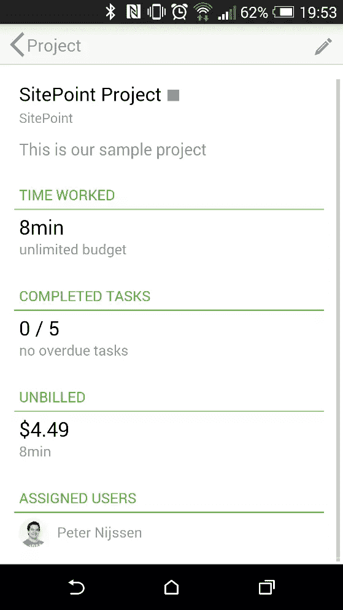
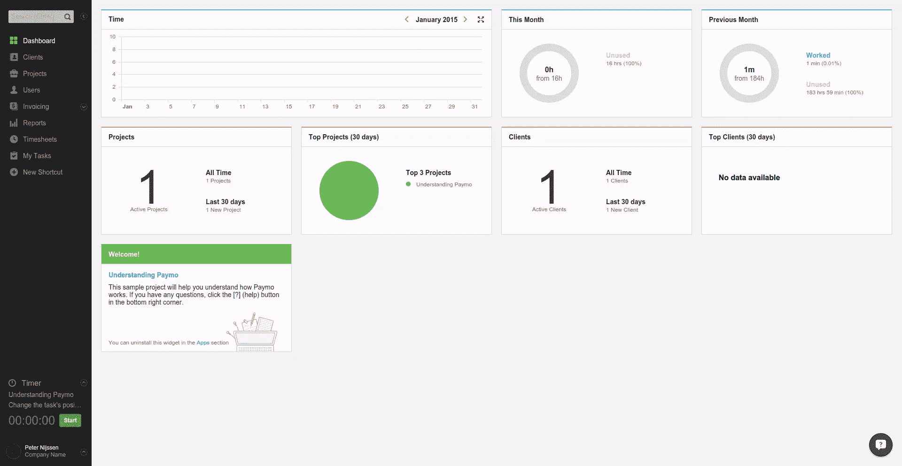
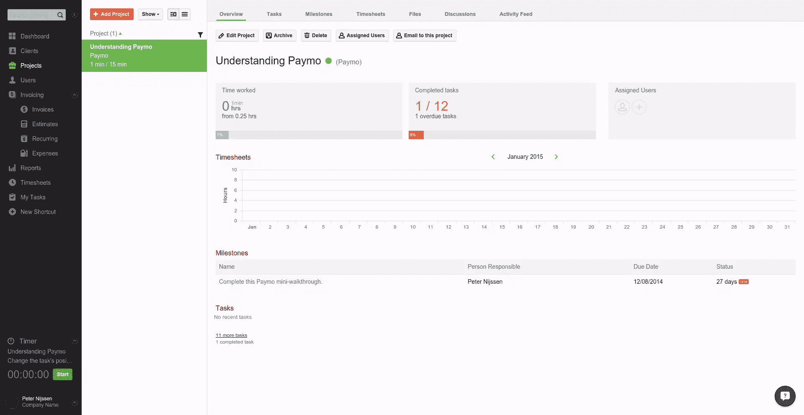
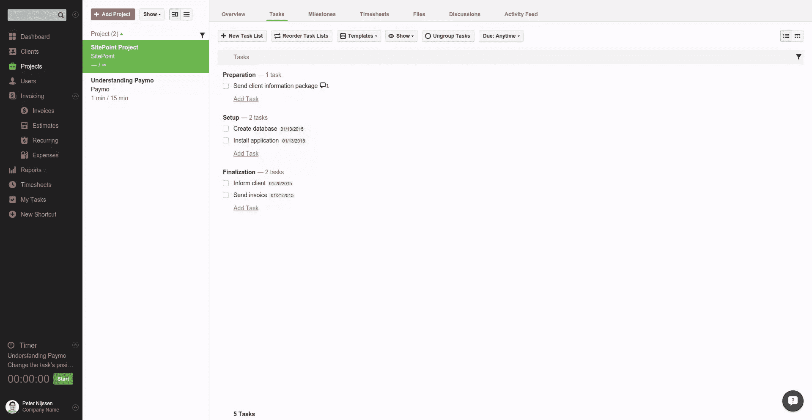
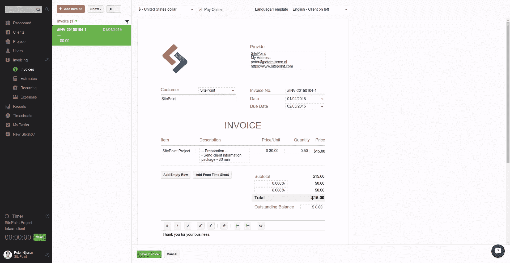
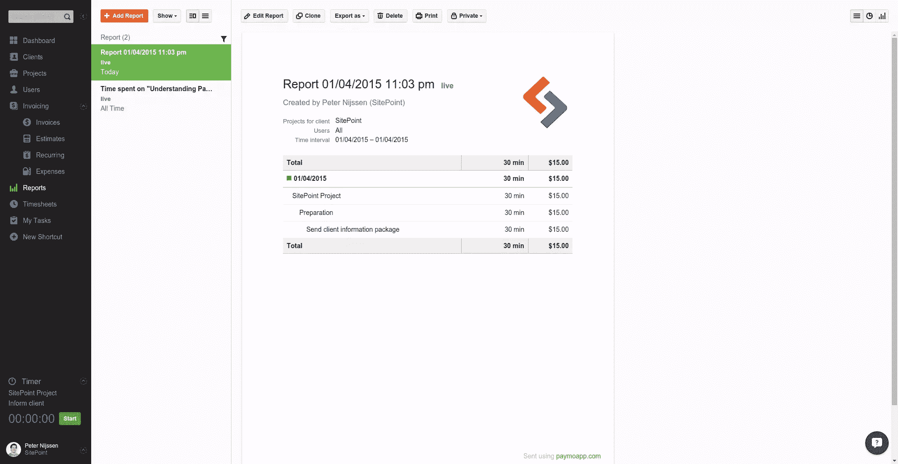
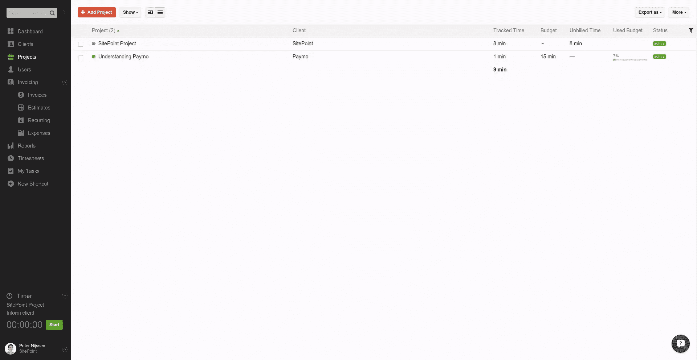

# 借助 Paymo 轻松管理项目

> 原文：<https://www.sitepoint.com/painless-project-management-paymo/>

*本文由 [Paymo](http://www.paymoapp.com/) 赞助。感谢您对使 SitePoint 成为可能的赞助商的支持！*

无论你是自由职业者还是项目经理，跟踪你的项目可能是你最困难(也是最令人沮丧)的任务之一。幸运的是，项目管理工具并不缺乏。Paymo 是最全面的一种，我将在本文中仔细研究它。

Paymo 是一个在线项目管理工具，将任务管理、时间跟踪和发票捆绑在一起。这是一个全功能的应用程序，所以我将把重点放在我认为使 Paymo 从其他项目管理工具中脱颖而出的部分。

## 应用和界面

你可以用几种不同的方式使用 Paymo。你可能会主要使用它的 web 界面，它拥有 Paymo 提供的所有功能。

除了网络界面，Paymo 还提供 iOS 和 Android 应用。这些应用程序包含了服务中最重要的部分。你可以很容易地改变你的客户和项目的基本细节，任何分配给你的任务都可以通过应用程序进行管理。然而，最有趣的功能是能够跟踪你的时间。你只需选择项目，然后点击“开始”开始跟踪你的时间。当你突然需要跟踪时间或者你更喜欢使用一个单独的设备来跟踪时间时，这就非常方便了。

Paymo 还为 OS X 和 Windows 提供独立的应用程序。不幸的是没有 Linux 支持，但是如果你像我一样是一个 Linux 用户，你可能已经习惯了，你可以忍受它。他们提供的第一个应用程序是 Paymo Widget。这是一个帮助跟踪时间的小实用程序。它带有方便的功能，如秒表、时间表编辑和空闲检测。第二个应用程序名为 PaymoPlus。PaymoPlus 会记录下您所有打开的应用程序和窗口。在课程结束时，您只需将应用程序和窗口与正确的项目相匹配，时间就会被记录下来。

为了简单起见，我将在整篇文章中引用 web 界面。但一定要查看 Paymo 提供的所有[额外附加服务](https://app.paymoapp.com/#Paymo.module.addons/)。

## 可用性

在我深入研究 Paymo 的功能并了解它的潜力之前，先来看看这个应用程序的可用性，这很有意思。如果你在处理像 Paymo 这样的大型应用程序，导航清晰是很重要的，这样你就可以找到你要找的东西，并且应用程序易于使用。

上面，你可以看到 Paymo 的仪表盘，登录后显示。菜单非常醒目，还有一个快速搜索栏。每个图表顶部的彩色小条表示它是关于时间跟踪、项目还是客户的图表。从这里开始，应用程序中的每个页面在颜色和样式上都非常一致。

时间跟踪是你想要快速和频繁地做的事情，所以在屏幕的左下角看到一个小部件让你快速启动时钟是很好的。

客户、项目和用户等更详细的页面也设计得非常清晰。在项目页面中，您可以从左到右导航到不同的区域。在给定的项目中，您可以使用顶部的选项卡进行导航。无论是在菜单中、项目中还是在单个标签页中选择了什么，都始终具有相同的绿色。

## 项目

自然，应用程序最重要的部分之一是添加和管理项目的部分。在 Paymo 中添加项目很容易:只需选择一个名称、一个描述，然后选择一个客户。为了将该项目与其他项目区分开来，您还可以为其指定一种特定的颜色，并且可以设置该项目是否收费以及每小时收费多少。

一个很好的特性是能够将给定的项目定义为模板。这意味着您可以根据自己的喜好配置项目，将其保存为模板，然后反复使用。想象一下，你每次都用相同的基本设置来销售一个项目。通过创建一个模板，一切都可以自动准备。

### 任务

在项目中，您可以处理任务。想象一下你正在出售某个产品的许可证。每次售出一个许可证，都需要多人执行一些步骤来启动并运行产品，供客户使用。

为此，Paymo 允许用户创建任务列表。可以想象，任务列表将多个任务组合在一起。这使得将您的项目分成几个阶段变得容易，并为每个阶段分配任务。好的一面是，任务不只是一个标题和描述字段，还支持每个任务的评论和上传。这样，很容易与同事讨论任务，并且您可以添加必要的或与任务相关的文件。这种任务共享是任何项目的核心。

正如你在上面的截图中看到的，有更多的菜单项可供选择。几乎所有这些菜单项都与预定义的任务相关联。

例如，在“里程碑”选项卡中，可以为任务列表设置里程碑，并为每个任务列表分配一个负责完成任务列表的人。当您希望有人管理多项任务，并且希望为所有任务设置一个明确的截止日期时，这很方便。

文件和讨论部分也与之前定义的任务相关。添加的任何评论也将出现在讨论选项卡下方。但是，我也可以在该选项卡中创建新主题。这是一个中心点，让您可以轻松地跟踪与单个任务或主题相关的讨论。

“文件”选项卡也是如此。如果您将文件分配给了某项任务，它们将出现在此处。你也可以在这里上传单独的文件。最棒的是你可以对文件进行评论。如果文件与任务相关，注释也会出现在任务本身中。这意味着所有东西都整齐有序地摆放在一起。无论您是对任务还是对分配的文件进行评论，您都会看到任何正在进行的讨论的全部内容。

在这些标签旁边，还有一个时间表标签。无论您使用 Paymo 应用程序还是左侧的小工具，项目的任何跟踪时间都会出现在这里。如果你忘记激活你的时间追踪器，你可以通过填写一个简单的表格来手动添加你的时间。

最后一个选项卡是“活动”选项卡。在该选项卡中，您可以看到在给定项目中执行的所有操作的全局列表。

## 货品计价

开具发票是项目管理中非常重要的一部分——每个人都想从自己的工作中获得报酬，对吗？为此，Paymo 提供了一个易于使用的发票模块，支持 16 种语言的发票。发票准备有几个全局设置。大部分发票都可以自动生成，节省了很多时间。例如，您可以选择一个客户，并将某个时间段内记录的每个小时的工作分配给他们的发票。由于您还可以为一个项目设定价格，所以只需几次点击，您就可以生成一份完整的发票。

好的一面是，您仍然可以编辑每一个单独的值，并且不会被创建项目时插入的全局细节所束缚。例如，您可以为某个规则设置一个较高的价格，因为它有一个固定的价格。因此，Paymo 提供了一种快速创建更通用发票的方法，但也让您轻松处理特定情况。

如果你仔细看看左边的菜单，你会注意到发票包含几个不同的部分。例如，您还可以创建评估和经常性发票。该界面与发票创建界面相同，但具有与所需操作相匹配的特定字段。例如，对于经常性发票，我们得到一个间隔和一个开始日期。

当您创建了估价并且实际上想要将其转换为发票时，只需打开估价并单击“发票”即可。如果你愿意，你可以改变变量，但是基本上你的发票已经准备好发送了。

## 报告

这是一个有趣的特性。报告为您提供了一个项目中花费时间的概况。您可以选择想要实时报告还是静态报告。如您所料，静态报告不会改变，而动态报告会在项目中发生变化时自动更新。你也可以做一些事情，比如将工作时间四舍五入到最近的一刻钟，或者按日期分组时间。

这允许您通过静态链接与客户端共享报告。你的客户会喜欢到目前为止在他们的项目上花费的所有时间的实时报告。没有必要分享一个烦人的 Excel 电子表格(你需要自己更新)。只要和你的客户分享一份报告，每次你打卡的时候报告都会更新，然后你就可以回去工作了。

## 个性化

当我在使用一个应用程序，而我不能轻松地使用它时，我会立刻放弃它。我认为很重要的一点是，你可以根据自己的需要轻松地定制应用程序，并找到自己的工作方式。Paymo 在这方面提供了很多可能性。它支持 16 种语言和多种货币，提供灵活的计费方式，并可以集成各种支付方式，包括 Authorize.net 和贝宝。

我立刻喜欢的一件事是我可以在菜单中添加快捷方式。如果有一个我每天都需要的项目，我可以把它添加到菜单中，这样我就可以快速访问它。

另一个有趣的部分是，您可以禁用应用程序的某些方面。您可以禁用仪表板中的某些图表，或者从系统中完全删除发票。不用的话就拆了吧。

此外，视图是可定制的。直到最近，我一直把项目列表放在菜单的左边。您也可以选择在表格中显示项目的实际列表，这将显示包含更多信息的附加栏。我在这里注意到的唯一有趣的事情是，当我切换到这个视图时，额外的功能出现了。突然间，我可以将项目导出为 CSV 文件。我无法在项目或默认列表中找到这个功能。我相信只有导出按钮出现，所以你没有错过任何伟大的功能，所以这不是一个真正的问题。

## 结论

Paymo 最大的特点是高度的一致性和集成性。对文件或任务进行注释——如果它们属于彼此，注释也是如此。如果您创建了发票，您可以轻松地从应用程序的其他部分检索数据。当你正确地配置好一切后，除了创建一个新的发票并点击发送之外，没有更多的事情要做。

该应用程序另一个有趣的部分是它的可定制性。您可以将快捷方式添加到您最常用的项目、可用的不同视图，以及您可以挂接到应用程序或从应用程序中移除的所有现有应用程序。

客户喜欢的是与他们分享实时报告的能力，了解到目前为止时间是如何花费的。

如果你对 Paymo 感兴趣，你可能想注册自己并尝试一下。你可以在这里注册 15 天的免费试用。

你有没有使用 Paymo 来跟踪你的项目？你有什么保持一切井然有序的技巧和诀窍？

## 分享这篇文章