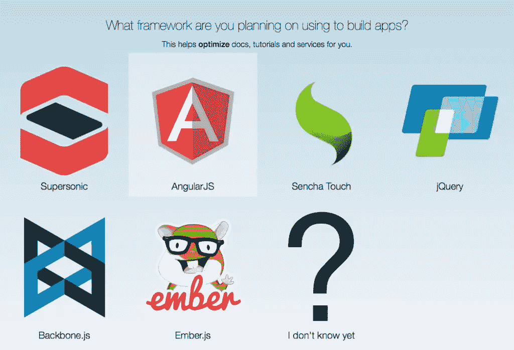

# AppGyver，一款混合应用开发

> 原文：<https://www.sitepoint.com/appgyver-hybrid-app-development-goes-beyond-just-code/>

在混合移动应用的世界里， [AppGyver](http://www.appgyver.com/) 的团队正在做一些创新的工作。他们最近发布了用于构建应用的平台[类固醇2，以及植根于 HTML5、AngularJS 和 web 组件](http://www.appgyver.com/steroids)[的 UI 框架](http://webcomponents.org/)[超音速](http://www.appgyver.com/supersonic)。由于混合了 HTML5 和本地组件的高性能混合应用的承诺，我急于尝试 AppGyver 的最新产品。

## 入门指南

AppGyver 在构建应用时提供了两种选择，*类固醇*或[作曲家 T5。Steroids 是命令行界面(CLI)和 web 应用程序的组合，用于生成、管理、编译和分发项目。应用程序可以设置为单页或多页(即多个 HTML 文件)。Steroids 使用样板设置生成新项目，或者您可以加载他们的“Kitchensink”应用程序，您可能猜到了，该应用程序包含了他们的超音速 UI 框架的所有功能。从那里，使用您喜欢的 IDE，您可以使用自己的代码修改和构建样板文件，或者使用像](http://www.appgyver.com/composer) [Bower](http://bower.io/) 这样的包管理器加载可用的 web 组件。作为本地服务器运行，Steroids 检测应用程序的变化，并将你的应用程序重新加载到设备上或本地 iOS 或 Android 模拟器中。

Composer 是一个完全可视化的、基于浏览器的应用引导工具。虽然它有局限性，但它擅长快速构建应用程序，几乎不需要任何编码经验。

我首先创建了一个 AppGyver 帐户并安装了类固醇工具。这个过程如此顺利给我留下了深刻的印象。Steroids 与众多 JavaScript 框架兼容，如 AngularJS、Backbone、Ember 等。虽然它是作为 JS MVC 不可知的平台提供的，但它是用 AngularJS 作为其首选前端框架编写的。

框架选择的截图。我选择了超音速入门，它与 AngularJS 配合得天衣无缝。

在验证了一些依赖项(Node、Git、Xcode)之后，我能够在大约 10 分钟内开始编码了。

如果你熟悉棱角和网状部件，使用类固醇应该会感觉很自然。

对于开发，我坚持使用 AppGyver 的入门教程。由于对 Angular 并不精通，我在做 AppGyver 教程之外的事情时能力有限，但同样，人们也不会被迫使用 Angular。

## 设计者

在玩了类固醇之后，我决定尝试一下 Composer，AppGyver 的可视化应用构建器。Composer 比较直观，学习曲线较低。它附带了一个通用 UI 组件库，如表单元素、图像、面板、列表、按钮，以及添加自定义 HTML 的能力。这些组件通过可视化逻辑编辑器变得栩栩如生，其中可以配置许多交互控件和条件逻辑。一个人只需要对编程原理有一个基本的理解就可以创建一些相对复杂的逻辑。Composer 使用与 Steroids 相同的数据集成工具，将数据绑定到组件库中更加方便。

## 分发变得简单

使用 AppGyver 的扫描仪应用程序(适用于 iOS 系统和安卓系统)，他们可以轻松地与他人分享应用程序。每个应用程序都有一个可以通过网络访问的二维码。扫描代码，扫描仪应用程序作为一个包装器，将应用程序加载到您的设备上。无需使用苹果的 [TestFlight](https://www.testflightapp.com/) 或类似 [Crashlytics](https://try.crashlytics.com/) 的服务向利益相关者、测试用户或客户分发预发布版本。

## 部署

当你准备向应用商店推送时，AppGyver 也让它成为一个简单的过程。输入必要的信息(证书、图标、启动画面创意等)后。)，他们基于云的部署服务将生成一个构建，准备提交到 App Store 或 Google Play。

## 好人

作为使用众多框架的本地和混合应用计划的首席策略师和项目经理，我相信 AppGyver 在混合应用创新方面处于领先地位。显著优势:

*   **数据绑定**。类固醇对数据整合的处理令人印象深刻。使用基于网络的应用程序，Steroids 对[build . io](https://www.built.io/)、 [Parse](https://parse.com/) 或与任何 REST API 的集成提供了开箱即用的支持，所有这些都通过点击式 UI 实现。AppGyver 还提供了一个沙盒数据服务来引导你的应用。
*   **建立分布**。如前所述，发布预发布版本很容易。如果您有非技术测试用户，您可以让他们立即安装并运行。
*   **不仅仅是框架或者编译器**。大多数其他混合应用解决方案要么是 UI 框架，要么是专注于原生 API 支持和编译的平台。AppGyver 是一个精心设计的、与语言无关的平台，考虑到了 UI、数据集成、分发和部署，并对插件组件和插件提供了相当大的支持。
*   **原生性能**。混合应用经常被批评为缺乏原生感觉和性能，尤其是在处理视图和动画之间的转换时。我发现类固醇应用程序是高性能的，几乎无法与本机区分开来。你可以通过查看他们的[用户提交应用程序目录](https://x.appgyver.com/xapps)或者通过 AppGyver 的[策划展示](http://www.appgyver.com/showcase)来亲眼看看。
*   **作曲家和类固醇之间的无缝交接**。所有用 Composer 生成的代码都是可下载的，并且符合类固醇。

## 坏事

我对 AppGyver 没有太多的批评。该平台在功能上有所欠缺。一些想法:

*   **作曲者的视觉限制**。如果你痴迷于视觉控制，Composer 有点限制。也就是说，这是我见过的最好的基于 GUI 的应用程序构建器之一。
*   **错误处理**。日志是通过 Steroids 基于浏览器的管理部分捕获的。虽然展示得很好，但我希望 AppGyver 集中精力改进警告、错误和调试日志，使之对开发人员更友好，更容易查明某些东西可能不工作的原因。
*   目前一切都是免费的？ AppGyver 的平台完全免费。他们提供每年 199 美元的附加服务和云服务，包括与脸书、城市飞艇推送通知、Oauth 和 GPS 等服务的集成。如果他们需要改变他们的定价模式，这可能意味着该平台不再免费，或者一些功能将作为额外的附加功能被删除。当然，这是使用任何免费平台的风险。

## 结论

如果你精通 AngularJS 或另一种 JS MVC，使用 AppGyver 你会感觉很舒服。如果没有，Composer 是一个可行的选择——要么作为一种引导你的应用程序想法并使用类固醇完成它的方式，要么从概念到成品建立你的应用程序想法。由于设置时间短、强大的数据处理、易于分发和类似本机的性能，没有理由不尝试一下 AppGyver 的产品。

## 分享这篇文章