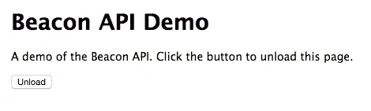
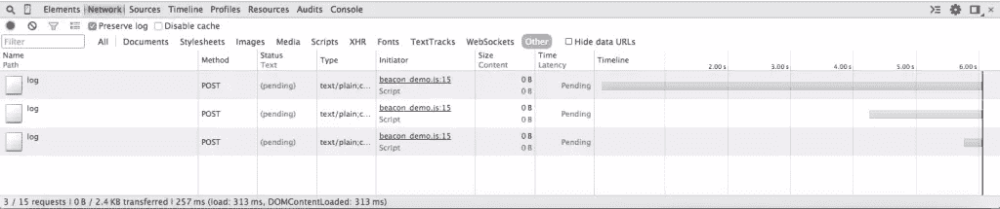

# Beacon API 简介

> 原文：<https://www.sitepoint.com/introduction-beacon-api/>

Beacon API 使 web 开发人员可以在当前页面卸载时轻松地将少量数据(如分析或诊断数据)异步发送回服务器。在本文中，我们将研究 Beacon API 解决的一些问题，并向您展示如何使用该 API。

如果没有 Beacon API，当用户离开某个页面时，将数据发送回您的服务器可能比看起来要复杂。你不想延迟下一页的加载，因为这会损害用户对你的网站的体验。然而，你不希望丢失有价值的信息，而这些信息可能有助于改进你的网站:过早发送数据可能意味着你丢失了有价值的信息，如果你再等一会儿的话，你*本可以*捕捉到这些信息。

在文档卸载时向服务器发送分析数据的典型*解决方案*可能如下所示:

```
window.addEventListener('unload', function(event) {
  var xhr = new XMLHttpRequest(),
    data = captureAnalyticsData(event);

  xhr.open('post', '/log', false);
  xhr.send(data);
});

function captureAnalyticsData(event) {
  return 'sample data';
}
```

一个`unload`事件处理程序，通过 Ajax 请求提交数据。当页面卸载事件触发时，数据通过`captureAnalyticsData`函数捕获，并通过 Ajax 请求发送到服务器。注意`xhr.open`的第三个参数是`false`，表示 Ajax 请求是*同步的*。浏览器通常会忽略卸载处理程序中的异步请求，所以任何这样的 Ajax 请求*都需要*同步。由于是同步的，浏览器必须等待请求完成*，然后*才能卸载文档并显示下一页。这种额外的等待会导致表现不佳的感觉。

代替同步 Ajax 请求的其他技术包括在卸载处理程序中设置一个`Image`对象的`src`。浏览器将在卸载文档之前等待`Image`加载，在此期间数据可以提交给服务器。然而，这仍然有同样的问题:当请求完成时，当前文档的卸载将被延迟，这次是对`Image`的请求，这可能导致较差的性能。

Beacon API 就是为了帮助解决这些问题而创建的。它定义了一个接口，允许开发人员向 web 服务器*异步发送少量数据*。它只包含一个方法`sendBeacon`，该方法被附加到`navigator`对象。`sendBeacon`有两个参数，您要提交数据的 URL 和要提交的数据:

```
window.addEventListener('unload', function(event) {
  var data = captureAnalyticsData(event);
  navigator.sendBeacon('/log', data);
});
```

数据通过 HTTP POST 请求提交，可以作为一个 [ArrayBufferView](https://developer.mozilla.org/en-US/docs/Web/API/ArrayBufferView) 、一个 [Blob](http://dev.w3.org/2006/webapi/FileAPI/#blob) 、一个 [DOMString](https://developer.mozilla.org/en/docs/Web/API/DOMString) 或一个 [FormData](https://www.w3.org/TR/XMLHttpRequest2/#formdata) 对象发送。浏览器将请求排队，并“在最早的可用时机”发送它，但与其他网络流量相比，数据传输的优先级可能较低(根据 [W3C 规范](https://www.w3.org/TR/beacon/#sec-sendBeacon-method))。如果数据成功提交给服务器，则`sendBeacon`返回`true`，否则返回`false`。

主流桌面浏览器对`navigator.sendBeacon`的支持相当不错。你会发现它在当前版本的 Chrome、Firefox 和 Opera 中受支持，但在最新版本的 IE 和 Safari 中不受支持。因为您不能保证它的可用性，所以最好的办法是使用特性检测，并退回到在页面卸载时提交数据的旧方法之一:

```
window.addEventListener('unload', function(event) {
  var xhr,
      data = captureAnalyticsData(event);

  if (navigator.sendBeacon) {
    navigator.sendBeacon('/log', data);
  } else {
    xhr = new XMLHttpRequest();
    xhr.open('post', '/log', false);
    xhr.send(data);
  }
});
```

我已经创建了一个小的[示例应用程序](https://github.com/jsprodotcom/source/blob/master/beaconapi.zip)，您可以使用它来查看 Beacon API 的运行情况。你需要安装 [Node.js](http://nodejs.org/) 来运行服务器。要运行示例，请执行以下操作:

1.  下载 zip 文件并将其解压缩到您选择的文件夹中，例如`beaconapi`
2.  打开终端，将目录切换到您在步骤 1 中创建的文件夹，例如`cd /path/to/beaconapi`
3.  仍然在终端中，键入`npm install`并按下`<Enter>`
4.  现在输入`DEBUG=beaconapi_demo ./bin/www`并按下`<Enter>`
5.  打开支持信标 API 的浏览器，并将其指向 http://localhost:3000

您应该会看到如下所示的页面:



在这个例子中，我们使用的是 Chrome。打开开发工具，切换到网络选项卡，并勾选保留日志复选框。过滤结果，以便您只看到其他请求。现在，当您单击`Unload`按钮时，您应该看到在开发工具中记录的对`/log`的请求。



## 结论

本文介绍了 Beacon API。它是一个非常小的 API，但是填补了一个特定的空白。希望你能好好利用它。

## 分享这篇文章