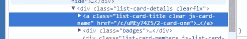
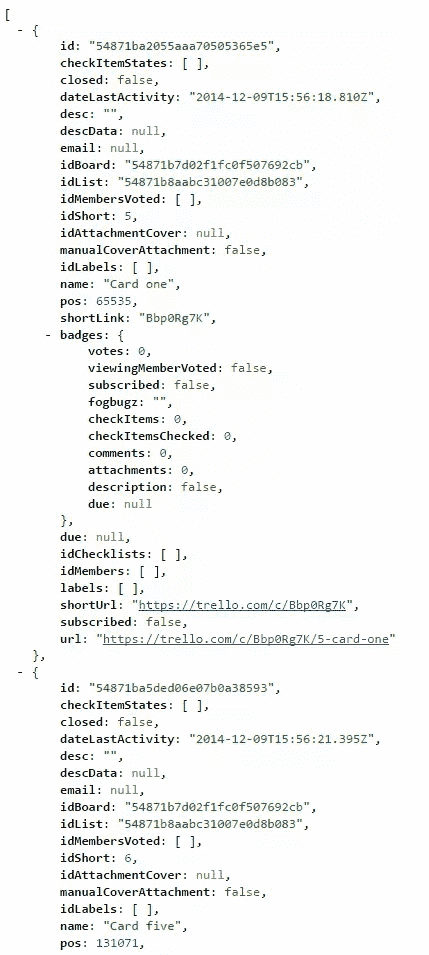
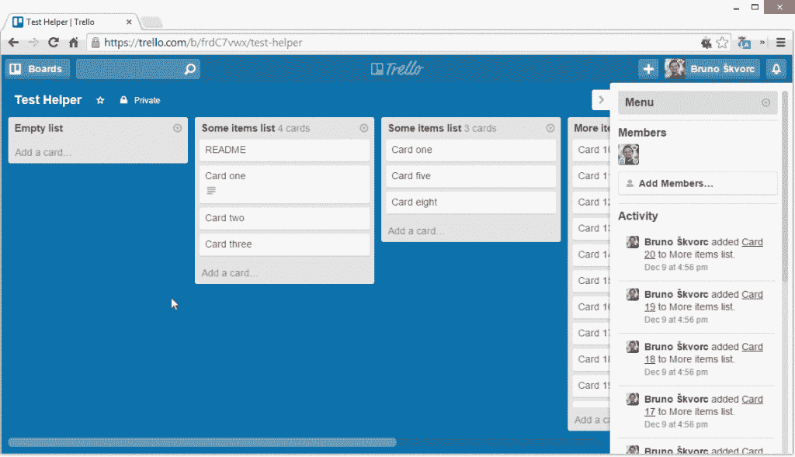

# 如何构建 Trello Chrome 扩展-导出列表

> 原文：<https://www.sitepoint.com/build-trello-chrome-extension-exporting-lists/>

在前一部分中，我们构建了扩展的基础，通过一个定制的基于 Foundation 的设置屏幕和使用 Trello 的 JavaScript 客户端库实现了身份验证。在这一部分，我们将通过添加导出逻辑和 UI 来完成我们的扩展。

## 信息发送

当我们在设置屏幕上通过 Trello 进行身份验证时，Trello 令牌会保存在本地存储中。然而，设置页面是它自己的页面，实际上是它自己的环境——因此，无论是扩展的背景页面还是扩展的内容脚本都不能访问它。这是我们需要使用[消息传递](https://developer.chrome.com/extensions/messaging)的地方。

`chrome.extension.sendMessage` API 用于在后台页面之间发送消息。在我们的例子中，我们将使用它将令牌从设置页面发送到我们的背景页面。因为我们的设置冒险在这个完成后就完成了，我们也可以自动关闭标签，以提高用户友好性。

将`settings.js`中`init`函数的第一部分更新为:

```
// Check if page load is a redirect back from the auth procedure
    if (HashSearch.keyExists('token')) {
        Trello.authorize(
            {
                name: "Trello Helper Extension",
                expiration: "never",
                interactive: false,
                scope: {read: true, write: false},
                success: function () {
                    chrome.extension.sendMessage({
                        command: 'saveToken',
                        token: localStorage.getItem('trello_token')
                    }, function(data) {
                        chrome.tabs.getCurrent(function (tab) {
                            chrome.tabs.remove(tab.id)
                        });
                    });
                },
                error: function () {
                    alert("Failed to authorize with Trello.")
                }
            });
    }
```

使用这个逻辑，我们告诉 Trello 库在身份验证完成时向扩展发送一条消息，一旦它收到一条返回消息说消息已收到(这是`function(data)`部分)，我们就关闭当前选项卡。

现在让我们来处理背景页面。首先，将`background.html`的内容改为:

```
<!doctype html>
<script type="text/javascript" src="scripts/key.js"></script>
<script type="text/javascript" src="scripts/background.js"></script>
<script type="text/javascript" src="lib/jquery-2.1.1.min.js"></script>
<script type="text/javascript" src="lib/trello_client.js"></script>
```

我们像以前一样加载 app key、我们将用于逻辑的后台脚本和 Trello 客户端。显然，我们也需要 jQuery 它是 Trello 的依赖。

然后，将`scripts/background.js`改为:

```
chrome.extension.onMessage.addListener(
    function (request, sender, sendResponse) {
        chrome.pageAction.show(sender.tab.id);

        // Now we have a token saved locally, as fetched from the settings page after authorization.
        if (request.command == 'saveToken') {
            localStorage.setItem('trello_token', request.token);
            sendResponse();
            return true;
        }

    });
```

这是从设置页面接收消息的部分。它从请求中获取令牌，并将其保存到本地存储中以备将来使用。我们使用带有`command`的对象构造作为主键，因为我们打算稍后将其他命令发送到后台页面。

## 自动设置

在`saveToken`命令上面，让我们来看另一个块:

```
if (!request.command && !localStorage.getItem('trello_token')) {
            chrome.tabs.create({url: chrome.extension.getURL('settings/index.html')});
            sendResponse();
            return true;
        }
```

如果我们没有发出特定的命令，并且我们的用户还没有通过 Trello 认证，请在新的选项卡中打开设置页面。这确保了在浏览器中访问 Trello 板时，在初始安装扩展后立即打开设置页面。

## 添加菜单选项

Trello 的 UI 对定制非常非常不友好。列表的元素中没有 id，无论是作为数据属性还是任何类型的链接，而卡片有。当你点击右上角的列表选项按钮时产生的上下文菜单在每次被调用时都是从头开始重建的(过分了吧？)和一个被归类为“弹出”的框，如果你点击 UI 中几乎每隔一个的菜单，也会调用这个框。更糟糕的是，一旦你调用一个列表的 popover 菜单，菜单本身没有它被调用的列表的标识符，所以你不知道它的上下文，这使得很难容易地获得一个列表的 ID，以便正确地查询关于它的 Trello API 并获取用于导出的卡。这就是为什么接下来的事情看起来像是一大堆可疑的黑客行为，但那是因为，嗯，事实就是如此。

要向上下文菜单添加菜单选项，我们需要编辑`main.js`内容脚本。把它变成这样:

```
chrome.extension.sendMessage({}, function (response) {
    var readyStateCheckInterval = setInterval(function () {
        if (document.readyState === "complete") {
            clearInterval(readyStateCheckInterval);

            var popover = $(".pop-over");
            $('.list-header-menu-icon').click(function(event) {
                var popover_summoned_interval = setInterval(function () {
                    if ($(popover).is(':visible')) {
                        clearInterval(popover_summoned_interval);
                        $(".pop-over .content").append('<hr><ul class="pop-over-list"> <li><a class="js-export-list" href="#">Export This List</a></li> </ul>');
                        $(".js-export-list").click(function(e){
                            // EXPORT LIST
                        });
                    }
                }, 50);
            });
        }
    }, 10);
});
```

从`var popover = $(".pop-over");`开始，我们设置一个变量来保存 popover 对象，这样我们就不必不断地重新获取它。然后，当单击列表上的菜单按钮(`.list-header-menu-icon`)时，我们调用一个间隔，不断监视弹出框是否可见。一旦它变得可见，检查就停止，一个菜单选项被附加到所有选项的底部，专门制作成看起来像其余的，所以它适合。最后，一个 click 事件处理程序被绑定到这个选项，这样当这个选项被点击时，我们可以调用“export”。但是..我们如何知道我们需要导出什么？我们以何种格式导出？

## 查找列表 ID

就像我之前说的，Trello 的 UI 是出了名的对开发者不友好。它不提供 DOM 元素的列表 id，所以找到它们并不容易。为什么我们需要列表 id？查询 Trello API 并获取卡，这样我们就可以导出它们——我们已经说过，由于 UI 在大型电路板上的不稳定性，我们不会解析 UI，但我们将依赖 API。

幸运的是，如果我们检查单个列表中的卡，我们可以看到这些卡确实有一个`href`属性，并且它包含卡 ID。通过知道卡的 ID，我们可以查询 Trello 的信息并获取其父列表的 ID。但是..如果弹出菜单没有连接到列表，我们如何找到我们点击了哪个列表？我们不能只抓住我们遇到的第一张牌，那太随意了。

我们可以使用点击菜单按钮时 jQuery 触发的`event`。这很重要！我们使用菜单按钮上的原始点击，而不是点击“导出”选项，因为虽然原始按钮绑定到我们感兴趣的导出列表，但产生的实际菜单**不是**，因此，我们几乎不可能找到我们正在处理的列表。代替上面代码中的`// EXPORT LIST`注释，添加以下内容:

```
exportList(event);
```

然后，创建函数:

```
function exportList(event) {

    var first_card_id = findFirstCardId(event);
    if (!first_card_id) {
        alert('No cards found in the list.');
        return false;
    }
}
```

最后，创建`findFirstCardId`函数:

```
/**
 * Uses the menu button on a card to find the first card in that list and get its ID
 * Returns false if not found, or the ID if there is a card
 * @param event
 * @returns bool | string
 */
function findFirstCardId(event) {
    var titles = $(event.currentTarget).parent().parent().find('a.list-card-title:first');
    if (titles[0] === undefined) {
        console.error('List has no cards!');
        return false;
    } else {
        return $(titles[0]).attr('href').split('/')[2];
    }
}
```

我们获取事件目标的祖父级(列表)，并在其中找到第一个卡片标题。标题包含此形状中的`href`:



如果没有找到标题，我们提醒用户不能导出列表。否则，我们提取并返回卡的 ID。

现在我们的`exportList`函数有了卡 ID，我们可以用它来找出列表 ID。如果我们查看 [API 文档](https://trello.com/docs/api/card/index.html#get-1-cards-card-id-or-shortlink)，我们可以使用 URL `card/{{ID}}`来获取我们需要的内容。为了最小化我们要求 Trello 返回的数据量，我们也可以将查询限制在带有`fields`参数的`idList`属性。让我们给`background.js`添加一个新的命令。

```
if (request.command == 'getCardListId') {
            trelloInit();
            Trello.rest('GET', 'cards/'+request.id, {fields: "idList"}, function(data){
                sendResponse(data);
            }, function (data) {
                sendResponse(data);
            });
            return true;
        }
```

我们还需要定义`trelloInit`函数。每次调用与 Trello 交互的命令之前，我们都可以调用这个函数，因此令牌和密钥设置正确，并且我们 100%确定我们的请求得到了验证。

```
function trelloInit() {
    Trello.setKey(APP_KEY);
    Trello.setToken(localStorage.getItem('trello_token'));
}
```

我们现在成功地获取了列表 ID。

## 获取列表卡

再加几行代码，回到`main.js`，我们现在有了一个`exportList`函数，如下所示:

```
function exportList(event) {

    var first_card_id = findFirstCardId(event);
    if (!first_card_id) {
        alert('No cards found in the list.');
        return false;
    }

    chrome.extension.sendMessage({
        command: 'getCardListId',
        id: first_card_id
    }, function(data){
        if (data.idList !== undefined) {
            chrome.extension.sendMessage({
                command: 'getListCards',
                id: data.idList
            }, function(data) {
                console.log(data);
            });
        }
    });
}
```

在“humanese”中，这是:

*   获取第一张卡的 ID
*   如果找不到 ID，列表显然是空的
*   如果找到 ID，调用后台页面，告诉它通过调用 Trello API 给我们列表 ID
*   如果列表 ID 没有问题，那么再次调用后台页面获取列表的卡片，完成后，在控制台中输出结果。

回到后台页面，我们现在可以构建`getListCards`命令，按照[API 文档](https://trello.com/docs/api/list/index.html#get-1-lists-idlist-cards):

```
if (request.command == 'getListCards') {
            trelloInit();
            Trello.rest('GET', 'lists/'+request.id+'/cards', {}, function(data){
                sendResponse(data);
            }, function (data) {
                sendResponse(data);
            });
            return true;
        }
```

如果您现在重新加载并测试扩展，您应该不仅能够看到 export 选项出现在您的列表中，而且在单击该选项后，我们正在寻找的数据也会在控制台中导出。

## 导出格式

现在，我们将采用一种简化的导出方法，因为本教程运行的时间有点长。我们将为用户提供 TXT 或 JSON 选项，形状和形式由我们预先定义。目前，文本输出如下所示:

```
Topic: Test Card 1
Description:
This is a description

Test Card 2

Test Card 3

Topic: Test Card 4
Description:
This is another description

Test Card 5
```

而 JSON 将满足于从 Trello 收到的内容，即:



显然，JSON 数据将产生更多的信息，但也更容易编辑——只需将其粘贴到任何 IDE 或工具中，如 [JSON 在线编辑器](http://jsoneditoronline.org/)或 [JSON 到 CSV](https://json-csv.com/) ，就可以了。

为了导出，我们需要一个模态窗口来粘贴数据。这里一个吸引人的选项是 Foundation framework，因为我们已经在设置页面中使用了它，它有自己的模态弹出组件，但是 Foundation 和 Trello 的 CSS 都没有正确的命名空间，在 Trello 的 CSS 中包含 Foundation 的 CSS 会导致冲突。我们也预装了 jQuery，但是同样，要启动并运行一个对话框，我们需要包含 jQuery UI，即使这样也是不够的——Chrome 扩展不支持通过相对`url()`语法加载 CSS 中的图像，而这正是 jQuery UI 所使用的——我们必须重写 jQuery UI 的 CSS 以使用本地扩展 URL 或使用 base64 编码的图像，这两种方法都不吸引人。

相反，我们将制作自己的弹出窗口，并使用一些 Trello 现有的风格，忽略所有的冲突。我把最后的代码放在这里，然后解释一下。请创建`lib/TrelloHelper/js/exportPopup.js`，并赋予其以下内容:

```
var exportPopup;

var TrelloExportPopup = function() {

}

TrelloExportPopup.prototype.init = function() {

    // When run, this makes sure the popup isn't around.
    // If it finds the popup residue, it removes it, paving the way for a fresh one.
    var popoverScan = $('.trello_helper_export_popup');
    if ($(popoverScan).length > 0) {
        $(popoverScan).remove();
    }
    popoverScan = null;

    // Create our new popup, hidden by default
    exportPopup = $('<div class="trello_helper_export_popup" style="display: none"></div>');

    // Create a header area for the popup, which will contain the buttons / tabs
    // Create a body area, which will contain the export data
    var header = $('<div class="trello_helper_export_popup_header"></div>');
    var body = $('<div class="trello_helper_export_popup_body"></div>');

    // Create areas for exporting the data - simple non-editable textareas
    var textarea = $('<textarea class="trello_helper_export_popup_textarea exportarea" readonly="true" style="display: none"></textarea>');
    var jsonarea = $('<textarea class="trello_helper_export_popup_jsonarea exportarea" readonly="true" style="display: none"></textarea>');

    // Create header buttons / tabs
    var textButton = $('<a href="#" class="exporttab button" data-area="text">Text Export</a>');
    var jsonButton = $('<a href="#" class="exporttab button" data-area="json">JSON Export</a>');
    var closeButton = $('<a href="#" class="button right">Close</a>');

    // Have the close button close our tab, and do the same if the user clicks outside the popup
    $(closeButton).click(this.hide);

    // Put everything together
    $(header).append(jsonButton).append(textButton).append(closeButton);
    $(body).append(textarea).append(jsonarea);
    $(exportPopup).append(header).append(body);

    // Add out popup to the Trello page
    $("#content").append(exportPopup);

    // Bind listeners to the buttons / tabs in the header, so we can switch output modes
    $(".exporttab").click(function (e) {
        var area = e.currentTarget.dataset.area;
        $(".exportarea").hide();
        $(".trello_helper_export_popup_" + area + "area").show();
    });

};

TrelloExportPopup.prototype.hide = function() {
    // Execute hiding logic only if the popup is visible
    if ($(".trello_helper_export_popup").is(":visible")) {
        $(exportPopup).hide();
    }
};

TrelloExportPopup.prototype.show = function(data) {

    // Hide all textareas
    $(".exportarea").hide();
    // Show the first one by simulating a click on the first tab
    // This makes sure our export popup always opens in JSON mode
    $(".exporttab")[0].click();

    var text = '';
    var cardCount = data.length;
    var i = 0;
    while (i < cardCount) {
        text += 'Topic: ' + data[i].name;
        if (data[i].desc) {
            text += '\nDescription:\n' + data[i].desc;
        }
        text += '\n\n\n';
        i++;
    }

    $(exportPopup).find('.trello_helper_export_popup_textarea').text(text);
    $(exportPopup).find('.trello_helper_export_popup_jsonarea').text(JSON.stringify(data));
    $(exportPopup).show();
};
```

我选择将弹出逻辑放在主脚本之外，这样我们以后可以很容易地改进它。我也选择了“面向对象”的方法，只是因为我喜欢它。我们定义了一个新的 TrelloExportPopup“类”,有三个方法——init、show 和 hide。内容脚本一加载，Init 就会被调用。这个方法负责构建弹出窗口，附加正确的事件侦听器，并将所有内容添加到 Trello 板的 HTML 中。将`.button`类添加到弹出窗口头部的按钮上，可以确保我们得到与当前 Trello UI 一致的外观。我在这里想要的外观是一种“选项卡式”界面——点击文本，文本导出显示，点击 JSON，JSON 显示。

hide 方法将隐藏弹出窗口，但前提是它以可见的形式存在于页面的某个位置。show 方法自动激活第一个(JSON)选项卡视图，并用所需的数据填充导出区域。JSON 区域是一个简单的 stringy dump——以字符串形式输出 JSON 数据，而文本区域目前只在单独的行上输出卡片的标题和描述，卡片之间有两行空行——高度“复制粘贴友好”。

我们现在需要做的就是设计一点风格。下面是`lib/TrelloHelper/css/exportpopup.css`的内容:

```
.trello_helper_export_popup {
    background-color: white;
    z-index: 1000;
    position: absolute;
    left: 50%;
    top: 50%;
    transform: translate(-50%, -50%); /* Yep! */
    width: 48%;
    min-height: 50%;
    border-radius: 3px;
    border: 1px solid #dbdbdb;
    border-bottom-color: #c2c2c2;
    box-shadow: 0 1px 6px rgba(0,0,0,.15);
}

.trello_helper_export_popup_body {
    position: absolute;
    right: 0;
    left: 0;
    bottom: 0;
    top: 55px;
}

.trello_helper_export_popup .button {
    margin: 10px;
}

.trello_helper_export_popup .button .right {
    float: right;
}

.trello_helper_export_popup textarea {
    height: 100%;
}
```

这确保弹出窗口居中，看起来像本地的 Trello 弹出窗口。它还确保将向我们显示导出内容的文本区域填充了弹出窗口的剩余空间。现在让我们将这些文件包含在我们的内容脚本中:

```
"content_scripts": [
        {
            "matches": ["https://trello.com/b/*"],
            "css": ["lib/TrelloHelper/css/exportpopup.css"],
            "js": [
                "lib/jquery-2.1.1.min.js",
                "lib/TrelloHelper/js/exportpopup.js",
                "scripts/main.js"
            ],
            "run_at": "document_idle"
        }
    ],
```

最后，让我们用新的弹出逻辑来增加`main.js`的趣味。`main.js`的最终版本看起来是这样的:

```
var tep = new TrelloExportPopup();

chrome.extension.sendMessage({}, function (response) {
    var readyStateCheckInterval = setInterval(function () {
        if (document.readyState === "complete") {
            clearInterval(readyStateCheckInterval);

            var popover = $(".pop-over");

            tep.init();

            $('.list-header-menu-icon').click(function (event) {
                var popover_summoned_interval = setInterval(function () {
                    if ($(popover).is(':visible')) {
                        clearInterval(popover_summoned_interval);
                        $(".pop-over .content").append('<hr><ul class="pop-over-list"> <li><a class="js-export-list" href="#">Export This List</a></li> </ul>');
                        $(".js-export-list").click(function (e) {
                            exportList(event);
                        });
                    }
                }, 50);
            });
        }
    }, 10);
});

function exportList(event) {
    tep.hide();
    var first_card_id = findFirstCardId(event);
    if (!first_card_id) {
        alert('No cards found in the list.');
        return false;
    }

    chrome.extension.sendMessage({
        command: 'getCardListId',
        id: first_card_id
    }, function (data) {
        if (data.idList !== undefined) {
            chrome.extension.sendMessage({
                command: 'getListCards',
                id: data.idList
            }, function (data) {
                tep.show(data);
            });
        }
    });
}
```

我们首先“实例化”TrelloExportPopup，这样我们就可以在代码中使用它的方法。然后，在将 click 事件监听器绑定到菜单之前，我们用`tep.init()`初始化我们的 popup，这样在需要它之前，它就在我们的 DOM 中准备好了。点击导出链接后，我们像以前一样调用我们的`exportList`函数。

在`exportList`函数中，我们首先隐藏带有`tep.hide()`的弹出窗口，以防在我们浏览另一个列表的菜单时打开一个，然后，一旦我们从背景页面获得卡片，我们显示带有`tep.show(data)`的导出弹出窗口。就是这样！

现在重新加载扩展，刷新 Trello 页面，你应该有一个正常工作的导出选项！



## 缺陷和改进

我故意留下了一些 bug 和警告。如果有足够的兴趣，我们将在未来的帖子中处理这些问题，调整和优化故障安全扩展。以下是一些仍有可能改进的地方:

### 贮藏

为了加速将来的使用，我们可以使用 localStorage 来记住一个列表属于哪个板。请注意，如果您将列表从一个板移动到另一个板，这可能会中断，所以要小心地实现这个特性——确保您为列表移动添加了另一个侦听器，这样您就可以使缓存的数据无效！

### 重复导出选项生成

如果你在菜单打开时疯狂点击菜单图标，你会在菜单底部不断添加新的“导出”选项。需要实现一个故障保险来检查选项是否已经存在。

### 初始化问题

在有数百个董事会和成员的巨大董事会上，Trello 的 UI 变得极其缓慢。这导致了文档就绪事件的失败，脚本的 init 部分在绑定侦听器的 UI 元素之前执行。因此，菜单有时没有导出选项，直到刷新后才能得到它。

### 更换电路板

更改电路板会终止当前 UI，并为新电路板重新构建它。然而，问题是带有事件监听器的元素也被删除了——所以我们的菜单不再调用导出选项。与上面的问题类似，需要在主板更改时触发重新初始化，这样一切才能正常工作。

### 无限循环

菜单点击后 popover 不呈现的可能性微乎其微——也许 Trello 改变了他们 UI 中的某些东西，也许他们改变了类，或者他们只是有某种 UI 错误——在这种情况下，检查其可见性的循环将变得无限，占用大量的 CPU 资源，直到选项卡的进程被终止。防范这种情况的措施会很好。

## 结论

在这个简短的系列中，我们为 Trello 构建了一个简单的 Chrome 扩展，它允许我们将给定列表中的卡片导出为 JSON 或 TXT 列表。使用这个例子来构建它，并创建您自己的 Trello 扩展-您可以完成的事情只受您的想象力的限制(以及 Trello 的 API 提供的功能:)。已经为您解决了身份验证问题，并且逻辑模板已经就绪——开始编码吧！

我们在本教程系列中编写的代码可以在 Github 上[获得。](https://github.com/Swader/TrelloHelper)

你想看这个教程的续篇吗？实现了更多功能？让我知道！感谢反馈！

## 分享这篇文章