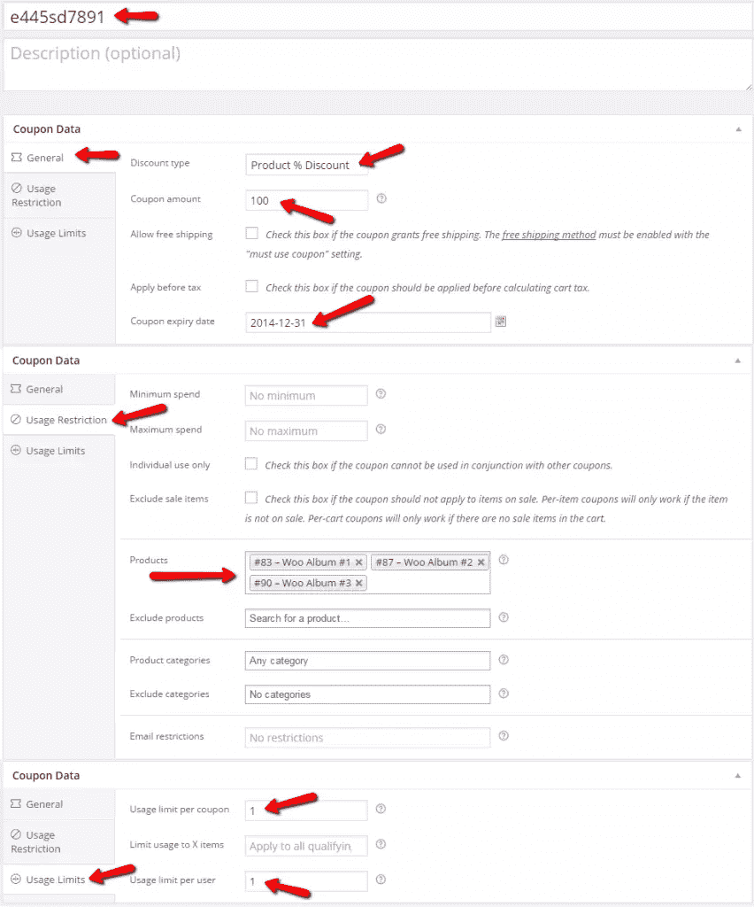
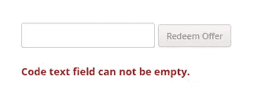
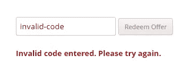

# 创建 WooCommerce 兑换优惠券页面

> 原文：<https://www.sitepoint.com/creating-a-woocommerce-redeem-coupon-page/>

在本文中，我们将探索一种独特的方式，让您的客户能够轻松兑换他们可能已经在会议或其他类似活动中购买的产品或产品组。

让我们再多谈谈这个概念。假设你是一个拥有革命性新产品的店主，你在一次会议上向数千人展示它。在你演讲的最后，那些愿意尝试你的产品的顾客可以这样做，并提前付款。你甚至可以通过降低价格给前 500 名顾客来吸引他们。

在这个场景中，您将在 WooCommerce 中创建 500 张优惠券，产品折扣为 100%。你可以使用智能优惠券插件来生成这 500 张优惠券，这样你就不必手动创建它们了。每个预先付款的顾客都会得到一个优惠券代码，但据顾客所知，这只是一个兑换产品的代码。

### 创建优惠券代码

如果你对你的优惠足够认真，那么你会试图让优惠券代码看起来随机，并使它很难，如果不是不可能的话，让用户想出一个有效的优惠券代码。请确保您选择了与此优惠券相关的产品，以便我们稍后可以自动将它们添加到购物车中。看一看我制作的一个优惠券，密切注意设置:



### 创建 WooCommerce 兑换产品页面

您可以轻松地复制您的 page.php，并将其转换为页面模板，这样您就可以在我们将要发送给这些客户的页面中使用它，以便他们可以兑换他们的产品。给它起个名字，比如 page-coupon-redeem.php

下面的标记是我们将用来格式化在该页面上显示给客户的表单。这只是一个有两个字段的表单，一个用于输入代码，另一个用于实际的提交按钮。对于客户来说，我们正努力使其尽可能简单；所以我们要通过 Ajax 做所有的事情，这样页面负载就尽可能的少。

```
<div class="redeem-coupon">
	<form id="ajax-coupon-redeem">
		<p>
			<input type="text" name="coupon" id="coupon"/>
			<input type="submit" name="redeem-coupon" value="Redeem Offer" />
		</p>
		<p class="result"></p>
	</form><!-- #ajax-coupon-redeem -->
</div><!-- .redeem-coupon -->
```

当用户输入代码并点击提交按钮时，文本字段中输入的值将被发送以进行验证，如果该值碰巧有效，则用户将被重定向到“购物车”页面，产品将已经在那里以 0 美元的价格结账。如果万一代码不正确，我们会通知用户有问题，输入的代码无效。

### 构建 Ajax 功能

如果你从未在 WordPress 中使用过 Ajax，请参考我之前的文章[将 Ajax 添加到你的 WordPress 插件](https://www.sitepoint.com/adding-ajax-to-your-wordpress-plugin/ "Adding Ajax to Your WordPress Plugin")来简单介绍 Ajax 在 WordPress 中是如何执行的。

让我们开始构建我们的“兑换您的产品页面”所需的 Ajax 功能，以实现预期的功能。接下来的所有代码都放在你的主题的 functions.php 文件中。

#### 注册我们的 Ajax 处理器

首先通过挂钩到`wp_ajax_$action`和`wp_ajax_nopriv_$action`动作来注册我们的 Ajax 调用处理程序。

```
add_action( 'wp_ajax_spyr_coupon_redeem_handler', 'spyr_coupon_redeem_handler' );
add_action( 'wp_ajax_nopriv_spyr_coupon_redeem_handler', 'spyr_coupon_redeem_handler' );
```

请注意，无论两个客户是否登录，都是由同一个函数来处理 Ajax 调用。

接下来，我们将开始构建逻辑，以考虑以下可能的情况:

*   代码文本字段为空
*   代码无效，意味着不是有效的优惠券代码
*   成功出示有效优惠券

#### 处理优惠券逻辑

现在我们已经注册了我们的操作，并且知道该做什么，我们需要编写实际的函数来处理我们可能的场景。

```
<?php
function spyr_coupon_redeem_handler() {

	// Get the value of the coupon code
	$code = $_REQUEST['coupon_code'];

	// Check coupon code to make sure is not empty
	if( empty( $code ) || !isset( $code ) ) {
		// Build our response
		$response = array(
			'result'    => 'error',
			'message'   => 'Code text field can not be empty.'
		);

		header( 'Content-Type: application/json' );
		echo json_encode( $response );

		// Always exit when doing ajax
		exit();
	}

	// Create an instance of WC_Coupon with our code
	$coupon = new WC_Coupon( $code );

	// Check coupon to make determine if its valid or not
	if( ! $coupon->id && ! isset( $coupon->id ) ) {
		// Build our response
		$response = array(
			'result'    => 'error',
			'message'   => 'Invalid code entered. Please try again.'
		);

		header( 'Content-Type: application/json' );
		echo json_encode( $response );

		// Always exit when doing ajax
		exit();

	} else {
		// Coupon must be valid so we must
		// populate the cart with the attached products
		foreach( $coupon->product_ids as $prod_id ) {
			WC()->cart->add_to_cart( $prod_id );
		}

		// Build our response
		$response = array(
			'result'    => 'success',
			'href'      => WC()->cart->get_cart_url()
		);

		header( 'Content-Type: application/json' );
		echo json_encode( $response );

		// Always exit when doing ajax
		exit();
	}
}
```

### 用 jQuery 处理表单提交

现在剩下要做的就是构建 jQuery 代码，将优惠券代码提交给 WordPress，以便处理返回的 JSON 数据。

```
jQuery( document ).ready( function() {
       jQuery( '#ajax-coupon-redeem input[type="submit"]').click( function( ev ) {

        // Get the coupon code
        var code = jQuery( 'input#coupon').val();

        // We are going to send this for processing
        data = {
            action: 'spyr_coupon_redeem_handler',
            coupon_code: code
        }

        // Send it over to WordPress.
        jQuery.post( woocommerce_params.ajax_url, data, function( returned_data ) {
            if( returned_data.result == 'error' ) {
                jQuery( 'p.result' ).html( returned_data.message );
            } else {
                // Hijack the browser and redirect user to cart page
                window.location.href = returned_data.href;
            }
        })

        // Prevent the form from submitting
        ev.preventDefault();
    }); 
});
```

### 决赛成绩

表单的样式完全由您决定。我使用了默认的 Twenty 主题和 WooCommerce 的虚拟数据，并使用了一些 CSS 规则，这就是我下面得到的。

##### 空字段错误消息



##### 无效代码错误消息



##### 有效代码/购物车已填充


### 结论

尽管这种情况可能不适用于所有商店，但 WooCommerce 通过其 API 为我们提供了一套工具，因此我们可以完成几乎任何我们想做的事情。将 WordPress 加入其中，你就拥有了一个首屈一指的完整的电子商务解决方案。

我希望通过这篇文章，我提供了一些优惠券在 WooCommerce 中如何工作的见解，并希望你在下一个项目中使用它时会感觉更舒服。

## 分享这篇文章