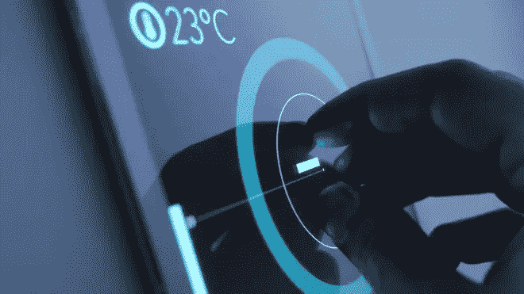
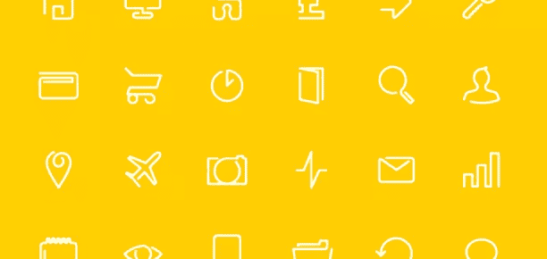

# 本周关注:2014 年回顾和 2015 年决议

> 原文：<https://www.sitepoint.com/radar-week-2014-review-2015-resolutions/>

欢迎来到 2015 年！根据《回到未来》得到[飞车](https://www.youtube.com/watch?v=0Yn2uyQJ1jc)、[悬浮板](https://www.youtube.com/watch?v=HSheVhmcYLA)、[自系带鞋](https://www.youtube.com/watch?v=oZD-9UiHyh0)的那一年。这些真实世界的视频可能与设想的不完全一样，但正在做出良好的努力。

## 那一年和即将到来的决议

本周，所有人都在回顾过去的一年， [iOS 2014 年回顾](http://code.tutsplus.com/articles/ios-2014-a-year-in-review--cms-22952)涵盖了苹果忙碌的一年中发生的一切，[今年最聪明的 UI 设计想法](http://www.wired.com/2014/12/years-8-smartest-ui-design-ideas/)很好地总结了去年行之有效的东西，我们回顾了[去年的 10 个网络预测](https://www.sitepoint.com/10-web-predictions-2014-results/)，看看它们有多准确，看看[过去一年平均页面权重如何增加](https://www.sitepoint.com/average-page-weight-increases-15-2014/)，以及[雅虎年度回顾](https://www.yahoo.com/tech/tagged/year-in-review)涵盖的内容

新的一年有[名顶尖设计师分享新年决心](http://thenuschool.com/designers-new-years-resolutions-2015/)，如果这些看起来太不现实而无法实现，那么克里斯·科伊尔会提供更多细节，告诉你如何[努力做好工作](http://css-tricks.com/just-try-and-do-a-good-job/)。

## 设计在于细节

设计好东西往往是一项棘手的任务，所以为了让事情变得更简单，这里有 [10 件平面设计师遇到的事情和 10 本可以帮助](http://greig.cc/sparkfile/2014/12/make-the-logo-bigger)的书。

稍微靠近一点，Matthew 仔细看看他目前为止学到的关于[线条图标设计](https://medium.com/@MatthewCooperUK/line-icon-design-what-ive-learnt-so-far-2a2b06733338)的知识，似乎“少即是多”的古老格言从未如此正确，并且有一个[免费连续线条图标包](https://dribbble.com/shots/1741860-FREE-Continuos-Line-Icon-Pack)。更仔细地看，Joshua 仔细查看了 [Square 的电子邮件收据和反馈流程](http://bokardo.com/archives/details-squares-email-receipt-and-feedback-flow/)。

## 反模式和对过去的改进

为了不犯和去年一样的错误，这里有一些[现实世界的 JavaScript 反模式](http://blog.javascripting.com/2014/11/06/real-world-javascript-anti-patterns/)要远离。如果它们中的任何一个看起来与你一直在做的事情相似，那么可能是时候考虑改进你一直在做的事情了，关于不做你可以[检测到的事情，现在不要用 JavaScript](http://davidwalsh.name/detect-track-javascript) 跟踪，这可以用来进一步增强用户选择退出的能力。

尝试改进事物，[命名事物](http://24ways.org/2014/naming-things/)深入研究我们在想出好名字时遇到的不同问题，并深入研究想出更好名字的方面和技术，ECMAScript 6 中的[符号是一种新的原始类型，探索这些唯一的标识符和它们将有助于改进您的代码的情况。](http://www.2ality.com/2014/12/es6-symbols.html)

那么哪些链接引起了你的注意呢？你有过哪些新年决心？你有没有被激励去改进你去年做的事情？让我们知道，讨论就可以开始了。

## 分享这篇文章