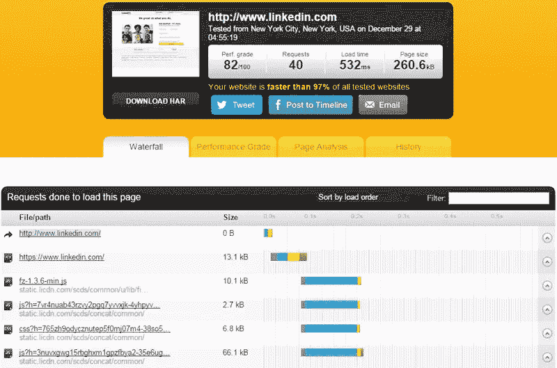
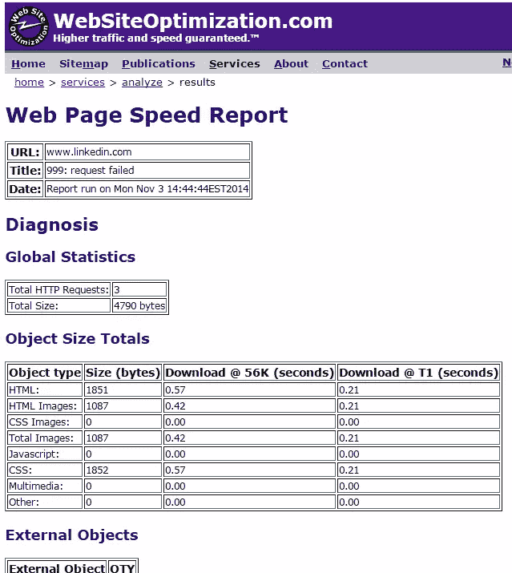
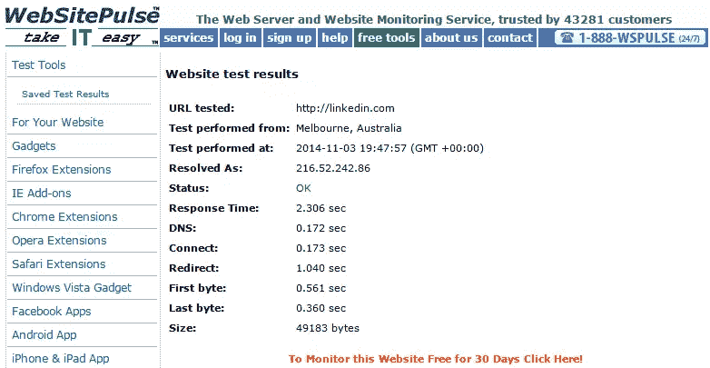
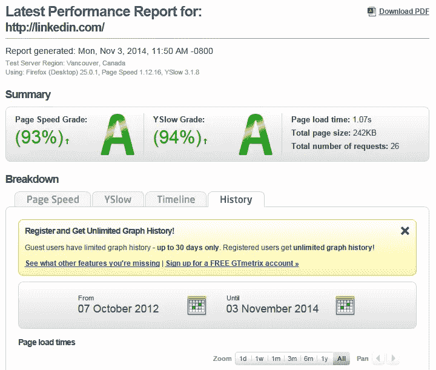
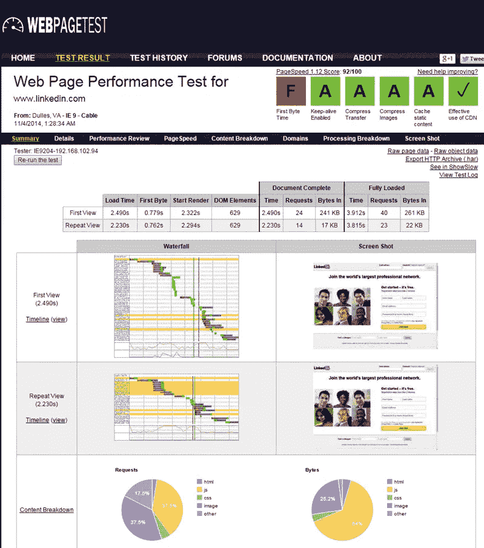
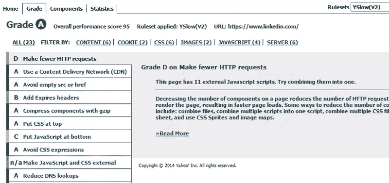
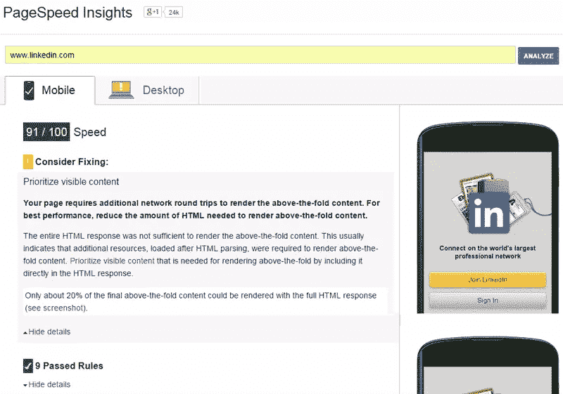

# 测试网站性能的工具

> 原文：<https://www.sitepoint.com/tools-testing-website-performance/>

如果你已经把网站的设计、开发、内容和搜索引擎优化视为网络成功的参数，那么是时候开始关注网站的加载时间了。

随着网页开发的改进，普通用户喜欢以更快的速度访问和浏览网站。如果你的网站仅仅落后几秒钟，就有可能失去你的客户。

根据一个消息来源，这里有一些统计数据[，显示了快速加载页面](http://www.aykira.com.au/2014/04/importance-website-loading-speed-top-3-factors-limit-website-speed/)的[重要性:](http://www.impressivewebs.com/importance-of-website-performance-sources/)

*   8%的潜在买家认为网页加载速度极慢是他们放弃购买的主要原因。
*   超过 75%的在线客户选择了竞争对手的网站，而不是在交通高峰期忍受过度的延迟。
*   如果页面加载时间超过 3 秒，57%的网站访问者会放弃你的页面。
*   75%的用户在 4 秒内退出。
*   与 1 秒钟加载的商业网站相比，3 秒钟加载的网站跳出率高 50%，页面浏览量少 22%，最重要的是，转化率少 22%。

甚至，Google [在 2010 年发布公告](http://googlewebmastercentral.blogspot.in/2010/04/using-site-speed-in-web-search-ranking.html)声明了页面加载时间在搜索引擎结果(SERP)中的重要性。

记住这一点，让我们看看一些工具，让您能够检查您的网站的加载时间和性能。但是在继续之前，我已经列出了一些你在为你的网站性能选择一个理想的测试工具时应该考虑的参数。

## 你如何选择工具？

选择最好的工具来评估你的网站的表现是关键。该工具应至少具备下述 3 项功能。这将让您真正了解性能方面的情况。

### 该工具在运行测试时会考虑您自己的连接吗？

假设你正在测试一个网站，它在你的位置不能正常加载。有可能是你自己的连接有问题，迫使你的网站加载缓慢。这是评估时首先要考虑的一点。

*工具*:网页分析器

### 测试期间工具是否包括多个位置？

为了得出一个平均的加载时间结果，你的网站能在多个地理位置正确加载吗？大多数人在做测试的时候往往会忘记这一点。

有一次，我收到一位客户的电子邮件，说他的网站加载很慢。我立即检查了网站，令我惊讶的是，它在我的位置上工作正常。这就是为什么考虑这是一个重要的工具选择因素，以避免未来的麻烦。

*工具* : Pingdom 工具、GTmetrix、WebSitePulse

### 该工具是否考虑了移动设备上的页面加载？

据计算，2013 年有 22 亿移动互联网用户，约占全球人口的 30%。全球 GSM 机构 GSMA 预测，未来六年，全球将有 16 亿人成为移动互联网用户，总人数将达到 38 亿，约占 2020 年全球预期人口的一半。

*工具* : GTmetrix

### 工具会报告错误吗？

该工具还应该在评估性能时报告网站错误。这包括客户端、服务器和连接错误。

*工具*:网页分析器、页面速度洞察

### 这个工具使用雅虎的 YSlow 和谷歌的页面速度来给网站的表现打分吗？

两大网络搜索引擎巨头提供了在线工具( [YSlow](http://yslow.org/) )和谷歌( [Pagespeed Insights](https://developers.google.com/speed/pagespeed/insights/) )来对网站的表现进行评级。一个好的工具将包括这两个功能，当检查你的网站的加载时间。当然，这些也是独立的评估工具。

*工具* : Pingdom 工具，GTmetrix

### 该工具是否提供专家建议来修复任何问题？

建议和推荐对于提高性能是必不可少的，所以找到一个这样的工具是关键。

*工具* : YSlow、PageSpeed Insights

### 分享结果

几乎每个工具都有一个选项，可以下载可访问格式(PDF、CSV 等)的性能报告。这有助于与您的客户、员工或同事共享统计数据。一些工具还以图形或图表的形式提供结果。

## 7 个优秀的工具

在考虑了我们想要在性能测试工具中寻找什么样的东西之后，让我们详细地看看每一个。

## [Pingdom 工具](http://tools.pingdom.com/)

*   给你的网站打分，满分 100 分。
*   使用 YSlow 和 PageSpeed 洞察。
*   跟踪绩效历史。
*   整页测试加载一个完整的 HTML 页面。这种测试包括图像、CSS、JavaScript、RSS、iframes 等。
*   测试期间会考虑多个位置。
*   创建结果的瀑布图，以指示请求的不同阶段(即 DNS、SSL、连接、发送、等待和接收)

### [网页分析器](http://www.websiteoptimization.com/services/analyze/)

这是一个免费的性能页面速度分析工具。

*   给出页面大小、组成和下载时间。
*   根据结果提供提高页面速度的建议。
*   提供结果报告。
*   计算单个元素的大小，并对每种类型的网页组件求和。

## [WebSitePulse](http://www.websitepulse.com/)

该工具提供高级远程监控服务，使客户能够提高电子商务的效率和性能。它通过三阶段验证系统提供错误检测，并提供第三方验证。这些服务包括:

*   服务器监控
*   网站监控
*   应用程序监控
*   浏览器内监控
*   电子邮件系统监控

测试工具包括:

*   网站测试
*   网页测试
*   HTTP 头测试链接测试
*   主机名 TestMX 查找
*   NS 记录查找反转 DNS
*   服务器测试邮件验证测试
*   端口扫描测试

测试在三个不同的地点进行:美国纽约；德国慕尼黑；和澳大利亚的墨尔本。

## [GTmetrix](http://gtmetrix.com/)

该工具有助于为您的用户开发更快、更高效、全面改进的网站体验。它具有以下特点:

*   URL 监控
*   移动测试；它通过一个实际的 Android 设备传递你的 URL。
*   测试您的页面在不同地区的加载情况，如达拉斯、悉尼、英国、印度等。
*   让您通过包含 3 个指标的交互式图表查看性能历史记录。
*   提供报告的 PDF 版本。
*   模拟拨号、2G、3G、DSL 或电缆连接上的页面负载。
*   每天、每周或每月保存报告数据。
*   使用雅虎的 YSlow 和谷歌的页面速度。

## [网页测试](http://www.webpagetest.org/)

这是一个多功能工具，提供以下功能:

*   生成屏幕截图以显示页面如何以递增的间隔执行(例如，使用[幻灯片视图](https://www.sitepoint.com/page-speed-soon-visitors-see-content/))。
*   为内容细分创建瀑布图。
*   不同的内容元素用不同的颜色表示。
*   允许比较多个 URL。
*   提供满分为 100 分的分数。

## [YSlow](http://yslow.org)

如前所述，YSlow 可以单独使用。功能包括:

*   给网站打分，满分 100 分。
*   总结了页面组件。
*   还提供了性能分析工具，例如 [Smush.it](http://www.smushit.com/ysmush.it/) 和 [JSLint](http://jslint.com/)
*   基于 Yahoo！分析网页并建议为什么它们很慢！高性能网站的规则。之后，给出了改进建议。
*   在分析网页时，每违反一条规则就从总分中扣分。然后，它会对每个规则应用一个等级。
*   作为 Chrome、Firefox、Safari、Opera 的浏览器扩展和移动书签提供。

## [页面速度洞察](http://developers.google.com/speed/pagespeed/insights/)

这个优秀的工具是由谷歌开发的。它提供以下内容:

*   给你的网站的移动版和桌面版打满分。
*   提供改进建议，并提供帮助修复的源代码链接。
*   建议基于网页性能的一般原则，包括上传和下载大小、客户端-服务器往返时间等。
*   给出详细的报告，包括列出正确完成的事情。
*   作为 Chrome 扩展提供(尽管没有相同的功能)

## 结论

鉴于[页面权重每年都在增加的事实](https://www.sitepoint.com/average-page-weight-increases-15-2014/)，我希望这篇文章能给你足够的弹药来更好地准备应对你自己项目中的性能挑战。如果你已经使用任何你认为值得一提的工具测试过你的网站，欢迎加入下面的讨论。

## 分享这篇文章