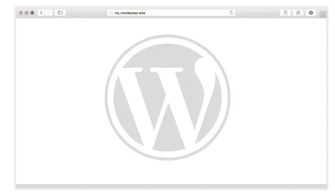

# 常见的 WordPress 问题以及如何修复它们

> 原文：<https://www.sitepoint.com/common-wordpress-issues-and-how-to-fix-them/>

对于许多开发者来说，WordPress 是一个大型或小型工作的首选解决方案，然而，就像生活中的大多数事情一样，它远不是一个完美的解决方案。尽管 WordPress 是一个领先的网络平台，但它的多功能性使得它在出现问题时很难确定故障的来源。虽然不可能在这篇文章中解释所有的 WordPress 问题，但是下面的指南可以帮助你解决一些最常见的错误。

## 死亡的白色屏幕

对于那些幸运地从未遇到过死亡白屏的少数读者来说，这个错误包括当你试图访问有问题的网站时出现一个黑屏。

这个错误的两个主要原因是插件和主题的兼容性问题。如果你可以访问你的管理面板，找出这个错误的最好方法是尝试一个接一个的关闭你的插件，如果这不起作用，那么尝试改变你的主题到默认的 WordPress 设计。

### 第一步

如果你不能访问你的管理面板，你必须通过 FTP 手动关闭插件和主题。登录到你的服务器后，导航到插件目录(通常是 wp-content/plugins)或主题目录(wp-content/themes ),在名字后面加上' _old '。

从那里尝试访问您的管理面板。如果你成功了，你可以尝试单独重新激活你的插件或主题，直到你再次出现问题。一旦发生这种情况，你就会知道你的问题的主要来源。

### 高级故障排除

对于更高级的故障排除，您还可以进入您的 wp-config 文件并将 WP_DEBUG 值设置为 true(如下所示):

`define( 'WP_DEBUG', true );`

完成此操作后，导航到出现错误的页面，您应该会看到导致错误的原因的详细信息。完成后，请确保通过将该值设置为 false 来禁用该功能(如下所示):

`define( 'WP_DEBUG', false );`

## 升级后的维护模式

更新是保持你的 WordPress 网站功能的重要部分。但是，有时系统不会清除进程中的所有文件。如果您收到消息“暂时无法进行定期维护”。请过一会儿再来查看。更新您的网站后，您很可能需要删除您的。手动维护文件。

为此，请通过 FTP 程序登录您的网站，并删除。根文件夹中的维护文件。您的站点现在应该可以正常工作了。

## 重置密码系统不起作用

### 简单的方法

如果您使用默认的管理员用户(即您的用户名是 admin ),您可以通过 FTP 重置您的密码。

1.  通过 FTP 访问您的网站并下载您的活动主题 functions.php 文件

2.  开头后 `line, add the following:` 开头`wp_set_password( 'password', 1 );`。在这个命令中，1 是用户 ID，而**密码**应该改成你想要的密码。

3.  将此文件上传到您的网站。

4.  登录后，返回到 functions.php 文件并删除您刚才输入的代码，因为它会在用户每次登录时重置您的密码。

### 复杂方法

如果您丢失了管理员密码，并且通过电子邮件向您发送的重置密码链接不起作用，您需要手动重置密码。最好的方法是使用 phpMyAdmin 来编辑你的 WordPress 数据库。您也可以从 MySQL 命令行编辑数据库，但是 phpMyAdmin 大大简化了这个过程。

首先，使用一个[散列生成器](http://www.miraclesalad.com/webtools/md5.php)将您想要的密码转换成 MD5 散列。然后完成以下步骤:

1.  导航到你的 WordPress 数据库

2.  访问`wp_users`表

3.  查找包含您的用户名的行

4.  在完成这些步骤之前，用您生成的散列更新该行中的`user_pass`值

5.  应用您所做的更改

## 内存不足

在许多服务器上，分配给 WordPress 的默认内存量不足以处理对 WordPress 的大量定制。幸运的是，增加你的 WordPress 内存限制可以通过在你的 WordPress 配置文件中添加下面一行来实现:

`define( 'WP_MEMORY_LIMIT', '64M' );`

上面的命令将 WordPress 的内存限制设置为 64M。如果需要更高或更低的限制，请用所需的数量替换该值。

## 主动保护自己的方法

在最坏的情况下，解决困难的 WordPress 错误的最佳解决方案是回滚到你手头的一个旧备份。简化这一过程的方法之一是探索你的[托管 WordPress 托管选项](https://www.sitepoint.com/managed-wordpress-hosting-pros-and-cons/)。如果您选择自己处理所有的站点维护，那么您应该确保至少有一个每日、每月和每周备份的滚动周期。

## 分享这篇文章