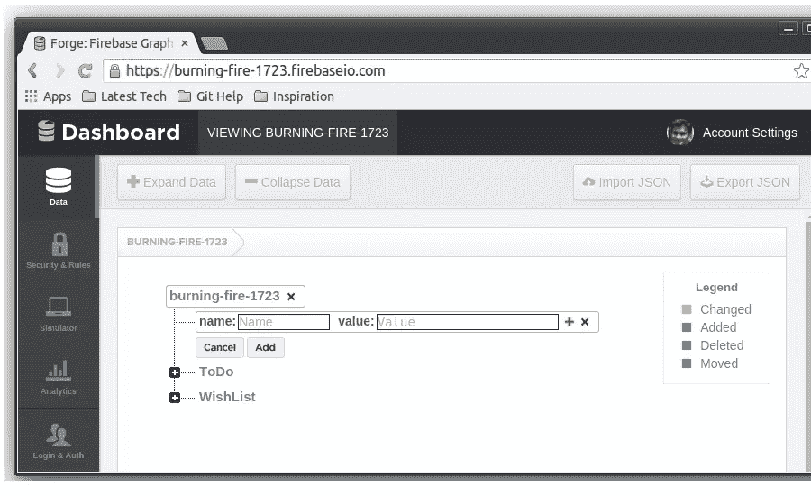
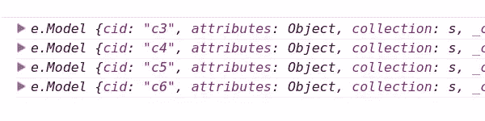
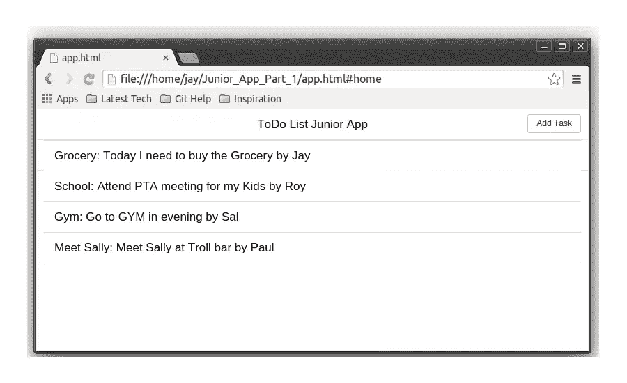

# 使用 Junior 和 Firebase 开发 Web 应用程序

> 原文：<https://www.sitepoint.com/web-app-development-junior-framework-firebase/>

在本教程的[第一部分](https://www.sitepoint.com/junior-front-end-framework-html-5-mobile-apps/)中，我们使用[初级框架](http://justspamjustin.github.io/junior/#home)设计了一个简单的待办事项 app。我们使用棘轮组件来设计 UI。

在教程的这一部分，我们将实现 [Firebase](https://www.firebase.com/) 作为待办事项列表应用的后端。

本教程的源代码可以在 [GitHub](https://github.com/sitepoint-examples/Junior_App_Part_2) 获得。

## 入门指南

要开始，从 [GitHub](https://github.com/sitepoint-examples/Junior_App_Part_1) 克隆之前的教程源代码。

```
git clone https://github.com/sitepoint-examples/Junior_App_Part_1
```

克隆完成后，导航到项目目录并安装所需的依赖项。

```
bower install
```

现在打开`Junior_App_Part_1/app.html`页面，您应该会看到应用程序正在运行。

## 包括 Firebase 参考

我们将使用 [BackboneFire](https://www.firebase.com/docs/web/libraries/backbone/quickstart.html) 将我们的应用程序连接到 Firebase。

要使用 BackboneFire，我们需要 [jQuery](http://jquery.com/) 和[下划线](http://underscorejs.org/)。下载并将这两个库作为参考包含在`app.html`中。Junior 中包含的`backbone.js`版本也太过时了，下载一个更新的版本到同一个文件夹。

```
<script src="lib/javascripts/jquery-1.11.1.min.js"></script>
<script src="lib/javascripts/underscore-min.js"></script>
```

添加上述引用后，包括对 Firebase 和 BackboneFire 的引用，如下所示:

```
<script src="https://cdn.firebase.com/js/client/2.0.6/firebase.js"></script>
<script src="https://cdn.firebase.com/libs/backbonefire/0.5.0/backbonefire.min.js"></script>
```

## 设置 Firebase

在将数据推送到 Firebase 之前，我们需要设置我们的帐户。如果你还没有的话，在 Firebase 上注册一个账户。创建账户后，登录账户并点击*管理应用*。

单击仪表板中 Firebase URL 上的加号图标，创建一个新的子节点。



添加一个新的子节点，名称为`ToDo`，值为`0`。添加后，您将获得如下网址

*https://burning-fire–1723.firebaseio.com/ToDo*

我们将把待办事项列表数据添加到上面的 firebase URL 中。我们创建子节点的原因是为了组织我们的数据。

## 将数据插入 Firebase

在 add task 页面中，我们将为 save task 按钮附加一个 click 事件。打开`app.js`，在`AddTaskView`内为保存任务按钮添加一个新的点击事件，如图所示:

```
events: {
    'click #btnBack': 'onClickBack',
    'click #btnAdd': 'onClickAdd'   //Newly added
  },
```

现在，在`AddTaskView`中定义`onClickAdd`方法，如下所示:

```
onClickAdd: function() {
     console.log('Save Task clicked');
     return false;
},
```

在`AddTaskTemplate`变量中，将`Save Task`按钮的 id 设置为`btnAdd`。

```
var AddTaskTemplate = [

  '<nav class="bar bar-standard">',
  '<header class="bar bar-nav">',

  '<button id="btnBack" class="btn btn-link btn-nav pull-left">Back</button>',
  '<h1 class="title">Add Task</h1>',
  '</header>',
  '</nav>',

  '<div class="bar bar-standard bar-header-secondary">',
  '<form>',
  '<input type="text" placeholder="Full name">',
  '<input type="search" placeholder="Search">',
  '<textarea rows="3"></textarea>',
  '<button id="btnAdd" class="btn btn-positive btn-block">Save Task</button>',
  '</form>',
  '</div>'

].join('\n');
```

保存更改并打开`app.html`。点击添加一个新任务，按下*保存任务*，你应该会在浏览器控制台看到我们上面设置的消息。

让我们添加将数据保存到 Firebase 的代码。如下所示更改`AddTaskTemplate`的 HTML 代码，使搜索字段成为文本字段，并为文本区域字段添加一个占位符。

```
var AddTaskTemplate = [

  '<nav class="bar bar-standard">',
  '<header class="bar bar-nav">',

  '<button id="btnBack" class="btn btn-link btn-nav pull-left">Back</button>',
  '<h1 class="title">Add Task</h1>',
  '</header>',
  '</nav>',

  '<div class="bar bar-standard bar-header-secondary">',
  '<form>',
  '<input id="txtName" type="text" placeholder="Full name">',
  '<input id="txtTitle" type="text" placeholder="Title">',
  '<textarea id="txtDesc" placeholder="Description" rows="3"></textarea>',
  '<button id="btnAdd" class="btn btn-positive btn-block">Save Task</button>',
  '</form>',
  '</div>'

].join('\n');
```

为了将数据保存到 firebase，我们需要使用`BackboneFirebase`创建一个 Firebase 集合对象。打开`app.js`并定义一个`TaskCollection`对象:

```
var TaskCollection = Backbone.Firebase.Collection.extend({
    url: "https://burning-fire-1723.firebaseio.com/ToDo"
});
```

在为`addTask`定义路线时，我们已经创建了一个新的`AddTaskView`实例:

```
addTask: function(){
    var addTaskView = new AddTaskView();
    this.renderView(addTaskView);
  }
```

为了将任务数据保存到 firebase，我们需要将`TaskCollection`对象传递给`AddTaskView`视图。修改上面的代码，如下所示:

```
addTask: function(){
    var collection = new TaskCollection();
    var addTaskView = new AddTaskView({ collection: collection });
    this.renderView(addTaskView);
  }
```

在`AddTaskView`视图中，我们需要将一个`listenTo`事件附加到所传递的集合中，以监听任何变化。将下面的代码添加到`AddTaskView`中:

```
initialize: function() {
    this.listenTo(this.collection);
},
```

在`onClickAdd`函数中，我们将从视图中读取值，并调用`collection`上的`create`方法将数据保存到 firebase。

```
onClickAdd: function() {

    var name = $('#txtName').val();
    var title = $('#txtTitle').val();
    var desc = $('#txtDesc').val();
    this.collection.create({
        name: name,
        title: title,
        description: desc
    });
    return false;
}
```

保存所有更改并打开应用程序。添加一个新任务，输入一些细节并点击*保存任务*。打开 firebase，您应该能够看到添加的数据。

## 查询数据和呈现数据

为了查询数据，我们需要做的就是将一个`listenTo`事件附加到集合中，一旦数据被添加，它将使用更新的数据触发一个回调函数。

打开`app.js`并在`HomeView`中添加一个带有附加到集合对象的`listenTo`事件的`initialize`属性。

```
initialize: function() {
    this.listenTo(this.collection, 'add', this.addOne);
},
addOne: function(todoList) {
   console.log(todoList);
   // Rendering code will be here !!
}
```

转到`app.js`中的路由器部分，当创建`HomeView`实例时，传递`TaskCollection`对象:

```
home: function() {
    var collection = new TaskCollection();
    var homeView = new HomeView({
        collection: collection
    });
    this.renderView(homeView);
},
```

在`onClickAdd`事件调用中，添加以下代码，以便在添加任务后重定向到主视图。

```
onClickAdd: function() {
    var name = $('#txtName').val();
    var title = $('#txtTitle').val();
    var desc = $('#txtDesc').val();
    this.collection.create({
        name: name,
        title: title,
        description: desc
    });
    AppRouter.navigate("/home", true);
},
```

保存更改并尝试浏览`app.html`。尝试添加一个新任务，当您重定向到主视图时，检查浏览器控制台。您应该已经在控制台中添加了项目列表。



接下来，我们将在`home`视图中将返回的数据绑定为一个列表。在`addOne`函数中添加以下代码，将返回的数据作为`li` s 添加到`ul`中。

```
addOne: function(todoList) {
    var name = todoList.attributes.name;
    var title = todoList.attributes.title;
    var desc = todoList.attributes.description;
    $('#lst').append('<li class="table-view-cell">' + title + ': ' + desc + ' by ' + name + '</li>');
}
```

在`HomeTemplate`中将`ul`元素的 id 设置为`lst`。

保存更改并尝试添加新任务。添加后，您应该会看到如下屏幕:



## 结论

在本教程中，我们看到了如何使用 [BackboneFirebase](https://www.firebase.com/blog/2013-01-29-backfire-firebase-bindings-for-backbonejs.html) 从 [Firebase](https://www.firebase.com/) 读取和插入数据，用于我们使用[初级框架](http://justspamjustin.github.io/junior/#home)创建的应用程序，该框架用于创建 HTML 5 移动应用程序。

你觉得朱尼尔怎么样？与许多其他移动 UI 框架相比，它有什么优势吗？

## 分享这篇文章