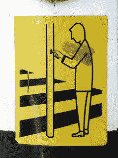
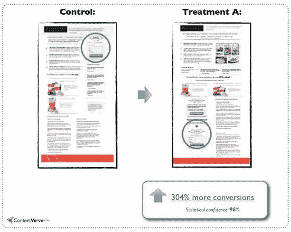
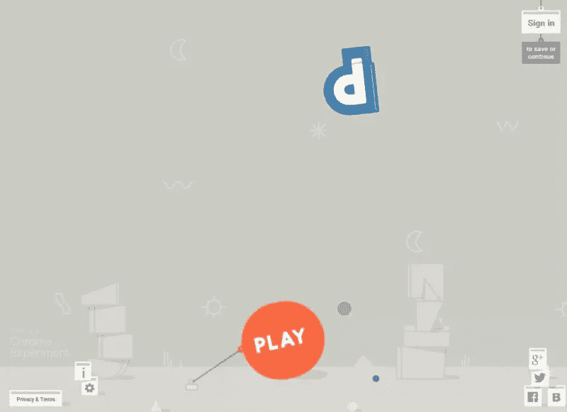
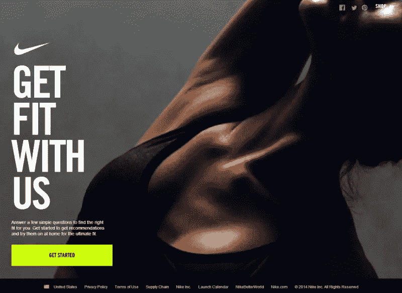
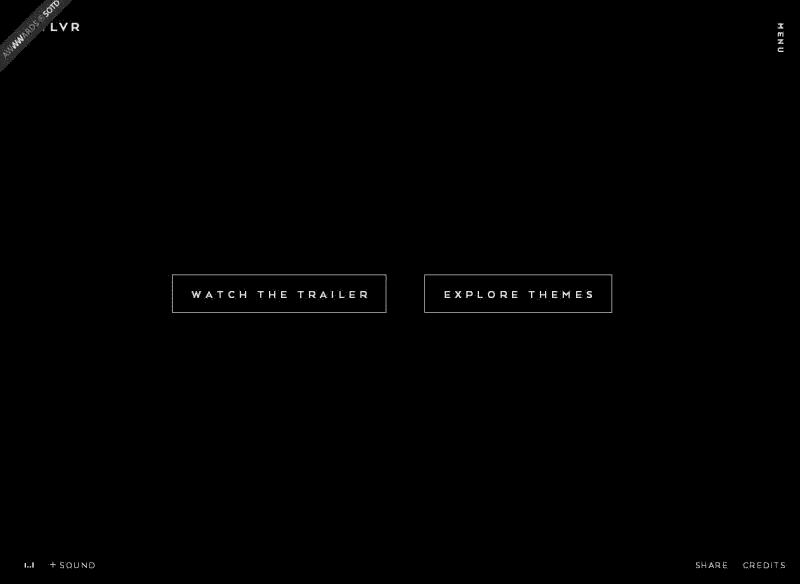
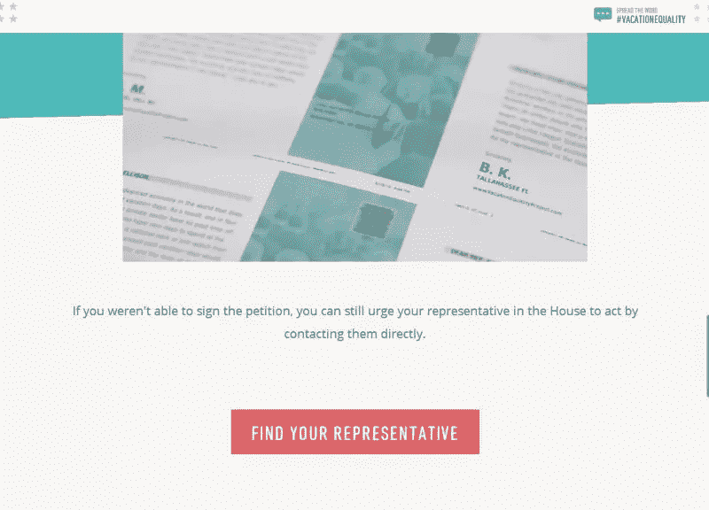
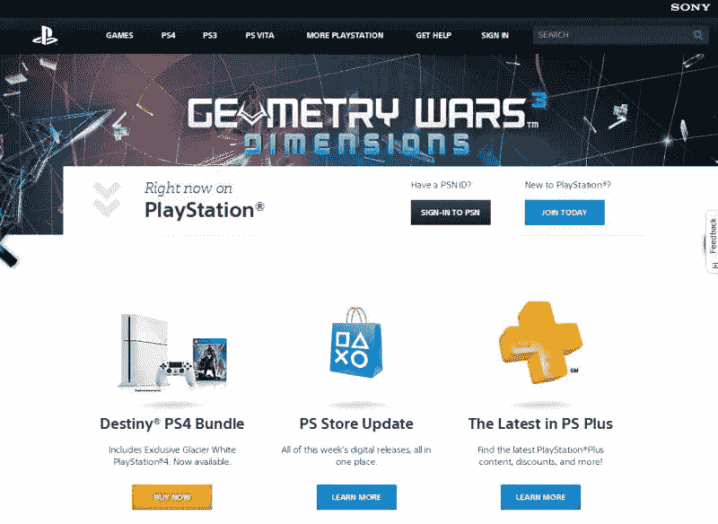
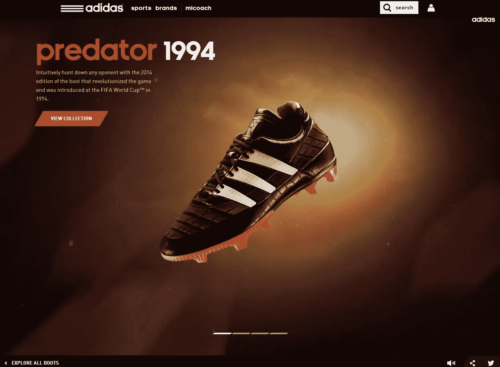

# 推它！让您的 CTA 按钮更易点击

> 原文：<https://www.sitepoint.com/push-making-cta-buttons-clickable/>

图片来源:boehjah

设计偏差。我们都是这样的罪犯:看着某样东西，仅仅根据颜色、布局、用词等等就自动得出一个观点。我知道我是。

闪亮、光滑的按钮让我感到厌烦，令人分心的颜色选择让我点击返回按钮，虽然我不是一个按钮爱好者，但我是一个用户*。所以，如果你的设计让一个用户感到厌烦，很有可能他们不是孤立的讨厌者。*

 *当然，糟糕的设计可能会让我们畏缩，但是糟糕的行动呼吁(CTA)按钮确实会伤害你的转化。

根据 Anum Hussain 的一篇文章([http://blog . hubspot . com/marketing/personalized-calls-to-action-convert-better-data](http://blog.hubspot.com/marketing/personalized-calls-to-action-convert-better-data))，当一位同事对以用户为目标的 CTA 进行测试时，这些特定的 CTA 的查看提交率比没有特定目标的 CTA 高出 42%。

你是做什么的？

只是模仿你的竞争对手，希望得到同样的结果？我知道这很诱人，但不，这不是答案。相反，我们需要看看案例研究，了解是什么让这些按钮如此容易点击。

所以，如果你想增加你的转换率，或者只是看看你是否做对了？然后继续阅读一些技巧来提高你的 CTA。

## 证据就在布丁里

要了解一个糟糕的 CTA 按钮会对你的网站造成多大的损害，最好的方法就是查看已经造成损害的地方。

幸运的是，已经有很多网站误入了不良 CTA 的陷阱。更重要的是，有人已经研究了这些问题，并找到了解决方案来帮助其他人避免未来的 CTA 失败。

Michael Aagaard 提供了 10 个很好的案例研究。在他的文章中有许多很好的例子和要点，但最关键和最极端的转化率之一来自于**304%**的转化率提升。

在这里，迈克尔分析了古老的“高于折叠”理论。你知道，就是说一个有效的 CTA 需要在折叠之上。事实证明这不一定是真的。

当他创建一个测试并把他的 CTA 放在一个很长的登录页面的底部而不是顶部时，性能提高了 304%。然而，Aagaard 指出，并不是所有的功劳都可以归因于简单的调整。

小的布局调整增加了 304%的转化率

不管怎样，事实是这种变体的表现优于遵循“黄金法则”的 CTA。如果你对这项研究感兴趣，外卖或类似的研究，我鼓励你看看他的文章。([http://content verve . com/10-号召行动-案例研究-示例-按钮测试/](http://contentverve.com/10-call-to-action-case-studies-examples-from-button-tests/) )

Aagaard 并不是唯一一个看到低于折叠线的好结果的人。你可以在 Certified Knowledge([http://Certified Knowledge . org/Blog/when-best-practices-fail/](http://certifiedknowledge.org/blog/when-best-practices-fail/))和 MarketingExperiments 博客上看到不同转化率的类似结果。([http://www . marketing experiments . com/blog/marketing-insights/call-to-action-errors . html](http://www.marketingexperiments.com/blog/marketing-insights/call-to-action-errors.html))

## 第一次不总是最好的

在我们进入技巧之前，让我们先来谈谈为什么低于倍的 CTA*似乎有更好的转化率的原因之一。*

首先，它确实与它相对于折叠的位置无关。记住，很多网络阅读器都是扫描仪。不仅如此，他们往往不会真正“阅读”任何东西。

Jakob Neilsen 注意到 80%的用户注意力都集中在折页上方(来源:[http://www.nngroup.com/articles/scrolling-and-attention/](http://www.nngroup.com/articles/scrolling-and-attention/))。虽然这很好，但我们不能忘记，我们人类是积极的动物，我们喜欢感兴趣的东西。

也就是说，转换率的增加不是因为他们的位置，而是因为之前的拷贝数量和类型。好的文案意味着更好的转化，当你思考它的时候，这个概念是有意义的。你不会自动买第一部放在你面前的智能手机吧？

# 小变化大成果

现在你已经看到了简单的改变是如何创造更好的转化率的，让我们来谈谈一些你可以编辑 CTA 的方法。

## 形状

【https://spellup.withgoogle.com/】T2

你的 CTA 的形状可能是人们是否点击它们的决定性因素。形状可以是心理激励因素，这取决于你决定选择哪种几何形状。

不仅如此，如果你决定使用一个不常用的形状，你可以很好地促使人们点击，仅仅是因为你的创新美学。

当决定你将采用什么样的形式时，你应该首先了解你的网站的目的以及你的网站面向什么类型的访问者。你的整体网站设计也将是形状选择的一个因素。

当试图促进关心、支持和友好的感觉时，循环 CTA 是完美的。正方形和长方形让人联想到熟悉、可靠和力量，而垂直线则更阳刚，而水平线则更女性化。

## 颜色；色彩；色调

[https://www.nike.com/cdp/nikepro360fit/us/en_us/#/](https://www.nike.com/cdp/nikepro360fit/us/en_us/#/)

色彩在设计中很重要。这是一个强大的工具，当谈到你的 CTA 时，一个糟糕的选择可能是点击和逃避之间的一切。

在设计 CTA 时，你要确保这些按钮容易被发现。这可以通过使用对比色轻松实现。对比色将使你的按钮不仅在背景下容易辨认，而且可读性更好。

虽然使用明亮的颜色是理想的，但你要确保你的颜色不要太亮。太亮的颜色会显得不吸引人和花哨，这自然会降低它的可点击性。

如果你不确定选择哪种颜色，那就创建多个版本并获得反馈。当涉及到你的 CTA 颜色时，一个很好的经验法则是深色按钮，浅色文本或浅色按钮，深色文本。

## 语言

[http://twlvr.com/](http://twlvr.com/)

需要文字来让人们点击你的 CTA，这意味着你需要好的文案。请注意，陈词滥调和枯燥乏味的文案与激动人心的文案是有区别的。

你必须时刻记住你想让谁点击你的按钮，虽然创建定制的目标 CTA 是一个挑战，但你仍然可以让你的实际按钮文本比其他人更有趣。

与“让我开始”和“显示我的结果”等更有吸引力的触发器相比，像“点击这里”和“下载”这样无聊的 CTA 文案显得索然无味。这些内容更加个人化，也更容易点击，而且不会太罗嗦。

不确定你的文案是否管用？问问你自己，你会点击出现的按钮吗？如果答案是否定的，那么是时候修改了。

## 大小

[http://www.vacationequalityproject.com/](http://www.vacationequalityproject.com/)

他们说大小并不重要，但对于你的 CTA 来说，情况并非如此，这意味着你不仅需要仔细考虑你把按钮放在哪里，还要考虑它有多大。

通常来说，越大越好，但有时这并不总是最明智的选择，因为太大的按钮会显得“咄咄逼人”和“格格不入”。你不希望你的访问者因为你的错误选择而感到不舒服。

Paul Olyslager 在他的文章([http://www . paulolyslager . com/five-quick-easy-ways-improve-websites-usability/](http://www.paulolyslager.com/five-quick-easy-ways-improve-websites-usability/))中建议做一个 5px 的模糊截图测试。这个技巧是为了帮助你注意到关键的突出或那些缺乏突出。如果你的 CTA 很难被发现，那么你应该增加它的大小。

务必确保 CTA 的尺寸不会改变设计布局。如果是的话，要么是太大了，要么是位置需要调整。

## 连续性

除了颜色，连续性在设计中占据了重要的位置，所以你的 CTA 也不例外。因为你的按钮是设计，你需要确保你的设计考虑到了你的网站。

设计师在整个设计工作中使用对比色和补色是有原因的。这不是因为他们认为他们必须这样做，而是因为这样做有效。它不仅能工作，还能在一天结束时将整个作品组合在一起。

如果你有一个网站，拥有土色类型的颜色，并使用了大量的圆形元素，那么你最不想做的事情就是用醒目的红色和橙色创建边缘清晰的 CTA。颜色的选择不仅出乎意料，而且破坏了网站的整体设计。

如果你有这个问题，那么检查你的网站的每一页，看看你是否可以在页眉、页脚和菜单这样的小区域整合你的 CTA 设计选择，或者只是重新设计你的按钮。

## 可点击的

老实说，关于如何生成 CTA 按钮，你可以遵循 10 或 20 个不同的提示和技巧，但如果你的按钮看起来不像它应该是什么，也没关系。

当人们想到按钮时，他们会想到斜边、光滑的封面等，但这并不是每个人都喜欢的外观。

你可以创建可点击的按钮，不管你是想要一个扁平的外观还是其他的。一些潜在的选择是使用微妙的阴影，给它一些尺寸和你的页面分离。另一种选择是当鼠标停留在元素上时，创建悬停动作或其他类型的动画。

边框和适当使用空白也是很好的策略，让人们知道你的按钮实际上是一个按钮，可以点击。

## 结论

这些只是设计完美的可点击 CTA 的一小部分技巧。如果你需要修改按钮，我强烈建议你从上面列出的简单步骤开始，在尝试一个完整的重新设计之前，看看你的转化率是否有所提高。

请记住，你的按钮的形状、颜色、语言、大小、连续性和可读可点击性会对你的用户产生影响。

## 分享这篇文章*