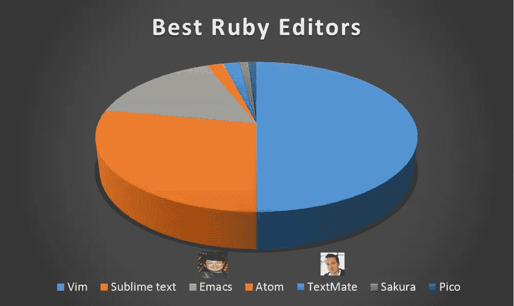

# ruby 主义者用什么编辑器？

> 原文：<https://www.sitepoint.com/editor-rubyists-use/>


嗯，你已经决定学红宝石了，是吗？太好了！Ruby 是一种很棒的语言，旨在让程序员开心。去吧！当你进入 Ruby 的世界时，你意识到，“我需要一个编辑器”。好的，谷歌，给我找最好的 Ruby 编辑器。

神圣的烟雾！有大量的编辑器，每个编辑器都有一个对其功能深信不疑的社区。“用 vim！”“用 Emacs！”“用 TextMate！”“用崇高的文字！”。你在恐惧中退缩…如果你做了错误的选择怎么办？？？

这个可能适用于许多 Ruby 爱好者的小故事，启发我采访了一些 Ruby 爱好者，询问他们最好的 Ruby 编辑器。如果没有别的，这将显示哪些编辑器被更多的 ruby 爱好者使用，并提供一些数据说明原因。我希望它能作为 Ruby 新手的指南，或者甚至是已经在使用 Ruby 的人的指南，Ruby 上的编辑器很流行。

我采访了 100 名卢布主义者。采访引出了以下编辑(按偏好顺序排列):

> *   I'm coming.*   [Noble words]*   【emacs】*   atom*   Text*   cherry blossoms

到目前为止，Vim 是最受欢迎的编辑器，被 50%的受访者使用。下面的图表讲述了这个故事:




我采访了两位最著名的 ruby 家:Yukihiro Matusmoto (Matz)和 David Heinemeier Hansson (DHH)。如果你不知道，马茨是 Ruby 语言的创始人，DHH 是 Ruby on Rails 的负责人。Matz 更喜欢 *Emacs* ，而 DHH 用的是 *TextMate* 的原版。我发现非常有趣的是，Ruby 的两个支柱没有使用最流行的编辑器，这当然是选择工具集时要考虑的事情。

不管怎样，Vim 为我的样本集赢得了最常用的 Ruby 编辑器奖。Vim 由布莱姆·米勒撰写，并于 1991 年首次向公众发布。网上关于 Vim 的文章数不胜数，包括 SitePoint 上的两篇非常好的文章。Islam Wazery 写了[Vim 入门](https://www.sitepoint.com/getting-started-vim/)和[用 Vim 进行有效的 Rails 开发](https://www.sitepoint.com/effective-rails-development-vim/)，如果你选择了老路，这两本书都值得一读。

但是，是什么让 Vim 如此特别呢？嗯，答案是“很多很多事情”。我将从一篇名为[伟大的 Vim 特性](http://c2.com/cgi/wiki?GreatVimFeatures "Great Vim Features")的文章中挑选几个项目，这篇文章由许多 Vim 用户的贡献组成，试图将这一点讲清楚。

Stephan Houban 表示，他喜欢的 Vim 特性之一是宏特性。乍一看，这个功能似乎并不特别。`q[letter]`开始录制宏，第二个`q`终止它。宏调用了我的打字`@[letter]`。

但是，这才是有趣的开始。假设我想创建一个宏，它执行以下操作:向下移动一行，替换第一个和第二个单词。使用标准的 Vim 命令，这可以表示为:`j^dwwhp`

如前所述，将该序列记录到名为`@a`的宏中。现在，如果您愿意，您可以对文件中的所有行重复该宏。还不错！

斯蒂芬·索恩进来说，“这很好，但是习语可以通过使用 g 得到极大的提高。”

例如，您有一个宏，用于将一行中的第二个单词改为“foo”`qb^wcwfoo<esc>q`(伙计，这看起来很奇怪)。现在，直观地选择一个要执行宏的块。但是，不要猛拉选择，而是按下`:`，这将使您进入所选块的命令模式(命令行看起来像`:'<,'>`，标记可视块的开始和结束)。然后，追加`g/^/normal @b`，这样命令行看起来就像:

```
:'<,'>g/^/normal @b 
```

(注意:这假定您录制的宏是用字母“b”保存的。)

这将对可视块中的每一行执行宏。解释起来很复杂，但是一旦你熟悉了视觉模式和`:g/`，它会出奇的快。

那篇文章中的另一位撰稿人比较了 Emacs 的一些特性:

> “依我看，VI 唯一最有用的特性是 Emacs 没有的(AFAIK)。(点)命令，重复前面的操作。(即:上一次插入，替换单词，删除单词，…)。它让你体会到为什么 VI 是模态编辑器。”

(值得注意的是，Emacs 的用户已经对这种说法做出了回应，这也是阅读它的另一个原因。)

最后，我想强调另一个关于某人在 Vim 中更喜欢的特性的评论:

> 我绝对欣赏 vim 的以下特点:
> 
> *   无限撤销
> *   编辑 ex 命令的历史(发出一些 ex 命令，按:并使用箭头键)
> *   编辑搜索命令的历史记录增量搜索
> *   持久的痕迹

尽管维姆在数量上遥遥领先，但这只是一个考虑因素。你有意见吗？爱 Vim？用崇高的文字？你最好的 Ruby 编辑器是什么？

## 分享这篇文章