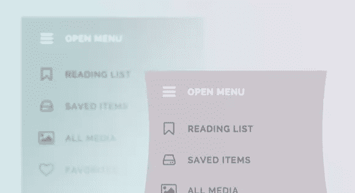
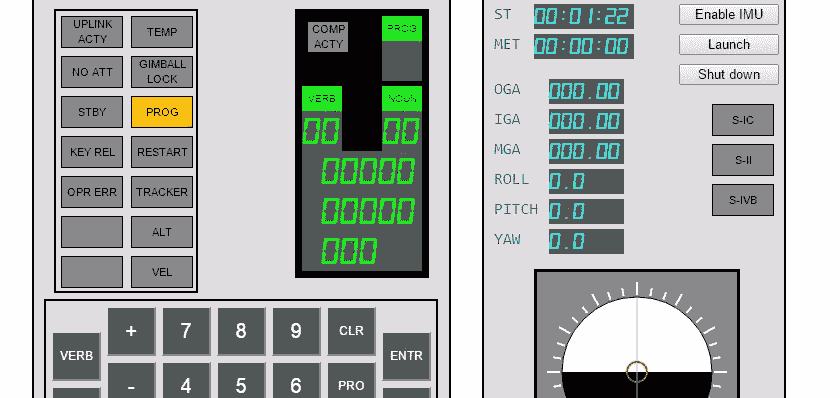

# 在我们的雷达上:弹性 SVG 和 Slack 机器人

> 原文：<https://www.sitepoint.com/radar-elastic-svg-slack-bots/>

欢迎来到《在我们的雷达上》,这是一个关于新闻、趋势和其他来自 web 开发世界的很酷的东西的每周综述。

## 设计工具

本周我们发现很多文章都在关注设计师的需求。[不要责怪设计师](https://medium.com/@shipitgood/dont-blame-the-designer-967324853676)帮助人们理解设计师的角色，以及这是一项多么不容易的任务，并且好好看看[设计师的崇高文本设置](https://medium.com/design-notes/a-designers-sublime-text-setup-e3963f8d79da)。

Lorem Ipsum 是一种用于为布局提供临时文本的文本类型，现在您可以[满足 Ipsum](http://meettheipsums.com/)的要求，有各种有趣的临时文本供您使用。另一种类型的内容也在【T2 内容，永远探索，在那里你可以根据你想要的任何主题产生无尽的废话——但不要试图用它来写任何文章。

## 改善事物的外观

[它是什么颜色](http://whatcolourisit.scn9a.org/)创建当前时间的背景颜色，但也许更有用的是 [Labelauty jQuery 插件](https://github.com/fntneves/jquery-labelauty)，它给你[漂亮的复选框和单选按钮](http://fntneves.github.io/jquery-labelauty/)。更进一步，我们有了[弹性 SVG 元素](http://tympanus.net/codrops/2014/12/15/elastic-svg-elements/)，这将更容易传达[生命的幻觉](https://vimeo.com/93206523)(视频)。

在其他地方，我们查看了错误消息的 UX，并探索了具有许多新特性的新版本语义 UI 1.2。你也可以在[更深入地研究，他们已经建立了一个独立的网站](http://learnsemantic.com/)，这样你可以了解更多。

## 诊断复杂问题

谷歌已经透露了一些关于他们如何诊断和修复复杂问题的有趣细节。Gmail 遇到了一些内存问题，我们了解了他们如何有效地管理 Gmail 规模的内存以及他们用来诊断问题的工具。在其他地方，我们学习如何[将谷歌地图](http://osvaldas.info/lazy-loading-google-maps)惰性加载到你的网页上。

我们还通过将 Slack 即时消息与 hellobot 相结合来了解如何开始使用 Slack Bots，我们问[你会实现无密码登录吗？](https://www.sitepoint.com/implement-passwordless-login/)著名的安全专家 Steve Gibson 也在研究一款[安全快速可靠的登录](https://www.grc.com/sqrl/sqrl.htm) (SQRL)系统，该系统承诺不再需要密码，并且有一个漂亮的视觉指南来帮助我们理解正在发生的事情。

## 去月球吧！

最后，本周我们有 Moonjs，一个用 JavaScript 构建的在线阿波罗制导计算机(AGC)模拟器，允许你探索用于登月的计算机系统。

阿波罗制导计算机模拟器

哪些链接引起了你的注意？你会为设计师研究一些崇高的文本工具吗？不管怎样，我们都想听听你的想法。

## 分享这篇文章