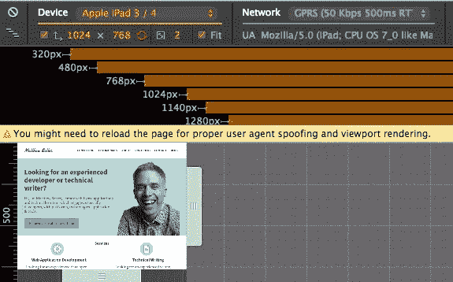
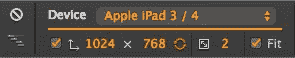
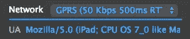
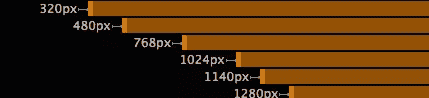
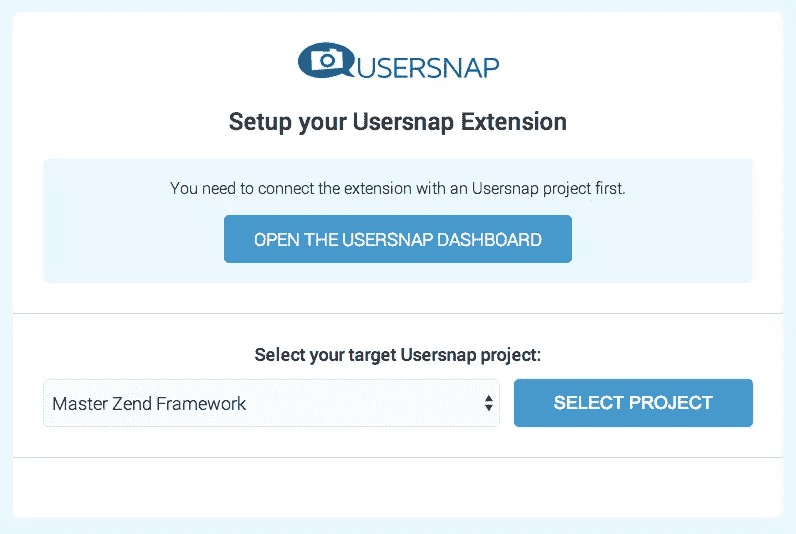
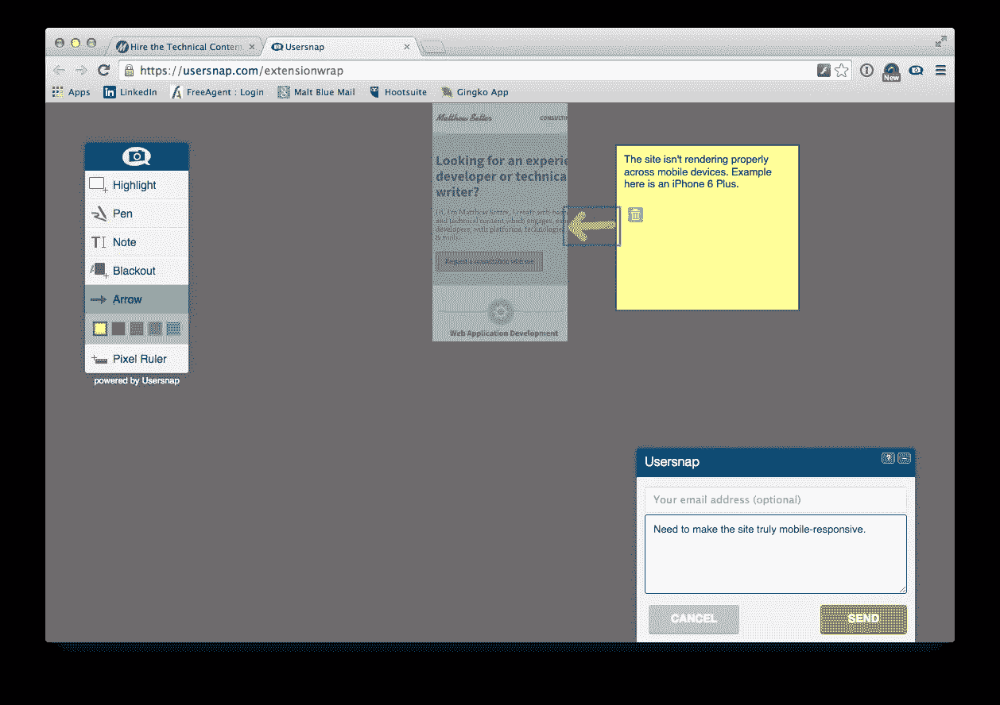

# Google Chrome 中响应更好的网站测试

> 原文：<https://www.sitepoint.com/better-responsive-website-testing-google-chrome/>

你的网站有移动意识吗？它真的有反应吗？如果不是，[根据 eMarketer](https://www.emarketer.com/Article/Smartphone-Users-Worldwide-Will-Total-175-Billion-2014/1010536) 的数据，预计今年智能手机用户将超过 17.5 亿。到 2017 年，全球手机普及率将上升至 69.4%。

我知道:你以前听过这些圣歌；*互联网无处不在；明年，互联网将只能在移动设备上观看；台式电脑正在步恐龙的后尘……*

但说真的，这就是正在发生的事情！不管你喜不喜欢，如果你不跟上潮流，你投入巨资的网站可能很快就会拥有非常有限的受众。

但这就变得复杂了，因为没有一个移动的景观。随着最近 iPhone 6 和 6 Plus 的发布，至少有 46 款竞争设备，它们都有不同的分辨率和硬件功能。除此之外，还有网络速度的问题。

然而在台式机上，你可能只会想到 Wifi 或 DSL 速度，移动手机有各种不同的网络数据速度，即: *GPRS* 、 *EDGE* 、 *3G* 和 *LTE (4G* )。

虽然你可以创建一个移动感知网站，但你能创建一个可以处理如此多种设备，并且在不同的数据传输速度下都能很好工作的网站吗？

我现在想向你们展示两个简单的工具:工具可以帮助您响应最常见的设备和速度，并保持在开发问题的顶端，直到您的网站完美。让我们从第一个开始。

## 谷歌浏览器中的移动仿真

随着 Chrome 32 的发布，增加了一个新的开发工具——**移动仿真**。这个工具绝对是调试移动和响应式设计的天赐之物。

如果您尚未打开它，请使用以下选项之一打开它:

*   按 F12(或者在 Mac 上按 Cmd+Alt+l)
*   点击**视图- >开发者**下的**开发者工具**
*   右键点击网站上的任意位置，点击**检查元素**

在开发者工具窗口的顶部，你会看到一个新图标，看起来像一部手机。点击该按钮，您当前所在的网站将启用移动仿真模式，如下图所示。

你可以看到普通的开发者工具是可用的，但是还有许多额外的选项，并且该站点已经被渲染以模拟移动设备，在本例中是 iPhone 6 Plus。现在让我们更详细地看看它。

### 设备配置

在左上角，有一个设备配置，允许你从 46 个移动设备中选择一个来模拟。在设备列表下方，您可以看到以下选项:

*   屏幕分辨率
*   显示横向和纵向之间的旋转
*   设置设备像素比率
*   将显示器安装在可视区域内，或者以最大尺寸显示

### 网络结构

接下来，蓝色部分是网络配置。在那里你可以设置网络速度，从离线到无节流。这将有助于你了解你的网站加载的快慢取决于用户所在的网络速度。

在“网络”下，您可以手动设置用户代理。这将有助于你看到你的网站将如何反应。

### 断点

那么那些断点呢？该工具将自动检测你在 CSS 中设置的所有断点，并提供每个断点的链接。你可以在下图中看到它已经检测到 6。通过点击它们中的每一个，您可以看到页面在每一个位置是如何呈现的。

关于用户代理字符串的一点；如果你不想手动设置它们，你不必这样做。通过单击键盘上的 escape，您可以打开更多的配置选项，并从预设的用户代理列表中进行选择。

除此之外，你还可以模拟硬件设备传感器，包括*触摸输入*、*地理定位*和*加速度计*。

## 用户快照扩展

有了这个新版本提供的所有可配置性，为移动设备设计变得简单多了。但这并不是故事的结尾。

看到网站在不同条件下如何渲染是一回事，但是你如何与你的开发者和设计者分享结果呢？

Usersnap Chrome 扩展与 Chrome 开发者工具的这一新功能完美集成。如果你曾经使用过[的 Usersnap Widget](https://usersnap.com/features/feedback-widget-for-screenshot-bug-reporting) ，你可以使用你熟悉的屏幕注释和报告功能，并通过移动仿真插件将其应用到你的设计会议中。

如果你还没有，从 Chrome 网上商店安装它。安装完成后，你会在 Chrome 工具栏上看到一个用户快照图标。第一次使用它时，会出现一个小提示，指示您必须配置它。

单击“确定”，登录 Usersnap 后，您将进入该工具的配置页面。如下图所示，在页面底部，您会看到您的项目列表。

从列表中选择一个相关项目，点击**选择项目**。完成后，您现在就可以使用这个扩展了。回到移动仿真插件，我注意到当页面到达 768px 断点时，它停止正确渲染。

所以我想让我的团队知道这件事，这样我就可以修复它。点击 Usersnap 按钮打开我在 Usersnap 编辑器中看到的网站，在这里我可以使用所有常用的功能。我可以添加一个*评论*、*高亮*、*备注*、*黑屏*、*标尺*、*画屏*。

你可以在上面的截图中看到，我为我的团队做了一些注释，让他们知道这个网站看起来像什么，它需要一些改变才能在移动设备上正确地呈现这个网站。现在，在设计、开发和调试优秀的网站和应用程序时，您拥有比以往任何时候都更大的灵活性和控制力。

## 包扎

现在，这两个伟大的工具可以帮助您简化确保网站或 web 应用程序跨设备兼容性所需的工作。

你尝过了吗？你的经历是怎样的？

## 分享这篇文章