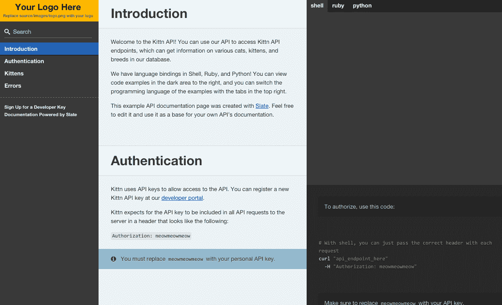
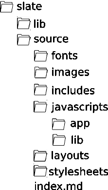

# 用 Slate 编写 API 文档

> 原文：<https://www.sitepoint.com/writing-api-documentation-slate/>

所以你已经为自己构建了一个 API。也许是休息*充分*，休息*像*或者其他完全不同的事情。您已经实现了身份验证——无论是使用 OAuth、HTTP 基本身份验证还是 JSON Web 令牌。您已经使用 JSON，可能是 XML，或者甚至是其他什么东西形成了您的响应。您的单元和集成测试正在通过，您可能有一个第三方服务，比如定期测试它的 Runscope，或者使用 JSON 或 XML 模式来验证您的响应。

然而，还有一件事。

事实是，API 的好坏取决于它的文档。这适用于仅供内部使用的情况——可能是基于 JavaScript 的单页应用程序，或者是移动应用程序——但如果是供公共消费的话就更是如此。

有许多方法可以把你的文档放在一起。出于本文的目的，我假设它是基于 web 的，无论它是在 internet 上公开提供还是在公司的内部网上私有。

你当然可以用 HTML 手工编码。你可以使用付费服务，比如 Readme.io。甚至有工具可以帮助从源代码自动生成 API 文档，比如 [Doxygen](http://www.stack.nl/~dimitri/doxygen/) 和 [API 蓝图](http://apiblueprint.org/)，或者用于创建动态文档；如[霸气](https://helloreverb.com/developers/swagger)。

另一个选择是[石板](https://github.com/tripit/slate)。Slate 允许您使用 markdown 手工编写 API 文档，然后它会为您打包成一个预先设计好的静态 HTML 站点。因为它生成静态 HTML，所以托管很简单——特别是，用 Github 页面托管很容易。让我们来看看它是如何工作的，并通过一个例子从安装到部署。

## 期待什么

一张图胜过千言万语；这里有一个现成的例子:



要在野外查看 Slate 生成的文档，请查看 [Travis](http://docs.travis-ci.com/api/) 文档，或 Mozilla 的[local feed](http://mozilla.github.io/localForage/)或 [recroom](http://mozilla.github.io/recroom/) 文档。你会在项目的[自述文件](https://github.com/tripit/slate)中找到更多的例子。

本质上，默认情况下您将得到以下内容:

*   一个包含基于 JS 的文档的单页静态站点(使用 [jquery.tocify.js](https://github.com/gfranko/jquery.tocify.js)
*   自动降价分析
*   可自定义的三列布局
*   页面内搜索
*   选项卡式、特定于语言的代码示例
*   语法突出显示

## 入门指南

### 先决条件

你需要 1.9.3 或更高版本的 Ruby。如果你还没有文档,那就去看看吧。

您还需要 Bundler gem，您可以从命令行使用以下命令安装它:

```
gem install bundler
```

> 如果你使用 [Docker](https://www.docker.com/) ，你可以跳过这个和一些安装步骤；Slate 附带了一个 docker 文件，您可以使用它快速轻松地启动和运行。

### 装置

接下来，[分叉](https://help.github.com/articles/fork-a-repo/)到 [Github 库](https://github.com/tripit/slate)。

将存储库的分支克隆到您的机器上:

```
git clone git@github.com:[YOUR-USERNAME]/slate.git
```

如果您查看一下新创建的`slate`文件夹，您应该会看到以下结构:



接下来，`cd`进入`slate`目录并安装必要的库:

```
bundle install
```

最后，输入以下命令来启动 Middleman，这是一个轻量级 web 服务器，它将在端口 4567 上进行侦听:

```
bundle exec middleman server
```

如果你现在浏览到`http://localhost:4567`，你会看到这个网站辉煌的一面。也可以浏览到`http://localhost:4567/__middleman/`查看中间人配置。

除了在本地提供网站服务，中间人还会留意变化，并根据需要重建网站。我们将通过修改网站的元数据来尝试这一点。

## 元数据和配置

让我们从修改文档站点的标题开始。打开`slate/index.md`，更改文件顶部的(基于 YAML 的)配置的第一行:

```
---
title: API Reference
```

例如:

```
---
title: MusicApp API Docs
```

现在回到你的浏览器，点击刷新，你应该看到改变立即生效。

现在让我们看看其他的配置变量。如果您查看默认站点，您会发现它包括位于右栏顶部的三个选项卡，这些选项卡允许您浏览特定语言的示例代码。

开箱即用，这些选项卡是 Shell、Ruby 和 Python:

```
language_tabs:
  - shell
  - ruby
  - python
```

让我们摆脱 Python 吧(无意冒犯！)并将其更改为 PHP:

```
language_tabs:
  - shell
  - ruby  
  - php
```

你会注意到我们用小写字母添加了 PHP。这很重要，因为语言名称必须与 Slate 使用的语法高亮器 [Rouge](http://rouge.jayferd.us/demo) 所期望的相应格式完全匹配。然而，您可能希望用大写字母显示它。现在，让我们更改“shell ”,使其显示“cURL ”,并正确地大写 Ruby。要为一种语言提供另一种“显示名称”，只需将其附加在冒号后，如下所示:

```
language_tabs:
  - shell: cURL
  - ruby: Ruby  
  - php: PHP
```

再一次，在你的浏览器上点击刷新，你会立刻看到变化。

配置部分还允许您在左侧栏的菜单下添加链接。例如，要向您的客户端库添加链接，请按如下方式修改`toc_footers`部分:

```
toc_footers:
  - <a href='#'>Sign Up for a Developer Key</a>
  - <a href='https://github.com/acme'>Client libraries</a>
  - <a href='http://github.com/tripit/slate'>Documentation Powered by Slate</a>
```

我们很快就会看到`includes`部分。

现在我们已经配置了我们的文档站点，是时候开始写作了。

## 编写您的文档

开箱即用，Slate 提供了一堆虚拟内容。最简单的开始方式可能是修改它，因为它会帮助你熟悉 Slate 的结构和 markdown 的风格。

你会注意到有四个部分，左边的菜单会自动选择。使用已经为您安装的 JQuery TOC(目录)插件，它允许您在它们之间导航，并且还将扩展当前项目以显示二级导航。

这四个部分如下:

*   介绍
*   证明
*   小猫
*   错误

简介、认证和错误部分足够通用，我们可能希望保留它们，尽管需要修改以适应我们的 API。

“小猫”反映了虚拟文档的示例实体。常见的做法是将 API 文档分成 API 支持的不同实体，所以让我们将“小猫”改为“专辑”，因为出于本文的目的，我们将记录一个与音乐相关的 API。为此，找到以下内容(在第 61 行周围):

```
# Kittens
```

将其更改为:

```
# Albums
```

您应该会发现，只需重命名这个一级标题，左侧菜单和自动生成的锚的名称就会随之改变。

您还可以修改、删除或添加第二级标题，这同样会相应地更新扩展形式的菜单。

这是我们音乐 API 的一个例子:

```
## Get All Albums

	```ruby
	require 'music'

	api = Music::APIClient.authorize!('your-api-key')
	api.albums.get
	```

	```shell
	curl "http://example.com/api/albums"
	  -H "Authorization: your-api-key"
	```

	```php
	$client = new Acme\Music\Client('your-api-key');
	$client->authorize();
	$albums = $client->getAlbums();
	```

	The above command returns JSON structured like this:

	```json
	[
	  {
	    "id": 1,
	    "title": "Dubnobasswithmyheadman",
	    "artist": "Underworld",
	    "year": 1994
	  },
	  {
	    "id": 2,
	    "title": "ISDN",
	    "artist": "Future Sound of London",
	    "year": 1994
	  }
	]
	```

	This endpoint retrieves all albums.
```

尽管注意菜单只有两层深度，但可以像平常一样随意使用第三层及以上的标题。

就你的文档主体而言，它很大程度上只是普通的降价。以默认的简介为例，对其进行相应的修改。当我们开始使用通知和代码样本时，事情会变得稍微复杂一些，我们很快就会看到。

## 使用包括

如果你的 API 文档变得很长或者很复杂，把它们都保存在一个文件中会很快变得难以管理。然而，把它分成多个文件是非常容易的。

您会注意到示例错误部分已经位于一个单独的文件中——您可以在`includes/_errors.md`中找到它。

让我们创建一个新的部分，“艺术家”，并把它放在一个单独的文件。首先，将该文件创建为`includes/_artists.html`:

```
# Artists

In addition to album and track information, you can also request information about the artists.

## Getting all Artists

Retrieve information about all artists using the following URL:

`GET http://example.com/api/artists`

## Getting an Artist

Retrieve a specific artist using the following URL:

`GET http://example.com/api/artists/[ID]`

<aside class="notice">
Replace [ID] with the numeric ID of the artist
</aside>
```

现在我们需要告诉 Slate 我们的新部门。在`slate\index.md`顶部的配置部分，插入文件名——减去前面的下划线——将其放在错误部分的正前面，如下所示:

```
includes:
  - artists
  - errors
```

您应该会发现,`includes/_artists.md`的内容已经被插入到错误部分的前面，并且菜单已经被自动调整以与之匹配。

## 警报

Slate 有三种现成的“警告”样式；通知、成功消息和警告。这些按顺序如下图所示:


要显示这些，插入一个带有相关类的`<aside>`:

```
<aside class="notice">...</aside>

<aside class="success">...</aside>

<aside class="warning">...</aside>
```

## 桌子

表格非常适合 API 文档。现成的错误部分使用一个表来列出 HTTP 响应代码；很有可能，你可以简单地修改它来适应。

您可能还想使用它们来列出端点的可用参数；同样，虚拟内容提供了您可以简单修改的示例。

否则，除了手写之外——这相对简单，但需要技巧——你可以使用[这个在线工具](http://www.tablesgenerator.com/markdown_tables)。

## 补充报道

右侧的侧边栏主要由三个独立的元素组成:

*   无情的
*   特定于语言的示例代码
*   抽样输出

下图是一个样本标注:


要包含一个将出现在右栏中的报价，请使用 blockquote 的降价:

```
> A sample of the JSON you can expect is displayed below
```

要包含代码示例，请使用 Github 风格的标记，确保语言名称与我们之前配置的语言名称相匹配；如果你一直在学习，你会记得在这个例子中那些键是`shell`、`ruby`和`php`。如果您尝试使用“显示”名称，例如 cURL 或 PHP，选项卡将无法正确显示。

例如，要显示一些示例 PHP:

```
```php
	<?php
	$client = new Acme\Music\Client($apiKey);
	$client->authorize();
	$albums = $client->getAlbums();
	?>
	```
```

注意，我们包含了开始和结束 PHP 标签；没有这一点，语法荧光笔就没有它的魔力。

通常，您会希望为每个端点创建所选语言的示例:

```
```shell
	curl "http://example.com/api/albums"
	  -H "Authorization: your-api-key"
	```

	```ruby
	require 'music'

	api = Music::APIClient.authorize!('your-api-key')
	api.albums.get
	```
```

如果你把你的代码放在相关的部分，它应该出现在正确的位置。当用户使用选项卡选择他们的首选语言时，应该只显示指定的语言。

您还可以嵌入来自 API 的示例响应。例如，提供一个 JSON 响应示例:

```
```json
	[
	  {
	    "id": 1,
	    "title": "Dubnobasswithmyheadman",
	    "artist": "Underworld",
	    "year": 1994
	  },
	  {
	    "id": 2,
	    "title": "ISDN",
	    "artist": "Future Sound of London",
	    "year": 1994
	  }
	]
	```
```

因为`json`键与配置的语言之一不匹配，所以它将显示在选择的选项卡上——这当然是我们想要的，因为无论使用哪种语言查询 API，输出都应该是相同的。

## 其他降价

你可以在 wiki 上找到 Slate [中使用的降价的综合指南；但是正如您将看到的，这几乎是标准的降价，所以如果您已经熟悉它，就没什么要学的了。](https://github.com/tripit/slate/wiki/Markdown-Syntax)

## 定制的

第一个也是最简单的事情，你可能想调整的是网站的标志。Slate 附带一个占位符图像；你需要做的就是更换它。

你会在`slate\source\images\logo.png`里找到。默认图像为 230 x 52 像素；默认网站使用固定宽度的左侧栏来匹配，所以除非你打算修改它，否则最好让你的图片保持大致相同的尺寸。

除了改变标志图像，定制真的很简单。除了 layouts 目录之外，`source`目录中的所有内容都将被复制到站点的“构建”版本中。如果你想添加额外的样式表、字体、图片或 JS 文件，只需将它们放入相关的目录中。

您可以随意修改样式表；请注意，它们是`.scss`格式的，所以坚持这种格式可能是最容易的——不要担心编译它们，因为这已经替你处理好了。“主要”风格在`source\stylesheets\screen.css.scss`中，您会发现它被很好地记录了下来。

如果您想修改布局，您可以在`source\layouts\layout.erb`中找到。如果您不太熟悉 ERB 模板系统，也不用担心；在大多数情况下，模板标签——用`<%= ... =>`表示——可以留在原处；无论如何，你会很快学会的。

如果愿意，您甚至可以重命名资产目录——您将在`config.rb`中找到适当的配置。

## 建筑物

一旦修改了内容，修改了虚拟内容并添加了附加内容，就可以开始构建了。

到目前为止，我们已经使用中间人来服务站点，监视文件系统并按需重建站点。在构建站点以准备部署时，我们可以使用以下命令:

```
rake build
```

你应该会发现这会创建一个新的文件夹——`build`——组成一个完整的、自包含的站点。markdown 被编译成一个单独的`index.html`文件，SASS 样式被编译，你的资产——例如`fonts`、`images`、`javascripts`和`stylesheets`文件夹的内容——被从`source`文件夹中复制过来。

在这个阶段，您可以简单地将`build`文件夹的内容上传到一个 webhost，使用 Githooks 发布它，或者创建一个 Grunt 或 Gulp 任务来自动完成。

如果你想使用 Github Pages，请继续阅读，因为这对你来说非常简单。

## 用 Github 页面托管

Github Pages 针对 Jekyll 进行了优化，但 Slate 的工作方式也差不多。

Slate 附带预装的[中间人 Github Pages](https://github.com/neo/middleman-gh-pages) 插件。部署很简单:

1.  将您的更改提交到源代码
2.  将这些更改推送到 Github
3.  创建一个`gh-pages`分支
4.  从命令行运行`rake publish`

在 Github 的文档和 [Slate wiki](https://github.com/tripit/slate/wiki/Deploying-Slate) 中有更多关于创建 Github 页面[的信息。](https://help.github.com/articles/creating-project-pages-manually/)

您也可以使用自己的自定义域；详见[相关文件](https://help.github.com/articles/setting-up-a-custom-domain-with-github-pages/)。

请记住，您需要创建一个`CNAME`文件；例如，假设您计划在 http://docs.example.com 发布您的文档。创建一个名为 CNAME 的文件，内容如下:

```
docs.example.com
```

将该文件放在`source`目录中。请记住，你放在这里的任何东西都会自动复制到你的`build`文件夹中，所以它会为你上传到 Github 页面。

当然，通过将你的文档发布到一个公共的 Github 库，你甚至可以将你的文档变成一个社区成果，允许用户通过直接访问或拉请求来修改你的文档。这完全是可选的，但是记住谁将真正使用您的 API 总是值得的。

## 摘要

在本文中，我们已经了解了 [Slate](https://github.com/tripit/slate) ，它只是帮助您记录 API 的一个工具。它可能不适合每个人的口味，但它为任何希望创建基于 HTML 的文档并使用 Markdown 编写的人提供了一个快速入门。

你如何编写你的 API 文档？请在评论中告诉我。

## 分享这篇文章