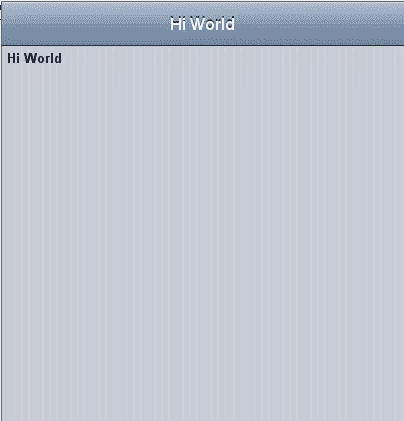
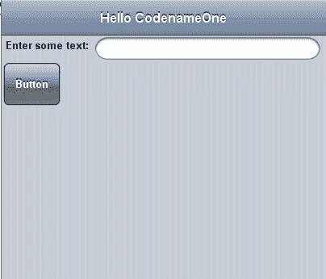
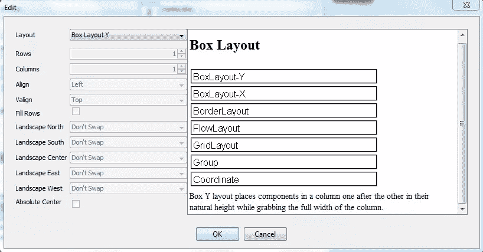
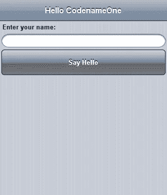
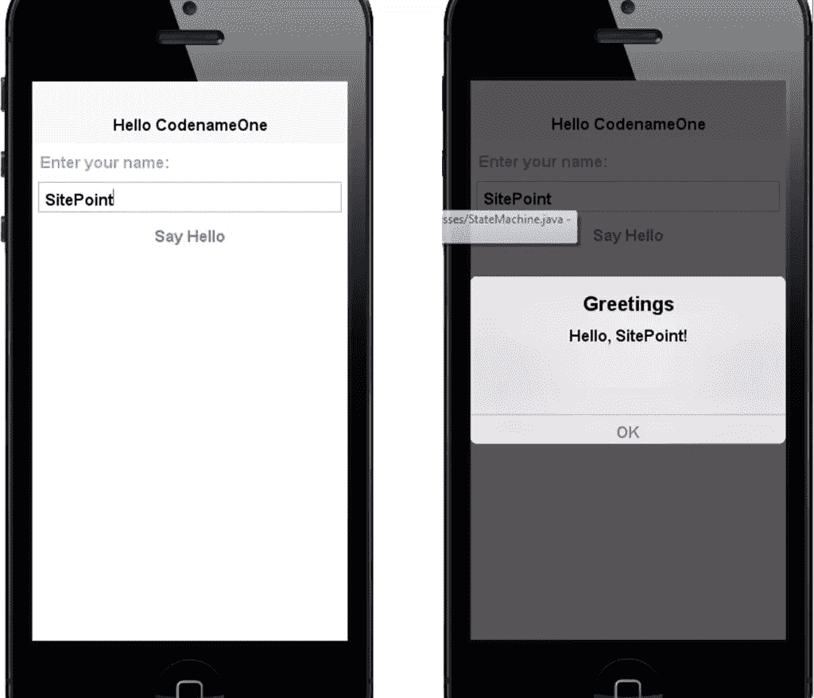

# 使用 Codename One 设计工具可视化地创建应用程序

> 原文：<https://www.sitepoint.com/using-codename-one-designer-tool-create-apps-visually/>

在我们上一篇关于 CodenameOne 的文章中，我讨论了它的设计工具的基本用法。在本文中，我们将更详细地了解这个工具及其用法。

## CodenameOne 用户界面基础

CodenameOne 中的每个 UI 元素都是[组件](https://codenameone.googlecode.com/svn/trunk/CodenameOne/javadoc/com/codename1/ui/Component.html)类的子类(直接或间接)。如果你熟悉 Android 开发，你可以把`Component`类想象成[视图](http://developer.android.com/reference/android/view/View.html)类。每个`Component`都有四个样式对象:

1.  挑选
2.  未经选择的
3.  有缺陷的
4.  压

这些样式中的每一个都包含了关于 UI 的信息，比如字体、颜色、边框等等。

默认情况下，CodenameOne 应用程序使用运行平台的本机 UI，但这是可以改变的。CodenameOne 定义了一个名为`includeNativeBool`的常数。设置为`true`时，使用原生 UI。否则，你可以创建在每个平台看起来都一样的主题，比如[皮革主题](http://codenameone.blogspot.com/2012/08/vegan-leather-coming-to-codename-one.html)。

## 布局经理

布局管理器处理 UI 元素在视图中的定位。每个布局管理器都有一个基础抽象类，[布局](https://codenameone.googlecode.com/svn/trunk/CodenameOne/javadoc/com/codename1/ui/layouts/Layout.html)。开发人员可以创建自己的布局管理器。Codename One 带有以下预定义的布局管理器:

*   [flow layout](https://codenameone.googlecode.com/svn/trunk/CodenameOne/javadoc/com/codename1/ui/layouts/FlowLayout.html)–使用设定的尺寸和换行符放置组件。它过于简单，并不总是正确地换行。这是默认经理。
*   [box layout](https://codenameone.googlecode.com/svn/trunk/CodenameOne/javadoc/com/codename1/ui/layouts/BoxLayout.html)X/Y–在给定逆轴上的设定尺寸的情况下，将组件放置在列/行中，并在主轴上拉伸它们。X 版本不会导致断行，并且比流布局对齐得更好。
*   [GridLayout](https://codenameone.googlecode.com/svn/trunk/CodenameOne/javadoc/com/codename1/ui/layouts/GridLayout.html)–将组件放置在一个均匀的网格上，其中所有元素的大小都相同。
*   [table layout](https://codenameone.googlecode.com/svn/trunk/CodenameOne/javadoc/com/codename1/ui/table/TableLayout.html)–将组件放置在一个表格中，具有行/列跨度等约束。
*   [BorderLayout](https://codenameone.googlecode.com/svn/trunk/CodenameOne/javadoc/com/codename1/ui/layouts/BorderLayout.html)–将组件放置在 5 个位置中的一个，4 个边框中的一个或中心。支持绝对中心模式，其中中心组件不被拉伸。

你可以在视频中了解更多关于布局的用法。

## 将设计工具与 Java 代码集成

创建新的 CodenameOne 项目。我将调用我的`FirstExample`，我将使用本地主题和*你好世界(视觉)*主题。创建项目后，双击`theme.res`文件打开设计器工具。您可以通过选择*原生主题*菜单上的项目来更改您看到的视图。如果使用 iOS6 主题，最初的视图应该是这样的:



我们将要改变这一点。要添加其他项目，请将它们从**核心组件**拖到视图中。您可以通过双击组件来更改它们的文本。

现在更改标题(我将它设置为" *Hello CodenameOne* ")和" *Hi World* "标签。添加一个文本字段和一个按钮，最终使视图如下所示:



要改变布局(我更喜欢 UI 元素在屏幕中间，一个在另一个上面)，选择`Main[Form]`，然后在`Properties`选项卡上搜索`Layout`。布局设置为`FlowLayout`，但是我们可以通过点击来改变它。将布局设置为`Box Layout Y`:



现在，您可以看到 UI 组件在 Y 轴上垂直对齐。



在模拟器中运行这个(不要忘记先保存)。您会注意到这个按钮不起作用，因为它的 click 事件没有附加任何代码。

## 用 Java 代码连接 UI 组件

设计器工具有助于向 UI 组件添加事件侦听器。我们现在将使用它向按钮添加一个 [ActionEvent](https://codenameone.googlecode.com/svn/trunk/CodenameOne/javadoc/com/codename1/ui/events/ActionEvent.html) 监听器。

更改字段和按钮的变量名。调用文本字段`nameField`和按钮`helloButton`。要向按钮添加监听器，请选择按钮，转到*事件*选项卡，然后单击*动作事件*。这将创建一个名为`onMain_HelloButtonAction(Component c, ActionEvent event)`的受*保护的*方法，该方法将在每次点击按钮时执行。

我们想在点击按钮时显示一个对话框，上面写着*“你好用户”*，但是显示用户名而不是*“用户”*。为此，在上面创建的方法中添加以下代码:

```
TextField nameField = (TextField) findByName("nameField", c);

String userName = nameField.getText();
String greet = "Hello, "+userName+"!";
Dialog.show("Greetings", greet, "OK", null);
```

[`findByName()`](https://codenameone.googlecode.com/svn/trunk/CodenameOne/javadoc/com/codename1/ui/util/UIBuilder.html#findByName) 方法相当于 Android 中的`findViewById()`。它接收两个参数，UI 组件的名称(使用 Designer 工具定义)，以及容器(视图)的`rootComponent`。

我使用 [Dialog.show()](https://codenameone.googlecode.com/svn/trunk/CodenameOne/javadoc/com/codename1/ui/Dialog.html#show) 使对话框可见。第一个参数是标题，第二个是正文，第三个是 T1，最后一个是 T2(我将其设置为 T3)。

现在，当在模拟器中运行应用程序时，您将看到以下内容:



### 结论

设计器工具是 Codename One 工具集的一个强大部分。你们有人在项目中用过吗？

## 分享这篇文章