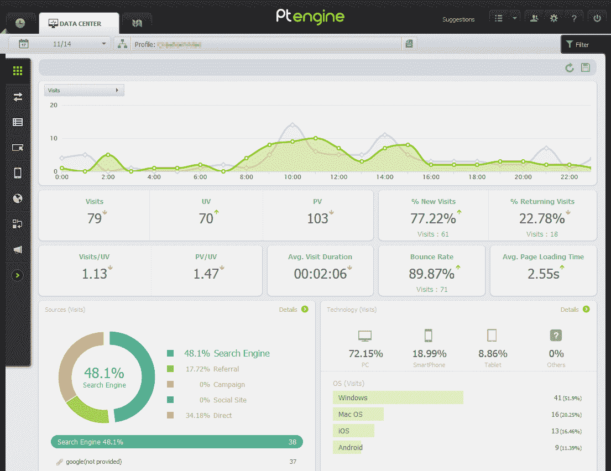
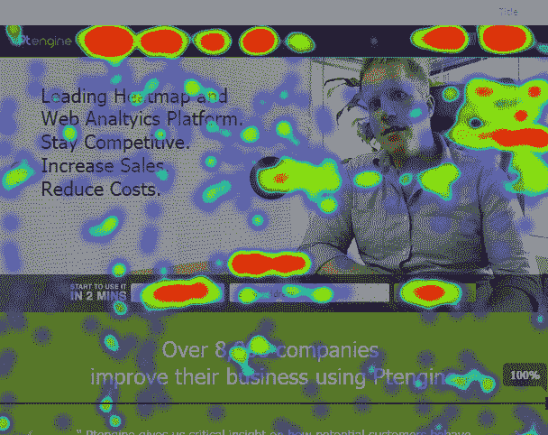
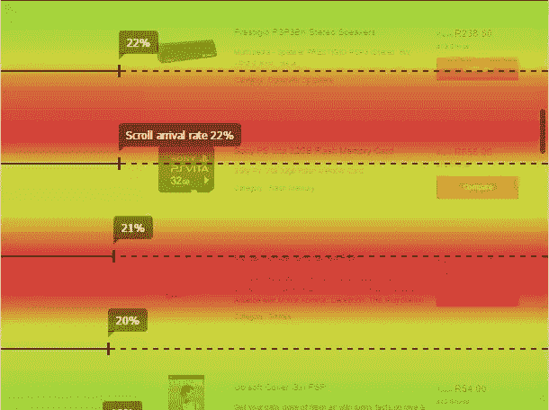

# 利用网站智慧提高流量和转化率

> 原文：<https://www.sitepoint.com/boost-traffic-conversions-website-wisdom/>

本文由 [Ptengine](http://www.ptengine.com/) 赞助。感谢您对使 SitePoint 成为可能的赞助商的支持！

小说不在于文字；而是文字传达的故事。类似地，网站统计提供了大量的访问者数据，但更重要的是理解导致这些数据的用户活动。

对于我们大多数人来说，提供统计使用报告只是简单地在每个页面上添加一个谷歌分析脚本。网站所有者可以获得大量的信息，并可以快速确定流量是增加还是减少。但是数据不会告诉他们*为什么*。

很难确定访问者如何与网站互动，例如:

*   人们在使用那个小工具吗？
*   用户会因为配色方案而分心吗？
*   图片和视频是有帮助的还是令人讨厌的？
*   人们向下阅读页面到什么程度？
*   那个号召行动的按钮被使用了吗？

*你知道的越多，你就越想知道……*

谷歌分析将提供一个洞察力，但它是复杂的。客户经常被诸如会话、反弹、漏斗和转换等术语迷惑，他们需要专家的帮助。该专家需要结合技术开发、统计分析和心理分析技能。假设他们能找到这样一个人，这是一份全职工作，花费的时间和金钱比除了大公司之外的所有公司都多。

## 访客互动指标

幸运的是，对于各种规模的数字营销人员、UI 设计人员和在线业务开发人员来说，都有经济高效的解决方案。Ptengine 提供了交互指标，揭示了原始数据背后的故事。功能包括:

### 简单实现

无需为定制活动、下载、转化或销售添加代码，一个脚本即可激活所有功能。

### 用户友好的报告

简单的报告提供一键式过滤、页面分组、活动分析以及设备、浏览器、地理位置、转换和事件的细分。今天的流量可以与平均值进行比较，以确定活动是否有效。

### 页面时间指标

不管用户是否点击进入另一个页面，Ptengine 都能精确地确定用户在页面上停留的时间。

### 点击跟踪

点击跟踪比基本的链接跟踪更复杂。用户可以点击不是链接的项目，如选项卡、小部件、表单元素等。重要的是，他们可能会认为点击一个项目是一个链接…

### 多设备热图

最后，杀手级特征。热图显示了访问者在每个页面上关注、滚动和点击的地方。

与其他热图解决方案不同，Ptengine:

*   Provides attention maps which highlight the certain areas that gain more visitor attentions by hotter color belts, and scroll arrival maps which highlight the proportion of users who scroll to a point in the page:

    

*   具有设备感知能力，适合响应式网页设计。例如，您可以确定移动用户正在滚动到桌面用户忽略的内容，并相应地修改您的设计。
*   允许页面被过滤和比较，这使它成为 A/B 测试的理想选择。

Ptengine 提供了一个包含所有功能的免费计划。每个免费计划从 30 天的完整功能包开始，[商业计划](http://www.ptengine.com/plan/)根据您的页面浏览量和您需要的功能提供。

## 如何使用 Ptengine 来提高转化率

让我们考虑一些典型的用例。

### 例子一

你的主页跳出率很高。谷歌分析会告诉你这一点，但它不会透露原因。

你怀疑大型旋转木马横幅可能是罪魁祸首。然而，设计师认为这很棒——他们有空间来表达他们的艺术完整性！营销部门认为这太棒了——他们可以在同一个页面上实施众多营销活动。你的客户喜欢它——他们有一个巨大的动态更新区域，看起来很酷。

Ptengine 可以证明谁是对的。它不偏不倚，不会屈服于利益相关者的偏见或先前的意见:

*   报告显示，97%的用户在主页上花费的时间不到 20 秒。然而，旋转木马每 30 秒旋转一次——绝大多数游客从未看到过一次以上的活动。那么，为什么要实施进一步的横幅呢？
*   注意力分布图显示，只有 8%的人滚动传送带到达主要的行动号召按钮。特别是，那些在较小的移动设备上的用户认为横幅区域标志着页面的结束，所以不会进一步滚动。
*   点击地图突出显示，不到 1%的访问者点击轮播链接。它看起来像一个横幅广告，按钮并不突出，它们导致网站的区域很少转化为销售(“关于我们”，“新闻”，等等)。

也许是时候重新考虑设计，关注真正重要的东西了？

### 例子二

尽管游客增加了，你的销售额还是下降了。同样，谷歌分析和你的销售报告将显示这一趋势，但不清楚为什么会发生这种情况。

查看主要的购物页面，你会发现与目标无关的元素数量在增加，比如优惠券、社交网络小工具和评论。点击热图证明，这些网站有强烈的号召信息和按钮，可以分散买家的注意力，将他们从产品上转移到网站上不太重要的地方。

解决方法:简化页面，减少旅途中的干扰。如果有任何疑问，你可以将访客分成两组——一组展示当前的设计，另一组展示基本的产品视图。在每个 A/B 实验中使用热图是快速了解访客行为的好方法。几天之内，就有可能确定哪种设计对销售转化最有效。然后，可以根据需要更新内容和设计。

## 网站智慧

来自网站统计的原始数据提供了丰富的信息，但仅此还不够。有了网站智慧，你就可以运用这些知识进行推理，做出合适的判断和决定，这对网站的流量、转化率和销售额都有积极的影响。

[Ptengine](http://www.ptengine.com/) 可能是你走向觉悟之路的第一步！

## 泄漏

Ptengine 为 SitePoint 读者提供独家优惠，为完成以下步骤的读者提供为期三个月的全功能套餐。要提出自己的主张，请在 Twitter 上分享这篇文章，并提到“@ptengine”。然后注册 Ptengine，给 contact@ptengine.com 发邮件，附上你的推文链接，然后等他们来做剩下的事情。他们会在工作日的 24 小时内保持联系。这是一个尝试 Ptengine 的简单方法！

## 分享这篇文章