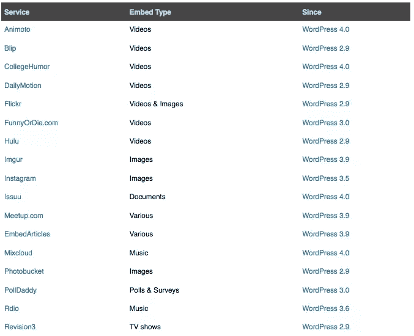
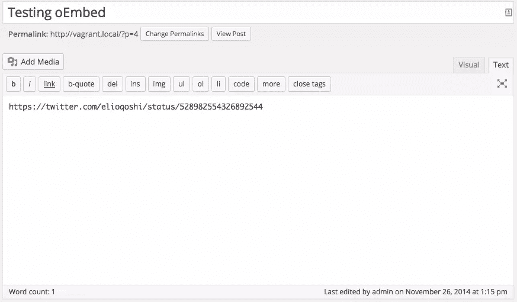
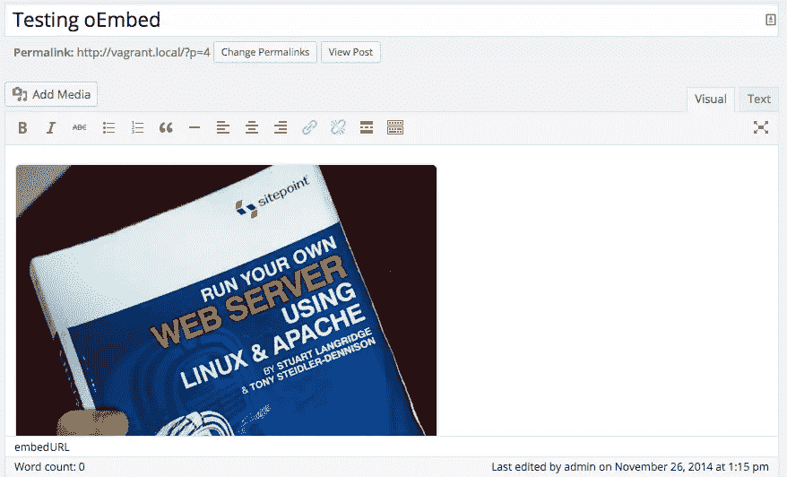

# oEmbed 和 WordPress 简介

> 原文：<https://www.sitepoint.com/oembed-and-wordpress/>

WordPress 目前是最大的 CMS 和博客平台之一。但这是为什么呢？在过去的几年里，WordPress 受到了很多批评。最大的问题之一是，建筑并不像它应该的那样现代。2004 年平台(或 CMS)的编写方式与我们今天看到的标准不同。尽管如此，毫无疑问，它对最终用户来说非常容易使用。

最终用户想要一个易于发布内容的 CMS。我相信大部分用户都不想对自己的内容进行硬编码。如果一个客户问我:“我想从 SlideShare 添加一些内容”，我会想到 REST APIs 或者至少嵌入代码。今天我们来看看 WordPress 的一个特性，你可能已经使用过，但却不知道。

## oEmbed 简介

oEmbed 是在你的网站中嵌入内容的一种非常简单的方式。oEmbed 由一个**消费者**和一个**提供者**组成。提供商提供可嵌入消费者的资源，消费者通过 oEmbed 端点请求这些资源。

oEmbed 实现指定了 4 种类型的资源:

*   照片
*   录像
*   链接
*   有钱的

照片，视频和丰富的类型应该提供一个网址，宽度和高度在他们的回应。提供者还可以包括其他数据，但是在处理这种类型的内容时只需要这些数据。oEmbed 规范是一个指南，提供商可以自己实现 oEmbed。提供程序应该至少有一个 oEmbed 端点和一个资源 URL。

让我们看看 [SlideShare](http://www.slideshare.net/developers/oembed) ，看看他们是如何实现 oEmbed 的。

[在他们的文档中](http://www.slideshare.net/developers/oembed)他们指定了 oEmbed 端点和资源端点。oEmbed 端点为:`http://www.slideshare.net/api/oembed/2`。资源端点看起来像这样:`http://www.slideshare.net/user-slug/slidename-slug`。为了从提供者那里获得信息，我们应该使用 oEmbed 端点并传递资源的 URL 参数。参数应该是 URL 编码的。最低要求是 URL 参数，但也可以传递 *maxwidth* 、 *maxheight* 和*格式*。这确实取决于内容格式，但是对于视频、照片和富格式，您可以选择传递这些参数。还有，oEmbed 只指定了 GET 方法，所以不能使用其他方法。

让我们使用 URL 参数向这个端点发出请求。

向:`http://www.slideshare.net/api/oembed/2?url=http://www.slideshare.net/chris-burgess/wordpress-themeswpmelb2014`发出请求，您将得到如下 XML 响应:

```
<oembed>
  <total-slides type="integer">50</total-slides>  
  <thumbnail-width type="integer">170</thumbnail-width>
  <width type="integer">425</width>
  <type>rich</type>
  <provider-name>SlideShare</provider-name>
  <slideshow-id type="integer">41489102</slideshow-id>
  <provider-url>http://www.slideshare.net</provider-url>
  <slide-image-baseurl>//image.slidesharecdn.com/wordpress-themes-wpmelb-2014-141112215416-conversion-gate02/95/slide-</slide-image-baseurl>
  <version>1.0</version>
  <conversion-version type="integer">2</conversion-version>
  <html><iframe src="http://www.slideshare.net/slideshow/embed_code/41489102" width="427" height="356" frameborder="0" marginwidth="0" marginheight="0" scrolling="no" style="border:1px solid #CCC; border-width:1px; margin-bottom:5px; max-width: 100%;" allowfullscreen> </iframe> <div style="margin-bottom:5px"> <strong> <a href="https://www.slideshare.net/chris-burgess/wordpress-themeswpmelb2014" title="WordPress Themes Demystified" target="_blank">WordPress Themes Demystified</a> </strong> from <strong><a href="http://www.slideshare.net/chris-burgess" target="_blank">Chris Burgess</a></strong> </div>
  </html>
  <author-name>Chris Burgess</author-name>
  <title>WordPress Themes Demystified</title>
  <height type="integer">355</height>
</oembed>
```

如果您在浏览器中只请求 URL 值，您只会得到一个普通的 HTML 页面。你每天都能看到的东西。如果没有请求其他格式，SlideShare 默认为 XML 格式。让我们稍微改变一下要求。这一次我们将添加另一个参数并获得一个 JSON 响应。

```
{

    "author_url": "http://www.slideshare.net/chris-burgess",
    "total_slides": 50,
    "provider_name": "SlideShare",
    "version_no": "1415853027",
    "html": "<iframe src=\"http://www.slideshare.net/slideshow/embed_code/41489102\" width=\"427\" height=\"356\" frameborder=\"0\" marginwidth=\"0\" marginheight=\"0\" scrolling=\"no\" style=\"border:1px solid #CCC; border-width:1px; margin-bottom:5px; max-width: 100%;\" allowfullscreen> </iframe> <div style=\"margin-bottom:5px\"> <strong> <a href=\"https://www.slideshare.net/chris-burgess/wordpress-themeswpmelb2014\" title=\"WordPress Themes Demystified\" target=\"_blank\">WordPress Themes Demystified</a> </strong> from <strong><a href=\"http://www.slideshare.net/chris-burgess\" target=\"_blank\">Chris Burgess</a></strong> </div>\n\n",
    "thumbnail_height": 128,
    "type": "rich",
    "slide_image_baseurl": "//image.slidesharecdn.com/wordpress-themes-wpmelb-2014-141112215416-conversion-gate02/95/slide-",
    "slide_image_baseurl_suffix": "-1024.jpg",
    "slideshow_id": 41489102,
    "title": "WordPress Themes Demystified",
    "version": "1.0",
    "height": 355,
    "provider_url": "http://www.slideshare.net",
    "thumbnail": "//cdn.slidesharecdn.com/ss_thumbnails/wordpress-themes-wpmelb-2014-141112215416-conversion-gate02-thumbnail.jpg?cb=1415853027",
    "conversion_version": 2,
    "author_name": "Chris Burgess",
    "thumbnail_width": 170,
    "width": 425

}
```

再次尝试请求该资源，但这次指定一个附加参数。让我们将 maxwidth 参数设置为 200 并请求这个 URL: `http://www.slideshare.net/api/oembed/2?url=http://www.slideshare.net/chris-burgess/wordpress-themeswpmelb2014&format=json&maxwidth=200`，您应该得到这个结果:

```
{

    "conversion_version": 2,
    "version_no": "1415853027",
    "slide_image_baseurl_suffix": "-320.jpg",
    "html": "<iframe src=\"http://www.slideshare.net/slideshow/embed_code/41489102\" width=\"202\" height=\"168\" frameborder=\"0\" marginwidth=\"0\" marginheight=\"0\" scrolling=\"no\" style=\"border:1px solid #CCC; border-width:1px; margin-bottom:5px; max-width: 100%;\" allowfullscreen> </iframe> <div style=\"margin-bottom:5px\"> <strong> <a href=\"https://www.slideshare.net/chris-burgess/wordpress-themeswpmelb2014\" title=\"WordPress Themes Demystified\" target=\"_blank\">WordPress Themes Demystified</a> </strong> from <strong><a href=\"http://www.slideshare.net/chris-burgess\" target=\"_blank\">Chris Burgess</a></strong> </div>\n\n",
    "total_slides": 50,
    "width": 200,
    "slide_image_baseurl": "//image.slidesharecdn.com/wordpress-themes-wpmelb-2014-141112215416-conversion-gate02/85/slide-",
    "thumbnail_height": 128,
    "thumbnail_width": 170,
    "thumbnail": "//cdn.slidesharecdn.com/ss_thumbnails/wordpress-themes-wpmelb-2014-141112215416-conversion-gate02-thumbnail.jpg?cb=1415853027",
    "provider_name": "SlideShare",
    "author_url": "http://www.slideshare.net/chris-burgess",
    "author_name": "Chris Burgess",
    "version": "1.0",
    "slideshow_id": 41489102,
    "type": "rich",
    "height": 167,
    "title": "WordPress Themes Demystified",
    "provider_url": "http://www.slideshare.net"

}
```

如果您将此请求的`html`键上的`iframe`的宽度与前一个请求进行比较，您应该会看到不同之处。第一个宽度为 427，最后一个宽度为 202。

如果你想了解更多关于 oEmbed 规范的信息，看看官方的 oEmbed 文档。还可以看一下[的 SlideShare oEmbed 文档](http://www.slideshare.net/developers/oembed)，并对其进行一些试验，以便更好地理解它是如何工作的。

## 为什么这很有用

暂时，让我们忘记技术实现。WordPress 更多的是关于终端用户。oEmbed 规范的所有实现都在 WordPress 代码库中。WordPress 有一个所有受支持的 oEmbed 提供商的白名单。这些只是他们白名单中的一部分。



WordPress 使得从这个白名单中嵌入内容变得容易。创建帖子或页面时，只需粘贴一个资源的 URL。



然后，您将看到它立即呈现内容:



URL 应该是独立的一行。WordPress 寻找那个链接，然后搜索看这个链接是否是一个白名单 URL 的资源。如果是，那么它向 oEmbed 端点发出请求。在这个例子中，我复制了一个 Twitter 状态 URL，WordPress 为我在帖子中嵌入了这个状态。但这不仅限于 Twitter，搜索其他在[白名单](http://codex.wordpress.org/Embeds)中的网站并进行试验。

除了白名单之外，WordPress 还支持每个 oEmbed 站点。您可以手动添加其他提供程序。WordPress 提供了两个功能，一个用于注册一个支持 oEmbed 的站点，另一个我们可以硬编码来为我们的站点添加 oEmbed 支持。使用 [wp_oembed_add_provider()](http://codex.wordpress.org/Function_Reference/wp_oembed_add_provider) 将现有的 oembed 站点添加到 WordPress。你也可以使用[WP _ embed _ register _ handler()](http://codex.wordpress.org/Function_Reference/wp_embed_register_handler)来添加一个非 oEmbed 站点。或者，如果你像我一样讨厌重新发明轮子，你也可以先检查一个插件是否存在。

## 结论

oEmbed 是方便的 WordPress 功能之一，让你的生活更轻松。在本文中，我们讨论了什么是 oEmbed，我们研究了 oEmbed 规范以及 oEmbed 和 WordPress 如何协同工作。但是不要止步于此。尝试白名单，并扩展到您自己的提供商。

## 分享这篇文章