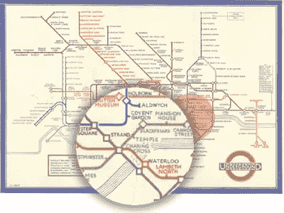
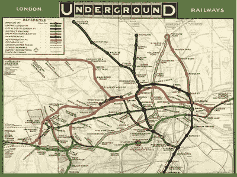
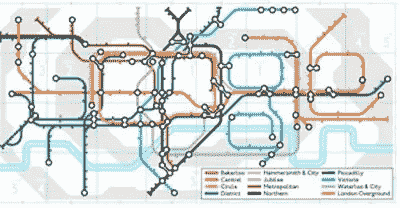

# 战斗蜘蛛和伦敦地铁地图

> 原文：<https://www.sitepoint.com/fighting-spiders-london-underground-map/>

有时候，做伟大设计的最好方式是*而不是*成为一名设计师。新鲜的眼睛。更少的规则。

贝克的伦敦地铁地图——1931 年

这是上世纪最著名的平面设计作品之一。这是 1931 年由[亨利(通常被称为‘哈里’)贝克](http://en.wikipedia.org/wiki/Harry_Beck)设计的[伦敦地铁图](http://en.wikipedia.org/wiki/Tube_map)。

有很多原因可以说明这一点。

首先，亨利从未被培养成一名设计师。他被铁路部门聘为技术绘图员，只是把绘制地图作为个人项目。他的经理最初不喜欢它。

第二，它今天看起来仍然是如此的简洁和现代，这是值得注意的。Beck 的地图创建于大多数家庭甚至还没有收音机的时代，看起来绝对是计算机生成的。

每条线要么平行于页面边缘，要么与页面边缘成 45 度角。车站间隔均匀，所有的弯路和岔路都是几何形状完美的。

当然，它记录的真实世界的铁路系统与此完全不同。铁路线建在对人类来说最便宜和最实用的地方。

伦敦地铁——1908 年——一群摔跤蜘蛛

早期的地图将道路和城市信息与精确的轨道和车站渲染相结合。它们看起来像一群色彩鲜艳、打架的蜘蛛。

亨利的新地图实际上比他之前的地铁地图传送的**信息要少得多。当然有更多的信息会更好，对吗？**

 **### 准确性并不总是你的朋友

在过去的 500 年里，地图制作一直被保真度所困扰。也有充分的理由！你越能准确地反映真实位置和距离，你的船、船员和货物就越有可能安全回家。

但是铁路地图有不同的目的。还有更多的已知。火车很少在途中迷路，你也不容易换线或在车站之间下车。大多数车站都在地下，所以地标是不存在的。

贝克意识到，乘客最需要知道的是 ***和*** 相对位置。他的地图融合了我们在列表中喜欢的简单结构，以及我们在地图中喜欢的一些有用的空间信息。

在我们这个网络分析和无尽数据海洋的世界里，人们很容易沉迷于数字和细节。一点数据好，一大堆数据一定更好吧？

贝克的设计天才并不像他所描绘的那样。**正是他选择了剪掉**。他删除了许多完全有效的信息，并使地图变得不那么精确——但在这个过程中创造了一个更加成功的设计。

这对我们来说应该是一个重要的想法。

贝克当然不是第一个简化铁路图的人，但他的设计影响了设计师至今。这是一个巨大的成功从一开始，亨利继续生产，直到 20 世纪 60 年代。

### 管状贡品

虽然在当时这是一个有点激进的设计，但今天亨利的地图是最受欢迎的设计比喻之一——直到今天在设计中不断被引用。

我最喜欢的包括:

*   塞缪尔·阿贝斯曼创造了 **[一幅辉煌的管银河系地图](http://www.arbesman.net/milkyway/)** 。
*   多里安·林斯基制作了一张摇滚/流行乐队和流派的地图**。**
*   马克·洛奇将地图与周期表合并，提出了 [**元素的地下地图**](http://www.chemistry-blog.com/2013/08/27/the-underground-map-of-the-elements/) 。
*   最后，谷歌在 2013 年——伦敦地铁 150 周年纪念日——制作了这个出色的致敬涂鸦。

如果你有这样的灵感，你甚至可以在beno.org.uk 生成自己的管状地图。

##### 从 [SitePoint 设计简讯](https://www.sitepoint.com/newsletter/)重新发布** 

## **分享这篇文章**