# 使用 Beanstalk 进行集成和协作的代码审查

> 原文：<https://www.sitepoint.com/integrated-collaborative-code-reviewing-beanstalk/>

*本文由[豆茎](http://beanstalkapp.com/)赞助。感谢您对使 SitePoint 成为可能的赞助商的支持。*

你在你的团队中执行代码审查吗？这是一种快速发现 bug 并提高代码质量的有用技术。简单地说，这个过程是这样工作的:开发人员将向他们的团队或上级展示一个代码示例，解释他们所写的内容，然后接收关于他们如何改进代码的反馈。这听起来很容易，但实际上往往很复杂、耗时且难以承担。

但是今天我要谈谈 Beanstalk，它是一个平台，可以帮助将代码审查过程整合到您的工作流程中，无缝地使其成为您编码习惯的一部分。

在继续讨论 Beanstalk 如何提供帮助之前，让我们先看看开发团队使用的常见代码审查技术，并强调哪些地方还有改进的空间。

## 代码评审工具和技术

审查代码有很多好处。一些比较重要的例子如下:

1.  错误被快速识别和消除。
2.  团队成员总是知道团队里发生了什么。
3.  经过评审的代码可读性更强。
4.  各种优化可以在代码审查中完成，从而提高速度。

让我们看看代码审查通常是如何完成的。团队通常采用以下一种或多种技术来评审代码:

1.  **结对编程**:两个程序员坐在同一个工作站，一起写代码，一个打代码，另一个提供建议。虽然这似乎是一个好的解决方案，但它也带来了一些问题。例如，有时团队中的高级成员可以接管并完成大部分工作，这违背了结对编程的目的。
2.  肩后回顾:通常一个资深成员会在开发人员解释他们所做的事情时看着他。这是一种快速、轻量级、专门的技术来执行代码审查，并且可能适用于小型团队和项目。但是随着项目的增长和团队的扩大，有效地进行回顾是不可能的。
3.  **Email** :这里版本控制系统通过 Email 发送代码给评审人员。通常，一旦有新的提交被推送到回购协议，这就完成了。但是使用这种技术，事情会很快变得一团糟。它要求你跟踪多个电子邮件链，以审查代码并提出修改建议。此外，因为它使用电子邮件，所以其他团队成员也很难知道评审中发生了什么。
4.  **代码评审会议**:开发人员安排一个专门用于代码评审的会议，由一个或多个评审人员评审代码。问题作为流程的一部分被记录下来。一旦开发人员解决了这些问题，评审人员就会得到通知。当然，与任何会议一样，安排和执行代码评审可能是棘手和耗时的。

以上是一些现有的管理代码评审的方法，每种方法都有自己的问题。让我们看看更好的方法。

## 豆茎简介

Beanstalk 是开发团队的代码托管解决方案。注册后，您可以开始创建存储库(repos)来托管您的代码。如果你没有意识到,“repo”是你的代码的存储空间。您可以通过点击 Beanstalk 仪表板中的“创建存储库”按钮来创建新的存储库。您还可以创建“分支”来修复错误或开发新功能。稍后我们将更多地讨论分支。

Beanstalk 提倡用三个步骤来发布您的代码:

1.  提交您的代码
2.  通过代码评审与团队一起评审
3.  部署最终评审的代码

这是发布您的代码的一种有用的方式，因为代码审查是作为开发工作流中的一个基本步骤而内置的。这意味着代码质量将会提高，错误将会更早地消除。开发人员可以根据评论或问题更新他们的代码，进行修改，然后从评审人员那里获得反馈。

### 代码托管和提交

要开始使用 Beanstalk 的代码审查工具，您首先需要托管您的代码。这个过程很简单。如果您还没有 Beanstalk 帐户，请继续操作并[创建一个](http://beanstalkapp.com/)。

创建帐户后，您可以转到“存储库”选项卡来创建新的存储库。您可以创建基于 git 和基于 subversion 的回购，但是在这个例子中我们将使用 git。如果你是 git 新手，[这里有一篇文章可以帮助你快速入门](https://www.sitepoint.com/git-for-beginners/)。

创建回购很容易。单击“创建存储库”按钮后，会出现一个向导。它会要求您选择一个标题和回购类型(`git`、`subversion`或其他)。)一旦您填写了详细信息，您的回购就准备好了。

这里是回购创建向导的屏幕截图。

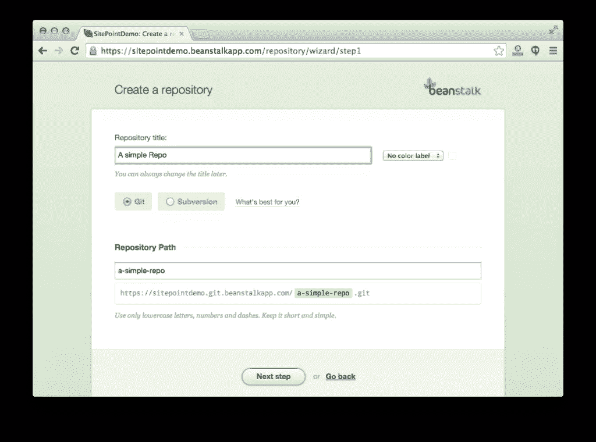

我创建了一个简单的 git 存储库来演示这个过程。“我的存储库”选项卡如下所示:

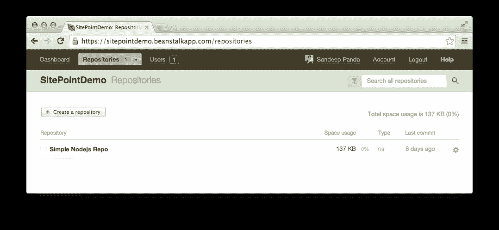

一旦你的回购准备好了，你会得到一个网址(我的是`https://sitepointdemo.git.beanstalkapp.com/simple-nodejs-repo.git`)。您可以使用此 URL 将“提交”推送到您的存储库中。

同样，如果您不熟悉源代码控制，可以将提交视为代码在特定时间点的快照。一旦您提交了一些更改，您可以在将来随时恢复到该点。

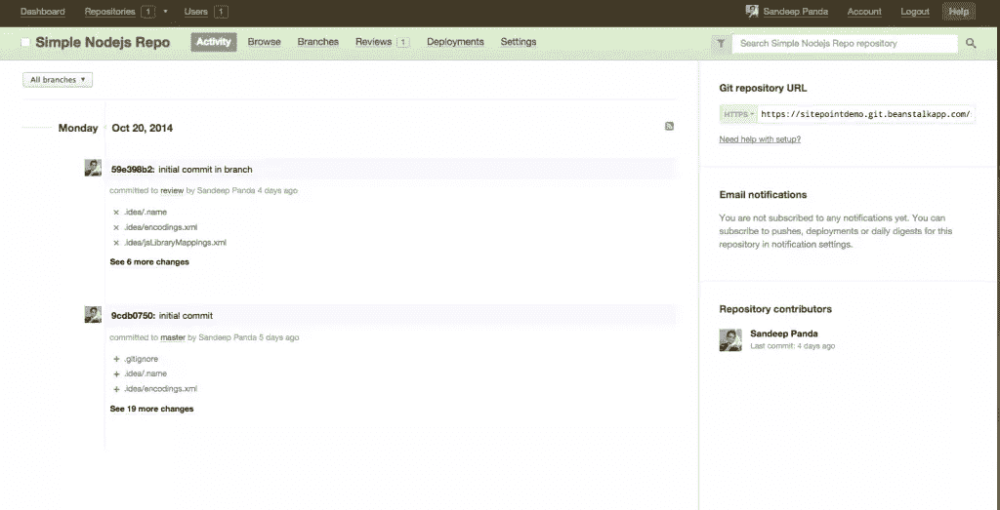

现在你的新回购已经准备好了，你可以开始提交更改。如果您的机器上有您的源代码，您可以在本地提交并将其推送到您的 Beanstalk repo。

每个回购都有一个或多个“分支”。正常的工作流程涉及生产的主分支。每一个特性和 bug 修复都应该从一个新的分支开始，并在完成后提交给代码评审。一旦审查完成，问题得到解决，分支就可以被合并回主分支，并且它的更改被应用到生产代码中。

“分支机构”选项卡，如下图所示，列出了您的回购中的不同分支机构。您还可以创建新分支并删除现有分支。

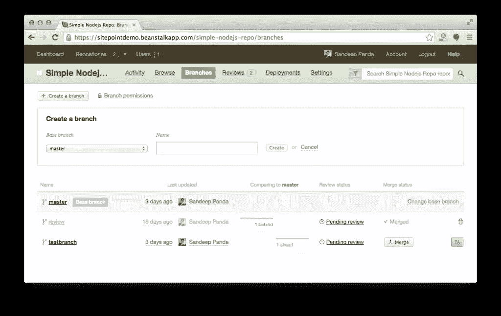

关于使用分支的更多信息，请查看本教程。

现在你已经有了基本的想法，让我们创建我们的第一个代码评审。

## 代码审查

### 创建评论

创建代码评审请求很容易。首先，在你的回购中创建一个分支。一旦分支准备就绪，您就可以创建一个评审并将其分配给团队中的某个人。以下屏幕截图演示了该过程:

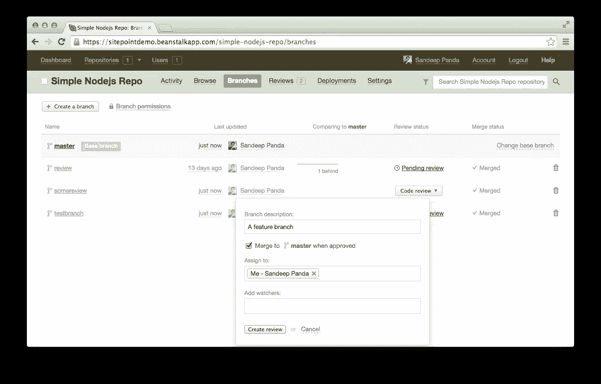

由于团队中只有我一个人在孤独的演示环境中，所以我将评审分配给了我自己。在现实世界的应用程序中，您显然希望将此评论分配给团队中的某个人。还可以将审查分配给多个审查者，以帮助您获得对代码的更多视角。

您也可以选择添加观察者。这是为那些不直接评审你的代码，但是需要知道被评审分支的进展的团队成员准备的。随着团队的成长，越来越多的人——例如，产品经理或开发经理——想要采用这种“观察者”的身份来跟踪他们感兴趣的代码。

创建评论后，转到“评论”选项卡，在那里可以找到评论列表。

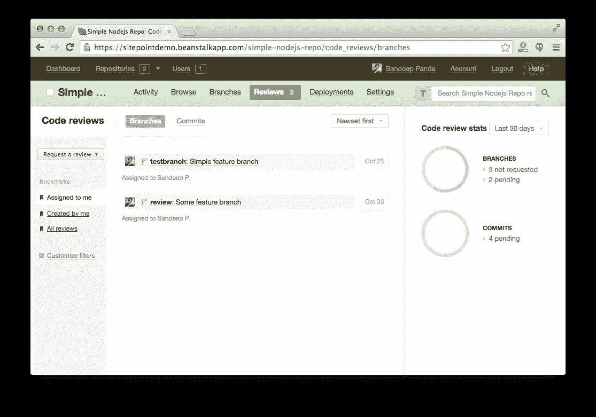

正如您所看到的，上面的截图显示了我刚刚创建的两个待定的代码评审。点击它们中的任何一个，您将被带到一个详细的代码评审页面，在这里您可以管理分配给您的评审。这就是事情变得有趣的地方。你有很多很酷很刺激的代码审查工具。让我们一个一个的去探索。

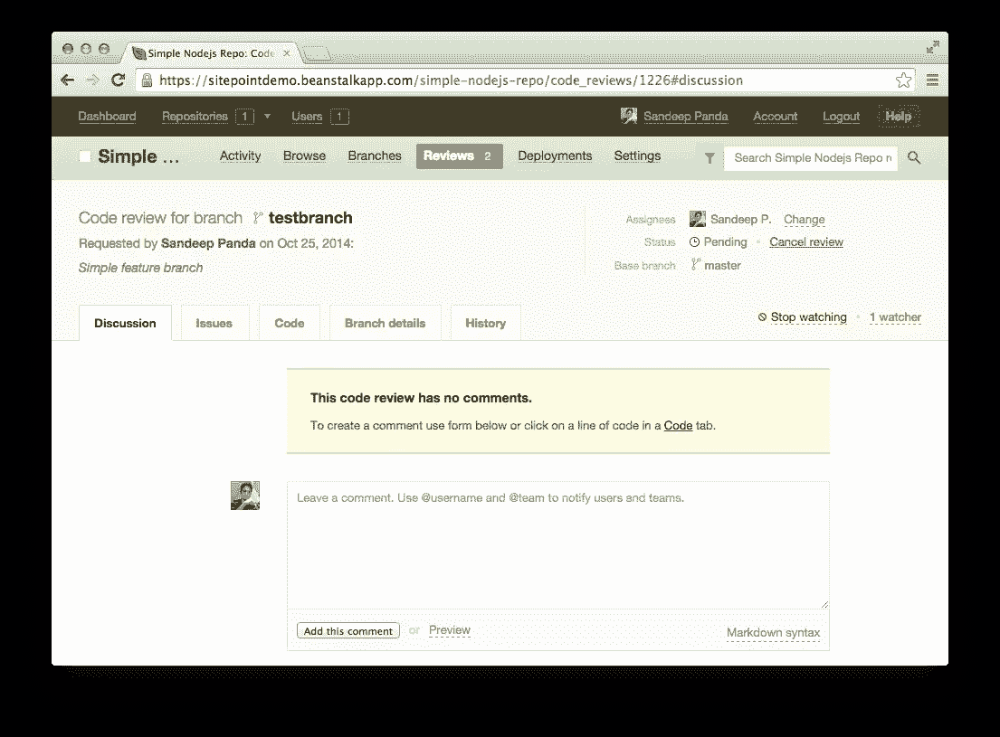

### 讨论、问题和您的分支代码

作为一名评审者，很多时候你会发现代码中的几个问题。毕竟这就是为什么要做代码评审！通常你会和开发人员坐下来，一个一个地指出问题。你也可以写一封正式的电子邮件给开发者，概述发现的问题。但这是最好的做事方式吗？很容易失去对问题的跟踪，尤其是当有太多移动部件时。

为了解决这个问题，Beanstalk 提供了一个名为“代码审查中的问题”的特性。在代码审查部分，你有一个专门的“问题”标签。作为评审者，您应该使用这个选项卡来添加您在代码中发现的问题。一旦在代码中发现问题，请在此处添加。这保持了事情的一致性，因为您和开发人员都可以跟踪评审中发生的事情。看看下面的截图，它描述了添加问题的过程。

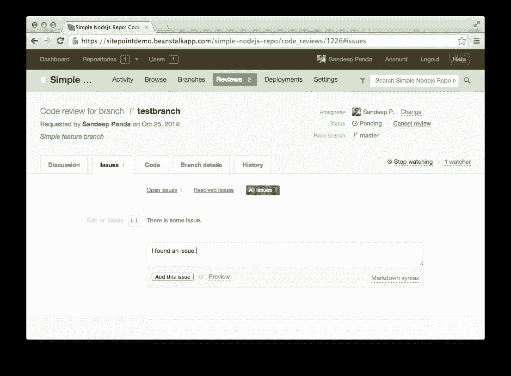

您可以看到，在“讨论和问题”选项卡中，评论和问题是分开的，因此您的团队可以进行讨论并跟踪与代码相关的问题，而不必通过单个评论线程来查找问题，反之亦然。

您还可以添加内联注释，通知开发人员任何问题或提出疑问。不确定为什么开发人员添加了特定的行？没问题！只需点击该行，并通过行内评论向他们提问。很酷吧？

每个问题还会有一个勾选框。如果您认为问题已经解决，只需点击此框进行标记，然后进入下一个问题。

您还应该注意，只要存在未解决的问题，就不能批准审查，因此分支机构不能与主分支机构合并。这是一个非常好的特性，因为它保证了在分支被合并之前所有的问题都会被解决。

这个工具的另一个优点是它支持 markdown 语法！很多时候，你需要编写代码块来解释清楚这些问题。Markdown 便于您格式化问题描述并引用其中的代码片段。您可以通过点击“预览”按钮在普通视图和减价视图之间轻松切换。

### 代码编辑

代码编辑是您的代码评审工作流的一个很好的附件。您可以在“问题”旁边找到“代码”选项卡。在这个部分中，您可以看到已更改的代码，编辑文件并提交您所做的更改。您也可以点击“扩展”按钮，获取特定变更的更多详细信息。

看看下面的截图，它显示了编辑和扩展选项。

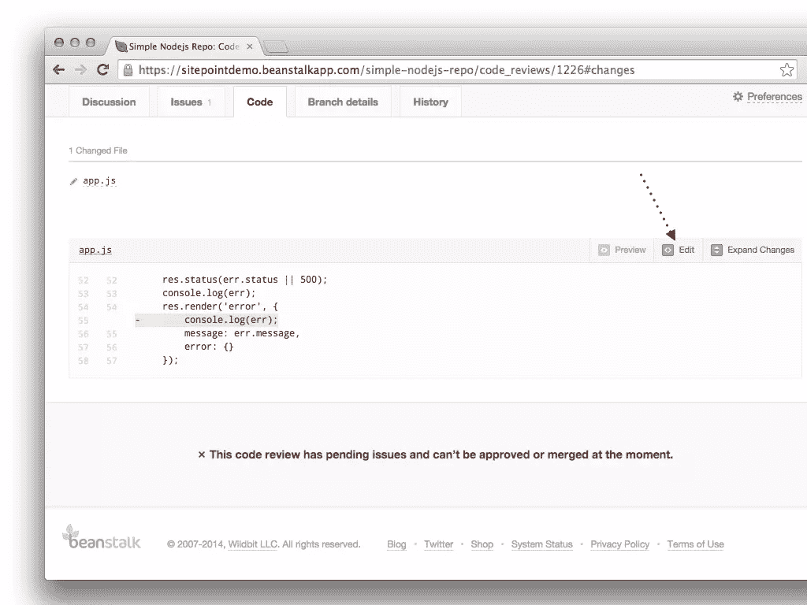

如果你点击编辑按钮，你将被带到一个新的页面，你可以在一个实际的代码编辑器中编辑文件(是的，还有语法高亮显示！)您还可以选择编写提交消息并直接提交更改。

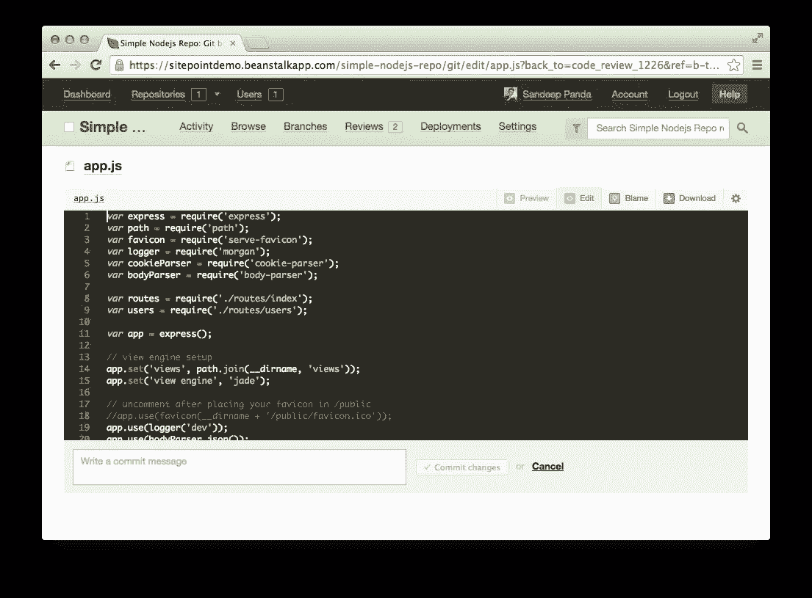

### 集成责备工具

当您频繁地发布代码时，跟踪每一次代码变更会变得非常困难。通常你会发现自己想知道为什么某一行会被删除或修改。豆茎已经覆盖了你。使用集成的责备工具，您将确切地知道为什么某些东西发生了变化，因为它为文件中的每个变化提供了上下文。

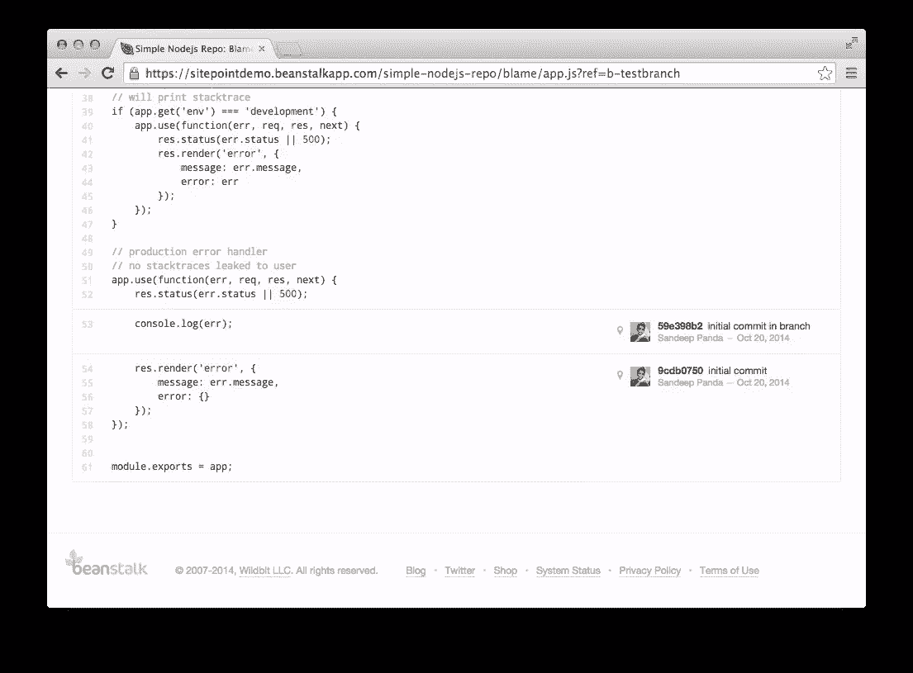

### 分行详细信息和历史记录

您可以在“分支机构详细信息”选项卡中找到与给定分支机构相关的所有相关信息。有了这个，你就能确定谁是贡献者，以及到目前为止已经修改了多少次。集成的“历史”标签可以让您跟踪特定分支中完成的所有操作。例如，您可以快速浏览历史记录列表，以了解问题的打开和关闭时间。通过单击问题描述，您可以直接跳转到“问题”选项卡中的特定问题，并根据需要开始故障诊断。历史工具是对功能集的一个简单但非常强大的补充。

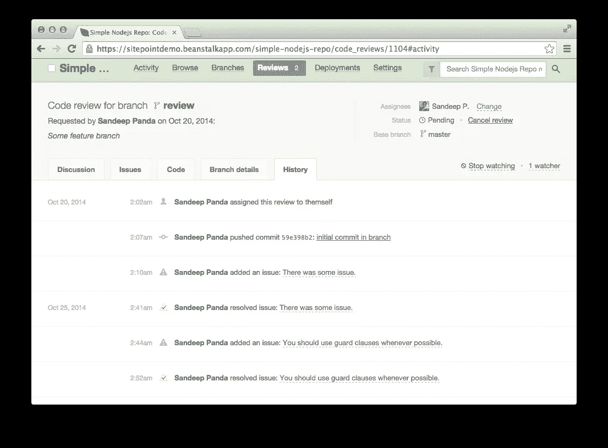

### 分行权限和一键分行合并

当您创建新的审核时，您可以选择在所有问题解决后自动合并分支*和*。太棒了。但是如果您还没有选择这个选项，那么一旦所有的问题都解决了，您就可以手动将分支与主分支合并。假设没有未解决的冲突，您可以单击“问题”选项卡中的“批准并合并”按钮，一键批准变更并与主分支机构合并。

使用分支权限，您可以轻松地将特定分支的写访问权限限制在选定的开发人员。例如，生产分支不应该是每个人都可以写的。这是一个聪明的工具，在每个项目中都有用。

### 比较视图

当您遵循一个协作编码过程时，有时您需要知道一个分支与另一个分支到底有什么不同。使用“比较视图”功能，您可以轻松地比较两个不同的分支，并确定发生了什么变化。您还可以利用这个工具来比较相同或不同分支中的特定提交。看一下下面的截图，它显示了比较视图。

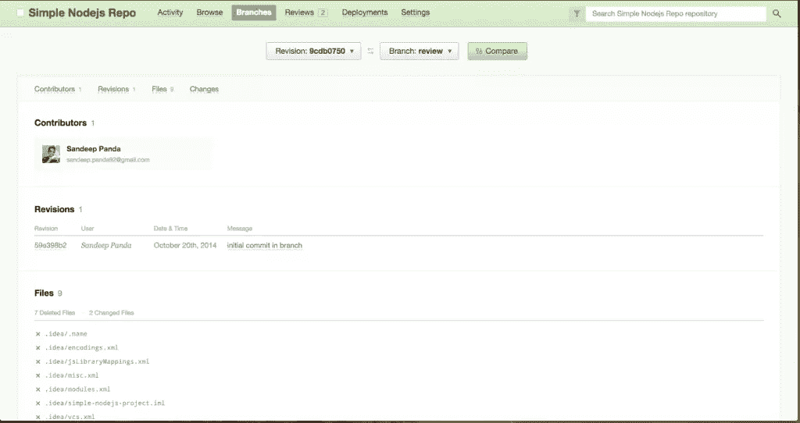

### 电子邮件通知

不在你的办公桌上？经常旅行吗？不要担心，只要您感兴趣的任何回购中有活动，Beanstalk 就会自动向您发送电子邮件通知。评论者和观察者会收到这些更新，电子邮件通知系统也确保你不会收到太多的电子邮件。例如，如果有人在几分钟内对 10 行代码进行了评论，您将只会收到一封电子邮件，而不是 10 封。

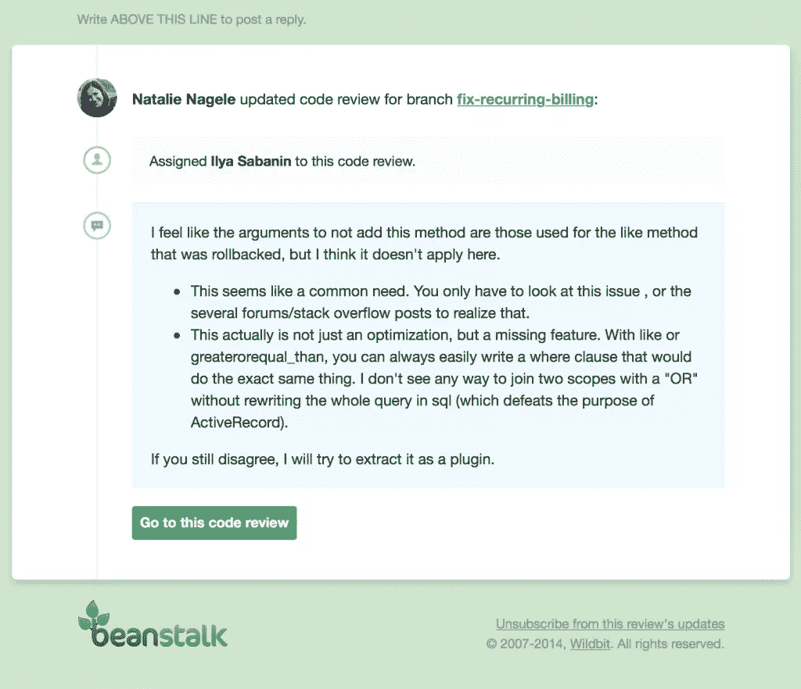

还有一个智能摘要工具，可以显示存储库中的活动列表。这是一个非常有用的工具来开始你的一天。我从 Beanstalk 的网站上抓取了以下图片，显示了智能摘要视图。

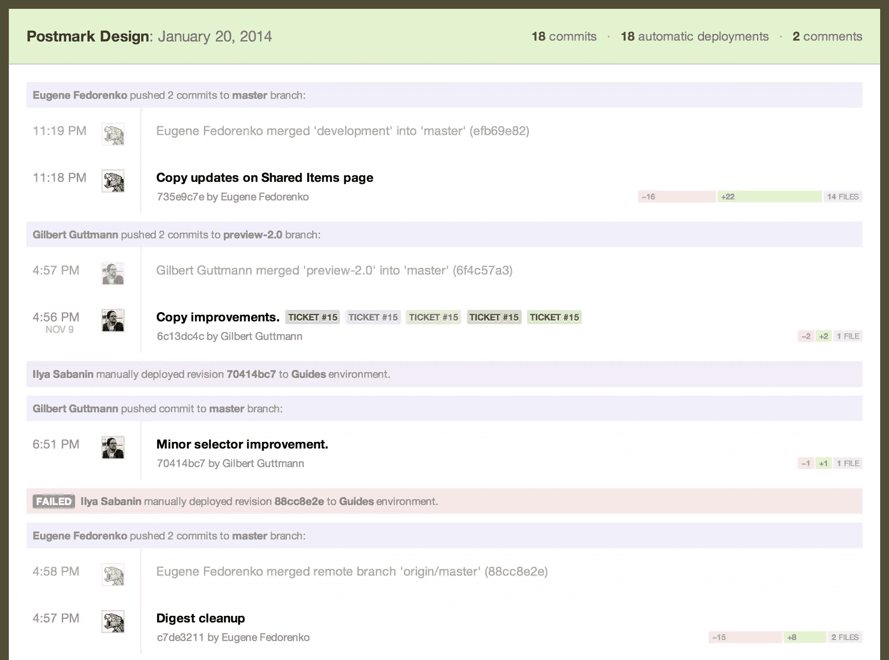

## 部署

一旦评审被批准，并且分支与生产合并，您需要发布最终的代码。Beanstalk 的部署系统可以让你立即将代码部署到你的服务器(通过 SFTP，SSH)或你喜欢的云服务，如 Rackspace 云文件，亚马逊 S3 和 Heroku。下面是对[部署流程如何工作的总结](http://beanstalkapp.com/features/deployments)。

好处显而易见。您不需要在产品之间切换进行部署，一切都在一个应用程序中处理。适当的部署过程所需的一切—从代码提交到审查再到部署—都在同一个环境中进行。

## 结论

代码审查和协作是任何开发工作流程的两个主要部分。Beanstalk 将协作编码提升到了一个全新的水平。使用 Beanstalk，代码审查不会等到过程结束；这是整个协作编码过程的一部分。此外，Beanstalk 的代码审查工具和技术可以很容易地应用到您现有的开发工作流程中。

这是我对 Beanstalk 中重要的代码审查特性的看法，但是如果你想了解更多，请点击这里查看。我个人认为 Beanstalk 在我的开发工作流程中非常有用。

你如何管理你的代码审查过程？你试过豆茎吗？请在评论中告诉我们。

## 分享这篇文章