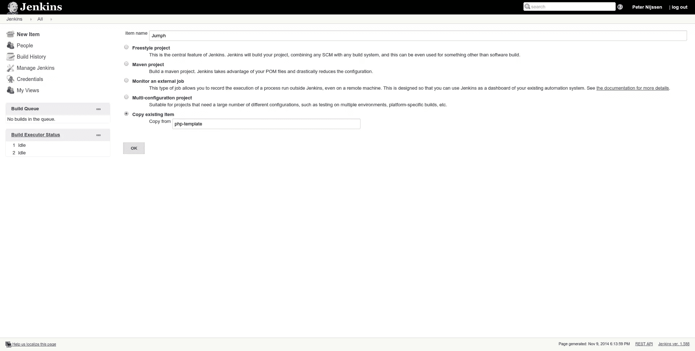
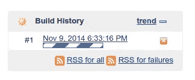
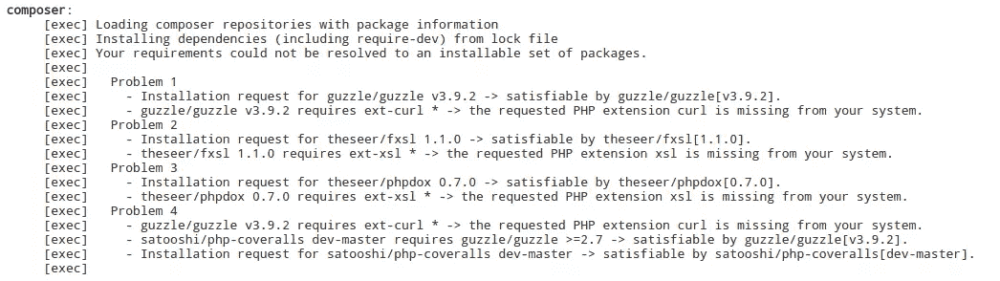
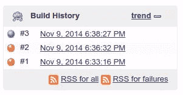

# 在 Jenkins 中准备和构建一个 PHP 项目

> 原文：<https://www.sitepoint.com/preparing-building-php-project-jenkins/>

在[之前的一篇文章](https://www.sitepoint.com/installing-securing-jenkins/)中，我们介绍了 Jenkins 的安装过程，并为开始做好了一切准备。在本文中，我们将继续实际准备我们的项目。如果您之前已经准备好了 Jenkins 设置，就没有必要再看前面的部分，您可以很好地完成这一部分。

## 准备作曲家

我们将首先准备我们的项目。我们可以使用塞巴斯蒂安·博格曼提供的[项目](https://github.com/sebastianbergmann/money)，但这是一个相当基础的项目，在詹金斯运行不会有问题。在本文中，我们将使用一个不同的存储库，在其中我们必须克服一些障碍。我们将使用一个[跳跃叉](https://github.com/peternijssen/Jumph)作为我们的基础。

首先，我们必须确保我们有像 PHPUnit 和 PHP-CodeSniffer 这样的工具可用。我们可以用两种不同的方法做到这一点。要么我们通过 Pear 或 Composer 全局地在 Jenkins 服务器上安装软件包，要么我们在`composer.json`文件中定义依赖关系。我决定采用后一种方法，这样我们可以很容易地在我们自己的本地机器以及 Jenkins 上控制这些工具的版本。因此，我们首先将下面几行添加到`composer.json`文件中，然后运行`composer update`。

```
"require-dev": {
    "squizlabs/php_codesniffer": "~1.5.*",
    "phpmd/phpmd": "~2.1.*",
    "sebastian/phpcpd": "~2.0.*",
    "pdepend/pdepend": "~2.0.*",
    "phploc/phploc": "~2.0.*",
    "phpunit/phpunit": "~4.3.*",
    "theseer/phpdox": "~0.7.*",
},
```

如果你想知道更多关于每个包的功能，看看 Bruno 关于 PHP QA 工具的文章。

## 准备蚂蚁

在我们的 Jenkins 服务器上，我们将使用 [Ant](http://ant.apache.org/) 。因此，如果您的服务器上还没有安装 Ant，请通过运行以下命令来确保它已经安装。

```
sudo apt-get install ant
```

Ant 帮助您自动化软件构建过程。您可以在配置文件中定义称为目标的任务。Ant 将读取该文件并执行适当的操作。您可以定义依赖关系来指示 Ant 应该以何种顺序执行这些任务。配置文件就是所谓的`build.xml`文件。我们将把它添加到我们的项目中，这样 Ant 就可以在我们的 Jenkins 服务器上执行这些任务。我们将使用塞巴斯蒂安博格曼提供的模板，可以在[这里](http://jenkins-php.org/download/build.xml)找到。我们将它添加到项目的根目录中。

要运行 Ant，可以在命令行上启动`ant build`。这意味着 Ant 将运行`build`目标。如果没有给定参数，Ant 将默认运行配置中指示的目标，在本例中也是`build`。

让我们仔细看看`build`目标。

```
<target name="build" depends="prepare,lint,phploc-ci,pdepend,phpmd-ci,phpcs-ci,phpcpd-ci,phpunit,phpdox" description=""/>
```

这个目标是空的，但是，它依赖于许多其他目标。它将首先运行`prepare`目标，然后继续运行`lint`目标，直到运行完所有目标。例如，让我们看看 phploc-ci 目标。

```
<target name="phploc-ci" depends="prepare" description="Measure project size using PHPLOC and log result in CSV and XML format. Intended for usage within a continuous integration environment.">
    <exec executable="${toolsdir}phploc">
        <arg value="--count-tests"/>
        <arg value="--log-csv"/>
        <arg path="${basedir}/build/logs/phploc.csv"/>
        <arg value="--log-xml"/>
        <arg path="${basedir}/build/logs/phploc.xml"/>
        <arg path="${basedir}/src"/>
        <arg path="${basedir}/tests"/>
    </exec>
</target>
```

这个目标相当容易理解。你会注意到这取决于`prepare`目标。因为它已经被目标`build`运行了，所以它不会再运行了。然后我们得到可执行文件，即`phploc`，它将由 Ant 执行。这是您之前在 Composer 中安装的。最后，我们将看到 PHPLOC 特定的参数。Ant 将基于这个目标配置运行以下命令行输入。

```
phploc --count-tests --log-csv /build/logs/phploc.csv --log-xml /build/logs/phploc.xml /src /tests
```

*`${toolsdir}`和`${basedir}`是两个变量。根据它们的配置方式，它们可能会对整个命令行输出产生影响*

如上所述，如果您只想触发这个目标，您应该在命令行上运行`ant phploc-ci`。

注意，这个 PHPLOC 命令将输出一个`phploc.csv`文件和一个`phploc.xml`文件。例如，Jenkins 早期安装的插件将读取这些文件并将其转换为图形。在下一篇文章中，我们将深入探讨这个话题。

如果你浏览整个`build.xml`文件，你会注意到它依赖于某些工具的另外 3 个单独的配置文件； [build/phpmd.xml](https://github.com/peternijssen/Jumph/blob/master/build/phpmd.xml) ， [build/phpdox.xml](https://github.com/peternijssen/Jumph/blob/master/build/phpdox.xml) 和 [build/phpunit.xml](https://github.com/peternijssen/Jumph/blob/master/build/phpunit.xml) 。这些配置文件是实际工具所需要的。要了解更多信息，请查看他们各自的文档。

*请注意，`phpunit.xml`受到 Symfony2 的原始`phpunit.xml.dist`文件的极大启发，因为我们正在处理一个 Symfony2 项目。*

### 更改 build.xml 文件

那么，我们完事了吗？不幸的是，还没有。`build.xml`文件非常普通，不完全适合我们的项目。首先，我们需要定义在哪里可以找到像 PHPUnit 这样的工具。我们的 composer 将这些文件自动安装在项目根目录下的 bin 目录中。我们需要将`toolsdir`属性更改为正确的值。

```
<property name="toolsdir" value="bin/" />
```

我们还可以清理几个命令。当前的`build.xml`文件定义了我们一方面有一个`src`目录，另一方面有一个`tests`目录。因为 Symfony2 在 src 目录中包含测试，所以我们可以像这个例子一样删除所有到测试目录的路径。

```
<arg path="${basedir}/tests"/>
```

虽然这不是必须的，但我更喜欢保持一切尽可能的干净，这样才能和我们的项目相匹配。

最后，在我写这篇文章的时候，`build.xml`文件中指出的 PHPDox 的当前配置不能与最新版本一起工作。我更改了目标，如下所示，这样它就能正确地读取我们的配置文件。

```
<target name="phpdox" depends="phploc-ci,phpcs-ci,phpmd-ci" description="Generate project documentation using phpDox">
  <exec executable="${toolsdir}phpdox">
   <arg value="--file" />
   <arg value="${basedir}/build/phpdox.xml" />
  </exec>
 </target>
```

### 创建新目标

一切都已经设置好了，以确保我们所有的 QA 工具都能按预期运行。然而，我们的项目有点复杂。如果您分析了存储库，您会注意到依赖项是由 Composer 和 Bower 管理的。因为这是一个 Symfony 项目，我们还需要一个默认的`parameters.yml`文件。我们需要处理这些需求，以便能够在 Jenkins 上正确地设置项目。

让我们从 parameters.yml 文件开始。我们可以使用默认的内容`parameters.yml.dist`，所以我们将复制这个文件。我们首先创建一个名为`copy-parameters`的新目标，它执行`cp`命令。

```
<target name="copy-parameters" description="Copy parameters.yml file">
  <exec executable="cp" failonerror="true">
   <arg path="app/config/parameters.yml.dist" />
   <arg path="app/config/parameters.yml" />
  </exec>
 </target>
```

接下来是作曲家和鲍尔。我决定通过执行以下命令在 Jenkins 服务器上全局安装这些。

```
curl -sS https://getcomposer.org/installer | php
sudo mv composer.phar /usr/bin/composer

sudo apt-get install nodejs
sudo apt-get install npm
sudo npm install -g bower
sudo ln -s /usr/bin/nodejs /usr/bin/node #This is needed on certain linux distro's.
```

*【Ed:注意，如果你在一个托管在 Windows 上的虚拟机中运行所有这些，那么[Bower HP](https://www.sitepoint.com/bower-vs-bowerphp/)将是比 Bower 更好的选择。]*

现在让我们为 Composer 创建一个目标。

```
<target name="composer" description="Installing composer dependencies">
 <exec executable="composer" failonerror="true">
  <arg value="install" />
  <arg value="--dev" />
  <arg value="--prefer-dist" />
  <arg value="--no-progress" />

  <env key="SYMFONY_ENV" value="test"/>
 </exec>
</target>
```

将`SYMFONY_ENV`设置为 test 很重要，这样 symfony 就知道它必须清除它的测试缓存目录。

让我们继续鲍尔。

```
<target name="bower" description="Installing bower dependencies">
 <exec executable="bower" failonerror="true">
  <arg value="install" />
 </exec>
</target>
```

我们需要做的最后一件事是确保这些目标得到执行。因此，我们更改了`build`目标，并按照我们希望的执行顺序添加了 3 个新创建的目标。

```
<target name="build" depends="prepare,copy-parameters,bower,composer,lint,phploc-ci,pdepend,phpmd-ci,phpcs-ci,phpcpd-ci,phpunit,phpdox" description=""/>
```

## 饭桶

我们需要做的最后一件事是准备我们的`.gitignore`文件。如果您想在本地机器上运行一个 ant 目标，那么您的构建目录将会被您不想提交到存储库中的日志文件所填充。所以我们将下面几行添加到`.gitignore`文件中。

```
# build
!build/phpmd.xml
!build/phpunit.xml
!build/phpdox.xml
build/*
```

也许你对我们所做的改变有点困惑。为了方便起见，[这里的](https://github.com/peternijssen/Jumph/commit/02b218384650b0da9446f4abe16eb8fc1049e748)是一个直接链接，指向我们上面描述的所有更改的提交。

## 在 Jenkins 中创建项目

我们的项目准备好了。让我们回到 Jenkins 并配置它。这将是本文中最容易的部分。

由于我们的项目位于 Github 上，我建议你在 Jenkins 内部安装 Github 插件。如果你使用自己的 git 服务器，你可以安装常规的 Git 插件。如果你不确定如何安装一个插件，可以查看之前的文章。

当您返回概览时，您必须点击左侧菜单中的`new item`。作为项目名称，我们填写 Jumph。接下来，我们选择选项`copy existing item`，并填写`php-template`作为要复制的项目。



我们将立即被带到该项目的配置页面。首先我们取消选择`Disable build`,这样我们的构建将在保存时启用。在 Github 项目输入字段中，我们填写 Github 项目的 URL。

我们要做的最后一件事是选择源管理。在我们的例子中，这是 git。接下来，您必须填写存储库链接。如果您使用 HTTPS 链接，您不必提供任何额外的凭据。我们可以决定应该构建哪些分支，但是因为我们只有一个主分支，所以我们将让它保持原样。

配置已经完成，因为我们使用了预定义的模板，所以非常简单。如果您向下滚动，您将确切地看到模板为我们配置了什么。在继续之前，不要忘记保存您的配置。

## 开始构建

如果您遵循了到目前为止的所有步骤，您现在应该能够开始构建了。您可以通过点击项目左侧菜单中的`build now`开始构建。您会注意到在左下方的表格中出现了一个构建。



如果您点击构建本身，您将获得一个新的侧菜单，其中包含这个特定构建的选项。点击`console output`查看到底发生了什么。在我的例子中，第一次构建由于缺少一些 PHP 扩展而失败。



控制台输出对于找出项目失败的原因非常方便。在我的例子中，我只需要运行`sudo apt-get install php5-curl php5-xsl php5-sqlite php5-xdebug`来安装一些需要的包。我花了几个构建来找出缺少了什么，但是通过控制台输出，很容易就能找出哪里出错了。最后，这就是我的构建历史的样子。



红色表示构建失败，蓝色表示构建成功。失败可能意味着我们之前看到的配置出了问题，但也可能意味着单元测试失败了。如果您再次打开您的`build.xml`文件，您会注意到一些目标有一个名为`failonerror`的属性，它被设置为 true。如果由于某种原因，目标失败，Ant 将自动停止并报告构建失败。

当构建成功时，也许你期望的是一个绿色的球而不是蓝色的球。有一个[插件](https://wiki.jenkins-ci.org/display/JENKINS/Green+Balls)可以显示绿色球而不是蓝色球。

## 结论

在本文中，我们成功地完成了构建。我们必须准备我们的项目，并在詹金斯内部创造一个职位。最后，我们不得不调试我们的前几个构建，因为我们忘记安装一些库。

在下一部分中，我们将看看 Jenkins 返回的所有结果。

## 分享这篇文章