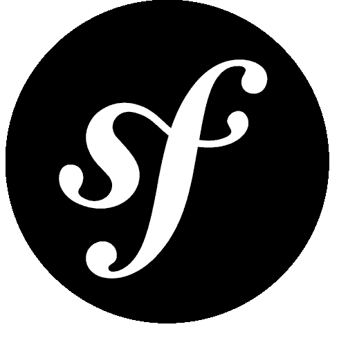

# 你可能错过的 PHP 新闻——2014 年 10 月/11 月

> 原文：<https://www.sitepoint.com/php-news-may-missed-october-november-2014/>

以一种已经非常熟悉的方式，这里有更多你可能在过去一个月左右错过的 PHP 新闻。其中一些将会在以后的文章中更深入地介绍，但是有一个关于它们的提示同样重要。

## 嗯，嗯

HHVM 最近火了——我们有来自 HHVM 世界的四大更新。

### 重写构造函数、新的 static 和 __ConsistentConstruct

正如[这篇博文](https://hhvm.com/blog/6473/hack-overriding-constructors-new-static-and-__consistentconstruct)中所解释的，hack 已经升级了一些新功能。由于 Hack 已经支持静态类型，实现方法覆盖的类型检查器是自然的步骤。Hack 的严格模式现在检查子类的方法是否覆盖了父类的方法，但也改变了返回类型，并且不允许这样的行为。这种严格性的一个例外是在构造函数中——被重写的构造函数可以有不同的签名。他们还添加了`__ConsistentConstruct` [用户属性](https://docs.hhvm.com/manual/en/hack.attributes.php)，确保你可以在构造函数覆盖不自然的情况下使用`new static()`，也就是说，你不知道你会得到哪个类的确切回报。

### H2TP

脸书发布了 H2TP 的实验版，这是一个 transpiler，你可以用它将黑客代码转换成 PHP5 代码。我们[在](https://www.sitepoint.com/hhvm-and-wordpress/)之前提到过，你可以在 HHVM 上轻松运行 PHP5 代码。然而，如果你写黑客代码，那就不能在 Zend 引擎上运行，也不能与老的 PHP 兼容。就我个人而言，我不认为这是一个问题，但有些人可能会。如果将来 Hack 不再合你的意，PHP7 超出了所有人的预期，在速度、质量和/或功能上超过了 HHVM，或者谁知道还有什么，H2TP 可以让你收回兼容性，回到 PHP。

### HHVM 3.4.0 版

一个新版本出来了。虽然不是像 3.3.0 那样的 LTS 版本，但它仍然拥有一些强大的升级，包括但不限于对 Hack 中抽象最终类的支持，对一级枚举的 Hack 反射支持，对 Closure::bind()的支持等等。详情可以在[官方博文](https://hhvm.com/blog/6899/hhvm-3-4-0)中了解。

### WP 引擎和盒子去 HHVM

公司开始提供 HHVM 托管？[疯狂](https://hhvm.com/blog/6989/wp-engine-and-box-now-use-hhvm)！:)虽然我并不觉得 WP Engine 的成立故事给人留下深刻印象——这是一个简单的故障转移，当 HHVM 失败时，它会启动 PHP 并接管它，直到 HHVM 再次掌权——但我仍然为那些公司敢于冒险，一头扎进现代 PHP 的世界而喝彩。如果我们想摆脱“PHP，回家吧，你喝醉了”的老话，我们需要更多像这样勇敢的努力。你用的是 WP 引擎吗？你感觉到影响了吗？请告诉我们，我们很乐意深入了解！你可以从盒子的 [PR 和 WP 引擎](https://tech.blog.box.com/2014/11/box-on-hhvm/)的 [PR 中读取其余的。](https://wpengine.com/2014/11/19/hhvm-project-mercury/)

## 推动 2 大变革

对于那些不熟悉这个项目的人来说，Propel 2 是一个非常流行的活动记录表单。它是完全独立的，的确在教义登上舞台之前就出现了，但在教义兴盛的时候发展却有些停滞。从版本 2 开始，它一直处于积极的开发中，现在，我们有一些巨大的变化即将出现。除此之外，新的 Propel 将更加模块化，支持 NoSQL 甚至 PHPCR。你可以看到上面的公关细节，它比我希望在这里省略的任何东西都要全面。

你在你的项目中实现过 Propel2 吗？我们想发表你的文章。取得联系！

## 面向安全的 PSR 向 PHP-FIG 提出

通过 [Pádraic Brady](https://blog.astrumfutura.com/2014/11/security-oriented-psr-proposed-to-php-fig/) 的帖子发现，似乎一个新的提议进入了 PHP-FIG 的房间。你可以阅读 Pádraic 的帖子了解详情，但简单地说，Lukas Kahwe Smith 提出的提议将确保所有发现的安全漏洞都以完全相同的方式处理。这并没有把 PHP 作为一门语言，但事实上所有与 PHP 相关的东西——包、库、框架——任何一个遭受新发现的漏洞(见 [SQL 注入 Drupal 7](https://www.drupal.org/PSA-2014-003) 的恶作剧)的人，都需要尊重 PHP-FIG 定义和接受的标准，迅速准确地解决问题。我认为这是一个好主意，而且非常容易实现——让我们实现它吧。

## Laravel 的 Oauth2 服务器

基于最近发布的 3.0 版本的 [PhpLeague 的 Oauth 服务器](https://oauth2.thephpleague.com/)，它的 Laravel 版本[也得到了升级](https://github.com/lucadegasperi/oauth2-server-laravel)。现在，在 Laravel 中为您的应用程序安装并运行一个工作的 Oauth2 服务器比以往任何时候都容易。有了广泛的 wiki 和大量可用的文档(以及我们即将推出的一些教程)，您将很快上手并进行授权。有没有想过让您的应用实现单点登录？现在你可以了。

## symphony

Symfony 在过去的几个月里火了——他们的开发者体验计划旨在使 Symfony 对新来者更加友好，并且该框架每周都有更新，可以肯定地说该框架正朝着一个好的方向发展。Symfony 为我们带来了三个重要的更新:

### 5.5 3.0 的要求和路线图

在这篇[博客文章](https://symfony.com/blog/symfony-3-0-the-roadmap)中，杨奇煜解释说 3.0 版本不会破坏每个人的 Symfony 应用程序，列出了一些即将到来的变化，并谈到了 Symfony 3.0 下一个最低要求的 PHP 版本，让公众放心。在最近的一次民意调查中，5.5 版。是请求最多的一个——这是 PHP 社区令人难以置信的前景，显示了我们已经走了多远。我希望在 Symfony 3.0 发布时(目前的目标是 2015 年 11 月)，一项新的调查将决定我们应该用 5.6 来代替。大约在那个时候，PHP 7 将会发布，并且至少在一定程度上，最小化所需 PHP 版本之间的差异应该是当务之急——5.5 到 7 将是比 5.6 到 7 更大的*裂痕。*

### 2.6 B2

2.6 beta 2 出来了，是 2.6 最终发布前的最后一个 beta。根据他们的博客文章，这主要是一个错误修复版本。在提交到最终版本之前，您可以通过切换到适当的 [2.6 b2 分支](https://github.com/symfony/symfony/tree/v2.6.0-BETA2)来试用这个版本。

编辑:Symfony 2.6 已经在这篇文章发表后的几天内发布了，[耶！](https://symfony.com/blog/symfony-2-6-0-released)

### Symfony 市场

SensioLabs 团队[引入了 Symfony market place](https://symfony.com/blog/introducing-the-symfony-marketplace)——所有 Symfony 项目、衍生产品和用途的中心。除了“与 Symfony 一起构建”部分，市场还将展示在 Symfony 中开发的最佳工具，并将提到最成熟的 Symfony 兼容的主机提供商——尽管这种提及有多少实际上是付费的还有待观察。

如果你已经用或*为* Symfony 开发了一些令人印象深刻的*，去看看市场，看看你是否能把自己列入清单。曝光保证！*

## PHP CS 固定 1.0

如果您关心标准(您应该这样做),并且不管您是单飞者还是团队成员，都要保持代码的整洁和可维护性，那么您最有可能使用一些代码检查工具，比如 CodeSniffer，让 IDE 自动向您显示您所犯的错误。CS Fixer 是一款通过更进一步自动化代码清洁的工具——它通过一组给定的规则运行，并自动重写您的代码，使其与这些规则兼容。大多数 ide 已经在某种程度上支持基于标准的重写，但是 CS fixer 是一个通用工具，它共享了许多项目中使用的许多标准，使您可以自动兼容绝大多数专业 PHP 开发领域。

CS Fixer 最近在一个基于 PHP 令牌的解析器上被重写，现在比以前更好，有了更多的标准、规则和特性。这一重写促使杨奇煜·波蒂奇尔[将其标记为 1.0 版本](https://fabien.potencier.org/article/76/php-cs-fixer-finally-reaches-version-1-0)。看看那篇博文了解更多，或者[今天就在你的 IDE 中安装 CS Fixer】。](https://arnolog.net/post/92715936483/use-fabpots-php-cs-fixer-tool-in-phpstorm-in-2-steps)

## AWS SDK 文档的 V3

PHP SDK AWS 文档的第 3 版现在可以在这个位置在线[获得。如果你从未在 PHP 中使用过 AWS，现在是时候了——它比以往任何时候都更好，并且针对 API 版本 3 进行了全面的记录，因此你可以将你的应用程序带到下一个可伸缩性和性能级别。](https://docs.aws.amazon.com/aws-sdk-php/v3/api/index.html)

如果你有任何 AWS PHP 实现想告诉我们，请告诉我们，我们很乐意发表你的故事。开源越多越好！

## 法尔孔

随着费尔康越来越受欢迎，现在有关于费尔康会议的传言。虽然地点和时间仍有待讨论，但一些 Phalcon 粉丝(Phans？)联合起来调查公众的兴趣程度。如果你能抽出一两分钟的时间，请填写他们在 https://bit.ly/phalconf[做的兴趣水平调查。即使你对 Phalcon 完全不熟悉，请参加调查——可以肯定的是，会议将举办大量关于 Phalcon 和 Zephir 的介绍性讲座，并温和地引导你了解这两者——请确保投票支持双轨会议，这样一个轨道可以专注于初学者主题，而另一个将举办高级讲座。](https://bit.ly/phalconf)

## Laravel 5.0 延迟

在一篇神秘但诚实的博客文章中，泰勒·奥特威尔已经将 Laravel 5.0 的发布时间推迟了两个月，直到一月份。今天使用 5.0 特性的人可能还好，但我的直觉告诉我一些重大的变化正在发生，在 Laravel 驱动的开发世界中，一些事情的处理方式可能会发生范式转变。

你已经在使用一些新的 5.0 特性了吗？想写写吗？让我们知道！

## 锁

Dries Vints 在下面的评论中提到，一个新的 PHP ACL 包已经出现。ACL 是任何严肃的 PHP 应用程序的重要组成部分，在超级浮动框架和 10k+文件计数包的时代，拥有一个构建良好的可重用组件是无价的。虽然它仍然处于 alpha 阶段，但它已经显示出了巨大的潜力，我个人希望作者能够将它转变为 PhpLeague 成员，而不是它自己的组织。

我们将很快对 Lock 进行更深入的研究。

## Bldr

[Bldr](https://bldr.io/) 是一个不依赖外部的 PHP 任务运行器。在你的机器上不需要 Java、NPM 和其他不稳定的软件——PHP 和一些附带的软件包会很好地完成这项工作。

我们将很快更深入地研究如何使用 Bldr。

## 包扎

过去一个多月就是这样。我错过了什么重要的事情吗？请在下面的评论中告诉我！

## 分享这篇文章