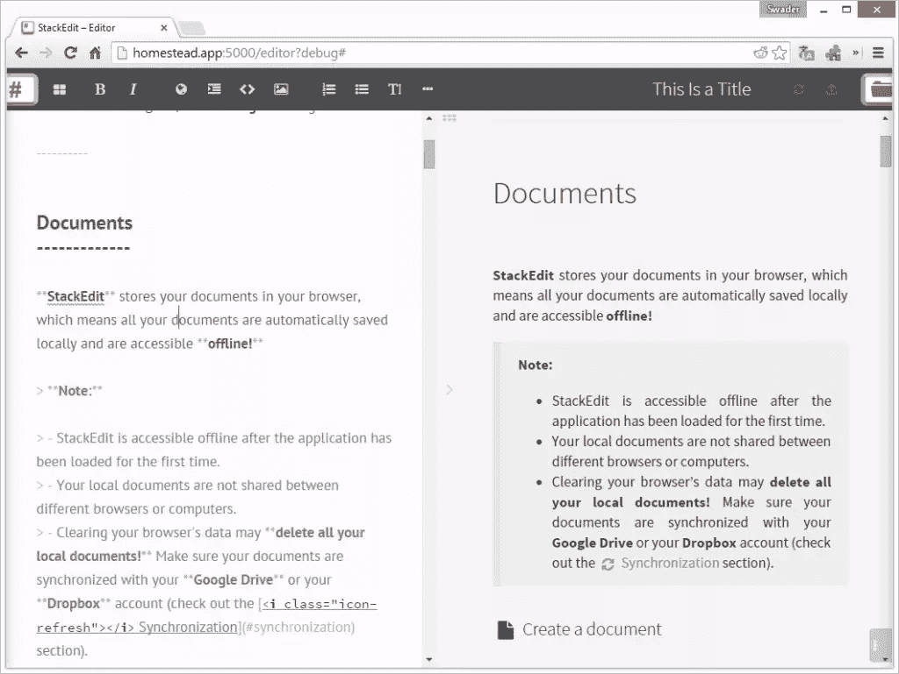
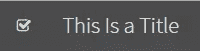

# 在 StackEdit 中实现标题大写

> 原文：<https://www.sitepoint.com/implementing-titlecapitalization-stackedit/>

在 SitePoint 为 PHP 频道写文章时，我经常忘记如何正确地大写标题。我通常最终会去 [TitleCapitalization](http://titlecapitalization.com/) 进行快速修复，但我经常幻想在[stacke edit](https://stackedit.io)的标题字段旁边有一个按钮来快速自动应用。嗯，我们已经[介绍了](https://www.sitepoint.com/stackedit-4-0-multiple-instances-local-hosting/)如何让 StackEdit 的一个(或几个)本地实例启动并运行。为什么不也构建按钮呢？



## 做好准备

为了准备升级，我们需要签出 StackEdit 的本地副本。当然，我将会使用我信赖的旧的改良过的盒子，就像这里的 T2 一样。你可以使用你自己的 Linux 操作系统，这取决于你，但这绝对是最简单的。

```
git clone https://github.com/swader/homestead-improved hi_stackedit
cd hi_stackedit
vagrant up
vagrant ssh
```

一旦进入虚拟机，我们就克隆 StackEdit。

```
cd ~/Code
git clone https://github.com/benweet/stackedit
cd stackedit
npm install --no-bin-link
```

请注意，如果在运行该命令时出现“未能解决”错误，以及一系列其他典型的节点“冗长”错误，这仅仅意味着缺少了一些依赖项。进入`package.json`并从[第 23 行](https://github.com/benweet/stackedit/blob/master/package.json#L23)和[第 28 行](https://github.com/benweet/stackedit/blob/master/package.json#L28)移除 hashtag 值，如果它们还在的话。这些标记引用了一个已经不存在的版本，在撰写本文时，StackEdit 的作者仍然没有更新 StackEdit 的文件来反映这一点。

```
bower install
```

这需要一段时间。如果你已经安装了[bower HP](https://www.sitepoint.com/bower-vs-bowerphp/)，你可以用它来代替。

要运行本地副本，请执行以下操作:

```
(export PORT=5000 && node server.js)
```

然后，在您的浏览器中访问`homestead.app:5000`(或者您设置的任何主机，如果不是默认的`homestead.app`)。

## 履行

好吧，让我们开始吧。实现将由两部分组成——UI 和逻辑。

### 用户界面

让我们添加按钮。

从用户界面的角度来看，StackEdit 的扩展有些复杂。项目本身，在安装时，包含超过 30000 个文件和下载的依赖项。这对于 web 应用程序来说是荒谬的，并且对于任何 IDE 来说都很难索引，尤其是考虑到 JavaScript 有点乱。向界面添加按钮有几个步骤。我们要的造型是这样的:



文档标题旁边的“勾号”图标，以[图标](http://glyphicons.com/)的形式，根据使用的主题与 UI 的其余部分匹配。我使用了复选标记，因为 StackEdit 中的 Bootstrap 已经包含了 Glyphicons。它可能在上下文上并不完美，但它是在不编辑太多文件的情况下获得我们想要的东西的最快方法(默认情况下，我们会编辑很多文件，增加这种开销是没有意义的)。

我们需要编辑的视图是`public/res/html/bodyEditor.html`——我们将在[行 44](https://github.com/benweet/stackedit/blob/master/public/res/html/bodyEditor.html#L44) 周围添加一个新的图标容器:

```
<li><div class="working-indicator"></div></li>
<li><div class="capitalize-button"></div></li>
<li><a class="btn btn-success file-title-navbar" href="#" title="Rename document"> </a></li>
```

我们在“working-indicator”容器之后添加了一个“capitalize-button”容器，所以我们的按钮出现在标题旁边，在那里它最匹配它的上下文。不过，这只是容器。

StackEdit UI 中的所有按钮都是用 JS 构建的。这发生在文件`public/res/libs/Markdown.Editor.js`中。首先，让我们添加按钮标签。在文件的顶部是一个[默认字符串](https://github.com/benweet/stackedit/blob/master/public/res/libs/Markdown.Editor.js#L20)数组。编辑它以包含我们的标题大写标签，如下所示:

```
[...]
        help: "Markdown Editing Help",

        titlecapitalization: "Autocapitalize Title"
    };
```

然后，向下滚动到同一文件中的`makeSpritedButtonRow`函数，并在`if (helpOptions) {`块上方添加以下内容:

```
buttons.titlecapitalization = makeButton("wmd-titlecapitalization", getString("titlecapitalization"), "-240px", bindCommand(function (chunk, postProcessing) {
                alert("Hello");
            }));
```

这将创建一个与编辑器主题的其余部分相匹配的按钮，并用我们定义的字符串赋予它一个 title 属性，这样当我们将鼠标放在按钮上时就可以看到它。它还会让它在点击的时候说“你好”。然而，它仍然不会出现在界面上。为此，我们需要编辑`public/res/core.js`。

在该文件中找到注释`// Add customized buttons`，并转到该块的末尾。在那里，添加以下内容:

```
$("#wmd-titlecapitalization").append($('<i class="icon-check">')).prependTo($('.capitalize-button'));
```

这将找到我们的按钮容器，并将我们新创建的按钮插入其中。如果您现在在调试模式(`homestead.app:5000/editor?debug`)下刷新编辑器并点击按钮，您应该会看到一个“Hello”警告，正如在`Markdown.Editor.js`中回调所定义的。

### 逻辑

现在已经添加了按钮，让我们让它做我们想要它做的事情。

首先，让我们获取标题字段的文本。编辑`Markdown.Editor.js`。用以下内容替换按钮回调中的`alert("Hello");`:

```
console.log($(".title-container a").text());
```

现在单击该按钮应该会在控制台中产生当前的文档标题。到目前为止一切顺利。

为了得到我们想要做的事情的逻辑，我们将从[TitleCapitalization.com](http://titlecapitalization.com)那里“借用”代码。如果您查看源代码，您会注意到它都在底部的脚本标记中。稍微清理一下，去掉网站特有的东西，我们最后得到这个:

```
(function(){
    var prepositions = [
      'a',
      'abaft',
      'aboard',
      'about',
      'above',
      'absent',
      'across',
      'afore',
      'after',
      'against',
      'along',
      'alongside',
      'amid',
      'amidst',
      'among',
      'amongst',
      'an',
      'apropos',
      'apud',
      'around',
      'as',
      'aside',
      'astride',
      'at',
      'athwart',
      'atop',
      'barring',
      'before',
      'behind',
      'below',
      'beneath',
      'beside',
      'besides',
      'between',
      'beyond',
      'but',
      'by',
      'circa',
      'concerning',
      'despite',
      'down',
      'during',
      'except',
      'excluding',
      'failing',
      'following',
      'for',
      'from',
      'given',
      'in',
      'including',
      'inside',
      'into',
      'lest',
      'like',
      'mid',
      'midst',
      'minus',
      'modulo',
      'near',
      'next',
      'notwithstanding',
      'of',
      'off',
      'on',
      'onto',
      'opposite',
      'out',
      'outside',
      'over',
      'pace',
      'past',
      'per',
      'plus',
      'pro',
      'qua',
      'regarding',
      'round',
      'sans',
      // while it technically can be a preoposition, 
      // (http://www.merriam-webster.com/thesaurus/save[preposition])
      // it is usually used as a verb
      // 'save',
      'since',
      'than',
      'through',
      'thru',
      'throughout',
      'thruout',
      'till',
      'times',
      'to',
      'toward',
      'towards',
      'under',
      'underneath',
      'unlike',
      'until',
      'unto',
      'up',
      'upon',
      'versus',
      'vs\.',
      'vs',
      'v\.',
      'v',
      'via',
      'vice',
      'with',
      'within',
      'without',
      'worth'
    ];
    var articles = [
      'a',
      'an',
      'the'
    ];
    var conjunctions = [
      'and',
      'but',
      'for',
      'so',
      'nor',
      'or',
      'yet'
    ];
    // var small = "(a|an|and|as|at|but|by|en|for|if|in|of|on|or|the|to|v[.]?|via|vs[.]?)";
    var punct = "([!\"#$%&'()*+,./:;<=>?@[\\\\\\]^_`{|}~-]*)";

    var all_lower_case = '(' + (prepositions.concat(articles).concat(conjunctions)).join('|') + ')';
    console.log('all lower case', all_lower_case);

    window.titleCaps = function(title){
      var parts = [], split = /[:.;?!] |(?: |^)["Ò]/g, index = 0;

      title = title.replace(/[\u2018\u2019]/g, "'")
        .replace(/[\u201C\u201D]/g, '"');

      while (true) {
        var m = split.exec(title);

        parts.push( title.substring(index, m ? m.index : title.length)
          .replace(/\b([A-Za-z][a-z.'Õ]*)\b/g, function(all){
            return /[A-Za-z]\.[A-Za-z]/.test(all) ? all : upper(all);
          })
          //.replace(RegExp("\\b" + small + "\\b", "ig"), lower)
          //.replace(RegExp("^" + punct + small + "\\b", "ig"), function(all, punct, word){
          //  return punct + upper(word);
          //})
          //.replace(RegExp("\\b" + small + punct + "$", "ig"), upper));
          .replace(RegExp("\\b" + all_lower_case + "\\b", "ig"), lower)
          .replace(RegExp("^" + punct + all_lower_case + "\\b", "ig"), function(all, punct, word){
            return punct + upper(word);
          })
          .replace(RegExp("\\b" + all_lower_case + punct + "$", "ig"), upper));

        index = split.lastIndex;

        if ( m ) parts.push( m[0] );
        else break;
      }

      return parts.join("").replace(/ V(s?)\. /ig, " v$1\. ")
        .replace(/(['Õ])S\b/ig, "$1s")
        .replace(/\b(AT&T|Q&A)\b/ig, function(all){
          return all.toUpperCase();
        });
    };

    function lower(word){
      return word.toLowerCase();
    }

    function upper(word){
      return word.substr(0,1).toUpperCase() + word.substr(1);
    }
  })();
```

如果你现在把它粘贴到你的控制台，你将可以访问一个名为“titleCaps”的根函数，它接受一个字符串并打印出一个标题大写的字符串。这正是我们所需要的。

再次编辑按钮的回调，并将其更改为:

```
var titleContainer = $('.title-container a');
var capitalized = capitalize($(titleContainer).text());
$(titleContainer).text(capitalized);
$(".input-file-title").val(capitalized);
```

现在我们所缺少的就是`capitalize`函数。环顾一下`Markdown.Editor.js`的代码，我们可以看到通用函数就在那里(例如，参见`properlyEncoded`)。因此，我们不需要重新考虑把我们的也包括进去。在文件末尾，最后一个`})();`之前，添加以下内容:

```
var prepositions = [
        'a',
        'abaft',
        'aboard',
        'about',
        'above',
        'absent',
        'across',
        'afore',
        'after',
        'against',
        'along',
        'alongside',
        'amid',
        'amidst',
        'among',
        'amongst',
        'an',
        'apropos',
        'apud',
        'around',
        'as',
        'aside',
        'astride',
        'at',
        'athwart',
        'atop',
        'barring',
        'before',
        'behind',
        'below',
        'beneath',
        'beside',
        'besides',
        'between',
        'beyond',
        'but',
        'by',
        'circa',
        'concerning',
        'despite',
        'down',
        'during',
        'except',
        'excluding',
        'failing',
        'following',
        'for',
        'from',
        'given',
        'in',
        'including',
        'inside',
        'into',
        'lest',
        'like',
        'mid',
        'midst',
        'minus',
        'modulo',
        'near',
        'next',
        'notwithstanding',
        'of',
        'off',
        'on',
        'onto',
        'opposite',
        'out',
        'outside',
        'over',
        'pace',
        'past',
        'per',
        'plus',
        'pro',
        'qua',
        'regarding',
        'round',
        'sans',
        'since',
        'than',
        'through',
        'thru',
        'throughout',
        'thruout',
        'till',
        'times',
        'to',
        'toward',
        'towards',
        'under',
        'underneath',
        'unlike',
        'until',
        'unto',
        'up',
        'upon',
        'versus',
        'vs\.',
        'vs',
        'v\.',
        'v',
        'via',
        'vice',
        'with',
        'within',
        'without',
        'worth'
    ];
    var articles = [
        'a',
        'an',
        'the'
    ];
    var conjunctions = [
        'and',
        'but',
        'for',
        'so',
        'nor',
        'or',
        'yet'
    ];
    var punct = "([!\"#$%&'()*+,./:;<=>?@[\\\\\\]^_`{|}~-]*)";

    var all_lower_case = '(' + (prepositions.concat(articles).concat(conjunctions)).join('|') + ')';
    console.log('all lower case', all_lower_case);

    var capitalize = function(title){
        var parts = [], split = /[:.;?!] |(?: |^)["Ò]/g, index = 0;

        title = title.replace(/[\u2018\u2019]/g, "'")
            .replace(/[\u201C\u201D]/g, '"');

        while (true) {
            var m = split.exec(title);

            parts.push( title.substring(index, m ? m.index : title.length)
                .replace(/\b([A-Za-z][a-z.'Õ]*)\b/g, function(all){
                    return /[A-Za-z]\.[A-Za-z]/.test(all) ? all : upper(all);
                })
                .replace(RegExp("\\b" + all_lower_case + "\\b", "ig"), lower)
                .replace(RegExp("^" + punct + all_lower_case + "\\b", "ig"), function(all, punct, word){
                    return punct + upper(word);
                })
                .replace(RegExp("\\b" + all_lower_case + punct + "$", "ig"), upper));

            index = split.lastIndex;

            if ( m ) parts.push( m[0] );
            else break;
        }

        return parts.join("").replace(/ V(s?)\. /ig, " v$1\. ")
            .replace(/(['Õ])S\b/ig, "$1s")
            .replace(/\b(AT&T|Q&A)\b/ig, function(all){
                return all.toUpperCase();
            });
    };

    function lower(word){
        return word.toLowerCase();
    }

    function upper(word){
        return word.substr(0,1).toUpperCase() + word.substr(1);
    }
```

如果你现在测试这个，你会注意到像“Hello world”这样的标题被大写成了“Hello World”。单击标题字段，您会注意到它也适用于里面的文本——所有内容都正确地大写了:


## 结论

在这篇文章中，我们在 MarkDown 编辑器 StackEdit 中实现了一个令人满意的新功能，首先在本地托管它。我们添加了一个按钮，从 TitleCapitalization 中窃取了功能，并将其回收到我们的环境中。如果我们愿意，我们现在可以使用这个升级向项目所有者发送一个 pull 请求。当你读到这封信时，它可能被接受，也可能被拒绝，但无论是哪种情况，我们的本地副本都已经实现了功能，我们可以按计划使用它。

评论？反馈？让我知道！

## 分享这篇文章