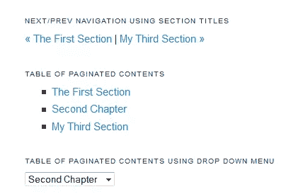

# 分页和搜索引擎优化:危险信号和最佳实践

> 原文：<https://www.sitepoint.com/pagination-seo-red-flags-best-practices/>

对于任何一个大型网站的站长来说，内容分页都是一个感兴趣的话题。当你有大量的内容时，很难避免分页。除了从可用性角度考虑分页问题，SEO 方面也值得考虑。

分页不是火箭科学，但就 SEO 而言，有几件事你需要知道。在我们深入研究这些细节之前，让我们首先澄清不同类型的分页以及它们可能导致的问题。

## 分页的类型

当您想到分页时，您可能只想到一两种类型，但是还有更多方法。在许多方面它们是相似的，但是在功能性和可用性方面它们也有很大的不同。

### 1.文章分页

这是一种非常常见的分页类型。当你有一篇很长的文章，但你不想把它放在一个页面上时，你可以使用文章分页。在这种情况下，你只需将它分成多个页面，并在每个页面的末尾有*下一个*和*上一个*导航。

每个页面都有不同的 URL，如下所示:

*   http://www.somesite.com/some_article-1.html
*   http://www.somesite.com/some_article-2.html
*   http://www.somesite.com/some_article-3.html

你可以为文章的每一部分使用不同的名称(也就是说，你可以用 part_name.html 代替 some_article-2.html，其中 part_name 是部分的名称)，但是这给 SEO 带来了更多的问题，所以你最好坚持 1，2，3 的约定。

### 2.图片库分页

使用图库分页，图库中的每个图像都有自己的页面。与文章分页类似，您可以在系列名称后按顺序命名单独的页面(1、2、3 等)，或者为任何图像命名不同的名称，但在这种情况下，您不会显示它们都是一个图库的一部分。“上一页”和“下一页”也可用于导航。

### 3.类别分页

当你有一个包含大量类别和子类别的网站，当这些类别和子类别被列为链接时，需要太多的滚动，类别分页经常发挥作用。

### 4.论坛主题或博客评论分页

分页在论坛中非常常见，因为线程可能会变得非常长，您不会希望在一个屏幕上显示所有内容。同样的道理也适用于有很多评论的博客文章——你只需要把它们分成不同的页面，并用下一个和上一个链接/按钮把它们连接起来。

### 5.无限滚动分页

无限滚动分页是最近出现的一种越来越流行的分页方法。当用户向下滚动屏幕时，下一页的内容会直接添加到用户的当前页面。这是自动完成的，不需要使用 Previous、Next 或更多——分页脚本会处理所有这些。

在 SitePoint 的其他文章中，已经从 SEO 的角度和 UX 的角度对无限卷轴进行了广泛的探讨。

## 红旗

尽管分页通常很有用，但是如果您不知道如何正确地实现它，它会导致各种问题:

### 1.爬行深度

如果分页链接不正确，谷歌将无法索引系列中的所有页面。此外，谷歌对每个网站抓取的页面数量有限制，大量的页面会导致抓取深度降低。正如我将在本文中进一步讨论的那样，最好创建一个“查看全部”页面，告诉 Google 只索引该页面，不要接触单独的分页部分。

### 2.重复内容

重复内容是一个非常严重的 SEO 问题。有了分页，当你有一个带有分页的“查看全部”页面时，就会出现这种情况。对分页系列中的页面使用 rel="nofollow "是一个好习惯，这样您就能够包含一个" View All "页面。

### 3.稀薄的内容

曾经有一段时间，谷歌喜欢有多个页面的网站，即使它们只有一张图片和/或少量的文字。然而，这是历史了，如此单薄的内容会让你陷入严重的麻烦。

对于图片库分页，瘦内容更受关注，因为对于其他类型的分页，每页不太可能只有一两个段落的文本。如果你不允许谷歌索引单独的图片页面，而是只提供主页面，那么你就不会有问题。

或者，您可能希望向图像页面添加更多内容，例如相关内容、类似的图库等。为了让它更胖，请谷歌。这种方法的问题是，这可能会导致关键字密度降低，从而降低排名。

## 分页最佳实践

分页最佳实践并不难实现，但是如果你跳过它们，你很快就会体验到分页实现不当可能导致的所有灾难。这里有一些如何避免这种情况的提示。

### 1.何时使用分页

没有一个普遍的规则，但这里有一些对我们大多数人都有效的一般性建议。

如果您使用文章分页，那么您可以在特定的点、站点范围或文章的某个部分的结尾绘制线条。节尾方法更符合逻辑，但它可以创建长度变化很大的页面。

对于论坛和博客评论，最好是在 10 到 20 个帖子/评论后分页。当然，如果帖子/评论很长，一个屏幕放不下 20 个，但这还是可以的。一些滚动比不停地点击下一个，下一个，下一个更容易接受，所以坚持 10 到 20 个帖子/评论的原则。

至于分类分页，我建议在你获得 50-70 个链接后，换到一个新的页面。一些作者推荐 100 个左右的链接，但这太多了，尤其是在移动设备上。

### 2.总是为分页的文章创建目录

我想这是不言而喻的，但由于我经常看到这一点被跳过，让我把它包括在这里——总是为分页的文章创建一个目录(TOC)。

不要假设读者会按照文章发表的顺序阅读每一页。读者通常会阅读介绍，然后他们会想直接跳到他们感兴趣的部分，跳过之前的所有内容。

如果你不给他们这样做的机会(也就是说，如果你没有 TOC 让他们选择他们感兴趣的部分)，你很可能会在介绍结束后就失去他们。

把目录放在一个显眼的地方——在标题下面，或者在第一段旁边的方框里。不要忘记在文章的每一页都包含目录，这样用户就可以随心所欲地在文章中前后移动。

如果你正在使用 WordPress，那么你可能会喜欢分页目录的 WP 表格插件。它为您处理所有的 TOC 创建问题，并提供许多定制选项。有了这个插件，你的目录看起来将如下所示:

### 3.不要忘记查看全部页面

我在这篇文章中多次提到,“查看全部”页面解决了许多源于分页的 SEO 问题。

一个显示所有分页部分的“查看全部”页面不仅有利于打印，也有利于那些不介意滚动的用户，它还可以防止 SEO 灾难。

论坛是唯一的例外，因为对他们来说，“查看全部”页面毫无意义。有了论坛，你只需要坚持独立的页面——这是没有办法的。

当你创建了“查看所有”页面，告诉谷歌索引它，而不是其他页面。为了避免重复内容的损失，请始终对单独的页面使用 noindex。

在爬虫访问你的站点之后，你可能想要在 Google 中仔细检查它是否只显示查看所有页面，或者是否单独的页面也被索引。这看起来似乎太麻烦了，但是因为重复的内容而受到惩罚是不太好的。

### 4.如有必要，使用 rel="prev "和 rel="next "

如果你有充分的理由不能使用“查看全部”页面，或者如果你使用的分页类型根本不允许这样的页面，那么你必须始终使用 rel="prev "和 rel="next "来告诉 Google 索引系列中的所有页面。

这些 HTML 属性告诉 Google 要索引的页面的顺序。然而，你需要知道 Google bot 可能会也可能不会跟随他们，所以不要太确定你所有的页面都会被索引。

关于如何使用 rel="prev "和 rel="next "的更多信息可以在[这里](https://support.google.com/webmasters/answer/1663744?hl=en)找到。

## 结论

分页在可用性和搜索引擎优化方面确实有其困难，但这些并不太难克服。是的，如果您没有正确地应用分页，这可能会导致问题，如降低爬虫深度，重复内容，或瘦内容。但是，如果您遵循一些简单的分页最佳实践，您可以享受分页的好处，而不必担心您的站点的可用性或您在搜索引擎中的排名。

## 分享这篇文章