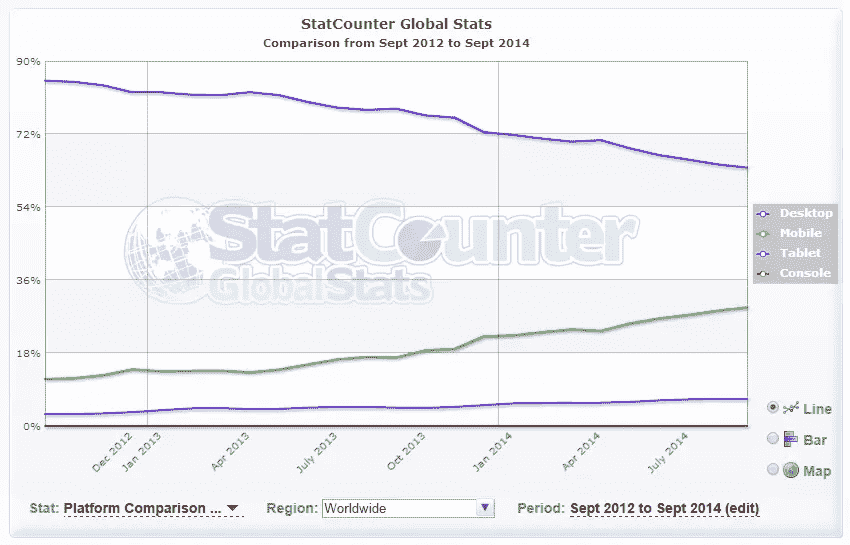
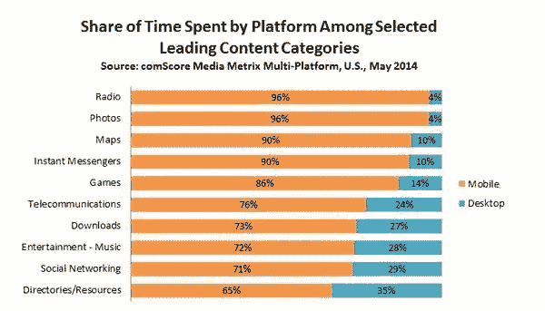
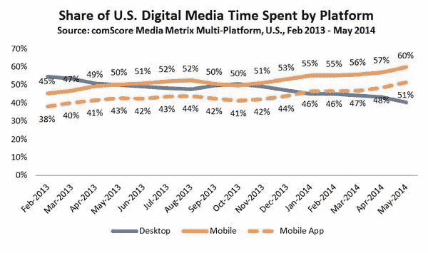

# 为 Mobile First 设计提供案例

> 原文：<https://www.sitepoint.com/making-case-mobile-first-designs/>

您是否知道移动流量(即智能手机等。)占如今网站页面浏览量的 30%左右？这比两年前微不足道的 10%增长了 3 倍。在同一时期，桌面访问率现在下降到 60% ( [下面是该数据的测量方法](https://gs.statcounter.com/faq#methodology))。

从花费的时间而不仅仅是页面浏览量来看，[comScore](http://www.comscore.com/Insights/Blog/Major-Mobile-Milestones-in-May-Apps-Now-Drive-Half-of-All-Time-Spent-on-Digital)的这份报告显示，移动平台占数字媒体花费时间的 60%。

我可以分享更多的数字来证明这一点，但你们中那些对数据感兴趣的人可以在这里和这里查找更多的[。这些数字只是表明**网络使用模式变化有多快。**](http://techcrunch.com/2013/07/03/mobile-data-use-to-grow-300-globally-by-2017-led-by-video-web-traffic-says-strategy-analytics/)

卢克·乌鲁布莱夫斯基早在 2011 年就谈到了移动优先设计的必要性[，并在 2012 年](http://www.lukew.com/resources/mobile_first.asp)分享了[一些早期数据，远在我们看到网络使用模式发生如此重大转变之前。两年过去了，随着](http://www.lukew.com/ff/entry.asp?1597)[智能手机和平板电脑戏剧性地取代个人电脑](http://techcrunch.com/2013/06/24/it-device-sales-to-rise-6-to-2-4b-in-2013-driven-by-android-tablets-smartphones-pcs-continue-decline/)，即使在工作场所，看到大多数设计师和开发人员仍然停留在传统的设计方式——为大屏幕台式机——并且仍然在谈论渐进增强和优雅退化，这令人震惊。

## 传统的桌面优先方法已经过时

如果你仍然在考虑你的网页设计策略，主要是大屏幕，是时候考虑一下了。原因如下:

*   **用户正在转向移动设备**。越来越多的用户现在更关心移动体验，而不是你的网站在桌面上如何工作。无论你的网站是关于电子商务，还是提供信息和内容，用户都希望能够访问它，使用它，无论他们在哪里，无论他们何时需要它。正如本文第一段中的数据所示，这最有可能来自移动设备。
*   **用于创作的桌面。移动消费**。如今，移动设备是大多数观众消费内容的主要方式。台式机仍在使用，主要用于内容创作或“工作”——这些事情太复杂，无法在移动设备上完成。随着[许多公司转向移动设备工作](http://techcrunch.com/2013/06/24/it-device-sales-to-rise-6-to-2-4b-in-2013-driven-by-android-tablets-smartphones-pcs-continue-decline/)，这种情况也在改变。你可以在[这篇出色的报告](http://www.exacttarget.com/sites/exacttarget/files/deliverables/etmc-2014mobilebehaviorreport.pdf)中了解更多关于手机使用行为的信息。
*   **移动设备和浏览器已经进化**。就 web 开发而言，桌面和移动体验之间的主要区别曾经是，移动浏览器非常基础，不支持许多关键的开发功能，这导致我们采用了一种优雅的降级方法。这不再适用。手机浏览器已经进化了。优雅的降级和渐进的增强不应该再是手机上的主要策略。这些原则是作为处理不同浏览器所支持的巨大差异的一种方式而发展起来的。如今，移动设备的 CPU 和 GPU 几乎与台式机不相上下。现代基于 WebKit 的移动浏览器比 IE8 好得多！所以你不必再为手机而降低音量了。真正的限制是屏幕空间和下载带宽。
*   web 的本质是用户体验。不是设计。作为设计师和开发人员，我们经常会被工具让我们做的奇妙事情的复杂性所困扰——无论是处理图形、动画还是媒体查询。网络不是关于我们的。这甚至与 HTML、CSS、JavaScript 或我们使用的其他工具无关。*这是关于连接人们。*。你的网站真的不需要花哨的图形、褪色的表单或最新的 CSS3 特性来创造精致的用户体验。

## 网络的未来是移动的

在过去的几年中，我们体验互联网的方式发生了如此巨大的变化，以至于在这个时代开始设计台式机就像是将一只脚牢牢地踩在过去。它阻止你前进。这意味着你的网站很快就会过时。虽然这对一些人来说可能是个好消息(嘿，你可以重新制作网站并收取额外费用)，但我们大多数人都喜欢把好的、持久的工作放在那里——那种会被欣赏的工作。以下是移动优先方法如何帮助您:

*   这是你未来的最佳选择。还是那句话，回过头来看看这篇文章顶部的数据。
*   它迫使你关注人，关注用户体验，关注内容。根据设备的不同，移动用户的可用屏幕空间比桌面少 20%。为了确保你的网站仍然传达它需要的信息，你不得不关注核心。你必须准确地知道谁是你的目标受众，以及你想让他们体验什么。
*   **它让您能够利用扩展功能**。想想触摸，想想 GPS。这些以及其他类似的扩展功能已经成为当今移动体验的一部分。我们将很快看到它们进入桌面领域。显式设计为移动设备，它为您提供了利用这些“扩展”功能来创建丰富的上下文感知网站的可能性。它给了你跳出框框思考的空间，而不是拘泥于桌面世界过时的概念和功能。
*   **更清洁的设计。清洁剂代码**。移动优先的方法是极简的。不是从一个拥有一切和厨房水槽的大型设计开始，然后添加媒体查询和不要在较小的屏幕上选择性地显示或隐藏某些元素的内容，而是从最少的开始，只添加绝对需要的内容——这几乎是一种禅宗方法。关于这一点的更多见解，请查看《粉碎》杂志上杰里米·吉拉德的故事[，他的公司如何以移动优先设计结束，以及它如何帮助他们。](http://www.smashingmagazine.com/2013/03/05/building-a-better-responsive-website/)

## 是什么阻碍了你？

如你所见，我明显偏向于移动优先的设计。所以我不得不绞尽脑汁，试图弄清楚为什么其他人都不那么热情。我只能想到两件事。

1.  **习惯**。我们只是太习惯于旧的设计方式了。从“应有尽有”的大屏幕开始；然后为较小的屏幕省去一些部分。我们不想努力去改变。我们不愿意相信这是必须的，甚至不愿意相信这是可能的。首先为移动设备设计迫使你重新思考你的整个设计和开发策略。你从少开始。空间越小，内容越少。真的很难做到。此外，我们还必须考虑手势、触摸和 GPS 之类的东西，而不是我们习惯的鼠标控制和点击。

2.  **客户**。是的，客户。他们对设计有最终决定权。他们中的一些人仍然要求基于 Flash 的网站，而不是 HTML。有些人想要花哨的图像和图形。有些人不会喜欢你向他们展示的极简主义手机设计。但是作为一名设计师/开发者，你的工作是找出什么对网站和客户最好，并向他们解释。当然，如果他们的网站流量都来自桌面，而不是移动设备，那么一定要做基于桌面的设计。但是，如果他们处在一个移动接入越来越多的领域，那么就要提高你的说服技巧，向他们展示为什么首先使用移动设备是有意义的。

## 概括起来

首先为移动设计不仅为你的网站在移动领域已经发生的爆炸式增长做准备，而且作为一名设计师和开发者，它迫使你关注用户。

移动优先设计不仅仅适用于新网站。即使你已经有了一个桌面版本，这也是一个很好的方法。在为手机设计的过程中，你必须确定什么是核心区域，什么是你的重点，你真正想在屏幕上显示什么，以及你希望用户如何与你的网站互动。这些见解也将提供优化桌面网站的方法。

虽然我首先说的是“移动”，但是请注意，这些原则并不真正局限于“移动”设备。这一切都是为了更好的可用性，更好地利用屏幕空间，更好地利用页面元素和代码——这些东西我们应该始终保持在最前沿，但往往被掩盖在珠光宝气之下。

少即是多。简单更好。我内心的极简主义者有点喜欢这样。但更重要的是，因为它让人们重新关注人，而不是技术细节。

## 分享这篇文章