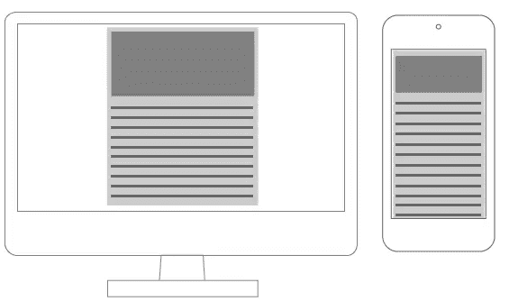
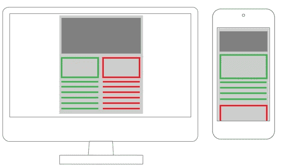
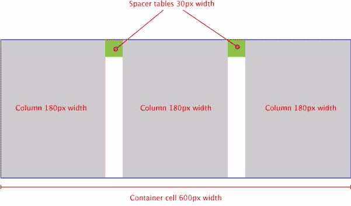
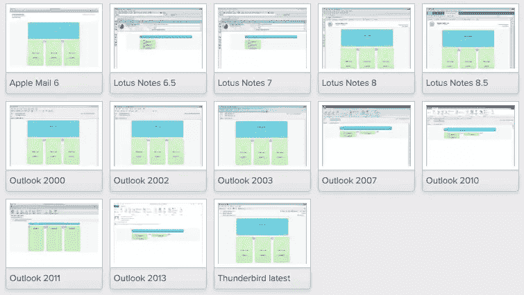
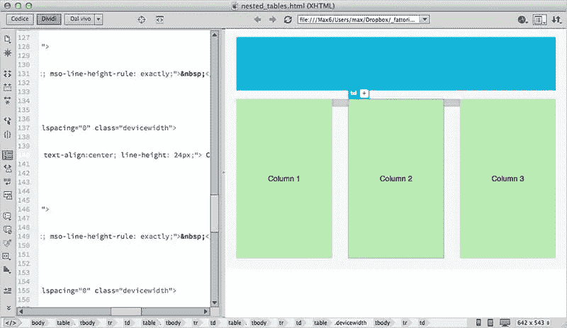
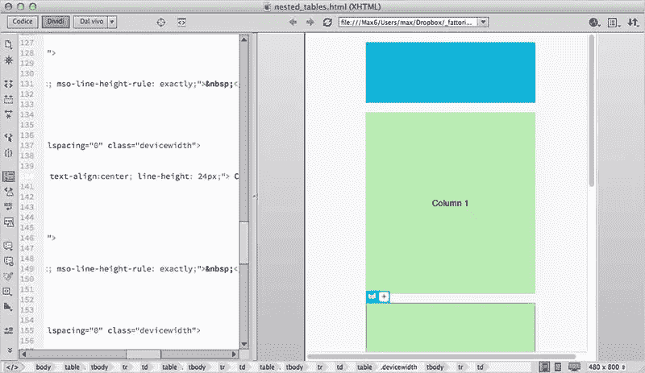
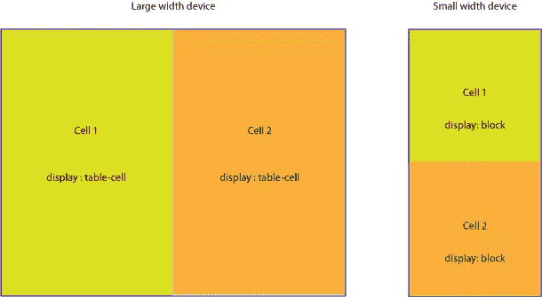
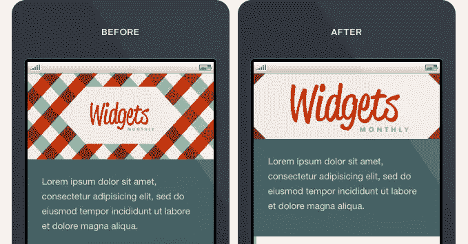
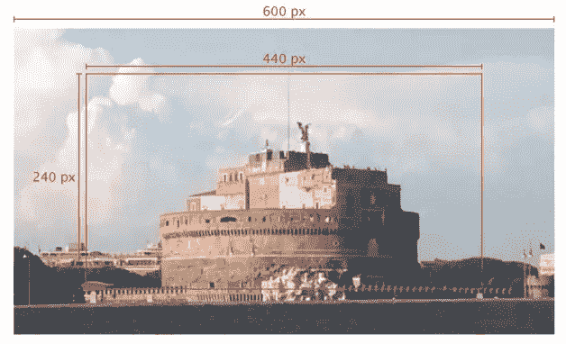

# 构建响应性电子邮件的一系列技巧

> 原文：<https://www.sitepoint.com/tricks-building-responsive-email/>

[](https://www.flickr.com/photos/fishbulb1022/4268407490/)

照片:fishbulb1022

在我之前的一篇关于时事通讯创作的文章中，我们已经看到了一些小技巧是如何让你的邮件在不同的客户端上有很大的不同。

此外，我们必须考虑移动设备，其在电子邮件消费中的使用每天都在增长。这就把我们带到了为电子邮件构建响应性布局的问题上。

因为我们知道电子邮件模板是用 HTML 表格构建的，并且有内嵌的 CSS，所以我们的工作比平常要复杂一些:

*   内联 CSS 规则具有很高的[特异性](https://developer.mozilla.org/en-US/docs/Web/CSS/Specificity)值(它们总是赢得一场角力)。
*   表格不是为布局设计的，所以我们在撰写电子邮件时必须小心，要记住在移动设备中，自然水平放置的单元格应该垂直排列。
*   当然，我们不能使用 JavaScript。

幸运的是，大多数移动设备都与现代 CSS 规则高度兼容，因此我们能够使用**媒体查询**，大量使用`!important`声明(覆盖内联样式)，并仔细注意内容的排列方式，轻松解决所有这些问题。

此类项目的*移动优先*方法非常重要，可以避免无法在小型设备中正确布置的布局。

考虑一下，即使在本文中，我们将只解决响应问题，有响应的移动电子邮件也不一定是好邮件。有效的移动电子邮件设计涉及许多元素，包括字体大小、布局构成等等:这些都是非常重要的任务，我们将在另一篇文章中讨论它们。

## 电子邮件布局模式

关于回复，我们可以区分两种类型的邮件:**单栏**和**多栏**邮件。

### 单列布局

单列布局(通常只有一个标题图像)没有特别的需求。因为它们不需要重新排列元素，我们只需要注意所有的宽度都适度降低以匹配设备大小。与其说是*响应式设计*，不如说这是**可扩展设计**的一个经典例子(参见[可扩展、流动或响应:理解移动电子邮件方法](https://litmus.com/blog/defining-and-understanding-mobile-email-approaches))。



单列布局

要确保您的电子邮件大小调整正确，您只需调整表格宽度:

```
<table cellspacing="0" cellpadding="0" border="0" width="600">
	<!-- email content -->
</table>
```

```
@media screen and (max-width:480px) {
	table {
		width: 100%!important;
	}
}
```

你还需要调整图像的大小(参见本文末尾的**关于图像**的段落)以及调整你的`font-size`，但是没有任何其他特殊的需求。

### 多栏布局

多列布局要求随着设备宽度的减小而重新排列列。不管你是使用两列、三列还是更多列，都没有区别:**你需要垂直显示它们，而不是水平显示**。



有两种简单的方法可以实现这一点:

1.  使用嵌套表格
2.  更改表格单元格`display`属性。

#### 嵌套表格布局

电子邮件撰写通常需要使用嵌套表格。这一直被认为是确保客户端兼容性的最佳方式，但另一方面，产生的代码非常脏，几乎难以辨认。

诀窍是使用 table `align="left"`属性，使表格水平对齐。

每个元素必须有一个特定的宽度，它们的总和必须和它们的容器有相同的值。



当设备宽度减小时，我们必须调整容器的大小，并强制所有的表格-列为 100%宽度。

```
table[class="body_table"] {
	width: 600px;
}

table[class="column_table"] {
	width: 180px;
}

table[class="spacer_table"] {
	width: 30px;
	height:30px;
}

@media only screen and (max-width: 480px) {
	table[class="body_table"] {
		width: 420px!important;
	}
	table[class="column_table"] {
		width: 100%!important;
	}
}
```

这种技术确保了与大多数客户端的兼容性:我已经在 [Litmus](https://litmus.com/) 中测试了演示文件，我对所有客户端都有很好的结果，允许以下警告:

*   **Outlook** 2007、2010、2013(这些版本的 Outlook 使用微软 Word 作为渲染引擎:参见石蕊博客[微软 Outlook 客户端渲染差异指南](https://litmus.com/blog/a-guide-to-rendering-differences-in-microsoft-outlook-clients))；
*   最老版本的**Lotus Notes**；
*   **Gmail 安卓应用**。

这是一个很好的起点(参见下面测试的部分结果)，而且**我们还必须考虑到这个测试是用空表**构建的:添加内容(和更多的嵌套表！！)您应该能够修复所有的错误，并使这种技术在所有客户端上都能正常工作。



用石蕊做的部分相容性试验

我用我使用的代码制作了一个 [codepen](http://codepen.io/massimo-cassandro/pen/AIqis) (注意 CSS 在这个笔中没有内联，所以在用于生产电子邮件之前，您需要运行一个 CSS 内联器)。

### 关于代码编辑器的说明:

虽然我目前使用[结尾](http://panic.com/coda/)或[括号](http://brackets.io/)进行编码，但在这些情况下，我真的很欣赏可视化编辑器，如 [Dreamweaver](https://www.adobe.com/products/dreamweaver.html) 。它使得在嵌套表格中导航和编辑 HTML 和 CSS 变得非常容易。

在下面的截图中，您可以在桌面和电话视图中看到 Dreamweaver 中的电子邮件布局。





#### 更改表格单元格`display`属性

构建多栏电子邮件的第二种方式更优雅，使用原生 CSS 规则。

这种技术包括当设备宽度减小时改变默认的表格单元格属性(你可以在[responsiveemailpatterns.com](http://responsiveemailpatterns.com)找到很多例子)。这导致细胞垂直地重新堆叠:



更改显示方案

```
table[class="body_table"] {
	width: 600px;
}
table td[class="column"] {
    height:100px;
    width:200px;
}

@media only screen and (max-width: 480px) {
	table[class="body_table"] {
		width: 440px!important;
	}

	table td[class="column"] {
        width:100%!important;
        display: block!important;
    }
}
```

该测试的结果非常好:所有客户端都正确地呈现了测试邮件(有时有小错误)，无论如何请记住，我们已经尝试了空邮件，添加内容后结果可能会有所不同。

这里是[码笔](http://codepen.io/massimo-cassandro/pen/dkFla)供你挑选。

## 关于图像

在回复邮件中，图片只需要我们目前在网络上使用的经典回复技术(`img {max-width: 100%;}`)就可以了。

无论如何，正如[活动监控响应电子邮件设计指南](https://www.campaignmonitor.com/guides/mobile/optimizing-images/)所建议的，使用媒体查询，你可以隐藏一个图像，而显示另一个图像作为背景图像。

```
@media only screen and (max-device-width: 480px) {
    img.original_img {
        display: none;
    }
    .substitute_image {
        background-image: url(background_image.png);
        width: 440px !important;
        height: 240px !important
    }   
}
```



请记住，即使是通过 CSS 隐藏的图像也会加载到客户端，所以要小心。

一个好的选择是对`img`标签和`background-image`源使用相同的图像。你必须准备一个*多用途*图像，可以用于所有的观测仪，就像下面的例子:



选择正确的图像，您可以使用它进行许多媒体查询断点。准备好之后，您只需添加一些 CSS 规则:

```
@media only screen and (max-device-width: 480px) {
    img.original_img {
        display: none;
    }
    .substitute_image {
        background-image: url(original_image_source.jpg);
        background-position: center center;
        background-repeat: no-repeat;
      width: 440px !important;
      height: 120px !important
    }   
}
```

您还可以添加一个`background-size`属性来调整每个断点视图(注意[客户端对这个规则](https://www.campaignmonitor.com/css/)的支持)。

不幸的是，这不太可能解决您对高密度设备的所有需求，但它可以减少所有其他情况下加载的文件数量。

## 结论

那么，有没有一种单一的、所向披靡的、最好的技术可以用于响应性电子邮件创作呢？

通常情况下，没有。每个项目都需要不同的方法，都有不同的最佳解决方案。真正的答案是有一些有用的技术可供选择，并且总是尝试新的方法。

## 资源

*   [https://litmus . com/blog/the-how-to-guide-to-responsive-email-design-info graph](https://litmus.com/blog/the-how-to-guide-to-responsive-email-design-infographic)
*   [http://responsiveemailresources.com/](http://responsiveemailresources.com/)
*   [http://responsiveemailpatterns.com/](http://responsiveemailpatterns.com/)
*   [https://www . campaign monitor . com/blog/post/3541/designing-ultra-short-emails-for-mobile-using-progressive-disclosure/](https://www.campaignmonitor.com/blog/post/3541/designing-ultra-short-emails-for-mobile-using-progressive-disclosure/)
*   [https://litmus . com/blog/responsive-scalable-email-design-what-the-difference](https://litmus.com/blog/responsive-scalable-email-design-whats-the-difference)
*   [https://litmus.com/blog/anatomy-mobile-email](https://litmus.com/blog/anatomy-mobile-email)
*   [https://www.campaignmonitor.com/guides/mobile/](https://www.campaignmonitor.com/guides/mobile/)

## 分享这篇文章