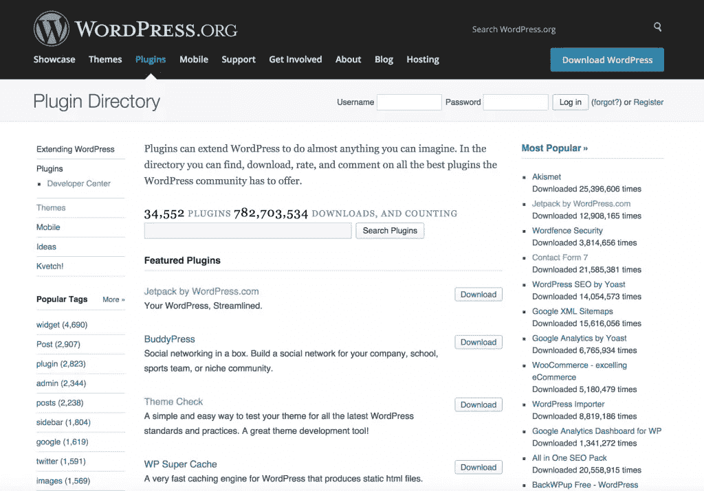

# 为 WordPress.org 插件目录开发

> 原文：<https://www.sitepoint.com/creating-a-base-plugin-for-wordpress-org-plugin-directory/>

官方的 WordPress 插件目录是一个惊人的有用插件集合的家，当 WordPress 用户寻求扩展他们网站的功能时，它通常是第一个看的地方。插件目录为开发者提供了很好的机会，但是你需要遵循一些指导方针。一个基础插件将帮助你轻松快速地开始开发过程。



WordPress.org 官方插件目录

## 基本插件目录和文件

这些是你想要发布到 WordPress 插件目录的每个插件的必要文件和目录。这些文件和目录代表你的**基础插件**。当前插件版本和所有未来版本将被打包到一个目录中，即`plugin-name`。

```
--plugin-name
    --assets
        -screenshot-n.png
        -icon-256x256.png
        -banner-772x250.png
    --trunk
        --admin
            --css
            --js
            --inc
            -admin.php
        --public
            --css
            --js
            --inc
            -public.php
        --inc
            -activation.php
            -deactivation.php
        --languages
            -plugin-name.pot
        -plugin-name.php
        -uninstall.php
        -README.txt
    --tags      
```

现在让我们回顾一下这些目录和文件的用法。我们还将查看需要放入文件中的代码。

## 资产目录

这个目录包含插件的图像，即插件截图，WordPress.org 插件页面的横幅图像和一个图标。

你可以提供任意数量的截图。截图可以是以下任何格式:png，jpg，jpeg 或 gif。截图还必须显示你的插件的最新版本。假设您有五个屏幕截图，那么您的资产目录应该如下所示:

```
--assets
	-screenshot-1.png
	-screenshot-2.png
	-screenshot-3.png
	-screenshot-4.png
	-screenshot-5.png
	-icon-256x256.png
	-banner-772x250.png
```

图标必须为 256×256 像素，横幅必须为 772×250 像素。提供截图、图标或横幅并不是强制性的，然而，推荐提供它们，因为它确实增加了你的插件的参与度。

## 主干和标签目录

Trunk 是您的工作目录。下面是你要写的代码。当你想发布你的插件时，你需要将主干目录中的内容复制到标签目录中的新版本目录中。版本目录代表插件代码的当前版本。

当你完成创建你的新插件时，你会希望用 1.0 版本发布它。那么您的目录将如下所示:

```
--plugin-name
	--assets
		-screenshot-n.png
		-icon-256x256.png
		-banner-772x250.png
	--trunk
		--admin
			--css
			--js
			--inc
			-admin.php
		--public
			--css
			--js
			--inc
			-public.php
		--inc
			-activation.php
			-deactivation.php
		--languages
			-plugin-name.pot
		-plugin-name.php
		-uninstall.php
		-README.txt
	--tags
		--1.0
			--admin
				--css
				--js
				--inc
				-admin.php
			--public
				--css
				--js
				--inc
				-public.php
			--inc
				-activation.php
				-deactivation.php
			--languages
				-plugin-name.pot
			-plugin-name.php
			-uninstall.php
			-README.txt
```

`tags/1.0`目录将包含所有与当前主干目录相同的代码。

现在，如果你想修改 trunk 并发布一个新版本的插件 2.0，那么创建一个新目录`tags/2.0`并将所有最新的代码从 trunk 目录复制到这个新目录。因此，您的主干目录应该总是反映当前的变化。现在，您的目录如下所示:

```
--plugin-name
	--assets
		-screenshot-n.png
		-icon-256x256.png
		-banner-772x250.png
	--trunk
		--admin
			--css
			--js
			--inc
			-admin.php
		--public
			--css
			--js
			--inc
			-public.php
		--inc
			-activation.php
			-deactivation.php
		--languages
			-plugin-name.pot
		-plugin-name.php
		-uninstall.php
		-README.txt
	--tags
		--1.0
			--admin
				--css
				--js
				--inc
				-admin.php
			--public
				--css
				--js
				--inc
				-public.php
			--inc
				-activation.php
				-deactivation.php
			--languages
				-plugin-name.pot
			-plugin-name.php
			-uninstall.php
			-README.txt
		--2.0
			--admin
				--css
				--js
				--inc
				-admin.php
			--public
				--css
				--js
				--inc
				-public.php
			--inc
				-activation.php
				-deactivation.php
			--languages
				-plugin-name.pot
			-plugin-name.php
			-uninstall.php
			-README.txt
```

用户下载版本目录中的内容，而不是主干目录。

## README.txt File

README.txt 文件是 WordPress.org 插件目录中显示的插件信息的主要来源。它应该存在，应该清楚地解释如何使用插件和插件做什么，即使你认为这是显而易见的。

一个 README.txt 文件存在于主干目录和 tags 目录的版本目录中。

这是我们基本插件的 README.txt 文件的样本内容。该文件被写入 [markdown](http://en.wikipedia.org/wiki/Markdown) 中。

```
=== Plugin Name ===
Contributors: (this should be a comma separated list of wordpress.org userid's of this plugin developers)
Donate link: http://example.com/
Tags: tag1, tag2, tag3
Requires at least: 3.0.1
Tested up to: 3.4
Stable tag: 2.0
License: GPLv2 or later
License URI: http://www.gnu.org/licenses/gpl-2.0.html

Here is a short description of the plugin.  This should be no more than 150 characters.  No markup here.

== Description ==

This is the long description.  No limit, and you can use Markdown (as well as in the following sections).

== Installation ==

This section describes how to install the plugin and get it working.

== Frequently Asked Questions ==

= This is question 1 =

This is answer to question 1

= This is question 2 =

This is answer to question 2

== Screenshots ==

1\. This is description for our first screenshot i.e., screenshot-1.png.
2\. This is description for our second screenshot i.e., screenshot-2.png.
3\. This is description for our third screenshot i.e., screenshot-3.png.
4\. This is description for our fourth screenshot i.e., screenshot-4.png.
5\. This is description for our fifth screenshot i.e., screenshot-5.png.

== Changelog ==

= 3.0 =
* A change since the previous version.
* Another change.

= 2.0 =
* A change since the previous version.
* Another change.

== Upgrade Notice ==

= 3.0 =

Upgrade notices describe the reason a user should upgrade.  No more than 300 characters.

= 2.0 =

This version fixes a security related bug. Upgrade immediately.
```

README.txt 文件中的大多数内容都是不言自明的。

你需要明白的一件事是`Stable tag:`。主干目录的 README.txt 文件的稳定标签应该指向最新版本目录的名称。这就是 WordPress 插件目录如何知道最新最稳定的插件版本。当你创建一个新版本的插件时，你需要将主干目录的 README.txt 文件的 Stable 标签值改为新版本目录。标记版本目录中 README.txt 文件的稳定标记应该指向该特定版本目录的名称。

版本目录中的 README.txt 文件代表每个版本，主干目录中的 README.txt 代表最新版本发布，因此与当前发布版本目录中的 README.txt 文件相同。

## 插件名称. pot 文件

不是每个使用 WordPress 的人都会说英语。因此你不想阻止非英语用户使用你的插件。你可以通过将你的插件显示的字符串翻译成不同的语言来避免这种情况。让你的插件兼容多种语言的过程被称为国际化(i18n)。一个. pot 文件包含插件字符串的替代语言版本。为你的插件生成一个. pot 文件叫做[本地化](https://developer.wordpress.org/plugins/internationalization/localization/) (L10n)。在 SitePoint，我们已经介绍了 WordPress 中的 [i18n](https://www.sitepoint.com/wordpress-i18n-make-your-plugin-translation-ready/) 和 [L10n](https://www.sitepoint.com/wordpress-l10n-translate-your-plugin/) ，如果你感兴趣的话，这绝对值得一试。

此语言文件(。pot)不是自动加载的，需要使用`load_plugin_textdomain`功能加载。要做到这一点，把这段代码放在你的插件的主文件中，比如 plugin-name.php 文件。

```
load_plugin_textdomain("plugin-name", false, basename(dirname(_FILE_)), "/languages");
```

### 激活和停用文件

`inc/activation.php`和`inc/deactivation.php`文件包含分别在插件被激活或停用时执行的代码。

现在我们只需要分别在插件激活和停用期间加载`inc/activation.php`和`inc/deactivation.php`文件。我们可以通过将下面的代码放在`plugin-name.php`文件中来实现。

```
function plugin_activated()
{
	require_once "inc/activation.php";
}

function plugin_deactivated()
{
	require_once "inc/deactivation.php";
}

register_activation_hook(__FILE__, "plugin_activated");
register_deactivation_hook(__FILE__, "plugin_deactivated");
```

你可以在这里了解更多关于[激活和去激活钩子的信息。](http://qnimate.com/wordpress-plugin-activation-deactivation-and-uninstall-hooks/)

### uninstall.php

当用户删除一个插件时，这个文件被执行。将此内容放入 uninstall.php 文件中

```
//this check makes sure that this file is not called manually.
if (!defined("WP_UNINSTALL_PLUGIN")) 
	exit();

//put plugin uninstall code here
```

## 管理和公共目录

在`admin/admin.php`里面是你应该放置管理面板**和插件的仪表板特定功能**的地方。然后，在`public/public.php`里面，是你应该放置插件的**公共功能**的地方。

## 发布您的插件

你的整个插件实际上是 WordPress.org 插件目录云上的一个 SVN 库。一旦你[提交你的插件](https://wordpress.org/plugins/add/)并获得批准，你将在云上拥有一个 SVN 存储库，你可以对其进行修改或添加新版本。

要对远程存储库进行更改或添加版本，您需要使用 SVN 创建存储库的本地副本。然后，对本地副本进行更改，然后使用 SVN 将它提交给远程存储库。

## 进一步阅读

你可以参考 WordPress.org 插件目录的 [FAQ](https://wordpress.org/plugins/about/faq/) 了解你的常见问题。您可以使用 [README.txt 验证器](https://wordpress.org/plugins/about/validator/)来验证您的 README.txt 文件。您也可以使用 GenerateWP 上的[插件自述文件生成器](http://generatewp.com/plugin-readme/)生成一个 README.txt 文件。

## 分享这篇文章