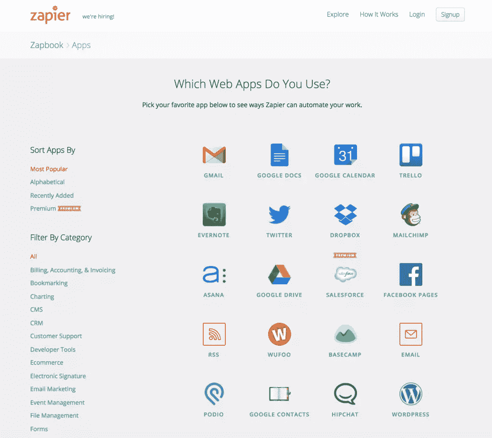
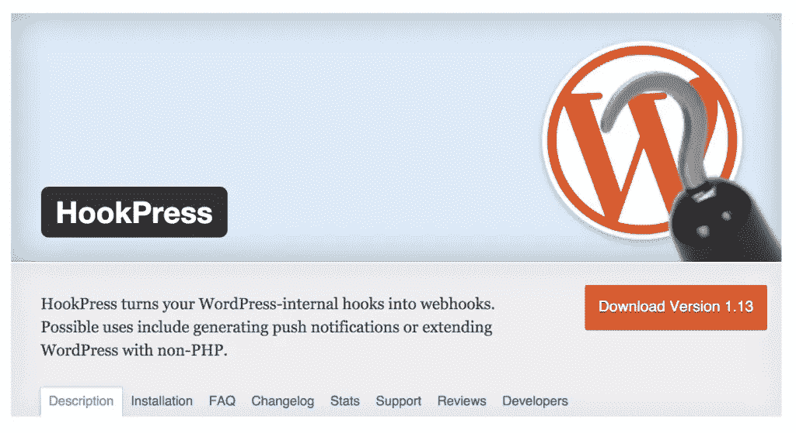

# 用 Zapier 自动化 WordPress

> 原文：<https://www.sitepoint.com/automate-wordpress-with-zapier/>

管理一个 WordPress 网站可能是一个耗时的过程，即使是最有经验的用户也是如此，这主要是因为一些小任务会随着时间的推移而增加。无论你是试图在社交媒体网站上分享你的帖子，备份你的内容还是创建新的内容，所有这些任务都会占据你时间表的很大一部分。幸运的是，现在你可以通过使用 [Zapier](https://zapier.com) 来简化你的工作流程，从而自动化大多数平凡的 WordPress 任务。

## 扎皮尔的基本知识

类似于我们之前讨论过的 IFTTT，Zapier 也允许你创建宏(称为‘Zaps’)。这两个工具之间最大的区别是，Zapier 更专注于商业(价格和功能方面)，而 IFTTT 更多的是消费者产品。

Zapier 最引人注目的方面是其定价结构。Zapier 提供从免费到每月 125 美元的多种计划。这些计划的不同之处不仅仅在于你可以创建的 zap 数量，还在于每个月可以运行的任务数量。例如，你可能有一个 Zap 分享一篇博客文章到脸书，另一个 Zap 分享到 Twitter。现在，当你发布一些东西的时候，你会用掉两个任务来完成你的配额。再次发布，另外两个任务将添加到您的总任务中。

除此之外，Zapier 还支持 300 多种应用程序，对任何专业人士来说都是一个有价值的工具。虽然您的确切需求会因项目而异，但了解这种定价方法很重要，这样您就可以确保自己有合适的预算。

### 创建自定义的 WordPress 广告

由于对 [HookPress 插件](https://wordpress.org/plugins/hookpress/)的支持，Zapier 能够提供比其他自动化工具稍多的功能。创建 Zap 相当简单。在 Zapier 仪表板中，选择一个触发器和一个要执行的操作。

虽然 Zapier 有预定义的触发器，如添加新的评论或帖子，但你可以基于任何 Webhook 创建任何内容。就动作而言，Zapier 只允许您基于正在执行的任务创建帖子。

## Zaps 让你开始

下面是使用 Zapier 可以简化的任务的一个小例子。请记住，这个列表并不全面，甚至非开发人员也可以在需要时轻松创建 Zaps。

**通过 Gravity Forms 创建帖子**:有时会出现这样的情况，你希望有外部贡献者，但是给这些人提供 WordPress 证书是不切实际的。通过使用流行的[重力形式](http://www.gravityforms.com/)插件，你可以创建一个简单的形式，并用于后期创建([见 zap](https://zapier.com/zapbook/gravity-forms/wordpress/20349/gravity-forms-new-form-submission-to-wordpress-create-post/) )。

通过 Eventbrite 创建帖子:由于活动策划本身就很紧张，Zapier 允许你从 Eventbrite 活动中自动生成 WordPress 帖子，这样你就可以将数据输入错误的风险降到最低([参见 zap](https://zapier.com/zapbook/eventbrite/wordpress/19652/eventbrite-new-event-to-wordpress-create-post/) )。

从 WordPress 帖子中生成一张 Trello 卡:让每个人都保持一致对于任何团队的成功都是至关重要的。现在你可以从 WordPress 的帖子中生成 Trello 卡片，这样员工就可以在发布前后就内容进行合作了([见 zap](https://zapier.com/zapbook/wordpress/trello/3234/create-trello-card-from-wordpress-post/) )。

WordPress 帖子的短信提醒:有时你会想要一个帖子上线时的实时提醒。虽然电子邮件提醒通常就足够了，但对许多人来说，短信也是接收提醒的一种选择。通过使用 Twilio，您可以轻松地将这种能力集成到您的站点中([参见 zap](https://zapier.com/zapbook/wordpress/twilio/3308/sms-for-wordpress-posts/) )。

**通过 Yammer 分享帖子**:如果你曾经有一个客户使用 WordPress 分享关于他们公司的更新，使用 Zapier 分享帖子到 Yammer 是一个简单的方法，可以确保员工获得关键信息([见 zap](https://zapier.com/zapbook/wordpress/yammer/859/post-new-wordpress-posts-yammer/) )。

## 处理价格问题

因为 Zapier 是根据执行的任务来计费的，所以利用这个工具的最好方法是只把它用于其他插件不能完成的任务。例如，如果你想在脸书、Twitter、LinkedIn 和其他社交网络上分享你的帖子，那么你最好使用不同的插件。

另一方面，如果您试图将联系人表单条目与您的 CRM 系统同步，或者如果您希望允许客人通过外部表单提交帖子，Zapier 是一个更好的选择。通过将您的 Zapier 订阅集中在必要的复杂任务而不是平凡的工作上，您可以最大限度地降低您的成本，同时仍然获得自动化的好处。

## 分享这篇文章