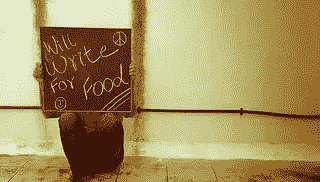

# 为什么你的 UX 团队里没有一个作家？

> 原文：<https://www.sitepoint.com/writers-in-ux/>

信用:[HowToStartABlogOnline.net](http://howtostartablogonline.net/content-writer-photo)

本周在墨尔本举行的 UX 澳大利亚 Redux 会议上，我对作家的匮乏感到震惊。

在 UX 职业介绍会开始时表明身份的人中，有设计师、商业分析师、UX 从业者、项目经理、开发人员……但 UX 的作家寥寥无几。

公平地说，这是雇主第一次认为派我去参加会议是有价值的，我已经做了 15 年的数字作家。也许作家传统上比其他学科的人更缺乏自我组织能力(现在有很多内容相关的会议，但更早？没那么多)。或者也许写作不像其他学科那样受重视。

但是，嘿，现在是 2014 年。作家在 UX 哪里工作？

## 什么是“写作”？

如果你问，“UX 为什么需要一个作家？“你不是一个人。说有很多代理公司和创业公司不需要作家的任何帮助就能生产产品是一种保守的说法；以我的经验来看，大多数小型产品公司都不会在 UX 上找作家帮忙。一点也不。

我们倾向于把网络写作看作是在页面上创建文本块，或者是为了更好地适应新的设计(例如，为了适应一个响应界面)而改变文本块的用途。作家写电子邮件、呼吁行动、电子书、帖子和文章。但是他们不写产品。

我们谈论“为内容而设计”，谈论“内容容器”，谈论重组、全渠道内容，谈论与设备无关的内容。

但是关于使用作家来提高你的产品的讨论在哪里呢，UX？

让我们现在开始吧。这里有五件事是一个伟大的作家比在座的任何人都知道的。

## 作家理解故事

照片:一张照片

任何作家，从为你的新搅拌机写说明书的人，到为下一个布克奖获得者写作的人，都是讲故事的人。他们就是这么做的:构建逻辑叙事。你会把这种建构的产物视为一篇博文或一本书，但作家必须先建构一个概念性的叙事，然后才能写作。

所以，如果你认为作家是在用文字说话，那你就错了。作家处理逻辑，解释和联系概念，创造自然的流动。听起来熟悉吗？

优秀的作家理解紧张(或痛点)和解决(例如，通过特写)之类的事情，并且擅长在故事中创造故事。他们也非常善于发现情节漏洞和连续性问题——让作者看看你的页面流或线框，看看它们是否没有增加一些价值。

## 作家理解意义

文字是写作的通用语言，因此作家往往会使用大量的文字。当你为一个完美的标签名称而困惑时，作家可以提出几个选项，并解释每个选项的细微差别。因为他们非常擅长叙事，他们将能够同时处理多种含义，在一个界面中查看所有标签，以及他们如何一起工作(以及单独工作)来传达含义。

毫不奇怪，一个好的作家将能够处理像图像这样的东西，以及它的重量和位置，字体和过渡。他们将能够以某种方式整合界面文本的片段，而不仅仅是他们所使用的词语的特定含义。

## 作家理解移情

照片:Kalexanderson

会议上的两个讲座集中在移情上。第一个由 Huddle 的 Simon Lawry 和 Zaana Howard 提出，是关于思维方式，以及设计师和客户的思维方式如何影响项目的 UX 结果。

第二个是由口渴工作室的 Ben Rowe 和 Ben Tollady 写的，集中于创造用户愉悦，并多次提到界面文本在实现这一目标中的重要性。

想想 Gmail 应用程序令人愉快的“全部完成”信息，当你到达零收件箱时就会显示出来。这是一件小事，但正如我们所知，这些小事会带来很大的不同。这也是处理黑屏的一种流畅方式。

作家无时无刻不在处理情感问题。甚至搅拌机手册的作者也在努力避免让你沮丧或屈尊俯就，让事情看起来可行，这样你就会对你购买的产品产生一种亲切感。

每一篇专业的文章都旨在交流，而要做到这一点，作者需要处理情感。他们擅长与目标受众——他们话语的使用者——产生共鸣，无论是基于一个单词还是一千个单词。

所以，如果你想让你的界面产生“共鸣”，让你的交互变得“直观”，作家可以帮你做到。下次你做移情图的时候，找个作家在房间里，看看会发生什么。

## 作家理解人物塑造

我上面提到过，作家和故事一起工作，每个故事都有人物。在你的产品中，一些角色将是你设计的用户角色。另一个是品牌和它的价值观，你可以在有形的产品中反映出来。

一个作家将擅长理解这些角色，并使他们变得有血有肉(顺便说一句，许多作家对人有天生的兴趣，所以他们会喜欢做像用户研究这样的事情)。然后他们会把这些角色带回家，找出他们的细微差别。

因为他们了解同理心，他们会帮助你发展细微差别，使品牌角色与你的人物角色产生最深刻的“共鸣”。

## 作家理解交流

照片:弗洛里安·塞鲁西

有一种倾向认为作家了解写作。我在这里告诉你，这是一个误解。

好的作家是沟通者。它们不仅仅是把单词串成句子。它们是关于寻找表达事物的最佳方式——甚至是像“你要找的页面不在这里”这样平凡的事情。

作家与文字打交道——他们与写作有关——但是一个好的作家知道什么时候适可而止。什么时候剪切，什么时候停止，什么时候让视觉效果来承担重任。

## 那么，为什么你的 UX 团队中没有一个作家呢？

我已经在 UX 团队中工作过几次，在每个角色中，如果他们没有雇佣一名编剧，我带给团队的技能就不会存在。设计师们可能会用错别字和时态问题来混淆语言，让语言变得正确，但从未真正触及基调，或者在设计本身允许的多少字符的空间里说出需要说的话。

他们会重复通过视觉足够清晰地表达的内容，而错过通过文本增加价值而不是重复的机会。

产品越有针对性和针对性，这一点就越真实。你的 UX 团队需要作家——至少，我认为它需要。你有吗？请在评论中告诉我们(如果你不知道，请告诉我们你是否认为某个作家能帮上忙)。

## 分享这篇文章