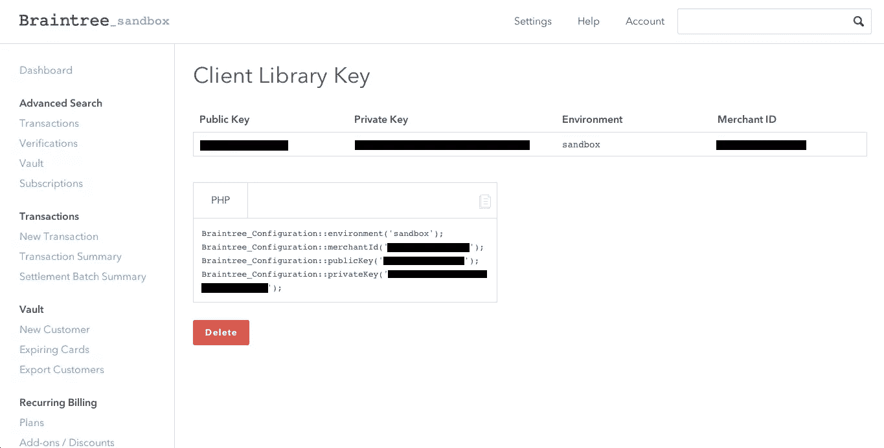
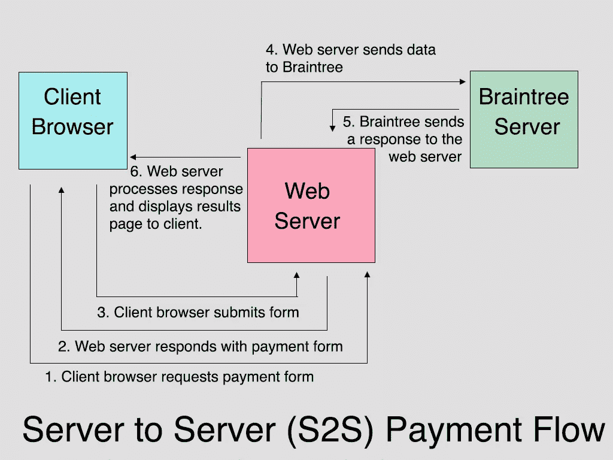
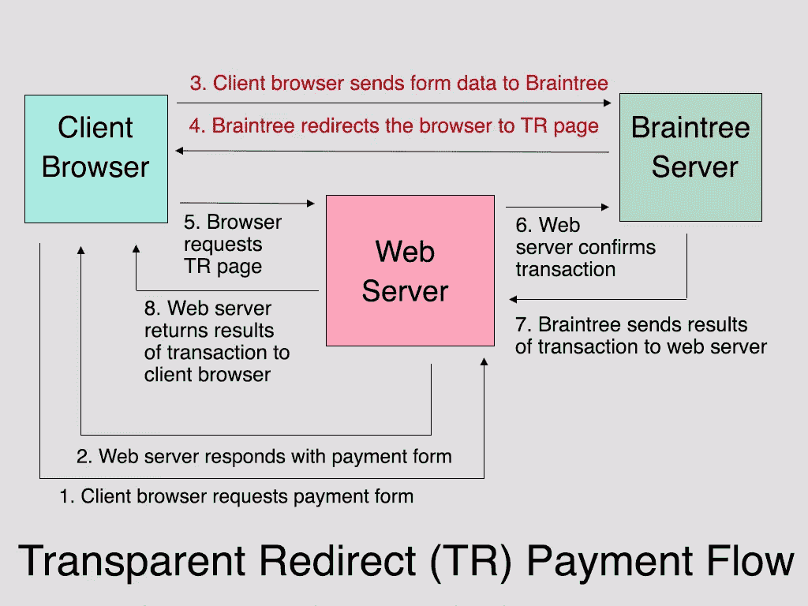
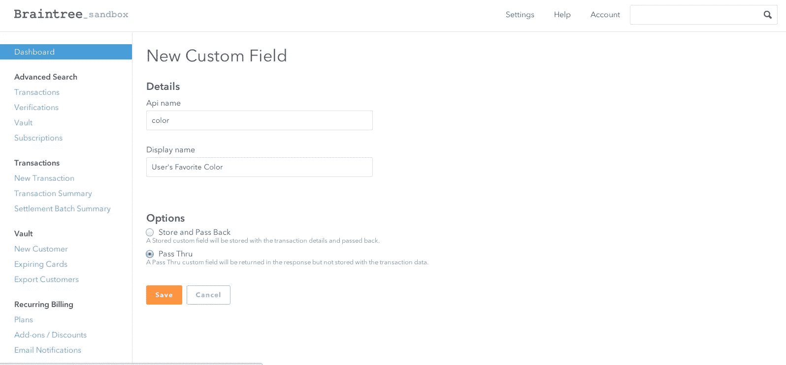

# 使用 Braintree 的透明重定向

> 原文：<https://www.sitepoint.com/transparent-redirects-braintree/>

仅仅提到“PCI 合规性”通常会引起接受在线信用卡支付的企业主困惑的表情和出汗的手掌。但这到底意味着什么呢？

这是一个复杂的话题，但简而言之，主要的信用卡公司在 2006 年成立了一个名为[支付卡行业安全标准委员会](https://www.pcisecuritystandards.org) (PCI SSC)的委员会，以便创建一套规则来标准化商户在处理和存储敏感信用卡信息时应遵循的安全政策和程序(PCI DSS)。为了确定您的系统是否符合要求，您通常会从八个选项中选择适当的[自我评估问卷(SAQ)](https://www.pcisecuritystandards.org/security_standards/documents.php?category=saqs) ，然后回答一系列问题以确定您是否确实符合要求。大公司经常雇佣一个合格的安全评估员(QSA)来帮助他们填写 SAQ D(最复杂的 SAQS)，这可能要花费几十万美元。更糟糕的是:如果您的系统遭到破坏，并且确定它们在被破坏时不符合要求，您可能需要为每次事件支付高达 50 万美元的罚款。

那么，小企业主应该做些什么呢？这就是[布伦特里支付解决方案](http://www.braintreepayments.com)的用武之地。他们提供了两种解决方案来最大限度地减轻您的 PCI 合规性负担:透明重定向和 Braintree.js。我应该提到的是，Braintree 和任何其他 PCI DSS 合规性服务提供商都不能告诉您要填写哪个 SAQ，或者您的系统是否合规。但是他们已经与行业领先的 QSA[Security Metrics](https://www.securitymetrics.com/)合作，提供免费的解决方案来帮助他们所有的客户实现和维护 PCI 合规性。根据他们的经验，使用透明重定向或 Braintree.js 的客户通常能够填写 SAQ A，这比 SAQ D 要简单得多(因此成本也高)，你可以在这里阅读更多。

但是足够的背景；让我们写一些代码。

## 入门指南

本文将重点介绍透明重定向方法。我们要做的第一件事是前往 Braintree 获取我们的服务器端 API 密钥。对于那些没有生产帐户的人，将你的浏览器指向 [Braintree 沙盒](https://sandbox.braintreegateway.com/)并注册一个测试帐户。登录，点击“账户- > API 密匙”然后，单击“生成新的”按钮，最后单击新生成的 API 密钥的私钥列下的“查看”。您将进入以下屏幕，其中包含配置 Braintree 客户端库所需的所有信息。



您可以看到它甚至有一个工具可以为您生成各种语言的配置代码。

现在是时候安装实际的 Braintree PHP 客户端库了。我们可以通过运行以下命令使用 [Composer](http://www.getcomposer.org) 来实现这一点:

```
composer require braintree/braintree:*
```

## 透明重定向

帮助决定你是否必须填写 SAQ D 或 SAQ A 的一个主要因素是信用卡数据是否通过你的系统传输。在典型的服务器到服务器(S2S)模式的开始，你的网络服务器会向客户的浏览器发送一个支付表单。填写完表单后，客户可以按 submit，这将把数据发送回您的 web 服务器，而 web 服务器又会将一些数据转发到 Braintree 进行验证和处理。看起来大概是这样的:



然而，使用透明重定向，表单动作被设置为表单将把**直接发送到 Braintree 的服务器**，并且响应被发送回客户端浏览器。然后使用 HTTP 303 重定向将浏览器重定向到 web 服务器上的脚本。最后，web 服务器脚本用 Braintree 确认事务，并将结果呈现给客户端浏览器。所以这个模型看起来更像这样:



现在我们已经有了理论，让我们继续写一些代码。那些想看完整版本的人可以在 Github 上找到。

我们要做的第一件事是创建一个非常基本的 HTML 表单，以便我们可以输入一些数据发送到 Braintree 进行处理。我将尽可能简单地说明这一点，以便我们可以专注于功能。

```
<!doctype html>
	<html lang="en">
		<body>
		    <div id="wrap">
		        <form method="post" action="" autocomplete="off">
		            <label>Name on Card: <input type="text" name="transaction[credit_card][cardholder_name]"></label>
					<label>Card Number: <input type="text" name="transaction[credit_card][number]"></label>
					<label>CVV: <input type="text" name="transaction[credit_card][cvv]" class="short"></label>
					<label>Expiration Date (MM/YYYY): <input type="text" name="transaction[credit_card][expiration_date]" class="short"></label>
					<input type="submit" value="submit payment">
			    </form>
		    </div>
		</body>
	</html>
```

这里没什么复杂的。您唯一会注意到的是输入字段名称是数组格式的。您可以在这里看到有效字段名[的完整列表。我要指出的另一件事是，如果你使用的框架在使用数组作为输入名称时有问题(我正在看着你，Zend Framework！)，那么您可以使用替代的双下划线语法。因此，您输入的截止日期将如下所示:](https://www.braintreepayments.com/docs/php/transactions/tr_fields)

```
<input type="text" name="transaction__credit_card__expiration_date">
```

您可能注意到的另一件事是，我在表单中添加了一个“autocomplete”属性，并将其值设置为 off。布伦特里建议这样做，我希望这样做的原因是显而易见的…

为了在表单上利用透明重定向的魔力，我们还需要做一些其他的事情。但在此之前，我们需要配置我们的脚本，以便与 Braintree 的 API 一起工作。

在我告诉你怎么做之前，我想提一下，为了清楚起见，我已经把所有的 PHP 和 HTML 放在我的示例代码的同一个文件中。我希望不用说，在生产项目中，设置代码将放在我的项目的引导文件中，而表单处理代码将放在控制器动作或其他单独的文件中。好了，道歉到此为止——让我们把事情安排好吧！

```
<?php 
		require('vendor/autoload.php');

		Braintree_Configuration::environment('sandbox');
	    Braintree_Configuration::merchantId('YOUR_MERCHANT_ID');
	    Braintree_Configuration::publicKey('YOUR_PUBLIC_KEY');
		Braintree_Configuration::privateKey('YOUR_PRIVATE_KEY');

	?>
```

第一行简单地允许我们利用 Composer 的自动加载器并使用 Braintree 的库，而不需要显式地包含任何附加文件。希望接下来的四行看起来很熟悉，因为它们是从我在上一节向您介绍的沙盒控制面板 API Key 工具中逐字复制的。显然，您将使用您自己的控制面板帐户中的代码来替换它。

我想做的下一件事是设置表单动作，以便我们的客户将他们的敏感数据直接发送到 Braintree，这是使用 TR 的全部目的。幸运的是，Braintree 库通过提供一个助手对象/方法使这变得非常容易。所以只需修改表单代码，如下所示:

```
<form ... action="<?= Braintree_TransparentRedirect::url()?>">
```

我们要做的另一件事是创建一个隐藏的输入，它包含一个 URL 的散列表示，您希望 Braintree 在客户提交表单后将他们重定向到该 URL，以及您不希望他们能够指定的任何信息。例如，您可以在这里输入交易金额。就风格而言，我喜欢将返回 URL 设置为支付表单本身，这样我可以向用户显示任何错误，并给他们重新提交的机会。这就是它看起来的样子:

```
$tr_data = Braintree_TransparentRedirect::transactionData([
        'transaction' => [
            'type' => Braintree_Transaction::SALE,
            'amount' => '100.00'
        ],
        'redirectUrl' => 'https://YOUR-DOMAIN.COM/transparent-redirect-form-basic.php'
    ]);
```

显然，我在这里对金额进行了硬编码，但在生产应用程序中，您可以使用一些服务器端逻辑来生成金额，或者在捐款表单中包含未指定的总额的情况下，您可以创建一个表单字段并允许用户提供一个。我通常也会将“提交结算”选项设置为 true。否则这个交易将简单地

现在我只需要将它作为隐藏字段添加到我的表单中，如下所示:

```
<input type="hidden" name="tr_data" value="<?=$tr_data?>">
```

现在我们已经准备好将数据提交给 Braintree，我们需要添加一些代码来处理实际的透明重定向响应。

```
$status = '';
	if(isset($_GET['http_status']) && $_GET['http_status'] == '200') {
		try {
            $result = Braintree_TransparentRedirect::confirm($_SERVER['QUERY_STRING']);
            if ($result->success) {
                $status = 'Your transaction was processed successfully.';
            } else {
                $status = $result->message;
            }
        } catch (Braintree_Exception_NotFound $e) {
            $status = 'Due to security reasons, the reload button has been disabled on this page.';
        }
	}
```

现在让我们来看看我们刚刚做了什么。当用户按下“提交”按钮时，表单直接发布到 Braintree，所有客户的敏感信息都安全地存储在他们的 PCI CSS 兼容服务器上。然后，一个 HTTP 303 重定向被发送到浏览器，浏览器将用户发送到您在生成`$tr_data`变量时指定的 URL，并将几个参数附加到 URL 的查询字符串。

当数据成功提交时，其中一个参数将是`http_status`，如果 Braintree 的服务器运行一切顺利，它将被设置为`200`。很明显，在生产中，你可能也想处理非 200 响应代码，但是现在我们只是确保，如果我们已经成功地向他们的系统提交了我们的支付信息，就只执行这个`if`语句中的代码。

接下来发生的事情是，我们必须从透明重定向中获取查询字符串，并将其**发送回**brain tree 以完成事务。因此，我们运行另一个库函数(`Braintree_TransparentRedirect::confirm`)并向它提供我们的 URL 查询字符串，以便告诉 Braintree 继续处理我们的支付。一旦发生这种情况，Braintree 会将我们的脚本发送回一个结果对象。在内部，该对象可以是一个`Braintree_Result_Error`或`Braintree_Result_Successful`，但是两个对象都有一个布尔`success`属性，因此您可以看到事务是否成功。

您可能还注意到，我将整个确认包装在一个 try/catch 块中。使用同一个页面显示表单和处理结果的一个缺点是**您只能确认一个 TR 查询字符串一次。**这意味着如果有人在一次失败的交易后点击 reload 按钮，你的代码将试图重新确认一个过期的查询字符串，而 Braintree 将抛出一个异常。

现在我们已经拥有了我们需要的一切，我们可以继续运行一些测试事务。关于使用沙盒的完整文档可以在[这里](https://www.braintreepayments.com/docs/php/reference/sandbox)找到，但是如果你真的很兴奋，想马上成功交易，就在“卡上的名字”中输入你的名字，`4111111111111111` (4 后面跟着 15 个 1)作为“卡号”，在 CVV 框中输入 123，以及未来的任何一天作为到期日。如果一切顺利，你应该可以回到沙盒，点击“高级搜索”下的“交易”，点击“搜索”按钮后，看到你的第一次成功交易。

## 越来越花哨

透明重定向是帮助最小化您的 PCI 遵从负担的一种很好的方式，但是它确实有一些您需要习惯的怪癖。首先，如果你想在你的支付表单中包含任何与 Braintree 的交易、客户或信用卡对象不对应的数据，那么你必须使用他们的“自定义字段”功能。假设我想捕捉用户最喜欢的颜色。我要做的第一件事是走向控制面板，点击“设置->处理”向下滚动到“自定义字段”部分，然后单击“新建”您会发现自己出现在以下屏幕上:



Api 名称是您将在表单输入的 name 属性中引用的名称。显示名称供您参考，您可以指定是否要将您的自定义字段的值与您的事务一起存储在 Braintree 上，或者只是将其传递回您的服务器。

收集它只需将下面的字段添加到表单中。

```
<label>Customer Favorite Color: <input type="text" name="transaction[custom_fields][color]"></label>
```

如果您试图在没有在 Braintree 控制面板中添加自定义字段的情况下这样做，您将会触发一个验证错误。

说到验证，TR 会使支付表单的服务器端验证变得复杂。比方说，我想要我的客户的电子邮件地址。直到交易被确认后，我才知道用户将它留空了。我发现的解决方案是在我的 TR 脚本的`success`块中运行我的验证，然后如果我的验证没有通过，就使事务无效。这将改变我们的代码，就像这样:

```
if ($result->success) {
		// transaction was successful, but email is missing
	    if ($result->transaction->customer['email'] == '') {
	        Braintree_Transaction::void($result->transaction->id);
            $status = 'Email address is a required field';
		} else {
	        $status = 'Your transaction was processed succesfully.';
        }
	}
```

如您所见，如果我的本地验证没有通过，我将使用客户端库来使事务无效，使用来自我的`Braintree_Result_Success`对象的事务 id。

最后，在我们的基本示例中，我没有费心为用户重新填充表单字段，因为我们所有的字段都包含敏感的信用卡数据，Braintree 对我们的服务器隐藏了这些数据。但是现在我们已经添加了一些客户数据，我可以用来自 Braintree 结果对象的数据预先填充那些不太敏感的字段。您可以在我的 [Github 示例](https://github.com/mjbeaumont/sitepoint-braintree-tr-demonstration)中看到完整的代码，但是要理解发生了什么，需要知道`Braintree_Result_Success`对象将用户提交的表单数据存储在它的`transaction`属性中，而`Braintree_Result_Error`将它存储在`params`属性中。例如，当事务成功时，第一个名字变量会在`$result->transaction->customer['firstName']`中找到，而失败的事务会将它存储在`$result->params['transaction']['customer']['firstName']`中。

## 包扎

Braintree 的透明重定向是最大限度地减少您的应用程序暴露于敏感客户数据的一种方式，从而减少您的 PCI 合规性负担，并且他们的 PHP 客户端库极大地简化了集成过程，但它确实增加了收集和验证与客户信用卡信息相同的表单上的非支付相关信息的难度。

下一次，我们将看看他们的另一个聪明的解决方案:Braintree.js。

## 分享这篇文章