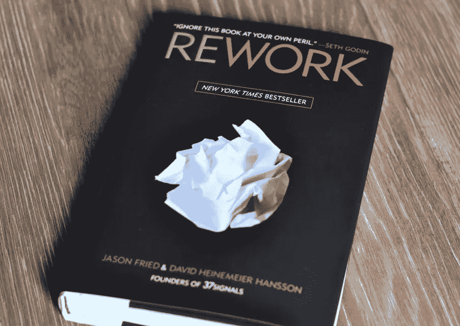
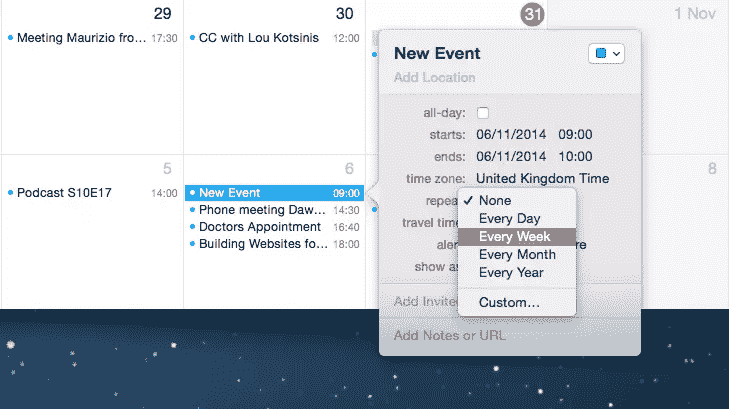
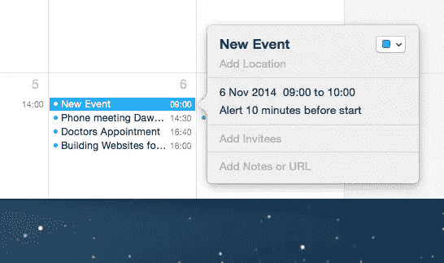

# 会议有那么邪恶吗？

> 原文：<https://www.sitepoint.com/meetings-evil/>

那是一个星期二的下午，我发现自己又参加了一次网络指导小组会议。有 20 多人出席，我知道这将是一个漫长的过程。自从两周前的上次会议以来，我没有什么可汇报的。然而，这并不能阻止会议的继续，尤其是当我知道网站的设计已经提上日程的时候。

果然，两个小时后，两位主管还在讨论网站应该是什么蓝色。就在这时，我发誓再也不参加会议了。

我相信你能理解我的感受。我们都参加过吸干你灵魂的会议。但是，我的誓言是正确的还是现实的？会议有那么糟糕吗？

在 [37signals](http://37signals.com/) 的团队是这样认为的。他们的书《T2 返工》将会议描述为有毒的。而且也不乏赞同他们的人。

在许多方面，这是完全可以理解的。我们如何利用会议存在重大问题。

## 会议的问题是

会议的最大问题是它们变得多么具有破坏性。如果你不小心，你的工作日就会变得支离破碎。被一系列会议打断。这使得你无法进入工作状态。

这对组织来说可能会很昂贵。不仅有会议本身的工时，还有会后重新投入工作的时间。这些工时可以累加。只有八个人参加的一个小时的会议花费了组织一整天的时间。我在本文开头提到的会议耗费了组织整整一周的生产力！

部分问题是大多数会议缺乏重点。这就是导致他们变得如此漫长和拖沓的原因。太多的会议缺乏议程或明确的结果。如果没有这种结构，会议就会分散，并开始耗费组织大量的资金。

不仅会议太长，而且参加的人太多。这是因为他们没有焦点。组织者最终邀请了任何可能对这个模糊话题感兴趣的人。

这样做的结果是，你最终会在一个有 IT 主管出席的会议上讨论设计。IT 主管在关于品牌的讨论中有什么贡献？

虽然会议可能会浪费时间和金钱，但也不是没有好处。有些类型的会议值得花费精力和金钱。

## 有些会议是值得努力的

为了回应 37signals 关于会议的评论，数字机构 [Happy Cog 写了一篇文章为他们辩护](http://cognition.happycog.com/article/an-open-letter-to-37-signals)。在这封信中，他们提到了四种他们认为有用的会议。其中包括:

*   **动员会**。Happy Cog 认为这个会议是确保项目有一个良好开端的重要工具。他们认为，这可能会取消以后的其他会议。
*   **头脑风暴会议**。他们认为聚在一起集思广益解决问题比单独工作更有效。
*   **验尸**。当一个项目完成时，Happy Cog 喜欢看看事情进展如何。他们觉得这有助于防止将来重复同样的错误。
*   **批判**。Happy Cog 认为讨论一个设计有助于它变得更加精致，并带来更好的产品。如果没有别的，它也有助于设计师学会证明他们的工作。

我能想到许多其他类型的会议有他们的位置。从**利益相关者访谈**到**研讨会**，会议本身没有任何问题。相反，问题在于它们是如何运行的。

## 如何开好会议

开一个好的会议并不难。它只是需要一些纪律，一些思考和一些人来控制。

下面是一些有效会议的注意事项。如果你坚持这些，你会发现会议感觉不那么邪恶了。

### 有议程吗

没有议程就召开会议是懒惰的表现，也是对他人时间的漠视。提前收到议程可以让与会者决定是否参加。这也有助于确保会议不偏离轨道。

### 不要邀请太多人

如果你有一个明确的议程，这将有助于决定邀请谁。你邀请的人越多，你为组织付出的代价就越大。会议持续的时间也越长。通过将讨论集中在一两个领域，你可以邀请最少数量的人。最糟糕的事情莫过于坐在一个会议上，人们在讨论你一无所知的事情。

### 一定要有目标

议程很好，但是也要知道你想要什么样的结果。有了你想要实现的明确目标，会议将会更有成效。当人们偏离主题时，这也有助于你不偏离主题。

### 不要自发开会

当一个问题出现时，很容易召集一群人开会讨论。虽然这可能对你有帮助，但对其他人来说却是破坏性的。至少提前一天安排你的会议，这样人们就可以围绕它来计划他们的工作日。

### 一定要有一个明确的结束时间，并坚持下去

如果没有明确的终点，会议往往会失去重点。有最后期限时，决策会更快。尊重别人的时间和安排也很重要。

### 不要安排定期会议

为“网络指导委员会”之类的事情安排定期会议是一种常见的做法。人们都很忙，时间都排满了，所以划出一些时间是有意义的。

问题是你经常发现自己为了开会而开会。或者那些会议拖拖拉拉，因为你已经安排了一个小时，但那一周只有一个项目要讨论。

只在需要的时候召集会议。在你有议程之前安排一个会议是适得其反的。

### 一定要记录下接下来的行动和决定

大多数会议不需要正式的会议记录。反正没人会看。但是你确实需要一份下一步行动和关键决策的记录。

将会议重点放在后续步骤上。将这些步骤分配给特定的人，并在可能的情况下设定最后期限。

记录关键决策也很重要。这是因为人们对决策的感知可能是不同的。写下来有助于清晰。

### 不要把会议分散在一整天

通过将会议分组在一起，你可以节省人们很多时间。在又一次会议之前，试图重新投入工作所浪费的时间。

一些组织说会议必须在一天的开始或结束时举行。其他人说，一周中的某些天必须保持空闲。无论你采取什么方法，试着把会议组织在一起。

### 不要使用日历默认值

默认情况下，大多数日历应用程序将会议设置为一小时。大多数会议不应该持续这么长时间。如果你有一个明确的议程，并且没有邀请太多人，那么会议不应该持续一个小时。

遵循这些建议，会议的质量将会提高。但是，我也认为传统会议在数字领域变得越来越不重要。

## 超越会议

有两种趋势正在让我们远离传统会议。

首先是**网页设计变得越来越协作化**。网页设计者和开发者并肩坐在一起工作。许多网络专业人士现在甚至和客户一起在网站上工作，这样他们就可以一起做项目了。

随着数字团队以更加敏捷、协作的方式工作，瀑布式管理的日子正在减少。这减少了开会的需要。

此外，越来越多的人意识到，作为一种管理数字技术的方式，委员会并没有很好地发挥作用。首先，他们见面的频率太低，以至于无法在快速变化的网络世界中做出决定。

委员会的另一个问题是数字的广泛性。它需要许多不同的技能，影响整个业务。这意味着许多网络指导委员会变得过于臃肿。错误的人在会议中讨论错误的事情。这浪费了每个人的时间。

相反，许多组织正在采用 [RACI 矩阵](http://www.smashingmagazine.com/2012/11/16/structure-supports-digital-presence/)。这种更加灵活的方法确保了正确的人在正确的时间做出正确的决定。这也减少了开会的需要。

所有这些让我相信，在未来几年里，我们参加会议的次数应该会减少。但是他们仍然有自己的位置。这就是为什么我们变得更有效率是如此重要。

## 分享这篇文章