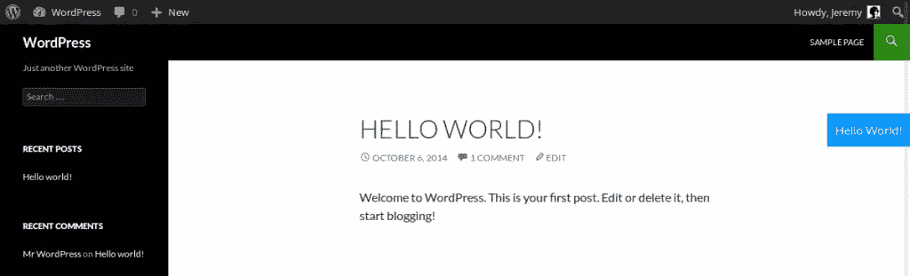
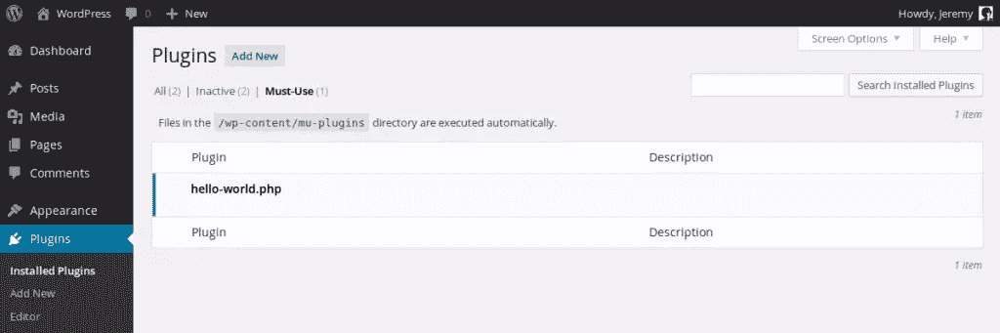
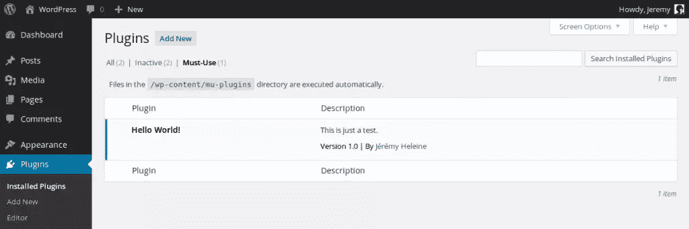

# 什么是 WordPress MU 插件？

> 原文：<https://www.sitepoint.com/wordpress-mu-plugins/>

WordPress core 功能丰富，然而，有时候还不够，我们需要更多。这可以通过插件来实现，有时主题甚至可以添加功能。然而，我们如何决定一个特性应该是插件还是主题呢？

这个问题的答案可能很棘手:它并不总是直截了当的。如果一个特性必须出现在主题中，或者相反，如果它可以保持不被使用而不破坏主题，那么你很容易知道应该在哪里实现它。

如果一个特性必须一直存在呢？独立于你当前的主题，这个特性可能是如此重要以至于它不能被停用，它在经典插件系统中没有它的位置。对于这些特殊功能，可以使用**必须使用的插件**。

## 什么是必须使用的插件？

一个[必须使用的插件](http://codex.wordpress.org/Must_Use_Plugins)(也称为“mu 插件”)是一个默认情况下**总是被激活的插件**，而不需要你自己去做。要激活阿木插件，你只需要把它上传到正确的目录，WordPress 会自动知道这个插件必须被使用。此外，**阿木插件不能被停用**:它将一直被执行，除非它被卸载。

最初，mu 插件只适用于 WPMU，那些使用多个(多站点)博客的站点。当时，阿木插件只是一个为所有博客激活的插件。

现在，从 2.8 版本开始，这个功能出现在 WordPress 的主要分支中，mu 插件中的“MU”部分有了新的含义:从“多用户”，变成了“必须使用”，这个功能的用法已经改变。

问题不是这个功能必须出现在我所有的博客上吗？‘不再是，而是’*这个功能重要到可以被认为是 WordPress 的扩展吗？*’。

必须使用的插件允许用户添加默认情况下 WordPress 核心中没有的功能，但是用户需要的功能。

必须使用的插件也可以被视为在主题或经典插件中没有位置的功能。例如，正如我们在[上一篇关于更新 WordPress、插件和主题的文章](https://www.sitepoint.com/a-guide-to-updating-wordpress/)中所提到的，由于一些特定的过滤器，我们可以实现插件和主题的自动更新。将这些过滤器添加到另一个插件中实际上没有意义，更不用说添加到一个主题中了。启用自动更新是 mu 插件有用特性的一个完美例子。

## 一个必须使用的插件有什么特点？

阿木插件的主要特点是它是默认激活的。你所要做的就是将文件上传到 mu-plugins 目录中(我们将在下面看到在哪里可以找到它)。然后，插件被自动激活，你不需要自己登录来做这个:一旦文件在正确的位置，WordPress 会一直执行它。

此外，阿木插件不能在你的 WordPress 仪表盘的`Plugins`页面中被停用:停用阿木插件的唯一方法是删除或移动它的文件。这样，没有人会意外地停用某个需要的功能。

因为它们没有被激活，mu 插件不能使用经典插件通常使用的激活钩子来初始化一些需要的东西，比如数据库中的选项。直接的后果是，如果你需要激活钩子，你将不能为你想要的特性使用 mu 插件。

必须使用的插件在经典插件之前加载，按字母顺序。知道你的 mu 插件是否加载了一个在你的网站的所有页面中使用的库是很有用的，例如:如果一个经典插件使用了这个库，你可以确定它已经被加载了，因为 mu 插件以前就被加载了，并且它们不能被停用。

## 如何创建一个必须使用的插件？

正如你将在下面看到的，一个必须使用的插件和一个经典插件没有太大的不同，但是有一些事情需要知道。本节的目标是学习如何创建阿木插件，把它放在哪里，以及如何查看你的站点当前正在使用哪些插件。

### 必须使用的插件目录

阿木插件类似于经典插件，除了它不是存储在`wp-content`文件夹的`plugins`目录中，而是存储在同一个文件夹的`mu-plugins`目录中。如果你以前没有使用过 mu-plugins，这个目录应该不存在，但是你可以创建它，没有任何问题。

注意，您将存储您的 mu 插件的目录是`/wp-content/mu-plugins`，但是您可以通过在`wp-config.php`文件中定义两个常量来改变它:`WPMU_PLUGIN_DIR`和`WPMU_PLUGIN_URL`。

```
define('WPMU_PLUGIN_DIR', '/full/path/to/the/new/directory');
define('WPMU_PLUGIN_URL', 'http://URL/to/the/new/directory');
```

注意:如果你定义了这两个常量，WordPress 不会重新定义它们，所以如果路径无效，mu-plugins 就不会被加载。此外，在`wp-config.php`文件中，你必须在 WordPress 包含`wp-settings.php`文件的那一行之前定义这些常量，这意味着你将无法使用一些有用的常量，例如`WP_CONTENT_DIR`。

除非你确定你的目录，否则你应该保持`WPMU_PLUGIN_DIR`和`WPMU_PLUGIN_URL`的默认值，因为这样更安全更实用。

### 我们第一个必须使用的插件

基本上，阿木插件是一个 PHP 文件，所以是一个经典的插件。我们现在将创建一个非常基本的 mu 插件。它将显示“Hello World！”消息，所以这将是相当琐碎的，但这样我们将能够看到它是否在创建后立即工作。

在`/wp-content/mu-plugins`目录中创建一个新文件(如果您更改了它，则创建另一个文件)。你可以给它起任何你想要的名字，但是`hello-world.php`似乎是个好主意。用下面的函数填充它。

```
function displayHelloWorld() {
echo '<p style="position: absolute; top: 150px; right: 0; padding: 10px; background-color: #0096FF; color: #FFFFFF;">Hello World!</p>';
}
```

这个函数将显示一个包含文本“Hello World！”的段落并把它放在屏幕的右上角:这样，我们可以很容易地看到它。现在，你必须调用这个函数。

这是一个测试，但它不是肮脏的借口:我们可以通过一个动作调用我们的函数，例如，`wp_footer`当页脚显示在博客上时就会被触发。在上面的函数后添加下面一行。

```
add_action('wp_footer', 'displayHelloWorld');
```

现在，访问你的博客。如果您没有对上面的代码做任何更改，您应该会在右上角看到一个蓝色框，显示文本“Hello World！”。如果没有，确保你的文件在正确的文件夹中:因为 mu 插件是自动激活的，你不需要做任何事情，只要把文件放在正确的目录中。



### 查看已安装的必备插件

由于管理部门插件不能被停用，它们不会显示在默认列表中，在默认列表中您可以看到其他插件。但是，这并不意味着你看不到当前安装的必须使用的插件列表。

在你的 WordPress 管理页面的`Plugins`部分，转到`Installed Plugins`页面。起初，什么都没有改变，但是看看页面标题下面的标签。看到了吗？

出现了一个新标签:`Must-Use`。点击它，正如你所猜测的，你会看到已安装的 mu 插件列表，并有一条消息提醒我们这个插件是自动激活的。



正如你所看到的，这个列表似乎没有显示经典插件的列表完整:你只能看到文件名，看不到插件做了什么。

我们可以改变这一点，改变的方式和经典插件一样:我们会添加一个包含我们想要的所有信息的注释。在文件的开头添加以下注释。

```
/*
Plugin Name: Hello World!
Description: This is just a test.
Author: Jérémy Heleine
Version: 1.0
Author URI: http://jeremyheleine.me
*/
```

用你的替换不同的值，刷新必须使用的插件列表，享受结果吧！



### 子目录

与经典插件相反，阿木插件不能存储在`mu-plugins`插件的子目录中，所以默认情况下，你不能用文件夹来分类你的插件。然而，如果 WordPress 没有在子目录中寻找插件，你可以自己做，用你自己的加载器。

这个加载器将是一个新的 mu 插件，只包含在一个文件中，直接存储在`/wp-content/mu-plugins`目录中。这是必要的，因为如果你把这个加载器存储在子目录中，它不会被 WordPress 执行，其他插件也不会。

正如我们上面所做的，在`/wp-content/mu-plugins`目录中创建一个新文件。我选择将这个文件命名为`load.php`,但是您可以选择任何您想要的名称。然后，将下面一行放到这个文件中。

```
require(WPMU_PLUGIN_DIR . '/myplugin/myplugin.php');
```

这一行包括存储在目录的`myplugin`子目录中的`myplugin.php`文件，在这个目录中我们找到了必须使用的插件，默认情况下这个目录是`/wp-content/mu-plugins`。您拥有我们想要的:您的插件被执行，即使它没有直接存储在主目录中。

如果您添加一个包含另一个 mu 插件的新文件夹，您将不得不编辑`load.php`文件。然而，由于一些 PHP 函数，您可以自动化这个过程。用下面几行替换`load.php`文件的内容。

```
// Opens the must-use plugins directory
$wpmu_plugin_dir = opendir(WPMU_PLUGIN_DIR);

// Lists all the entries in this directory
while (false !== ($entry = readdir($wpmu_plugin_dir))) {
$path = WPMU_PLUGIN_DIR . '/' . $entry;

// Is the current entry a subdirectory?
if ($entry != '.' && $entry != '..' && is_dir($path)) {
// Includes the corresponding plugin
require($path . '/' . $entry . '.php');
}
}

// Closes the directory
closedir($wpmu_plugin_dir);
```

这个脚本将自动包含存储在子目录中的 mu 插件。请注意，它要求插件的主文件具有其文件夹的名称。

此外，你可以看到包含存储在子目录中的 mu 插件的另一个缺点:由于它们在默认情况下不会被 WordPress 找到，所以它们不会出现在我们上面给出的必须使用的插件列表中。这样，如果不查看目录本身，你就看不到哪个必须使用的插件被安装了。

## 最后

必须使用的插件是一种通过添加文件到`wp-content`目录来添加特性到 WordPress 核心的方法。好处是它们不会因为 WordPress 的更新而被删除，所以你可以确定你总是能找回你的特性。

阿木插件仍然是一个插件。当你想给 WordPress 添加功能时，你通常可以选择使用经典插件或者必须使用的插件，而不会有检索不到你需要的功能的风险，除非那个功能是激活钩子。这两种插件的唯一区别是，必须使用的插件将一直被执行，它们不能被停用。所以如果你问自己是必须选择经典插件还是必须使用的插件，把 mu-plugins 看作 WordPress 的扩展可能是个好主意。

最后，必须使用的插件还有一个缺点，我们在上面没有提到。WordPress 不会告诉你是否有 mu 插件的更新，所以如果你使用一个不是你自己写的插件，你必须自己验证是否有更新。

这个教程[的例子可以在这里](http://jeremyheleine.me/downloads/sitepoint-mu-plugins.zip)找到，在这里你会发现一个包含四个 mu 插件的档案文件:“Hello World！”示例和另一个加载两个其他“Hello World！”键入 plugins 以显示我们可以在子目录中存储 mu-plugins。为了测试这些例子，在`wp-content`文件夹中创建`mu-plugins`子目录，并将归档的文件和文件夹放在这个子目录中。

## 分享这篇文章