# 10 必须有 WordPress 插件-2014 版

> 原文：<https://www.sitepoint.com/10-must-wordpress-plugins-2014/>

当构建一个 WordPress 站点时，你的主要目标是使用尽可能少的插件。然而，并不是每个使用 WordPress 的人都是 PHP 专家。幸运的是，这些 WordPress 插件不会让你的网站陷入困境。其中一些实际上会帮助你的网站运行得更快更有效。我所有的 WordPress 网站都使用这些插件。它们帮助我管理那些用其他方式很难完成的任务，并且它们提供了任何成功的 WordPress 站点所必需的特性。

在 SitePoint，我们已经写了关于[必须在](https://www.sitepoint.com/10-must-have-wordpress-plugins/)之前拥有 WordPress 插件，然而在这篇文章中，我将涵盖我自己的“必须拥有”插件——2014 版。

## [Akismet](https://wordpress.org/plugins/akismet/)

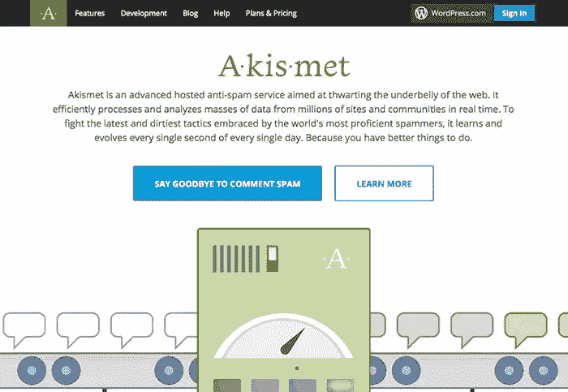

在运行你的 WordPress 站点时，最烦人的事情之一就是你会遇到很多垃圾评论。对抗这些垃圾评论的一个方法是使用一个已经存在多年的插件，叫做 Akismet。从我记事起，Akismet 就一直是防止垃圾评论的可靠代言人。

## [WordPress SEO by Yoast](https://wordpress.org/plugins/wordpress-seo/)

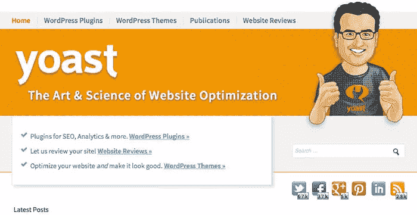

无论你是否是搜索引擎优化大师，Yoast 都是你的 WordPress 站点搜索引擎优化的首选插件。使用这个插件，你可以控制你搜索引擎优化工作的每一个方面。这个插件非常适合处理元描述和其他 SEO 任务。这个插件对于页面搜索引擎优化也非常有用。你也可以控制像 robots.txt 文件这样的东西，它会为你生成你的站点地图。这使得定期向 Google、Yahoo 和 Bing 提交站点地图变得非常容易。

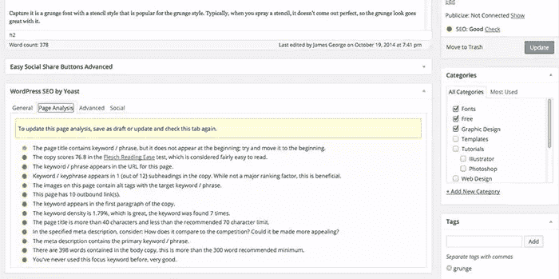

我最喜欢 Yoast 的 SEO 插件的一点是，它分析你的文章，并根据你所做的事情提出建议。有这个提醒很方便，让你知道你已经忘记了一些重要的事情，比如在标题中使用你的关键字等等。Yoast 的插件会给你一个总分，这取决于你打了多少分。

## [WP-DBManager](https://wordpress.org/plugins/wp-dbmanager/)

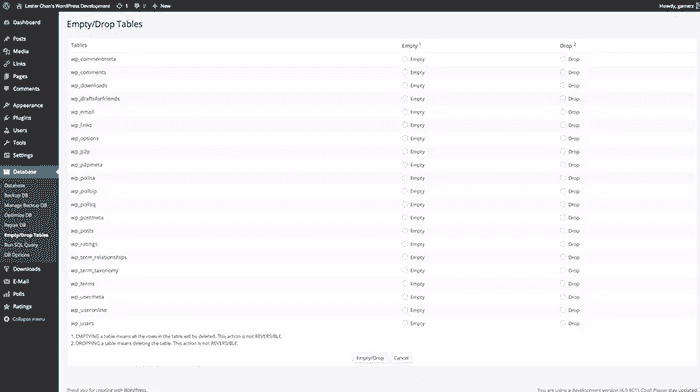

当你运行你的 WordPress 站点时，你会遇到的事情之一是创建额外的文章修改和草稿。运行一个成功的 WordPress 站点最重要的一个方面是保持你的数据库健康。去掉这些额外的数据将有助于保持数据库快速高效地运行。WP-DBManager 允许您只需单击一个按钮就可以做到这一点。

## [问题评论系统](https://wordpress.org/plugins/disqus-comment-system/)

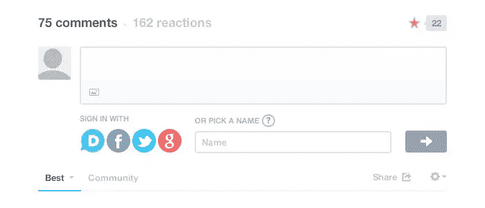

网站成功的一个最重要的方面是你与读者之间的关系。让你的读者很容易对你的帖子发表评论将会产生互动，并为你的网站带来活力。Disqus 是一个插件，用户可以很容易地用他们的 Google+、脸书、Twitter 或 Disqus 账户登录并发表评论。用户还可以为其他人的评论投票，这促进了网站访问者之间的互动。

## [WP Smush.it](https://wordpress.org/plugins/wp-smushit/)

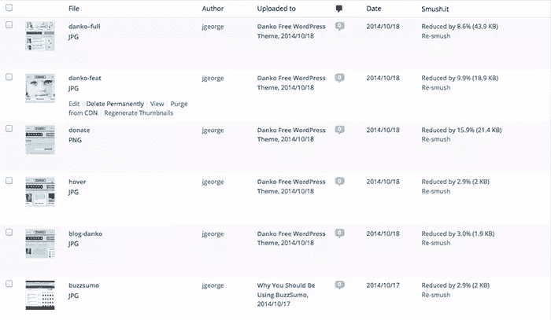

WordPress 最难的部分之一是保持它快速运行。就像网络上任何其他类型的网站一样，保持你的图片最优化是很重要的。文件越小，你的网站加载就越快。这样做的问题是，如果你上传很多图片到你的网站，你可能没有时间去优化和压缩每张图片。这就是 WP Smush.it 的用武之地。只需点击一个按钮，你就可以选择压缩保存在你的 WordPress 网站上的所有图片。有时，您可以为每个图像节省 30%或 40%的空间。如果你把它乘以 100 张图片，你就节省了很多带宽。

## [VaultPress](https://vaultpress.com/)

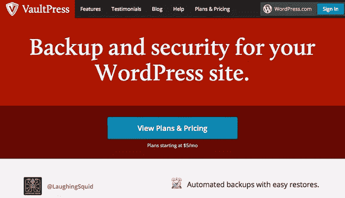

对于任何 WordPress 网站来说，安全性都是最重要的。有大量的插件可以保证你的网站安全。在我看来，最好的安全和备份插件叫做 VaultPress。这个插件会在你指定的时间间隔自动备份你的站点。为了应对被黑客攻击的可能性，VaultPress 将对您的网站进行每日扫描。如果它发现了什么，你可以一键修复你的数据库。这个插件不仅容易使用，而且让你安心。

## [W3 总缓存](https://wordpress.org/plugins/w3-total-cache/)

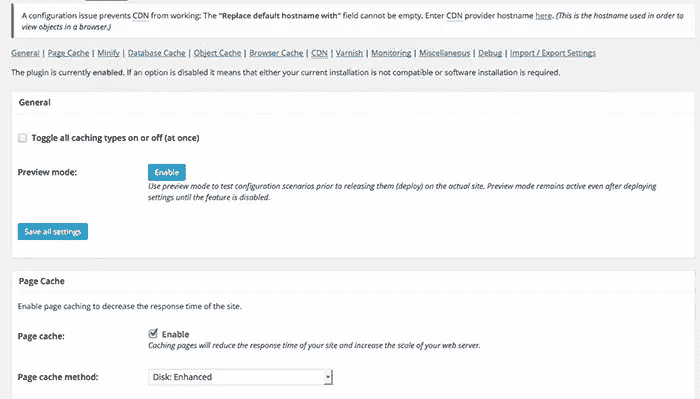

所有 WordPress 用户都应该采取一些步骤来优化他们的网站。使用像 W3 Total Cache 这样的缓存插件可以大大提高你的 WordPress 站点的性能。它执行对象和浏览器缓存，这对于为用户加载站点非常重要。

缓存意味着用户不必在每次有人访问你的站点时重新下载所有的资源。初始加载可能需要更长的时间，但是以后每次页面加载都会快得多。

W3 Total Cache 还可以缩小你的 CSS 和 Javascript 文件，这将有助于你的网站加载更快。

## [重新生成缩略图](https://wordpress.org/plugins/regenerate-thumbnails/)

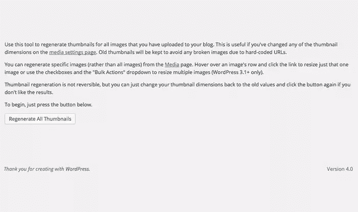

这个插件可能不是你在每个网站上安装的东西，但它绝对是我在某些情况出现时放在脑海里的一个插件。这个插件派上用场的地方主要是当你切换主题时，你的图像或缩略图看起来都不对。这可能会令人沮丧，但解决这个问题的最快方法不是手动重做所有的缩略图。解决方案是使用重新生成缩略图插件。点击你的鼠标，这个插件将浏览你所有的缩略图，并立即重新生成它们。你可能需要坐在那里一两分钟，让它自然运行，但它会自己处理你所有的缩略图。这是我手头最有用的插件之一。

## [联系方式 7](https://wordpress.org/plugins/contact-form-7/)

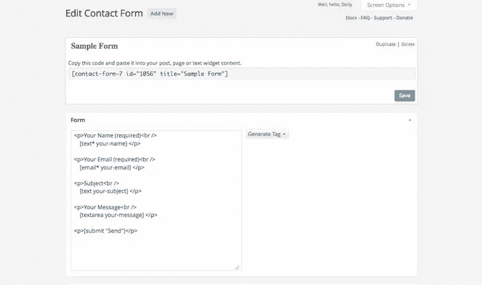

您希望您的网站访问者能够与您取得联系，以便他们可以向您提问，并在需要时提供反馈。不幸的是，并不是每个 WordPress 主题都有内置的联系方式。联系表单 7 是 WordPress 最好的联系表单插件之一。您可以自定义每个表单域以满足您的需要。您也可以在不知道如何编码的情况下创建一些非常高级的表单。Contact Form 7 允许您使用短代码将您的联系表单放在您网站的任何地方。

## [联系表单数据库](https://wordpress.org/plugins/contact-form-7-to-database-extension/)

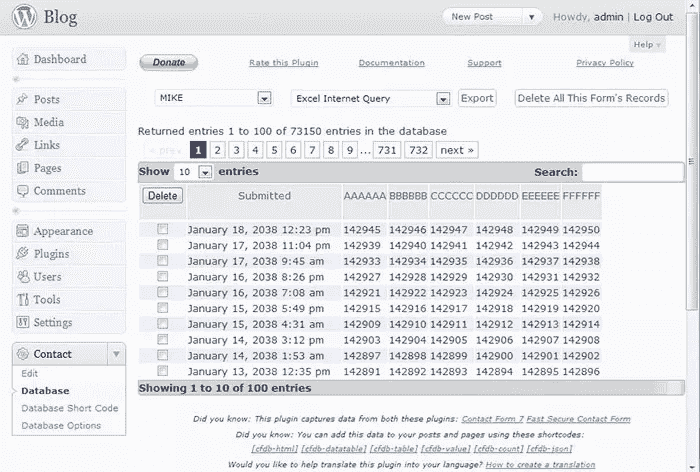

当访问者在你的网站上填写联系表格时，你可能并不总是希望他们给你发邮件。有时，您需要收集这些信息，以便可以将其编译成电子表格供以后使用。通过表单收集信息有很多用途，Contact Form DB 将允许你在你的 WordPress 数据库上保存表单提交。然后，如果需要组织这些信息，可以将数据导出为 CSV 文件。这将允许您在 Microsoft Excel 中打开它。这个插件不仅适用于联系表单 7，也适用于快速安全联系表单、重力表单和 Jetpack 联系表单插件。

## 分享这篇文章