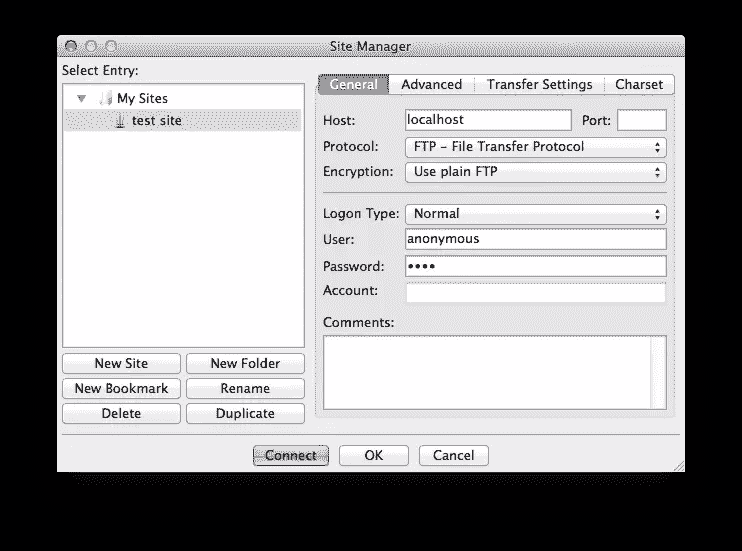

# FTP 程序安全吗？

> 原文：<https://www.sitepoint.com/are-ftp-programs-secure/>

您是否使用 FTP 部署或传输文件？鉴于该协议的年代及其在众多主机公司中广受欢迎的性质，可以说你可能会。

但是，您是否意识到这可能为您和您的企业带来的安全问题？让我们深入考虑一下情况。

像 *FileZilla* 、 *CyberDuck* 、 *Transmit* 或者 *Captain FTP* 这样的程序是可以安全的。他们可能会采取一些措施，比如让你周围的人看不到密码。但是，如果您使用 FTP 传输数据，这些措施会得到有效缓解。

我就开门见山了；我写这篇文章的原因是因为八月份在 SitePoint 上的一个有趣的讨论。讨论主要集中在 FileZilla 上，断言它有多不安全。

争论的一个关键方面是你是否应该用 FileZilla 存储你的密码。其中一条评论链接到了一篇颇具描述性的文章，该文章显示，尽管在使用该软件时模糊了您的凭证，但如果您保存了凭证，它们很容易被检索到。

如果您还没有读过这篇文章，FileZilla 将连接细节存储在一个简单的 XML 文件中，您可以在下面看到这个例子。

```
<?xml version="1.0" encoding="UTF-8" standalone="yes" ?>
<FileZilla3>
    <Servers>
        <Server>
            <Host>localhost</Host>
            <Port>21</Port>
            <Protocol>0</Protocol>
            <Type>0</Type>
            <User>anonymous</User>
            <Pass>user</Pass>
            <Logontype>1</Logontype>
            <TimezoneOffset>0</TimezoneOffset>
            <PasvMode>MODE_DEFAULT</PasvMode>
            <MaximumMultipleConnections>0</MaximumMultipleConnections>
            <EncodingType>Auto</EncodingType>
            <BypassProxy>0</BypassProxy>
            <Name>test site</Name>
            <Comments />
            <LocalDir />
            <RemoteDir />
            <SyncBrowsing>0</SyncBrowsing>test site
        </Server>
    </Servers>
</FileZilla3>
```

你可以看到它存储了很多关于连接的信息，所以你不需要记住它。但是请注意它是如何明文存储您的密码的？



当然，当你使用该程序时，它会隐藏密码，如上面的截图所示，这样你就无法越过肩膀读取密码。

但是如果你有权限的话，把它从电脑上拿下来就没什么意义了。公平地说，在 FileZilla 的最新版本中，默认情况下不允许存储密码。

## 加密的配置文件呢？

人们建议，至少配置文件应该加密，或者设置成在授权访问前要求输入主密码，就像 [1Password](https://agilebits.com/onepassword) 和 [KeePassX](http://www.keepassx.org) 所做的那样。

Louis Lazaris 随后链接到[一个关于筹码交换的讨论](http://security.stackexchange.com/questions/39321/should-i-use-filezilla)，该讨论试图反击头寸。以下是这篇文章的核心内容:

> 你看，加密凭证需要一个需要存储在某个地方的加密密钥。如果一个恶意软件在你的用户帐户上运行，他们可以访问你(或任何其他运行在同一级别的应用程序)所拥有的内容。这意味着他们还可以访问加密密钥或对加密密钥进行加密的密钥，等等。

我相信上面的断言没有完全理解程序的设计考虑，比如上面列出的两个。专门为密码和其他安全信息设计的应用程序可能不像这个答案暗示的那样容易被破解。

例如，[1 password](https://learn2.agilebits.com/1Password4/Security/1P4-security-changes.html)最近发布的一篇博客文章列出了打击黑客的许多关键机制。

其中包括 [128 位和 256 位对称密钥](http://computer.howstuffworks.com/encryption2.htm)、 [SHA512](http://en.wikipedia.org/wiki/SHA-2) 和 [PBKDF2](https://helpdesk.lastpass.com/security-options/password-iterations-pbkdf2/) 加密，以及一系列用于保护被访问数据文件的其他功能，同时保持它们的易用性和简单性。

因此，推断使用安全加密库并不真的更安全是不正确的，尤其是考虑到所有这些可用的技术。

## 是 FTP，不是你的 App！

但是凭证是否应该被保存的争论是没有实际意义的，因为首先使用 FTP 忽略了一个关键点—**您的凭证和数据是以明文方式发送的**。不相信我？读一下 Deccanhosts 博客上的[为什么 FTP 不安全](http://engineering.deccanhosts.com/2013/02/why-is-ftp-insecure.html)。

如果您没有意识到，通过使用简单的数据包嗅探器，如 [Wireshark](https://www.wireshark.org) ，您不仅可以检索使用的用户名和密码，还可以检索存储在发送的文件中的任何其他凭证，以及算法、数据库结构和存储在那里的任何其他内容。

事实上，很长一段时间以来，将这些信息存储在。ini 和配置文件，我建议大量下载现成的软件，如 WordPress、Joomla 等。将会以这样的方式发展。

FTP 的设计从来没有考虑到安全性；它被设计成一种公共服务。这种设计中固有的是一系列进一步的假设，这些假设也没有考虑安全性。 [Zend](http://www.zend.com/) 的高级软件工程师 Enrico Zimuel 甚至说:**永远不要使用 FTP——永远不要！**

是的，安全性更改是后来才出现的，但它们是添加上去的，而不是内置的。没有针对暴力攻击的保护措施，虽然 SSH 隧道是可能的，但是很困难，因为您需要加密命令和数据通道。因此，你的选择有限。当你试图实现它们时，困难因素并不总是微不足道的。

你是站长吗？你为你的 FTP 用户启用了 chroot 监狱吗？如果您不熟悉 chroot 这个术语，它是一种限制用户移动和访问的方式。从他们登录的目录，他们可以进入任何子目录，但不能离开它。

## FTP 的替代选项

在我让你相信这一切都是厄运和黑暗之前——事实并非如此。当今的许多 FTP 程序——尤其是前面提到的那些——也支持 FTP 的一些更安全的衍生物和替代物。让我们来看看它们。

### FTPS 和 SFTP

FTPS 是安全的 FTP，就像 HTTPS 是安全的 HTTP，并且运行在 SSL(安全套接字层)和 TLS(传输层安全性)之上。用户凭据和数据不再以明文形式发送；相反，它们在传输前会被加密。

如果服务器允许的话，客户端软件也有灵活性，只加密部分通信，而不是全部。基于到目前为止的讨论，这可能看起来违反直觉。

但是，如果正在传输的文件已经加密，或者如果没有敏感性质的信息正在传输，那么不产生加密所需的开销也是可以的。

然而，转向 FTPS 是有代价的。使用 FTPS 包括生成[一个自签名的 SSL 证书](https://devcenter.heroku.com/articles/ssl-certificate-self)，或者从一个可信的[认证机构购买一个证书](http://en.wikipedia.org/wiki/Certificate_authority)。因此，可以获得更好的安全性，但是需要付出更大的努力和成本。

但是在你回避之前，问问你自己你的信息对你的生意有多少价值？这可能会说服你保留。

现在让我们看看 SFTP。SFTP 或 SSH 文件传输协议的工作方式与 FTPS 不同。作为 SSH 2.0 的扩展，SFTP 创建了一个普通的 FTP 连接，但是通过一个已经加密的连接来执行。FTP 数据流本身并不比普通的 FTP 更安全，但是，它所运行的连接更安全。

### SSH、SCP 和其他登录 Shells

如果你打算放弃 FTP，为什么要采取折中的措施呢？为什么要使用 FTP？如果你安装了 SFTP，你就安装了 SSH 工具；这些使您可以访问各种功能。

从 SSH 本身开始，它为用户提供了对远程系统的完全访问，让他们可以做比标准 FTP 更多的事情。连接是安全的，数据可以很容易地从一个系统复制到另一个系统。

如果你是一个命令行专家，你甚至可以使用诸如 Rsync over SSH 这样的工具。

在一个简单的用例中，它可以用来递归地将所有文件从本地目录复制到远程机器上的一个目录中。第一次运行时，所有文件都会被复制。

第二次和随后的时间，它检查文件差异，只传输差异，较新的文件，并有选择地删除文件和目录在远程机器上不再存在本地。

问题是授予这种访问权本身就是一个迟早会发生的安全问题。但是这些影响是可以减轻的。OpenSSH 允许许多配置选择，比如禁止 root 访问、限制可以远程登录的用户，以及将用户锁定到特定的目录。

也许用户首先不需要在远程机器上，或者当他们在那里时不需要很多特权。如果是这种情况，并且很可能是这样，您可以从许多 shellss 中进行选择，这些 shell 是为适应这些情况而设计的。

最好的两个是 [scponly](https://github.com/scponly/scponly/wiki) 和 [rssh](http://www.pizzashack.org/rssh/) 。Scponly 只允许用户将文件复制到远程机器。

用户不能登录、移动、查看或更改文件。伟大的是，它仍然可以与 rsync(和其他工具)一起工作。rssh 更进一步，允许访问 SCP、SFTP、rdist、rsync 和 CVS。

要实现它，系统管理员只需要用他们选择的工具改变用户的外壳，然后编辑`/etc/rssh.conf`，列出允许的协议。下面是一个配置示例:

```
allowscp
allowsftp
```

这种配置允许用户仅使用 SCP 和 SFTP。

## SSH 密钥

接下来，我们来考虑一下 [SSH 按键](http://blakesmith.me/2010/02/08/understanding-public-key-private-key-concepts.html)。这个过程需要一点解释，但我会尽量保持快速和简洁，大量转述[在 Stack Exchange](http://security.stackexchange.com/questions/3887/is-using-a-public-key-for-logging-in-to-ssh-any-better-than-saving-a-password#answer-3898) 上的回答:

> 首先，通过启用对称密钥的协商，服务器的公钥用于构建安全的 SSH 通道，该对称密钥将用于保护剩余的会话、启用通道机密性、完整性保护和服务器认证。在信道起作用并且安全之后，对用户进行认证。
> 
> 接下来，服务器创建一个随机值，用用户的公钥加密，然后发送给他们。如果用户是他们应该是谁，他们可以解密挑战，并将其发送回服务器，服务器然后确认用户的身份。这是经典的挑战-回应模式。
> 
> 这样做的主要好处是私钥不会离开客户端，也不会发送任何用户名或密码。如果有人拦截了 SSL 流量，并能够对其进行解密(使用受损的服务器私钥，或者如果您在连接到服务器时接受了错误的公钥)，您的私人信息将永远不会落入攻击者手中。

当与 SCP 或 SFTP 一起使用时，这进一步减少了使用它们所需的工作量，同时增加了安全性。SSH 密钥可能需要一个密码来解锁私钥，这似乎使它们更难使用。

但是，当你登录到你的计算机时，有一些工具可以把它与你的用户会话联系起来。正确设置后，系统会自动为您提供密码，因此您可以充分利用系统的优势。

## 连续发货呢？

也许你以前没有听说过这个术语，但是它已经流传了一段时间了。我们以前在 SitePoint 上写过，最近一次是在上周。由马丁·福勒创造的[连续交货被定义为](http://martinfowler.com/bliki/ContinuousDelivery.html):

> 一种软件开发规程，在这种规程中，您构建软件的方式使得软件可以在任何时候发布到产品中。

有很多方法可以实现它，但是像 [Codeship](https://www.codeship.io) 和 [Beanstalk](http://beanstalkapp.com) 这样的服务对消除痛苦大有帮助。

这是它们如何工作的粗略类比。您设置您的软件项目，包括您的测试代码和部署脚本，并将其全部存储在版本控制之下。我假设你用的是在线服务，比如 GitHub 或者 Bitbucket。

当对这些服务中的任何一个进行推送时，在您的代码分支中进行提交或释放之后，该服务将运行您的应用程序的测试。如果测试通过，那么您的应用程序将进行部署，无论是测试还是生产。

假设一切顺利，那么它会自动为您展开部署。之后，您会收到部署成功或失败的通知。

如果成功了，那么您可以继续下一个特性或错误修复。如果出了问题，您可以检查它以找到问题的原因。请看下面的短片，展示了 Codeship 中测试存储库的部署。

[//www.youtube.com/embed/L6BXLdR6Nxw?rel=0](//www.youtube.com/embed/L6BXLdR6Nxw?rel=0)

你必须做什么？向 Github 存储库提交一个 commit 就是这样！你不需要记得运行脚本，它们在哪里，传递给它们什么选项和开关(特别是在周五晚上，当你宁愿在任何地方而不是在工作的时候)。

我知道这是相当简单的，并没有涵盖所有的选项和细微差别，但你得到的想法。

## 人为失误的问题

最后，让我们从使用 FTP 的基本安全问题转移到日常使用的有效性问题上来。比方说，你正在开发一个网站，比如一个电子商务商店，你的部署过程使用了 FTP，特别是 FileZilla。

这里有许多与人为错误相关的固有问题:

*   所有文件都会上传到正确的位置吗？
*   文件会保留或获得所需的权限吗？
*   会不会有一两个档案忘了？
*   生产中是否有需要更改的开发名称？
*   是否需要运行部署后脚本？

所有这些都是合理的担忧，但是当使用持续交付工具时，这些都很容易被减轻。如果已经很晚了，如果压力很大，如果相关人员要么离开公司，要么渴望休假，那么通过 FTP 手动传输文件就是自找麻烦。

好了，手动传输文件，句号，是自找麻烦。人为错误太难消除了。

## 向 FileZilla 道歉

我不想让人觉得我在找 FileZilla 的茬。这是一个非常好的应用程序，我已经用了很多年了。并且已经有一些技术试图使其更加安全。

我的重点是 FTP 本身，而不仅仅是 FileZilla。

## 包扎

这就是我对 FTP 安全辩论的看法。我的建议是——不要用它；此外，在管理部署时，请牢记安全性。毕竟是你的数据。

但是你的想法是什么？你还用 FTP 吗？你在考虑搬走吗？请在评论中分享你的经历和你尝试过的解决方案，这样我们就能一起努力找到实用易用的解决方案。

## 进一步阅读和资源

*   [Zend\Crypt\Password](http://framework.zend.com/manual/2.3/en/modules/zend.crypt.password.html)
*   [密码安全(幻灯片)](http://www.slideshare.net/e.zimuel/password-insecurity)
*   [为什么 FTP 不安全](http://engineering.deccanhosts.com/2013/02/why-is-ftp-insecure.html)
*   [Wireshark(网络协议分析器)](https://www.wireshark.org)
*   [1 密码 4 中安全性的持续发展](https://learn2.agilebits.com/1Password4/Security/1P4-security-changes.html)
*   当心:FileZilla 不会保护你的密码
*   [Linux 受限外壳:rssh 和 scponly](http://www.linuxscrew.com/2012/07/05/linux-restricted-shells-rssh-and-scponly/)

## 分享这篇文章