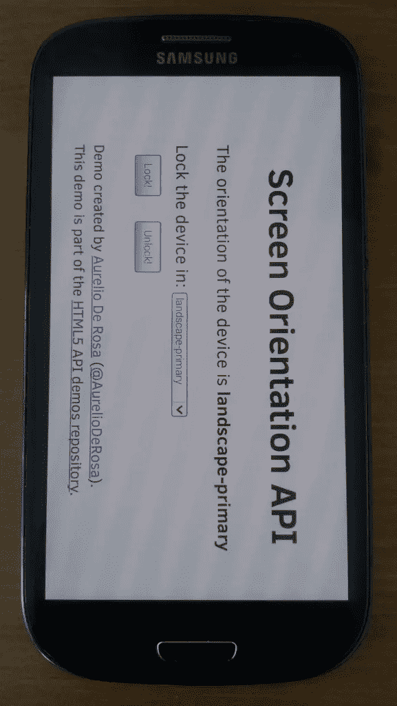

# 屏幕方向 API 已重新加载

> 原文：<https://www.sitepoint.com/screen-orientation-api-reloaded/>

九月份，我发表了一篇名为 [<cite>的文章，介绍了屏幕定位 API</cite>](https://www.sitepoint.com/introducing-screen-orientation-api/) ，毫不奇怪，这篇文章讨论了屏幕定位 API。这个 API <q cite="https://www.w3.org/TR/screen-orientation/">提供了读取屏幕方向状态的能力，当这个状态改变时被通知，并且能够锁定屏幕方向到一个特定的状态。</q>正如我在文章中提到的，<q cite="https://www.sitepoint.com/introducing-screen-orientation-api/">屏幕定向 API 还处于非常早期的阶段，因为它是 W3C 的工作草案。当前的[规范](https://www.w3.org/TR/screen-orientation/)可能会在几个月后被更新版本的[所取代。](https://w3c.github.io/screen-orientation/)</q>猜猜看？发生了！事实上，上一个版本的 Chrome (38)和 Opera (25)都支持新版本的规范(Firefox 高达 33 仍然支持旧版本)。

在本文中，我将强调这两个版本的规范之间的重要区别，以便您能够跟上时代的步伐。

## 什么是屏幕方向 API？

在我们开始深入研究新规范之前，我想向您简要回顾一下这个 API 是什么，以及为什么您可能想要使用它。屏幕方向 API 使您能够检测用户设备的方向(纵向和横向),并锁定您的应用所需的模式。该规范指出，作为一种安全条件，只有当页面处于全屏模式时，用户代理(read browser)才可以允许屏幕锁定。时至今日，所有现代浏览器都要求你这样做，因此如果你想使用屏幕方向 API，你应该记住这一点。

如果你是我的文章的追随者，你还记得关于这个 API 的前一篇文章，我很抱歉地告诉你，只有一般的概念是相同的，几乎所有的东西都变了。具体来说，所有的方法、属性和事件都被移动到一个新的对象下和/或被重命名。别害怕，我会解释你需要的一切。

## 性能

在以前的版本中，API 通过`window.screen`属性公开。新版本已经把它全部移到了属于`window.screen`的`orientation`属性中。在当前版本中`orientation`是一个对象，而不是像以前那样返回设备方向的属性。

此属性包含下列只读属性:

*   `type`:包含设备当前方向的字符串(稍后将详细介绍其可能值)。
*   `angle`:指定设备当前方位角的数字。

`type`可以假设下列值之一:

*   `portrait-primary`:方向为主纵向模式。对于智能手机，这个值意味着它处于垂直位置，按钮在底部。
*   `portrait-secondary`:方向为第二纵向模式。对于智能手机，这个值意味着它处于垂直位置，按钮在顶部(设备在下方)
*   `landscape-primary`:方向为主横向模式。对于智能手机，这个值意味着它处于水平位置，按钮在右边。
*   `landscape-secondary`:方向为第二风景模式。对于智能手机，这个值意味着它处于水平位置，按钮在左侧。

当设备处于纵向主模式时，认为设备的`angle`为 0 似乎很自然，但事实并非总是如此。规范建议不要假设屏幕方向类型和屏幕方向角度之间存在任何跨设备关系，因为角度为 0 表示只有设备处于其自然方向。例如肖像模式的智能手机，其按钮朝向地面。

## 方法

在以前的规格中，我们有`lockOrientation()`和`unlockOrientation()`。在新版本中，它们分别被重新命名为`lock()`和`unlock()`。毫不奇怪，它们执行相同的动作。`lock()`将设备屏幕锁定在一个或多个方向(取决于参数)，而`unlock()`将屏幕解锁。

这两种方法的使用示例如下所示:

```
// Lock the screen in landscape-primary mode
screen.orientation.lock('landscape-primary');

// Unlock the screen
screen.orientation.unlock();
```

调用该代码片段的第一条语句的结果如下图所示:



The Screen Orientation API in action. The device is physically in portrait mode but the screen acts as if it was in landscape.

`lock()`方法改动较大，请仔细阅读。它只接受一个字符串来指定我们想要锁定屏幕的方向，返回的值不再是布尔值，而是一个**承诺对象**。如果你需要 JavaScript promises 的介绍，SitePoint 已经为你提供了 JavaScript Promises 的概述。最后，有两个新的可能值可以传递给 lock: `any`和`natural`。您可以传递的值的完整列表如下所述:

*   `any`:设备能够被锁定在它能够采取的任何方向。实际方向取决于设备，例如三星 Galaxy S3 不能锁定在纵向辅助位置(颠倒)。
*   `natural`:装置处于自然方位。对于智能手机来说，这通常意味着处于主肖像模式(按钮朝向地面)。
*   `portrait-primary`:方向为主纵向模式。对于智能手机，这个值意味着它处于垂直位置，按钮在底部。
*   `portrait-secondary`:方向为第二纵向模式。对于智能手机，这个值意味着它处于垂直位置，按钮在顶部(设备在下方)
*   `landscape-primary`:方向为主横向模式。对于智能手机，这个值意味着它处于水平位置，按钮在右边。
*   `landscape-secondary`:方向为第二风景模式。对于智能手机，这个值意味着它处于水平位置，按钮在左侧。

`unlock()`方法用于释放先前设置的锁，与先前版本相比没有变化。

## 事件

该 API 还提供了一个事件，每次屏幕方向改变时都会触发该事件。您可以监听这个`change`事件，如下所示:

```
window.screen.orientation.addEventListener('change', function() {
   // do something here...
});
```

## 浏览器兼容性

自上个月 Chrome 38 和 Opera 25 发布以来，对屏幕方向 API 的支持有所改善。截至今天，Chrome 38 和 Opera 25 只在其移动版本中实现了没有任何供应商前缀的新版 API:Chrome for Android 和 Opera for Android。Firefox，直到版本 33(本文发布时的最后一个版本)，都支持使用供应商前缀(`moz`)的旧版本规范。Internet Explorer 11 也支持旧版本，使用其供应商前缀(`ms`)。

请注意，目前 Firefox 暴露了两个导致浏览器崩溃的问题。你可以在 https://bugzil.la/1061372 和 https://bugzil.la/1061373 的[找到更多信息。](https://bugzil.la/1061372)

因为规范的两个版本是如此不同，所以您必须学习如何检测它们。以下代码显示了如何做到这一点:

```
var orientation = screen.orientation    ||
                  screen.mozOrientation ||
                  screen.msOrientation  ||
                  null;

if (orientation === null) {
   // API not supported
} else if (typeof orientation === 'object') {
   // new versions supported
} else {
   // old versions supported
}
```

## 演示

我们将要开发的演示是我们在上一篇文章中构建的演示的重构版本。它由一个 HTML 页面组成，显示指示屏幕当前方向和支持的角度的文本。然后，您可以通过使用选择框来选择您想要锁定屏幕设备的方向。如您所见，选择框也包含旧版本中不支持的值。如果浏览器支持旧版本，这些值将通过 JavaScript 删除。

在 JavaScript 代码中，我们检测浏览器是否支持这个 API。此外，我们将检查它使用的版本和前缀，如果有的话。在这个演示中，出于本文前面解释的原因，我们也将使用全屏 API。

你可以在下面找到演示的完整代码，但是你也可以在线玩这个游戏。

```
<!DOCTYPE html>
<html>
   <head>
      <meta charset="UTF-8">
      <meta name="viewport" content="width=device-width, initial-scale=1.0"/>
      <meta name="author" content="Aurelio De Rosa">
      <title>Screen Orientation API Demo by Aurelio De Rosa</title>
      <style>
         *
         {
            -webkit-box-sizing: border-box;
            -moz-box-sizing: border-box;
            box-sizing: border-box;
         }

         body
         {
            max-width: 500px;
            margin: 2em auto;
            padding: 0 0.5em;
            font-size: 20px;
         }

         h1
         {
            text-align: center;
         }

         .api-support
         {
            display: block;
         }

         .hidden
         {
            display: none;
         }

         .value
         {
            font-weight: bold;
         }

         .button-demo
         {
            padding: 0.5em;
            margin: 1em;
         }

         .author
         {
            display: block;
            margin-top: 1em;
         }
      </style>
   </head>
   <body>
      <h1>Screen Orientation API</h1>

      <span id="so-unsupported" class="api-support hidden">API not supported</span>
      <span id="soo-supported" class="api-support hidden">Old API version supported</span>

      <div id="so-results">
         <ul>
            <li>
               The orientation of the device is <span id="orientation" class="value">unavailable</span>.
            </li>
            <li class="new-api hidden">
               The angle of the device is <span id="angle" class="value">unavailable</span>.
            </li>
         </ul>

         <form>
            <label for="orientation-type">Lock the device in:</label>
            <select id="orientation-type">
               <option value="any">any</option>
               <option value="natural">natural</option>
               <option value="portrait">portrait</option>
               <option value="landscape">landscape</option>
               <option value="portrait-primary">portrait-primary</option>
               <option value="portrait-secondary">portrait-secondary</option>
               <option value="landscape-primary">landscape-primary</option>
               <option value="landscape-secondary">landscape-secondary</option>
            </select>
            <br />
            <input class="button-demo" id="lock-button" type="submit" value="Lock!" />
            <input class="button-demo" id="unlock-button" type="reset" value="Unlock!" />
         </form>
      </div>

      <small class="author">
         Demo created by <a href="http://www.audero.it">Aurelio De Rosa</a>
         (<a href="https://twitter.com/AurelioDeRosa">@AurelioDeRosa</a>).<br />
         This demo is part of the <a href="https://github.com/AurelioDeRosa/HTML5-API-demos">HTML5 API demos repository</a>.
      </small>

      <script>
         var prefix = 'orientation' in screen ? '' :
                      'mozOrientation' in screen ? 'moz' :
                      'msOrientation' in screen ? 'ms' :
                      null;

         if (prefix === null) {
            document.getElementById('so-unsupported').classList.remove('hidden');

            ['lock-button', 'unlock-button'].forEach(function(elementId) {
               document.getElementById(elementId).setAttribute('disabled', 'disabled');
            });
         } else {
            var select = document.getElementById('orientation-type');
            var orientationElem = document.getElementById('orientation');
            var onChangeHandler;

            var Fullscreen = {
               launch: function(element) {
                  if(element.requestFullscreen) {
                     element.requestFullscreen();
                  } else if(element.mozRequestFullScreen) {
                     element.mozRequestFullScreen();
                  } else if(element.webkitRequestFullscreen) {
                     element.webkitRequestFullscreen();
                  } else if(element.msRequestFullscreen) {
                     element.msRequestFullscreen();
                  }
               },
               exit: function() {
                  if(document.exitFullscreen) {
                     document.exitFullscreen();
                  } else if(document.mozCancelFullScreen) {
                     document.mozCancelFullScreen();
                  } else if(document.webkitExitFullscreen) {
                     document.webkitExitFullscreen();
                  } else if (document.msExitFullscreen) {
                     document.msExitFullscreen();
                  }
               }
            };

            // Determine what version of the API is implemented
            if ('orientation' in screen && 'angle' in screen.orientation) {
               // The browser supports the new version of the API

               // Show the properties supported by the new version
               var newProperties = document.getElementsByClassName('new-api');
               for(var i = 0; i < newProperties.length; i++) {
                  newProperties[i].classList.remove('hidden');
               }

               document.getElementById('lock-button').addEventListener('click', function (event) {
                  event.preventDefault();
                  Fullscreen.launch(document.documentElement);
                  screen.orientation.lock(select.value);
               });

               document.getElementById('unlock-button').addEventListener('click', function (event) {
                  event.preventDefault();
                  Fullscreen.exit();
                  screen.orientation.unlock();
               });

               var angleElem = document.getElementById('angle');
               onChangeHandler = function() {
                  orientationElem.textContent = screen.orientation.type;
                  angleElem.textContent = screen.orientation.angle;
               };
               screen.orientation.addEventListener('change', onChangeHandler);
               onChangeHandler();
            } else {
               // The browser supports the old version of the API, so the user is informed of that
               document.getElementById('soo-supported').classList.remove('hidden');

               // Remove the options that aren't available in the old version of the API
               var unavailableOptions = [
                  document.querySelector('#orientation-type option[value="any"]'),
                  document.querySelector('#orientation-type option[value="natural"]')
               ];
               for(var i = 0; i < unavailableOptions.length; i++) {
                  unavailableOptions[i].parentElement.removeChild(unavailableOptions[i]);
               }

               document.getElementById('lock-button').addEventListener('click', function (event) {
                  event.preventDefault();
                  Fullscreen.launch(document.documentElement);

                  setTimeout(function () {
                     screen[prefix + (prefix === '' ? 'l' : 'L') + 'ockOrientation'](select.value);
                  }, 1);
               });
               document.getElementById('unlock-button').addEventListener('click', function (event) {
                  event.preventDefault();
                  screen[prefix + (prefix === '' ? 'u' : 'U') + 'nlockOrientation']();
                  Fullscreen.exit();
               });

               onChangeHandler = function() {
                  var orientationProperty = prefix + (prefix === '' ? 'o' : 'O') + 'rientation';
                  orientationElem.textContent = screen[orientationProperty];
               };
               screen.addEventListener(prefix + 'orientationchange', onChangeHandler);
               onChangeHandler();
            }
         }
      </script>
   </body>
</html>
```

## 结论

在本文中，我描述了屏幕方向 API 规范的新版本。此 API 使您能够检测用户设备的方向(纵向和横向)，并将其锁定在您的应用程序需要的模式。正如我们所看到的，最近支持增加了，所以你可以在更多的浏览器中使用它，尽管你必须注意支持的 API 的版本。记住，Chrome 和 Opera 支持新版本，而 Firefox 和 Internet Explorer 支持旧版本。

## 分享这篇文章