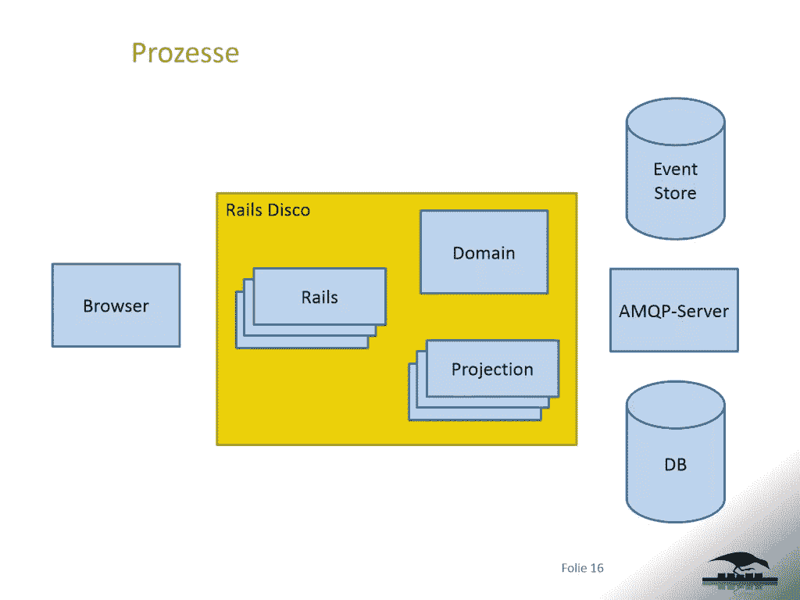
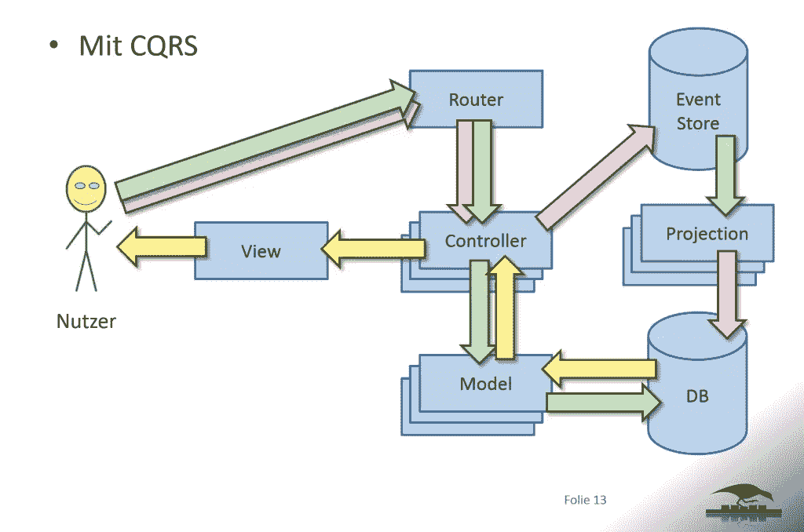
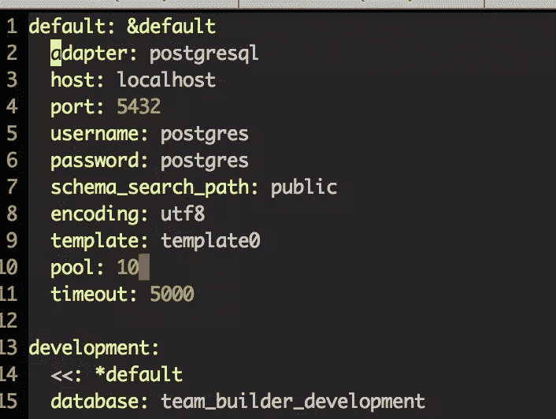
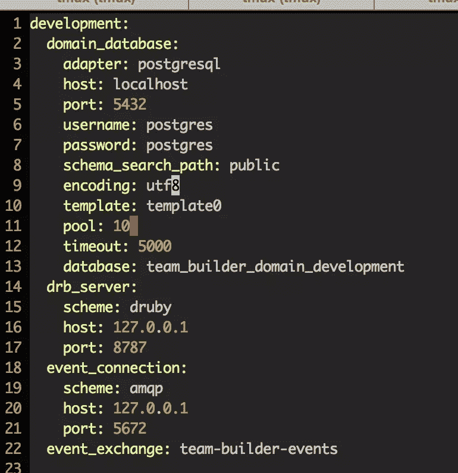

# Rails Disco:了解事件源

> 原文：<https://www.sitepoint.com/rails-disco-get-event-sourcing/>


旁白:我觉得你现在应该演奏比吉斯的[《你应该跳舞》](https://www.youtube.com/watch?v=4yAkkpbm_8E)。一旦它在后台运行，请继续阅读…

这里有一些问题要问你:

*   你去年的数据是什么样的？上周？
*   有多少不同的客户端应用程序正在使用您的单个数据存储？为了使用数据，他们做了多少数据转换？
*   您是否曾经更改过您的模型，导致繁琐的数据迁移，以便向现有数据添加新属性？
*   您是否曾经想要改变与您的数据相关的技术(例如，数据存储)，却因为迁移太难而拒绝了？

我最近不得不回答这些问题，我的答案很糟糕。所以，我问了自己另一个问题:我能做些什么来更好地回答这些(以及其他)问题？

经过一番研究，弹出的答案是“事件采购”。

## 事件采购 101

什么是事件采购？简而言之，存储使我们的数据/应用程序达到当前状态的事件。以下是马丁·福勒[的发言](http://martinfowler.com/eaaDev/EventSourcing.html):

> 事件源的基本思想是确保在事件对象中捕获应用程序状态的每个变化，并且这些事件对象本身按照它们被应用的顺序存储，与应用程序状态本身具有相同的生存期。

那篇链接文章值得一读。活动采购领域的“大脑”是 [Greg Young](http://goodenoughsoftware.net/about/) ，他有几个关于活动采购的绝佳资源，包括:

*   演讲:[“CQRS 与活动采购”](https://www.youtube.com/watch?v=JHGkaShoyNs)(沙滩上的代码)
*   视频:[“多语言数据”](http://youtu.be/hv2dKtPq0ME)
*   文章:[“为什么使用事件采购？”](http://codebetter.com/gregyoung/2010/02/20/why-use-event-sourcing/)
*   软件: [EventStore](http://geteventstore.com/) 可能是最大的致力于事件源的软件。不幸的是，它没有 Ruby 包装器，只有 Java 和 C#。不管怎样，[的文件](http://docs.geteventstore.com/)绝对值得一读。

快速谷歌“格雷格杨事件采购”将带来更多的资源。

Young 先生的上述介绍提到了 CQRS，它代表命令查询责任分离。CQRS 背后的基本概念是将改变数据的事情(命令)与请求数据的事情(查询)分开。分离可以是不同的类或完全不同的应用。同样，我们将[转向福勒先生](http://martinfowler.com/bliki/CQRS.html):

> [CQRS]它的核心是一个简单的概念，你可以使用不同的模型来更新信息，而不是你用来读取信息的模型。所谓独立的模型，我们通常指的是不同的对象模型，可能在不同的逻辑进程中运行，可能在独立的硬件上运行。

活动采购和 CQRS 是豌豆和胡萝卜，巧克力和花生酱。我强烈建议您在继续阅读本文之前先阅读一下这两个概念。这会让 rails-disco 更容易消化。

我将快速浏览一个场景，让事情变得更清楚，并介绍几个概念。想象一个用运动员建立运动队的应用程序。该域由一个团队模型和一个玩家模型组成。

使用事件源，当用户创建一个团队时，结果是一个带有团队数据的`CreatedTeamEvent`。当一个玩家被加入一个队伍时，一个`CreatedPlayerEvent`被创建。事件存储看起来像这样:

```
CreatedTeamEvent {"name": "Cowboys"}
CreatedTeamEvent {"name": "Redskins"}
CreatedPlayerEvent {"name": "Troy Aikman", "number": "8", "position": "QB", "team": "Cowboys"}
DeletedTeamEvent {"team": "Redskins", "reason": "Because they are awful"}
```

问题是，当所有团队都被请求时，应用程序向用户显示什么？它可以在每次球队被邀请时重播比赛。然而，它是不可扩展的。事件源的原则之一是永远不删除数据。永远不会。让它深入人心。您不能删除事件，因为事件必须是可重放的，以确保您以正确的应用程序状态结束。因此，为每个查询重放事件可能会有一点效果，但是随着事件数量的增加，查询会成为一个瓶颈。你是做什么的？

用事件采购的话说，答案是:预测。“预测”是数据的滚动快照。本质上，投影使用事件并将数据写入特定客户机的规范。对于 Rails 应用程序，我们可能会创建一个`Team`模型，并为事件存储中的每个`CreatedTeamEvent`创建一个团队。我们的投影基本上订阅了事件，就像 RSS/Atom 提要一样。理解投影负责管理自己的订阅是很重要的，就像 RSS/Atom 客户端一样。

可以添加预测来回答许多常见问题/场景:

*   想为你的 Rails 应用程序切换到一个新的数据存储吗？创建一个使用事件并将数据写入新存储的投影。然后，从事件 0 开始，遍历所有事件。
*   想要为使用非规范化数据结构的报告创建单独的数据存储吗？完成了。
*   想知道去年夏天队里有哪些球员？完成了。
*   需要对您的数据模型进行重大更改吗？执行此操作，更改投影以处理新模型，并从事件 0 开始运行事件。

这种可能性实在是太遥远了，看不见了，一点也不！

## 铁轨迪斯科

既然你已经了解了活动采购的基本知识，那么一个穿喇叭裤的 Rubyist 该怎么做呢？答案是来自[希克纳克软件](https://www.hicknhack-software.com/)的时髦猫的 [rails-disco](https://github.com/hicknhack-software/rails-disco) 宝石。

Rails Disco 是“带有命令、事件和投影的分布式聚会”。它由三种宝石组成:



(图片由希克纳克提供。他们在德国跳舞。)

*   活动域——“一个允许编写域服务器、处理命令和创建事件的框架。”
*   活动事件–包含进入事件存储的事件、命令和事件验证。
*   活动投影——消费事件和创建 Rails 数据库模型的投影。

Rails Disco 假定某种基础设施变得时髦起来:

*   分布式 Ruby (DRb)服务器用于向域传递命令。
*   RabbitMQ 交换用于将事件从域发布到投影。因此，您必须安装并运行的 [RabbitMQ。](https://www.rabbitmq.com/download.html "Install RabbitMQ")
*   必须使用流式 web 服务器(如 Puma 或 Thin)。事件源更改通过流式传输传送给客户端。默认情况下，Disco 会将 Puma 添加到您的 Gemfile 中。

Rails disco 附带了一个`disco`可执行文件，允许 Rails 开发人员生成一个“Disco 脚手架”(顺便说一句，我喜欢把“Disco”放在其他单词前面。最爱。宝石名称。永远不会。)因此，它还添加了一些由`disco`命令调用的生成器，我将使用它来设置应用程序。

### 高水位流量


(图片由希克纳克提供。Nutzer 的意思是“用户”。迪斯科疯子。)

通过 Rails Disco 应用程序的标准数据流如下:

1.  用户发出更改数据的请求，如“创建团队”。
2.  控制器发出改变的域命令。
3.  Domain 命令将自身传递给 DRb 服务器。
4.  DRb 服务器将命令与在事件域中存储事件的命令处理器相匹配。
5.  命令处理器将事件发布到事件服务器。
6.  事件服务器在 RabbitMQ 事件交换中删除一条消息。
7.  应用程序投影服务器接收来自 RabbitMQ 的消息。
8.  投影服务器创建域模型(在本例中是一个团队)
9.  用户发出查看新数据的请求，如“获取团队”
10.  标准的 Rails 控制器-模型-视图序列将数据呈现给客户机。

### 演示应用程序

如前所述，今天的演示应用程序是一个团队构建器。该应用程序允许创建球队，并向这些球队添加球员。我用的是 Ruby 2.1.2，Rails 4.1.6，Disco 0.5.3。

安装 rails-disco gem ( `gem install rails-disco`)并输入`disco new team-builder`来设置应用程序。输出看起来将非常类似于`rails new`吐出的东西。主要区别是一些额外的文件夹(`domain`、`app/commands`、`app/projections`)、一个新的可执行文件(`disco`)、一个新的控制器(`event_source_controller`)，以及一些其他的小添加。

进入**团队建设者** app 目录。在我们开始做甜蜜迪斯科之前，让我们做一些改变。首先，我将使用 PostgreSQL，因此添加' pg' gem，`bundle`，并更改数据库配置以使用它。



Rails Disco 有自己的配置文件。这个文件包含域事件数据存储、DRb 服务器和 RabbitMQ 连接和交换的信息。



请注意，我为我们的域(事件)和投影(标准 Rails)使用了不同的数据库名称，因此我将为域事件和投影使用不同的数据库。这更准确地模拟了“真实”安装的样子。

所有配置就绪后，是时候使用`disco`命令来创建我们的脚手架了。Rails disco 提供了一个镜像`rails scaffold`命令的命令:

```
disco g scaffold team name:string
```

这导致了相当多的输出，所以我只突出显示 Disco 添加的项目。

```
invoke  model
    invoke    projection
    create      app/projections/team_projection.rb
    create      test/projections/team_projection_test.rb
    ....
    invoke  command
    create    app/commands/create_team_command.rb
    create    app/events/created_team_event.rb
    invoke    command_processor
    create      domain/command_processors/domain/team_processor.rb
    insert      domain/command_processors/domain/team_processor.rb
    insert    app/projections/team_projection.rb
    create    app/commands/update_team_command.rb
    create    app/events/updated_team_event.rb
    invoke    command_processor
      skip      domain/command_processors/domain/team_processor.rb
    insert      domain/command_processors/domain/team_processor.rb
    insert    app/projections/team_projection.rb
    create    app/commands/delete_team_command.rb
    create    app/events/deleted_team_event.rb
    invoke    command_processor
      skip      domain/command_processors/domain/team_processor.rb
    insert      domain/command_processors/domain/team_processor.rb
    insert    app/projections/team_projection.rb
    ...
   prepend    app/views/teams/index.html.erb
   prepend    app/views/teams/show.html.erb
```

Disco 生成器(伙计，我喜欢打字)添加了一个投影，以及每个 CRUD 动作的命令-事件-处理器序列。最后，它还涉及到视图、前置和`event_source`辅助对象。

标准的控制器动作都在那里，但是它们不调用通常的 ActiveRecord 方法。

### 控制器变更

记住我们上面的流程，控制器运行一个域命令。该命令被验证，就像模型一样，然后被发送到 DRb 服务器进行处理。

```
class TeamsController < ApplicationController
  include EventSource

  def index
    @teams = Team.all
  end

  def show
    @team = Team.find(id_param)
  end

  def new
    @team = CreateTeamCommand.new
  end

  def edit
    @team = UpdateTeamCommand.new Team.find(id_param).attributes
  end

  def create
    @team = CreateTeamCommand.new team_params
    if store_event_id Domain.run_command(@team)
      redirect_to @team, notice: 'Team was successfully created.'
    else
      render action: 'new'
    end
  end

  def update
    @team = UpdateTeamCommand.new team_params.merge(id: id_param)
    if store_event_id Domain.run_command(@team)
      redirect_to @team, notice: 'Team was successfully updated.'
    else
      render action: 'edit'
    end
  end

  def destroy
    delete_team = DeleteTeamCommand.new(id: id_param)
    if store_event_id Domain.run_command(delete_team)
      redirect_to teams_url, notice: 'Team was successfully destroyed.'
    else
      redirect_to team_url(id: id_param), alert: 'Team could not be deleted.'
    end
  end

  private

  def team_params
    params.require(:team).permit(:name)
  end

  def id_param
    params.require(:id).to_i
  end
end
```

第一个值得注意的变化是包含了一个`EventSource`模块，它来自于 **app/concerns** 目录，只是添加了一些方法来存储会话中的事件 ID。我们正在创建模型，所以当它被创建时我们不能重定向到一个新的模型。Rails Disco 使用事件 id 来获得最终的模型 ID，做了一些漂亮的事情。

`find`和`show`动作不变。命令动作(`create`、`update`、`destroy`)是恐惧变得恐惧的地方。查看`create`动作，它创建一个`CreateTeamCommand`并将其传递给`Domain`。命令是做什么的？

### 命令

命令非常简单。命令负责验证并向表单提供数据。

```
class CreateTeamCommand
  include ActiveModel::Model
  include ActiveEvent::Command
  form_name 'Team'
  attributes :name

  validates :name, presence: true
end
```

如您所见，命令 simple 保存了对象的属性和验证。可以使用标准的 ActiveModel 验证方法，这很好。

如果命令有效，它将通过 DRb 传递给`Domain`，并最终由`ActiveDomain::CommandProcessor`处理。

### 命令处理器

命令处理器负责从命令中创建我们的域事件。命令处理器位于**域/命令处理器/域**中。在那里，你会发现**团队处理器**，它看起来像:

```
module Domain
  class TeamProcessor
    include ActiveDomain::CommandProcessor
    process DeleteTeamCommand do |command|
      if command.valid?
        event DeletedTeamEvent.new command.to_hash
      end
    end

    process UpdateTeamCommand do |command|
      if command.valid?
        event UpdatedTeamEvent.new command.to_hash
      end
    end

    process CreateTeamCommand do |command|
      if command.valid?
        id = ActiveDomain::UniqueCommandIdRepository.new_for command.class.name
        event CreatedTeamEvent.new command.to_hash.merge(id: id)
      end
    end

  end
end
```

非常简单，命令处理器为命令创建匹配的事件。这些事件将存储在我们的`domain_events`表中，并发布到 RabbitMQ 交换。

### 预测

由 Rails 应用程序启动的投影服务器正在侦听 RabbitMQ 事件交换上的事件。对于每个事件，投影服务器将遍历注册的投影并调用该事件。值得注意的是，并非所有的投影都会对所有事件进行更改。应用程序中可能有几个投影，每个投影处理事件的一个子集。

**app/projections/team _ projection . Rb**文件如下所示:

```
class TeamProjection
  include ActiveProjection::ProjectionType

  def deleted_team_event(event)
    Team.find(event.id).destroy!
  end

  def updated_team_event(event)
    Team.find(event.id).update! event.values
  end

  def created_team_event(event)
    Team.create! event.to_hash
  end
end
```

如果你记得，投影处理事件，把它转换成我们的应用程序可以读取的东西。对于 Rails 应用程序，这只是我们的 ActiveRecord 调用。

基本就是这样。如果你启动添加并进入`/teams/new`，你可以添加一个新团队并查看日志。您将看到如下消息:

```
2014-10-20 20:27:15 -0400: [Domain Server][DEBUG]: Published CreatedTeamEvent with {"name":"Cowboys","id":1}
2014-10-20 20:27:15 -0400: [Projection Server][DEBUG]: Received CreatedTeamEvent with {"name":"Cowboys","id":1}
2014-10-20 20:27:15 -0400: [Projection Server][DEBUG]: [TeamProjection]: successfully processed CreatedTeamEvent[1]
```

## 玩家会玩吗

到目前为止，我们构建的应用程序非常普通。我希望你更多地关注概念而不是实现，所以我不会把它弄得太复杂。但是，我想快速浏览一下添加玩家投影的步骤，这样您就可以看到如何处理关联，以及当您有多个投影时会发生什么。

球员有名字，位置，号码，并且必须在一个队里:

```
disco g scaffold player name:string position:string number:integer references:team
```

你已经知道那将会做什么，但是我们需要调整一些事情来确保一个球员总是在一个团队的环境中。

首先，通过移动`resources :players`来更改**配置/routes.rb** ，使其位于团队下:

```
resources :teams do
  resources :players
end
```

在`PlayersController`上，我们需要在每个动作运行之前抓住团队。

```
class PlayersController < ApplicationController
  include EventSource
  before_action team

  ...existing code...

  def create
    # Change the command to include the team_id
    @player = CreatePlayerCommand.new player_params.merge(team_param)
    ...the rest is the same...
  end

  ...existing code...

  def team_param
    params.require(:team_id).to_i
  end

  def team
    @team = Team.find(params[:team_id])
  end
end
```

我们添加了`before_action`并更改了`create`方法，将团队 id 传递给`CreatePlayerCommand`。

那个命令呢？它看起来是一样的，除了它有一个来自生成器的`references`属性。我要把它改成`team_id`:

```
class CreatePlayerCommand
  include ActiveModel::Model
  include ActiveEvent::Command
  form_name 'Player'
  attributes :name, :position, :number, :team_id
end
```

对`CreatePlayerEvent`做同样的事情:

```
class CreatedPlayerEvent
  include ActiveEvent::EventType
  attributes :id, :name, :position, :number, :team_id
  def values
    attributes_except :id
  end
end
```

最近一次与 Rails Disco 相关的变化发生在`PlayerProjection`。由于玩家被添加到一个团队中，所以在我们创建玩家之前必须找到这个团队:

```
class PlayerProjection
  include ActiveProjection::ProjectionType

  def deleted_player_event(event)
    Player.find(event.id).destroy!
  end

  def updated_player_event(event)
    Player.find(event.id).update! event.values
  end

  def created_player_event(event)
    attrs = event.to_hash
    team_id = attrs.delete(:team_id)
    return if team_id.nil? # Or raise
    team = Team.find(team_id)
    return if team.nil? # Or raise
    team.players.create! event.to_hash
  end
end
```

我们已经添加了一个属于另一个模型的模型，因此需要进行标准的 Rails & ActiveRecord 更改:

**应用/模型/团队. rb**

```
class Team < ActiveRecord::Base
  self.table_name = 'teams'
  has_many :players
end
```

**app/models/players.rb**

```
class Player < ActiveRecord::Base
  self.table_name = 'players'
  belongs_to :team
end
```

球员视图(在**应用/视图/球员**中)需要改变以反映球队。基本上任何地方看到`players_path`都改成`team_players_path(@team)`。你可能想给`teams/show.html.erb`添加一个“新玩家”链接。这些变化只是 Rails 的东西，我想你可以解决剩下的问题。如果没有，看看 Github 库，看看我做了什么。

如果你去一个团队(你已经添加了一个，对吗？)新球员页面(`/teams/1/player/new`，假设球队 ID 为 1)，然后填写并提交表单。以下是我在日志中看到的内容:

```
Started POST "/teams/1/players" for 127.0.0.1 at 2014-10-27 19:44:10 -0400
Processing by PlayersController#create as HTML
  Parameters: {"utf8"=>"✓", "authenticity_token"=>"kA23feXUmm6P3paIRO8IAeBt/YAmiQrmhjZZKaiwOhU=", "player"=>{"name"=>"Troy Aikman", "position"=>"QB", "number"=>"8", "team_id"=>"1"}, "commit"=>"Create Player", "team_id"=>"2"}
  Team Load (0.3ms)  SELECT  "teams".* FROM "teams"  WHERE "teams"."id" = $1 LIMIT 1  [["id", 1]]
2014-10-27 19:44:10 -0400: [Domain Server][DEBUG]: Published CreatedPlayerEvent with {"name":"Troy Aikman","position":"QB","number":"8","team_id":1,"id":1}
2014-10-27 19:44:10 -0400: [Projection Server][DEBUG]: Received CreatedPlayerEvent with {"name":"Troy Aikman","position":"QB","number":"8","team_id":1,"id":1}
Redirected to http://localhost:3000/teams/1/players
Completed 302 Found in 54ms (ActiveRecord: 0.3ms)

Started GET "/teams/1/players" for 127.0.0.1 at 2014-10-27 19:44:10 -0400
Processing by PlayersController#index as HTML
  Parameters: {"team_id"=>"2"}
  Team Load (0.3ms)  SELECT  "teams".* FROM "teams"  WHERE "teams"."id" = $1 LIMIT 1  [["id", 2]]
  Player Load (0.2ms)  SELECT "players".* FROM "players"
  Rendered players/index.html.erb within layouts/application (1.5ms)
Completed 200 OK in 26ms (Views: 24.9ms | ActiveRecord: 0.5ms)
2014-10-27 19:44:10 -0400: [Projection Server][DEBUG]: [PlayerProjection]: successfully processed CreatedPlayerEvent[4]
2014-10-27 19:44:10 -0400: [Projection Server][DEBUG]: [TeamProjection]: successfully processed CreatedPlayerEvent[4]
```

您可以看到事件被发布、接收和处理。注意，`TeamProjection`和`PlayerProjection`都获得了事件，但是只有`PlayerProjection`对它做了任何事情。

### 域事件

现在我们有了几个团队和玩家，让我们看看我们的领域数据。以下是`domain_events`表中的条目:

| 身份证明 | 事件 | 数据 |
| one | CreatedTeamEvent | {"name":"Cowboys "，" id":1} |
| Two | CreatedTeamEvent | {"name":"Redskins "，" id":2} |
| three | CreatedPlayerEvent |  |

回到我们的 Rails 数据，`projections`表中有 2 个条目:

| 身份证明 | 类别名称 | 姓氏 id | 固体 |
| one | 团队预测 | three | 真实的 |
| Two | 玩家投影 | three | 真实的 |

如您所见，每个投影负责管理它所处理的事件。

Rails Disco 还有一些其他的表，但是上面的数据对于基本概念来说是最重要的。

### 重放投影

事件源的一个要点是能够在新的需求和情况出现时播放/重放预测。在我们的演示中，我们可以通过一个简单的例子看到这一点。

启动 Rails 控制台，删除所有团队和玩家(`Team.delete_all`、`Player.delete_all`)。此时，我们必须通过将它的`last_id`值重置为开始事件的 id 来告诉投影重放所有事件。因此，如果您在`domain_events`表中的第一个事件是 1，那么打开一个 SQL 提示符(我使用 pgAdmin3，FWIW)并键入:

```
update projections set last_id=0
```

> 更快的方法是简单地使用`rake db:drop`和`rake db:migrate`。

现在，当您重新启动服务器时，您会看到日志中正在重播的所有事件:

```
2014-10-28 05:18:29 -0400: [Domain Server][DEBUG]: received resend request with id 1
2014-10-28 05:18:29 -0400: [Domain Server][DEBUG]: Republished CreatedTeamEvent with {"name":"Cowboys","id":1}
2014-10-28 05:18:29 -0400: [Domain Server][DEBUG]: Republished CreatedTeamEvent with {"name":"Redskins","id":2}
2014-10-28 05:18:29 -0400: [Domain Server][DEBUG]: Republished CreatedPlayerEvent with {"name":"Troy Aikman","position":"QB","number":"8","team_id":1,"id":1}
2014-10-28 05:18:29 -0400: [Projection Server][DEBUG]: Received CreatedTeamEvent with {"name":"Cowboys","id":1}
2014-10-28 05:18:29 -0400: [Projection Server][DEBUG]: [PlayerProjection]: successfully processed CreatedTeamEvent[1]
2014-10-28 05:18:29 -0400: [Projection Server][DEBUG]: [TeamProjection]: successfully processed CreatedTeamEvent[1]
2014-10-28 05:18:29 -0400: [Projection Server][DEBUG]: Received CreatedTeamEvent with {"name":"Redskins","id":2}
2014-10-28 05:18:29 -0400: [Projection Server][DEBUG]: [PlayerProjection]: successfully processed CreatedTeamEvent[2]
2014-10-28 05:18:29 -0400: [Projection Server][DEBUG]: [TeamProjection]: successfully processed CreatedTeamEvent[2]
2014-10-28 05:18:29 -0400: [Projection Server][DEBUG]: Received CreatedPlayerEvent with {"name":"Troy Aikman","position":"QB","number":"8","team_id":1,"id":1}
2014-10-28 05:18:29 -0400: [Projection Server][DEBUG]: [PlayerProjection]: successfully processed CreatedPlayerEvent[3]
2014-10-28 05:18:29 -0400: [Projection Server][DEBUG]: [TeamProjection]: successfully processed CreatedPlayerEvent[3]
2014-10-28 05:18:29 -0400: [Projection Server][DEBUG]: All replayed events received
```

就像迪斯科一样，你的数据又回来了！(好吧，也许迪斯科不回来了，但我可以做梦，对吧？)

所有这些时髦的迪斯科魔术的来源是 Github 上的

## CompletedPostOnRailsDiscoEvent

像这类帖子经常出现的情况一样，这个例子有点做作。我让 Hicknhack Software 的 Andreas Reischuck 评论了这篇文章，他补充了以下内容:

> 我想补充一件小事。来自生成器的 CRUD 部分将只显示 Rails Disco 是如何工作的。如果你开始添加语义域事件，闪亮的部分开始发挥作用。对于您的演示，我可以想到 PlayerChangedTeam(涉及玩家、团队和资金)、PlayerBecomesCoach 和其他特定领域的事件。

安德烈亚斯提出了一个很好的观点。我的演示非常粗糙，但是大多数领域都有领域逻辑更复杂的事件。在这种情况下，事件采购是天赐良机。

有你的活动采购和铁路迪斯科旋风之旅。Rails Disco 还有更多功能，但我不想说得太远。我真的认为活动采购是你 17 英寸的技能中应该有的一个概念。Rails Disco 确实给 Ruby 带来了事件源的乐趣和节奏，所以赶快来看看吧。我得走了，你们这些酷猫！

*趾高气扬地说“你应该~~跳舞~~采购，耶”*

我想真诚地感谢 HicknHack Software 的 Andreas 审阅本文。

## 分享这篇文章