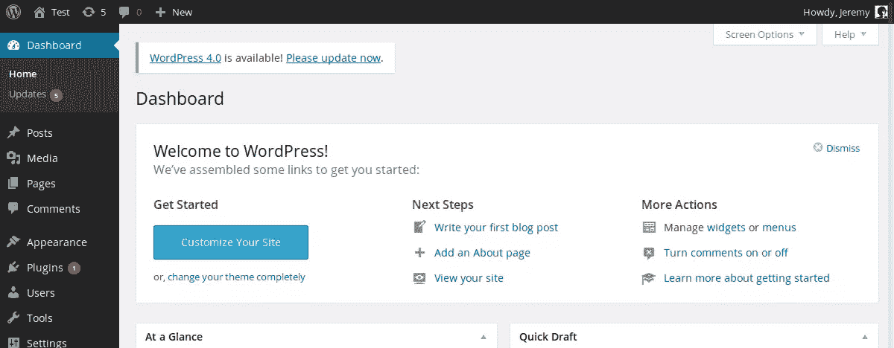
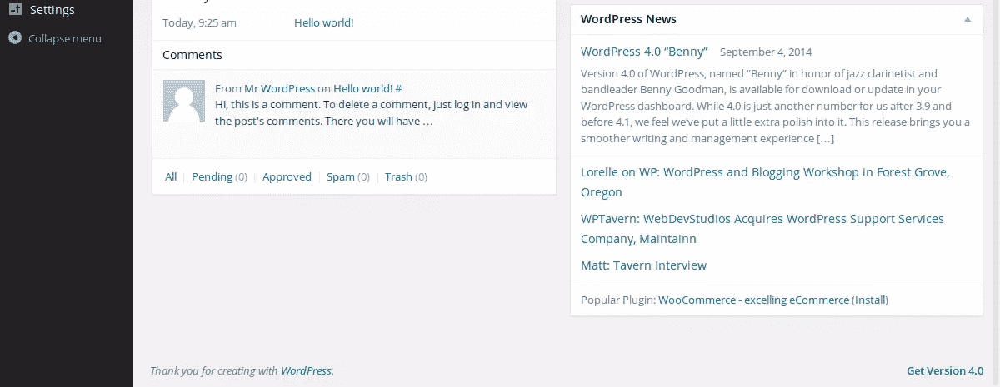
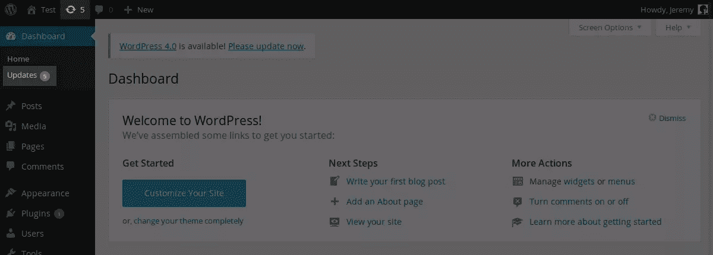
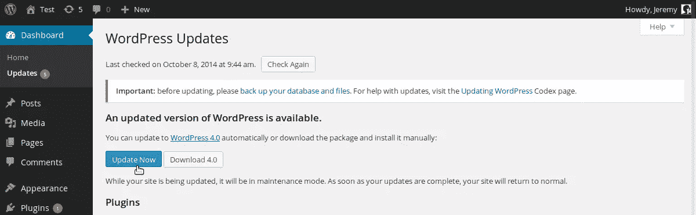
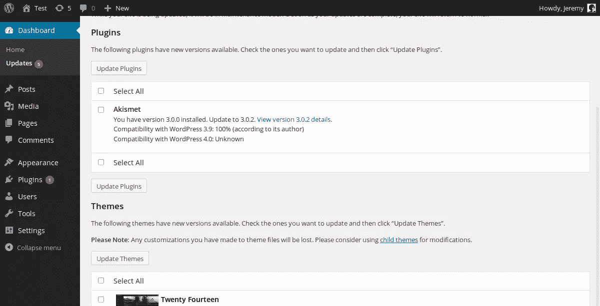
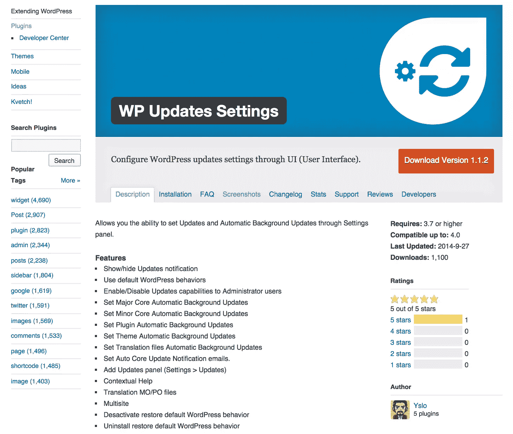

# 更新 WordPress、插件和主题的指南

> 原文：<https://www.sitepoint.com/a-guide-to-updating-wordpress/>

WordPress 是一个很棒的 CMS，并且越来越受欢迎。像任何事情一样，它并不完美。我们都有不同的需求，现成的 WordPress 无法满足所有的需求。这就是插件和主题存在的原因。

如果你使用 WordPress，很可能你已经安装了插件和主题来满足你的特殊需求。在 WordPress 和其他第三方网站上有数千个公开的插件和主题，但是安装一个插件，一个主题，甚至是 WordPress 本身，只是第一步。

WordPress 是一个活的项目。开发者在这个 CMS 上努力工作，为我们提供了一个可靠的平台，我们可以对许多可用的插件或主题说同样的话。然而，任何软件都可能出现问题。其中一些是用户错误，可以通过为用户简化 WordPress 来避免。不过，有些错误是在你的插件或主题中引入或发现的。要使用新开发的功能，或者防止潜在的错误或删除现有的错误，您应该保持最新。更新 WordPress 核心以及你的主题和插件是很重要的，这就是我们将在这篇文章中讨论的。

## 为什么要更新？

WordPress 及其插件和主题就像你电脑上安装的任何其他软件，或者像你设备上的任何其他应用程序。开发人员定期发布更新，提供新功能或修复已知缺陷。

也许新功能不是你一定想要的？事实上，也许你对现有的功能很满意，不需要更多了？好吧，你可能还是会担心虫子。

软件错误可能有多种形式和大小。一个 bug 可能是巨大的，比如阻止用户使用一个插件，也可能是非常小的，比如只涉及某个主题的某个部分。在某些情况下，bug 甚至可能是严重的安全漏洞。

不管软件错误的严重程度如何，都必须修复。作为一个用户，当一个修复了一个 bug 的软件更新发布时，你应该尽快更新以拥有该产品最安全和稳定的版本。

WordPress 及其主题和插件也是如此。更新并不难，那么是什么在阻止你呢？

## 如何知道是否有可用的更新？

正如我之前提到的，更新我们的软件是重要的，但是我们不能每天监控 WordPress 或者我们的插件或者主题是否有新的版本，特别是如果我们使用了很多的话。

幸运的是，如果有新版本的 WordPress，你不会错过它，因为你会在你的管理面板的几乎每一页的顶部看到一条消息。您甚至会在这些页面的底部看到另一条消息！





对于插件和主题，这是不同的，但如果它们在 WordPress.org 上可用，那么 CMS 可以告诉你是否有新版本发布。你所要做的就是访问 WordPress 仪表盘的“更新”部分。

您将在菜单中的此项旁边看到有多少更新可用。当您登录后，该号码还会出现在网站所有页面屏幕顶部的栏中。如果这个数字没有出现，好消息是:WordPress 和你所有的插件和主题都是最新的！



## 更新 WordPress

更新 WordPress 本身是非常重要的，因为 CMS 是它成功的受害者。WordPress 被全世界数百万人使用，是一个很好的目标:一个安全漏洞可以影响许多网站。

幸运的是，WordPress 是开源的，安全漏洞可以很快被发现和修复。但是，为了安全起见，您必须更新您的安装。

要更新 WordPress，你必须手动或自动添加、删除和替换一些文件。如果你在更新安装时出现问题，WordPress 可能会被破坏，我敢肯定这不是你想要的！

这就是为什么你应该在更新之前备份你的 WordPress 安装程序，以确保你可以恢复旧的但是有效的安装程序。

### 一键更新 WordPress

从 2.7 版本开始，由于一次点击的方法，快速简单地更新 WordPress 成为可能。这种方法是首选，因为 WordPress 会自动下载并替换正确的文件。这样，您可以避免错误并赢得时间。

要一键更新 WordPress，进入“仪表板”菜单的“更新”条目。如果你没有 WordPress 的最新可用版本，你会在两个按钮前看到“WordPress 的更新版本可用”的消息。

点击第二个按钮，你将下载一个包含 WordPress 最新版本的 ZIP 存档。然后你将能够创建一个新的 WordPress 安装或者手动更新你当前的安装(这将在下面描述)。



第一个按钮是一键式方法。如果你点击“立即更新”按钮，WordPress 会带你到另一个页面，通知你进度:它会自动下载最新版本，停用你的插件，替换正确的文件，重新激活你的插件。你所要做的就是等待几秒或几分钟。

### 自动更新 WordPress

在 3.7 版本中，WordPress 引入了自动更新。由于这个特性，CMS 将每天检查 WordPress 是否有新的次要版本。如果是这样的话，它会单独下载并安装，不需要你做任何事情，甚至不需要点击。

默认情况下，如果最新的可用版本是主要版本，你仍然需要自己更新，一键或手动更新，但你可以确保总是拥有 WordPress 的最新稳定版本。

例如，如果你使用的是 WordPress 4.0，并且有 4.0.1 版本，WordPress 会自动安装。但如果新版本是 4.1 之类的，就不会了。

总是拥有最新版本是很重要的，如果有小更新，你应该尽快更新，因为小更新可以修复错误。这就是为什么自动更新是有用的，因为你不必担心是否有最新的补丁:你可以肯定这是事实。

默认情况下，自动更新处于启用状态。但是如果你想禁用它们，仍然可以在 WordPress 安装的根目录下的`wp-config.php`文件中添加一个新的常量。

```
define('AUTOMATIC_UPDATER_DISABLED', true);
```

定义另一个常量，您甚至可以为主要更新启用自动方法。仍然在`wp-config.php`文件中，添加下面一行:

```
define('WP_AUTO_UPDATE_CORE', true);
```

当有新版本时，它会自动更新 WordPress，不管是小版本还是大版本。如果你使用 WordPress 的开发版本，开发更新也将自动使用这个常量。

该常量可以取三个不同的值:`true`，启用自动次要、主要和开发更新；`false`，禁用所有更新；或者`'minor'`，仅启用自动次要更新(这是默认行为)。

如果出于某种原因不想编辑`wp-config.php`文件，也可以启用或禁用过滤器自动更新。

例如，上面看到的`AUTOMATIC_UPDATER_DISABLED`常量可以通过在你的主题的`functions.php`文件或者插件中添加下面一行来替换:

```
add_filter('automatic_updater_disabled', '__return_true');
```

这将禁用自动更新。

其他过滤器可以启用或禁用特定的自动更新。对于每个过滤器，如果您想要启用相应类型的更新，您的函数必须返回`true`，否则返回`false`。

```
// Disable automatic minor updates
add_filter('allow_minor_auto_core_updates', '__return_false');

// Enable automatic major updates
add_filter('allow_major_auto_core_updates', '__return_true');

// Enable development updates
add_filter('allow_dev_auto_core_updates', '__return_true');
```

### 手动更新 WordPress

你应该总是选择自动或一键更新 WordPress。然而，如果你愿意或者因为某些特殊原因你没有选择的话，当然还是可以手动更新 CMS。

小心:你是人类(我想！)，因此您可能会出错并中断您的安装，因此请务必按照说明一步步操作。此外，请记住，首先备份您的安装总是一个好主意。

1.  下载 WordPress 的最新版本。你可以用我们在描述如何一键更新时看到的按钮来完成，或者你可以从 WordPress.org 下载。你会得到一个存档，所以解压它。

2.  为了确保插件在更新过程中不会导致错误，请停用您使用的所有插件。你可以很快地做到这一点，这要感谢下拉列表中的“停用”选项，你可以在选择所有插件后使用它。

3.  现在你必须替换正确的文件。在您当前的安装中，删除`wp-includes`和`wp-admin`文件夹。然后上传新的。

4.  将新`wp-content`文件夹的内容上传到旧文件夹。覆盖现有的文件，你将更新旧的官方主题和插件。别担心，其他插件和主题会保持不变，你的媒体文件不会受到影响。

5.  对根目录中的文件做同样的事情:上传所有的文件，用新的文件替换它们。你唯一需要担心的文件是`wp-config.php`，但它不会被覆盖，因为它在新版本中不存在:在你下载的档案中，`wp-wonfig.php`被命名为`wp-config-sample.php`。现在，您必须将该文件与您的`wp-config.php`文件进行比较，以确保没有添加新行:如果是这样，请将新行从`wp-config-sample.php`复制并粘贴到您的旧`wp-config.php`文件中。

6.  有时，自动更新会失败，一个`.maintenance`文件会被添加到您的安装中。如果您手动更新以解决该问题，则需要删除该文件。

7.  您的数据库可能也需要更新。访问您的管理面板，看看是否是这种情况:如果是，将出现一条消息，包含一个链接。点击它，你的数据库将被更新。

8.  更新本身已经完成。你现在要做的就是重新激活你使用的插件。

## 更新插件和主题

更新核心 WordPress 很重要，但是更新你使用的主题和插件也很重要，因为其中一个的错误会影响你的整个安装。

### 一键更新

像 WordPress 本身一样，你可以用一键点击的方法更新插件和主题。为此，请转到管理面板的“更新”部分。

如果有一些插件或主题可以更新，它们会出现在这里，就在告诉你 WordPress 的新版本是否可用的部分的下面。

要更新您的插件，请选择它们并单击“更新插件”按钮。对主题也可以这样做:选择它们，然后点击“更新主题”。



无论是插件还是主题，你都会被带到另一个页面，这个页面会告诉你更新的进度，就像 WordPress 更新一样。

请注意，对于插件，另一个部分也将允许您一键更新:仪表板中的“已安装插件”部分。如果一个插件可以更新，它的正下方会出现一条消息，带有自动更新的链接。你甚至可以选择你所有的插件，并在下拉列表中选择“更新”来批量更新那些需要它的插件。

### 自动更新

我们在上面看到 WordPress 本身可以自动更新，不需要你做任何事情。它非常实用，如果你是自动更新的粉丝，你会很高兴知道 WordPress 也可以自动更新你的插件和主题。

默认情况下，插件和主题的自动更新是禁用的。要启用它们，你可以在你的主题的`functions.php`文件或插件中添加一个过滤器，就像你对 WordPress 核心更新所做的那样。

```
// Enable automatic updates for plugins
add_filter('auto_update_plugin', '__return_true');

// Enable automatic updates for themes
add_filter('auto_update_theme', '__return_true');
```

然而，与 WordPress 本身相反，你不能在`wp-config.php`文件中用一个常量为插件和主题启用自动更新:对于插件或主题，你别无选择，必须使用过滤器。

### 手动更新插件和主题

像 WordPress 一样，用一键式方法更新插件和主题是首选。但是您也可以手动更新它们。在某些情况下，你将别无选择:例如，如果一个插件在 WordPress.org 上不可用，WordPress 就不能给你一键点击的方法。

要手动更新一个插件，首先要在 WordPress.org 或其官方网页(如果有的话)上下载新版本。在大多数情况下，你会得到一个存档，所以解压它。然后，停用插件，以防止最终的错误。

如果插件是一个单独的文件，通过将新的文件直接上传到`wp-content`的`plugins`子目录来替换它。但是大多数插件都存储在一个文件夹中，如果是这样的话，将新版本的内容上传到旧文件夹中，覆盖现有的文件。然后，重新激活插件。

手动更新一个主题是相似的，所以，就像我们对插件所做的那样，从下载新版本并解压存档开始。

如果您当前正在使用您想要更新的主题，您现在应该通过激活另一个主题来停用它。然后将新版本的内容上传到旧版本中，替换旧文件。现在，你可以重新激活这个主题。

## 关于一键式方法和自动更新

WordPress 无法检查您使用的所有插件和主题是否都有新版本。每天，它都会检查 WordPress.org 上可用的那些是否是这种情况。

如果一个插件或者一个主题不在这个平台上，WordPress 无法向你推荐一键点击的方法，自动更新对这个也不起作用。

但是，即使你有访问一键或自动更新，它可能不会工作，尤其是如果你试图更新你的计算机上的本地安装。

为了能够自动更新 WordPress，插件或主题，CMS 必须有写文件的权利。换句话说，WordPress 文件必须由 web 服务器用户拥有，或者这个用户必须有权利写这个文件。

## 更新工具和服务

当我们谈到更新的话题时， [WP 更新设置](https://wordpress.org/plugins/wp-updates-settings/)是一个方便的插件，如果你喜欢使用插件，它会给你一个简单的界面来使用上面讨论的选项。



还有一些第三方服务和工具可以帮助您管理更新(以及其他)。 [ManageWP](https://managewp.com/) 、 [InfiniteWP](http://infinitewp.com/) 、 [WP Remote](https://wpremote.com/) 、 [MainWP](https://mainwp.com/) 甚至主机管理平台如 [Plesk 12 的 WordPress 工具包](https://www.sitepoint.com/plesk-12-wordpress-toolkit/)都有自己的机制来管理更新。

## 最后

运行您使用的软件的最新版本非常重要。现在，你知道如何用 WordPress，它的插件和主题来做到这一点。

如您所见，更新它们的方法不止一种。你应该总是选择一次点击和自动方法，因为它们更简单，更快，更不容易出错。然而，手动更新仍然是一种选择，有时是唯一的选择，所以知道如何做也很重要。

如果你想一直拥有最新版本的 WordPress，插件和主题，自动更新是很实用的。所有这些都可以自动更新，所以没有时间不能成为不更新的借口！

## 分享这篇文章