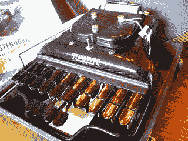
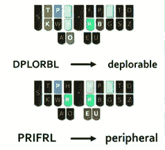
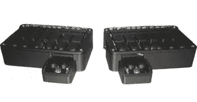

# 以每分钟 240 字的速度写作的百年老窍门

> 原文：<https://www.sitepoint.com/trick-to-writing-coding-faster/>

摄影:尼尔费恩

见过这些坏男孩中的一个吗？这是 1912 年的一些重要的尖端技术——[速记机](http://en.wikipedia.org/wiki/Stenotype)。

如果你在现实生活中没有遇到过，你很可能在电视或电影中见过。在法庭剧里，经常有一个穿着拘谨的女人站在一边，静静地敲着一台看起来像婴儿打字机的东西。

速记仍然是一项需要大量训练和实践才能掌握的专业技能，但需求量仍然很大。

速记机器只有 22 个键，没有空格键。速记员使用组合键——很像钢琴上的和弦——来触发更长的单词，而不是键入每个字母来组成一个单词。

最初，速记员制作了一卷卷的编码速记，这些编码速记后来被手动转换成纯文本。今天更先进的机器实时处理转换。

除了法庭报道，速记员还经常被用于电视直播字幕，以及其他一般的商业场合。

虽然学习速记有摩擦点，但速记员有一个很好的理由来承担昂贵的学费，陡峭的学习曲线和昂贵的硬件(最高端的机器超过 4000 美元)。

速记很快。*真的*快。

一个好的速记员可以以每分钟 240 字的速度巡航*并有 99.9%的准确率。每四页就有一个错误。*

 *### 好的。我在乎…，*为什么*？

大约四年前，速记员米拉拜·奈特(Mirabai Knight)得出结论，速记在太长时间里一直是一个有围墙的花园——被大公司控制和边缘化。她着手创建自己负担得起的硬件和开源软件，旨在让大众免费使用速记。

这个名为 [Plover](http://plover.stenoknight.com/) 的系统可以被图书作者、记者、博客作者以及对我们来说很重要的**程序员和开发人员**在我们的日常工作中使用！

在一个演示中，Mirabai 展示了她能够在 Python 中击 140 次键，并在不到 50 次键的情况下用速记再现它！现在，我知道有很多“维姆忍者”对他们高超的键盘技能感到自豪，但如果他们能达到这种效率，我会感到惊讶。

Plover 提供了一套激光切割的“按键”,可以直接安装在键盘上。请注意，这种键盘需要能够识别多个同时击键，因此[游戏键盘(起价 50 美元)是标准的](http://www.amazon.com/Microsoft-JQD-00001-SideWinder-X4-Keyboard/dp/B002ZV51DI)。

还有许多项目致力于开发价格合理的独立硬件解决方案。约书亚·丽芙顿正在制作一个漂亮的、高质量的竹铝原型，名为[狭龙](http://stenosaurus.blogspot.com.au/2014/07/custom-key-caps-and-switches.html#gpluscomments "Stenosaurus - stenotype project ")。他希望在未来几个月通过[众筹活动](https://www.crowdsupply.com/stenosaurus/next-generation-open-stenotype)为其商业制作筹集资金。

速写板 1.1 套件。

[Stenoboard](http://utopen.com/stenoboard-kits/21-stenoboard-11-kit.html?#/electronics-bare_pcbs_components/plastic_parts-black_hq_plastic_par "Stenoboard") 是一个套件，可以让你用 Arduinos 和零件构建自己的 stenotype 单元。如果你喜欢，你甚至可以 3d 打印自己的零件。一套包括所有部件的基本套件将花费你大约 200 美元(例如航运)。

Plover 的软件组件是免费的、开源的、基于 Python 的，所以您应该能够让它在大多数系统上工作。

如果你感兴趣的话，去年 Mirabai 做了一个关于 Plover 的很棒的演讲，我把它包括在这里(大约 30 分钟)。

[//www.youtube.com/embed/Wpv-Qb-dB6g](//www.youtube.com/embed/Wpv-Qb-dB6g)

### 学习曲线

虽然启动成本大大降低，但学习曲线肯定还在。Mirabai 估计可能需要 2-3 个月的练习才能复制你目前的 QWERTY 打字速度。

在那之后，你应该在接下来的 2-6 年里保持每月更快的速度，那时你将达到你的最高速度。

我认为你的时间投资是值得的。

##### 从 [SitePoint 设计简讯](https://www.sitepoint.com/newsletter/)重新发布* 

## *分享这篇文章*