# 使用 Komodo IDE 提高生产率

> 原文：<https://www.sitepoint.com/komodo-ide/>

*本文由[科莫多 IDE](http://komodoide.com/) 赞助。感谢您对使 SitePoint 成为可能的赞助商的支持！*

不可否认，开发人员的大部分时间都花在编辑器里，写代码。再加上你花在识别和尝试修复代码问题上的时间，一周可能会超过 40 个小时。

考虑到这一点，能够定制您的编码工具以适应您的视觉偏好和工作风格是非常重要的。更重要的是找到高效做事的方法，最大化你的生产力。为了达到这一点，您需要考虑一个可靠的、成熟的集成开发环境(IDE ),而不仅仅是一个代码编辑器。

ide 不仅仅是代码编辑器。它们提供了一整套开发工具。从代码调试器、集成版本控制——支持最流行的软件，如 Git、SVN、Mercurial——到单元测试环境，您可以在其中自动建立一个框架。任何一个 IDE 都可以让你感觉像在家里一样，允许你自定义环境，以符合你的最佳工作方式。

虽然大多数强大的 ide 都拥有这些特性中的一部分或全部，但它们通常局限于特定的平台或编程语言。您通常需要为您选择用来开发的每个操作系统或语言购买一个许可证。这是一个代价高昂的提议，但幸运的是，它并不适用于所有的 ide。

Komodo IDE 的突出之处在于它提供了一个单一的许可证，可以在所有平台上使用——Windows、OS X 和 Linux——来开发多种语言。您不需要浪费金钱为每个平台购买单独的许可证密钥，也不需要担心兼容性或被迫忍受一个平台的特殊怪癖。Komodo 还提供了大量的定制和可扩展性，以及顶级的版本控制和调试服务。

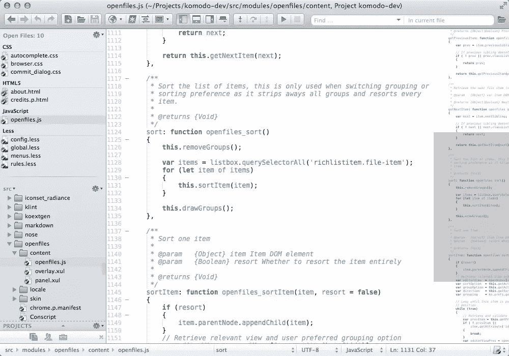

在这篇文章中，我将回顾 Komodo IDE 第 8 版，概述它的特性和优点，您将了解这个软件如何帮助您编写更好的代码，并成为一个更有生产力的开发人员。

*对于下面显示的截图，我在根据自己的喜好定制了科莫多之后，使用了科莫多的“深渊”皮肤*。

## Komodo IDE 如何帮助您

Komodo IDE 是一个跨平台的 IDE，支持当今使用的大多数主要编程语言，如 PHP、Ruby、Node.js 和 Python。IDE 也跨越边界进入前端，支持 HTML、CSS 和 JavaScript。

它的“跨平台”特性意味着你可以在所有主流操作系统上运行该软件，包括 OS X、Windows 和 Linux。如果你在一个团队中工作，团队成员使用不同的操作系统，这很好。

这些跨平台的能力源于 Komodo 对 Mozilla 引擎的实现，这个框架同样支持跨平台浏览器 Firefox。

越来越多的公司为开源世界和教育机构免费提供他们的软件，Komodo IDE 背后的团队 ActiveState 也不例外，它为个人/自由职业者、公司和开源项目提供了一系列许可选项。前往网站下载免费试用版。

Komodo IDE 背后的公司 ActiveState 也提供了该软件的免费开源版本,去掉了所有高级功能，留给你一个强大的精简代码编辑器。

## Komodo IDE 的主要特性

Komodo IDE 具有均衡的特性选择，拥有你所期望的 IDE 的一切，而不会变得臃肿。

除了编辑器之外，IDE 还具有调试器、单元测试、灵活的“工具箱”、版本控制系统集成、团队协作以及具有自动完成和智能代码重构功能的强大代码智能。

### 调试器

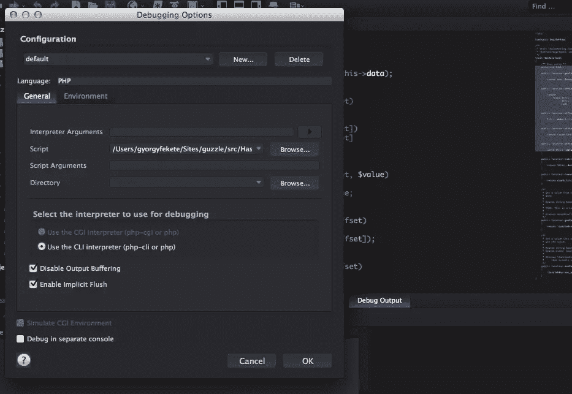

Komodo 有一个强大的调试引擎，具有你所期望的所有特性，比如查看调用堆栈、断点、远程调试和一个交互式 shell。

要启动调试器，进入*调试- >继续/继续*或中的*调试- >步骤。默认情况下会出现*调试选项*窗口，您可以在其中配置调试器环境，如选择编程语言、设置环境变量或插入附加参数。*

目前 Komodo 支持 Perl、Python、PHP、Ruby、XSLT 和 Tcl 编程语言。它会根据当前打开的文件的扩展名自动检测编程语言。

### 工具箱

工具箱是 Komodo 的一个非常有用的功能，允许你在边栏中存储代码片段、JavaScript 宏、模板甚至 URL，以便快速访问。这开启了各种自动化的可能性，例如，允许您创建自动缩写的代码片段。

要打开工具箱，请转到视图->选项卡和边栏->工具箱。默认情况下，工具分为三个文件夹:顶层是全局工具箱，另外两个工具箱是共享工具箱和项目工具箱。您可以根据需要创建任意多个工具箱文件夹。

顶层工具箱可以应用于你正在处理的任何文件，共享工具箱是可以与你的团队成员共享的工具，或者在其他 Komodo 安装中可用的工具，最后，项目工具箱包含当前活动项目特定的和可见的工具。

### 代码智能

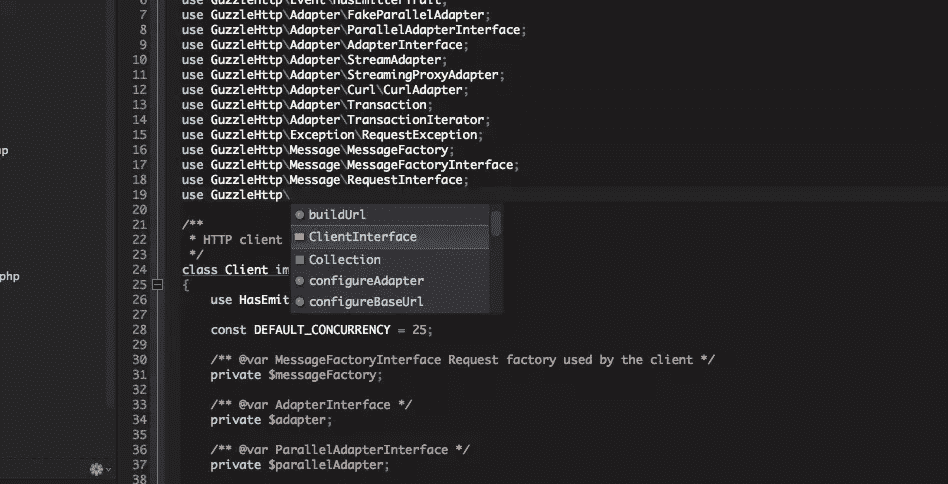

代码智能(或“代码完成”)是每个主流 IDE 的必备特性。科莫多也不例外，它有一个非常强大的引擎来实现这一功能。

Komodo IDE 中的代码智能不仅限于完成方法和属性名，它还具有代码重构能力和智能代码转换，如变量重命名和方法提取。

代码浏览器和定位定义也是 IDE 代码智能的一部分。代码浏览器允许您在树视图中导航源代码，单击其中一个方法或属性将跳转到文件中的那一行。很方便。

### 版本控制

IDE 的目标是帮助您快速高效地工作。这意味着开发工作流的每个部分在 IDE 中都应该有一个统一的过程。

版本控制也不例外。当然，您可以在命令行或第三方 GUI 客户端提交和管理代码，但这意味着您需要切换窗口，让 IDE 来完成给定的操作。

Komodo IDE 支持所有主要的版本控制系统，如 Git、Mercurial、Subversion、Bazaar、Perforce 和 CVS，允许您在 IDE 中管理版本控制。

默认情况下，版本控制是启用的，但是您可以通过点击*视图- >工具栏- >源代码控制*在项目级别上管理它。另一个图标将出现在您的工具栏中，允许您对存储库执行操作。

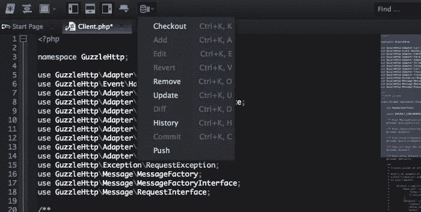

### 编者ˌ编辑

Komodo IDE 的代码编辑器非常可靠，拥有 IDE 的所有特性。一个引人注目的漂亮特性是**多行选择**。

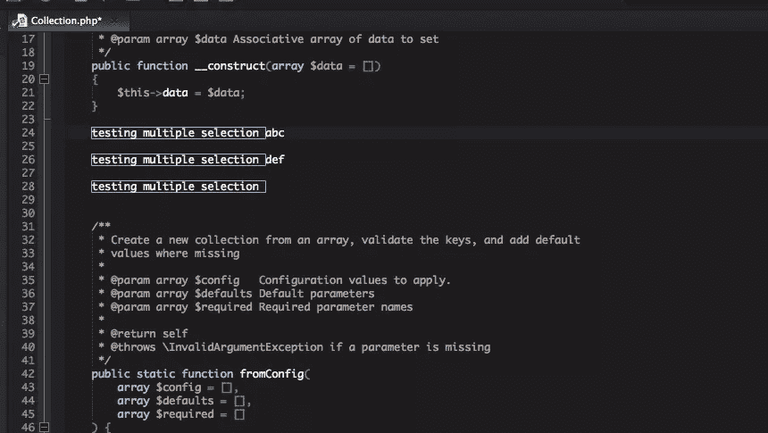

它真的很容易使用:转到你想要编辑的行，选择你想要的文本并点击 *CMD + D* (或 Windows 中的 *CTRL + D* )，或通过菜单访问该功能，*编辑- >选择- >多选-添加*。当您开始进行修改时，它们将影响所有选定的行。

**语法高亮显示**现在是任何有自尊的代码编辑器的标准特性。Komodo IDE 支持无数语言。只需点击底部的“文件类型”窗格来选择/取消选择多种语言。

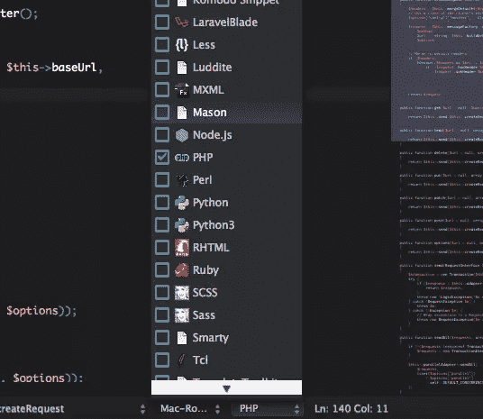

一个*小地图*面板显示在你编辑的每个文件中，你可以通过点击*视图- >视图小地图*来关闭这个面板。此面板显示文件内容的概述，允许您了解当前的位置，还可以查看文件嵌套的概述。

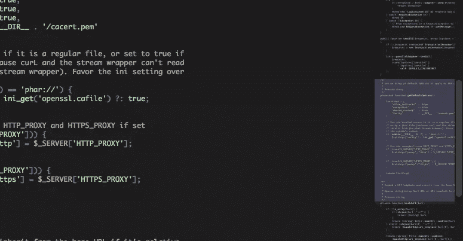

分割视图是另一个有用的功能，允许你在分割屏幕视图中打开多个文件。如果你想比较不同的文件，或者分别打开多种文件类型，比如在一个面板上打开 PHP，在另一个面板上打开 HTML 或 CSS，这是很有用的。

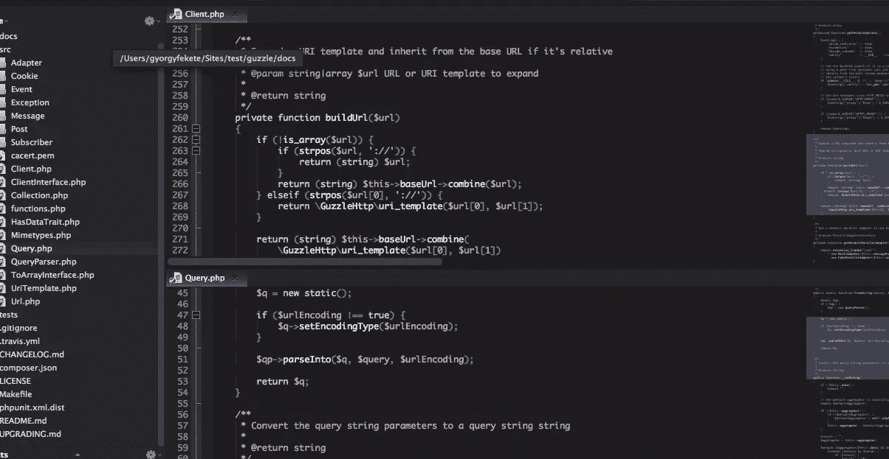

我喜欢的关于**编辑器标签**功能是标签的行为就像浏览器标签一样。例如，您可以通过点击 *CMD+N (CTRL+N)* 来创建一个新文件(您可以配置默认的文件类型)。如果不小心关闭了一个标签页，可以用*CMD+SHIFT+T(CTRL+SHIFT+T)*带回，也可以通过敲击 *CMD+W (CTRL+W)* 关闭一个标签页。您也可以通过左侧栏的“打开文件”小工具来管理您打开的文件。如果您正在处理大量文件，这将非常有用。

## 如何定制您的编辑器

Komodo IDE 在配置方面非常灵活。每个视图、图标和部分都可以定制，以满足您的需求。

我将在下面介绍最重要的几个。

### 自定义编辑器

默认配置很好，但是只需几分钟的配置就可以变得更好。

在我看来，字体大小和行高是首先要配置的最重要的，因为你会花大量的时间看代码。

Komodo IDE 的默认字体大小和行高对我来说太小了，所以让我们配置一下。进入*偏好设置*，点击*字体和颜色*，在*字体*选项卡上设置你的字体大小。

Komodo 8 没有行高设置。不过即将上市的科莫多 9 会有这个设定。下面是如何在 Komodo IDE 9 预发行版中设置行高:单击字体和颜色中的通用语法选项卡，然后选择 bracebad 元素类型。设置所需的大小，然后单击确定。

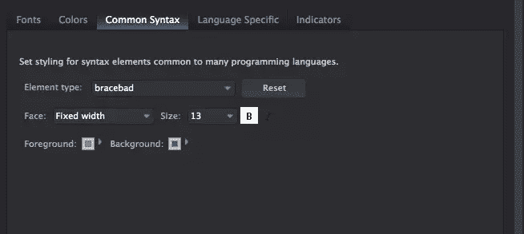

除了字体大小和行高，您还可以配置 IDE 体验的其他方面。

如果您希望空白区域可见，只需点击*查看- >查看空白区域*。如果您想要行号或识别指南，只需点击*视图- >查看行号*或*视图- >查看识别指南*。要应用这些选项的全局设置，请访问*首选项* - > *编辑器* - > *常规*。

配置的可能性是无限的。

### 皮肤和配色方案

我不知道你怎么想，但对我来说，深色主题比浅色背景更能放松我的眼睛。幸运的是，在 Komodo IDE 中改变主题非常容易。

在应用程序中更改整体颜色有两个方面。首先，您可以更改控制应用程序界面(工具栏、代码浏览器等)的*皮肤*。).您还可以更改*配色方案*，它控制代码编辑器本身。

转到*首选项*，点击*外观*，将*皮肤*从默认改为另一种皮肤(我选择了*深渊*，然后再次转到*字体和颜色*，从*配色方案*下拉列表中选择不同的方案。

我喜欢 *Dark_Wombatsosia* ，这是科莫多的一个核心配色方案，但你可以从他们的[网站](http://komodoide.com/resources/colorschemes/)下载其他的，包括[科莫多 9](http://komodoide.com/resources/colorschemes/komodo--base16collection/) 即将推出的配色方案预览。

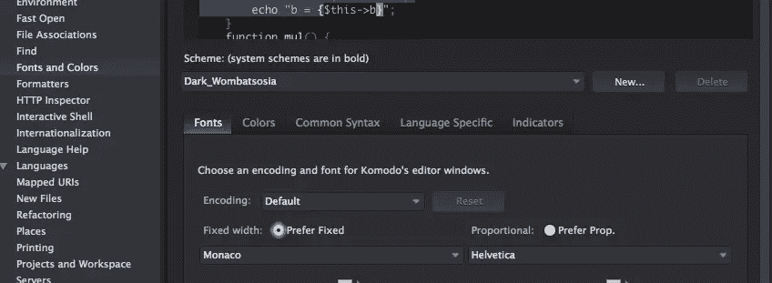

通过点击*语言特定的*选项卡，每个编辑器特定的配置也可以在语言级别上修改。

语法突出显示也可以在文件级别上启用。在文件编辑器中，点击底部的*文件类型*，检查文件中混合在一起的所有语言。

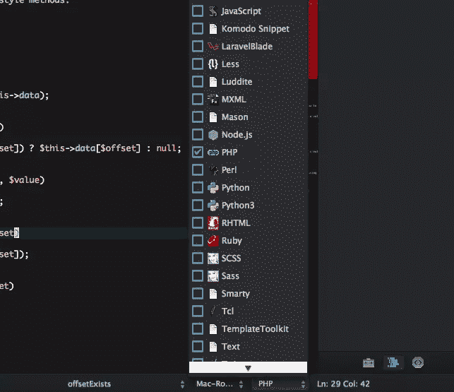

### 快捷键和按键绑定

快捷键和键绑定是快速浏览不同窗口的强大方法。

我在每个 IDE 中使用的最强大、最快速的快捷方式之一是快速打开文件，而不需要在文件树中搜索。在 Komodo 中，这个快捷方式在 Mac 上是 *CMD+SHIFT+O* 或者在 Windows 上是 *CTRL+SHIFT+O* 。这个功能在科莫多 9 中被彻底改造，增加了大量新功能和视觉更新。

现在可以看到一个弹出窗口；你可以开始输入文件名，然后按回车键立即打开它。

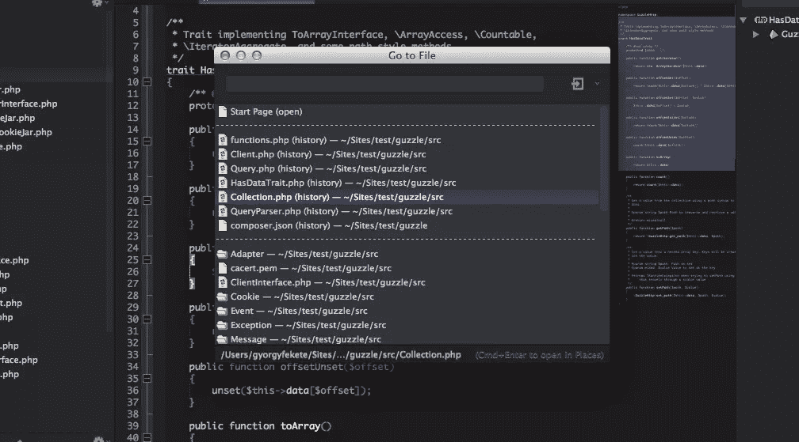

你可以在 Komodo 中配置快捷键的每个部分。要查看可用快捷方式的完整列表，请进入*首选项*并点击*编辑器- >按键绑定*。

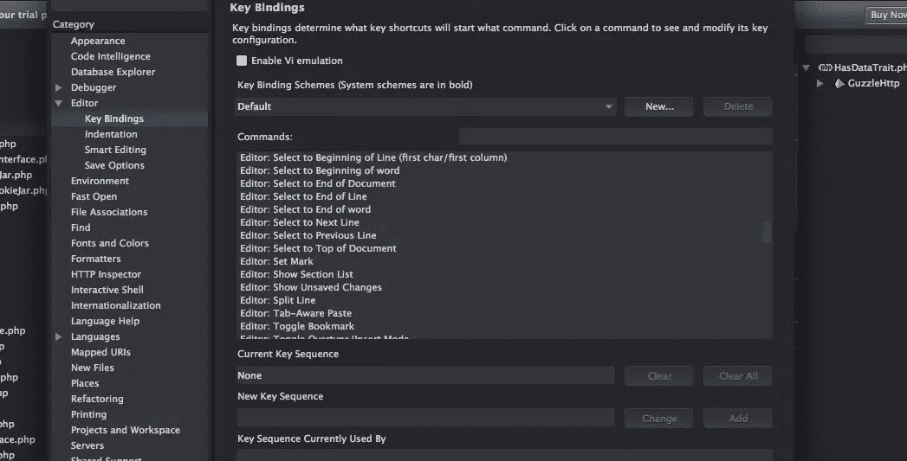

在这个弹出窗口中，您还可以定义密钥绑定方案，或者从 Emacs、Vi 或 Windows 等可用方案列表中进行选择。

### 扩展ˌ扩张

如果你发现你需要额外的功能，你会很快发现 Komodo 有[多种多样的扩展](http://komodoide.com/resources/)。您可以找到许多没有内置到 Komodo IDE 核心中的附加功能的扩展。

要安装新的扩展，在导航中进入*工具- >扩展*，点击*获取附加组件*标签。在这里，您将看到 IDE 所有可用扩展的列表。

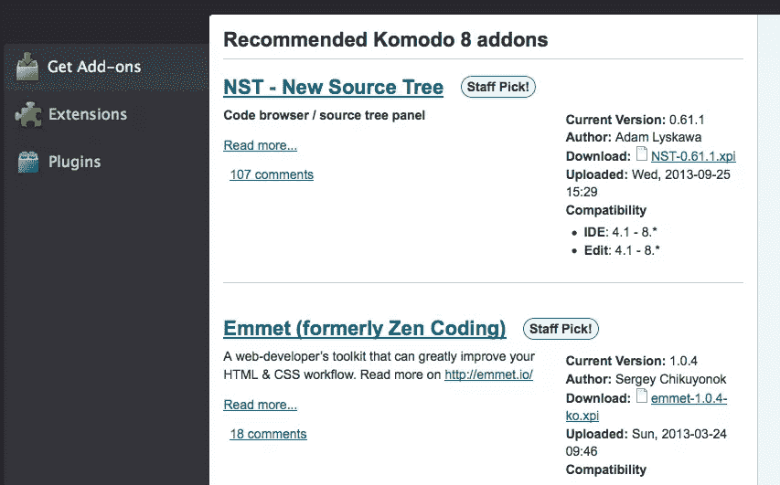

在*扩展*选项卡上，您会看到所有已安装的扩展，如 DB Explorer、Git 插件和 Breadcrumb 部分。在这里，您可以禁用那些您不打算使用的扩展。

您可以轻松地编写您的扩展。如前所述，Komodo 使用 Mozilla 引擎，这意味着你可以使用 Javascript、CSS 和 Python 来编写它。

## 流行的 Komodo IDE 扩展

### [NST–新源树](https://community.activestate.com/xpi/nst-new-source-tree)

来自 extensions 主页:“如果你从事大项目，没有一张像样的地图，你很难不迷失在你的代码中。NST 以类似于 Komodo 代码浏览器的方式提供它。

它提供了一个新的面板来可视化您的源代码。进入*视图- >标签页&边栏- >信号源*启用。

### [并排差异](https://community.activestate.com/xpi/side-side-diff)

并排比较是常规比较对话框的附加组件，用于并排查看更改。

当您激活比较对话框时——通过进入*文件- >源代码控制- >比较(比较文件)*——您将看到一个名为*比较样式*的下拉菜单，您可以在其中启用并排比较视图。

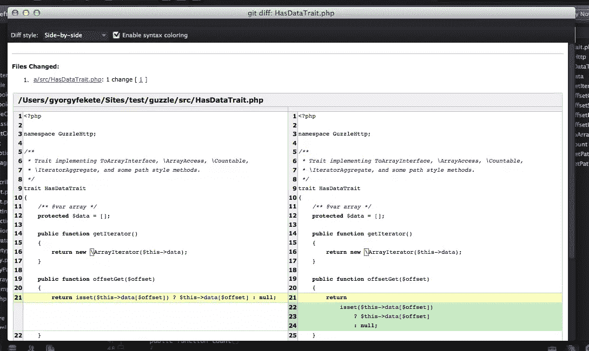

### [MySQL 数据库浏览器](https://community.activestate.com/xpi/mysql-database-explorer)

Komodo IDE 具有内置的数据库浏览器功能，但是它的核心中没有实现 MySQL 驱动程序。通过这个扩展，您可以添加这个功能，使您能够连接到 MySQL 数据库。

安装完扩展后，进入*视图- >标签页&侧栏- >数据库*，点击左边的“+”号，在弹出窗口中为 MySQL 创建一个新的数据库连接。

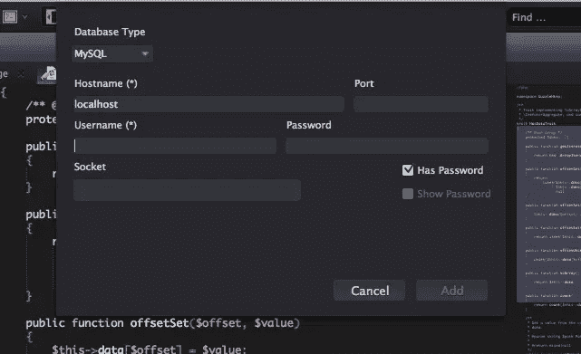

### [待办事宜助手](https://community.activestate.com/xpi/todo-helper)

这是一个非常有用的扩展，它分析你当前打开的文件，并显示你是否有 todo 注释。

状态栏上的一个小图标会告诉你是否有待办事项，点击它会弹出待办事项面板。您可以为文件中的 todo 行定义搜索模式。

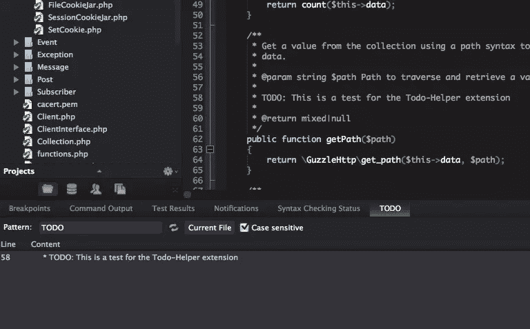

### 更多扩展

Komodo IDE 有这么多扩展。要找到它们，在*附加组件管理器*窗口进行搜索。

其他值得注意的扩展包括:

*   kopy.io :这个插件可以让你将代码从 Komodo 发送到其新的补充文本存储应用 kopy.io。
*   [标签切换器](http://community.activestate.com/xpi/tabswitcher)
*   [科莫多围棋](http://community.activestate.com/node/11332)
*   [HTML 工具](http://community.activestate.com/node/10850)
*   [DOM 检查器](http://community.activestate.com/xpi/dom-inspector)

## 结论

对于严肃的开发来说，集成开发环境是最棒的。但是有一个尽可能平稳地适应你的工作流程是很重要的。Komodo IDE 是一个非常通用的 IDE，它有许多特性可以帮助开发人员按照他们的方式编写更好的代码。它的跨平台特性意味着你可以使用你想要的操作系统(或操作系统),用你选择的语言来编写，而不必支付多种许可证。

ActiveState 一直致力于高级功能和工作流，因此开发人员无需离开 IDE 窗口。毕竟，这就是 IDE 的魅力所在。

Komodo 在这个市场面临着激烈的竞争，但它在不断发展，具有优秀的核心功能，如调试器、非常强大的代码编辑器、集成版本控制、多语言支持。所有这些特性和你今天能买到的任何流行的 IDE 一样好，甚至更好。

Komodo IDE 提供 21 天免费试用，你可以在这里下载。试一试，看看它是否是适合你的工具。

## 分享这篇文章