# 谷歌收件箱初探

> 原文：<https://www.sitepoint.com/first-look-google-inbox/>

上周，谷歌发布了一款新的仅限邀请的产品， [Inbox](http://www.google.com/inbox/) 。收件箱是 Gmail 的一个界面——设计目的不是作为一种替代服务，而是作为一种替代和增强的界面。作为一个超级电子邮件用户，我从第一天开始就一直在看它，并将在这篇文章中报告我的初步发现和印象。正是通过这种公众反馈——而不是所有谷歌产品都有的应用内反馈功能——我相信大部分改变都可以实现。

如果你想了解更多关于收件箱的信息，可以浏览一下已经发布的关于这个主题的各种在线资源。在这篇文章中，我将表达我对这项服务的初步看法，列出我注意到的优点和缺点。

## 概观

谷歌的团队表示，使用收件箱的最佳方式是全力以赴——我就是这么做的。从发布的那天晚上开始，收件箱完全取代了我的手机和桌面 Gmail 应用程序，这样我就可以看到它会产生多大的影响。那段时间，我还在巴黎的[for UMP HP](http://www.afup.org/pages/forumphp2014/#)工作，所以邮件不断堆积，这是一个很好的测试机会。

## 特征

虽然 Inbox 提供的功能已经在他们的网站和各种宣传文章中列出，但我将重点放在那些立即给我留下印象并且我实际使用过的功能上。Inbox 在移动设备和桌面浏览器上使用相同的*界面，可以随时在两者之间进行无缝转换。

*参见下面的*差异*部分。

### 搞定了。

你在服务中标记为“完成”的邮件会在 Gmail 中存档，因此那里的工作流程几乎保持不变。

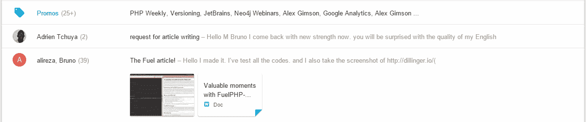

与 Gmail 的同步几乎是即时的，如果您的移动设备上安装了 Gmail 和收件箱，Gmail 通知会在您处理收件箱邮件时立即消失。这是 Twitter 和脸书应该学习的东西——谷歌从第一天起就一直向他们展示如何实现设备间的通知同步，然而他们一次又一次地未能正确实现这个许多用户认为必不可少的简单功能。

### 试映

当一封电子邮件符合某个特定的上下文时，界面会记录下来，并通过显示更深入的片段来提醒您。这可以是从旅行路线和航班信息到易贝购物的任何信息:

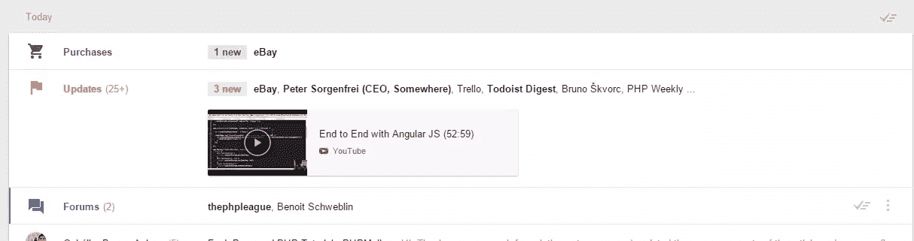

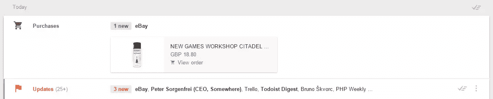

您购买的物品将显示为徽章，点击它将快速呈现整个订单信息屏幕。

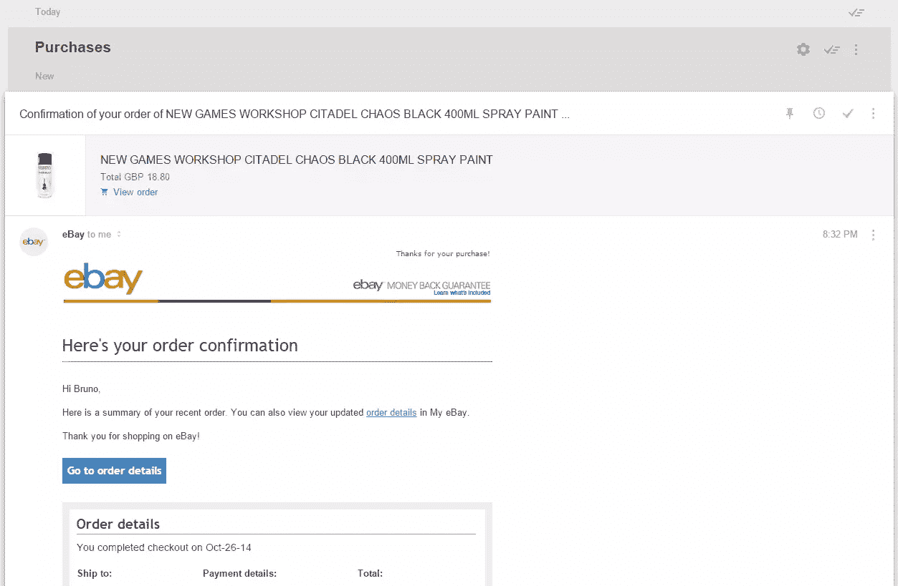

### 分组

所有上下文相似的项目将被归入一个类别。在易贝上对一件物品出价、赢得拍卖、通过 PayPal 付款，然后收到订单确认电子邮件的整个过程都将被归类到“购买”下，让您可以轻松浏览和“分组完成”整个过程。你知道它是关于什么的——你不需要检查细节——所以为什么不节省一分钟，把它们都处理掉呢？“论坛”、“更新”等群组也是如此——以及您定义的任何其他自定义群组(将它们视为上下文反应标签)。

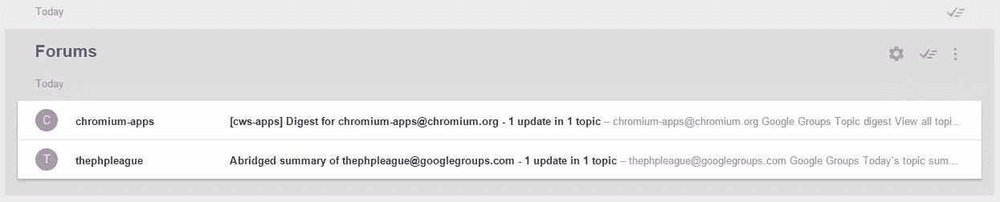

社交网络的内容与 Gmail 几乎相同——有一个社交群组保存所有 Twitter、脸书等的通知。然而，与最初的 Gmail 不同的是，G+不再是嵌入式的——你不再能直接从界面上评论你的帖子，而是必须通过点击电子邮件中的链接转到 G+。不管这样做是为了从界面上去掉 G+这个庞然大物，让事情变得更快，还是为了让桌面和移动版本保持同步(或者两者都是！)，说不上来，但不会错过特色。

### 撰写 Popover

我发现自己用得最多的功能之一是编写弹出窗口。

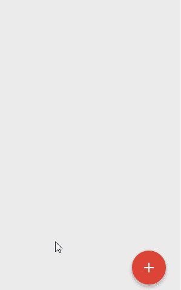

将鼠标停留在撰写按钮上，或者在移动版本中轻按它，您最近最常联系的人就会出现在“创建提醒”和“邀请到收件箱”选项的正上方(如果您有后者的话)。这可以让你立即与你交谈最多的人取得联系。一旦弹出窗口已经打开，再点击一次撰写按钮，将会打开一个熟悉的撰写窗口，就像在 Gmail 中一样，可以快速撰写电子邮件。

### 离线就绪

默认情况下，收件箱处于离线就绪状态——阅读您预装的电子邮件，将其标记为完成，分类，删除:一旦您重新连接到互联网，所有的更改都将被同步。你甚至可以撰写草稿，想保存多久就保存多久，或者直到你恢复连接并成功发送它们。

### 默认回复-全部

回复邮件时，收件箱已切换到默认的“全部回复”发送模式。这肯定会引起很多人的大惊小怪，但就我个人而言，我喜欢它——我最终几乎对我所有的回复都设置了“全部回复”,这种切换肯定是基于*一些*数据，所以我很确定它会适合大多数高级用户的使用情况。

### 提醒和打盹

其中最重要的功能之一是提醒功能。你可以提醒自己在三个小时内或者甚至是“当我到家的时候”看一封邮件——没错，你甚至可以通过位置来触发它们。当然，你需要在移动设备上激活位置报告功能，但仅此而已——谷歌将尽最大努力确保一切尽可能准确。这就像是把 IFTTT、Tasker 和 Google Notes/Reminders 的最小功能都塞进了一个整体。我们以前使用 Google/Google Now 做的一些事情:“好的 Google，提醒我在 4 小时内给 Mary 发一封电子邮件”，现在可以直接在收件箱中完成。

设置提醒在五个小时内烤一个蛋糕就像点击提醒一样简单，选择时间，保存，然后放松并忘记它。提醒直到快触发的时候才会被看到。您可以在提醒组(左侧菜单)中看到您所有提醒的列表，其中还会列出您之前在 Google 提醒和 Google Notes 中的所有提醒，甚至是在收件箱之前。

不过，有一个警告:看看下面关于差异的部分。

## 缺失的功能和缺陷

虽然收件箱在目前的状态下，确实提供了超出普通电子邮件客户端的功能，使生活变得更加轻松，但在成为即将击败其竞争对手 *的电子邮件客户端之前，它仍有一些领域可以改进。*

 *### 移动设备和桌面设备之间的布局和 UX 差异

在移动设备上，强制应用程序获取新内容非常容易——只需下拉菜单，刷新符号就会出现。在桌面上，没有那么多。没有刷新按钮，在这个前端应用程序极度膨胀的时代，使用浏览器的重新加载按钮是疯狂的——页面重新打开需要的时间是等待自动抓取的十倍。

此外，当查看电子邮件时，顶部有一个工具栏，上面有“完成”按钮。

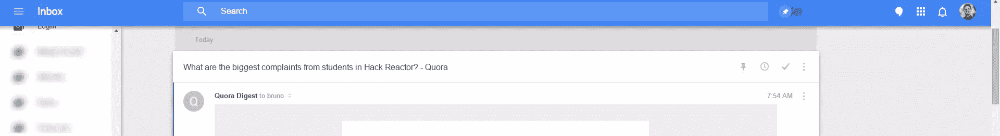

在桌面上，在长长的电子邮件中，显然缺乏这种能力。在滚动区域移动到一封长邮件之后，按钮(和包含它的工具栏)应该会变得粘粘的，这样邮件在阅读后就可以标记为“完成”，而不必滚动回顶部:

这种情况不会发生在手机上，这是 UX 的失误，应该得到纠正。

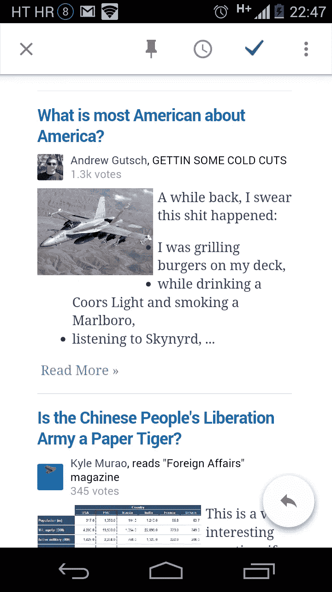

另一个失误是在设置提醒时，桌面上没有位置选择——你可以很容易地在移动设备上设置基于位置的提醒，但笔记本电脑没有这个选项。这是一个耻辱，原因有二:首先，笔记本电脑是移动(或者至少是“可移动”)设备，HTML5 有一个位置 API。这一特征的缺失毫无意义。其次，要设置位置提醒，你必须使用移动设备，而这有时是不可能的。也许你没有带在身上，也许你没有上网(也许在会议上？)，或者谁知道还有什么。也许我打算整天带着我的笔记本电脑？

这些微小的差异不会破坏交易，但它们很烦人，可以(也应该)很容易修复。

### 无回复-来自

没有“回复”功能意味着你总是从收到邮件的同一个电子邮件地址回复。对于像我这样的用户来说，他们使用一个单独的 Gmail 账户来收集来自所有其他电子邮件账户的邮件，包括商业和个人邮件，这尤其令人困扰。不仅因为我不用那个 Gmail 地址发邮件，还因为这是我多年来一直保持隐私的一个电子邮件地址，以避免垃圾邮件发送者和各种强制注册。

### 弹出回复错误，回复布局分崩离析

一个彻头彻尾的 UI 错误，在 Gmail 中运行良好的弹出回复功能在这里不起作用，尽管在撰写回复时有这个选项。UI 有时也会莫名其妙地崩溃:

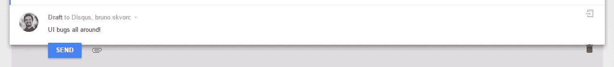

### 某些电子邮件呈现失败

在 Gmail 中，一封 Disqus 版主批准邮件是这样的:

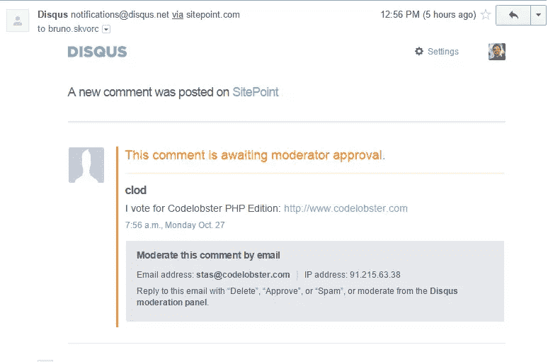

在收件箱中，它看起来像这样:

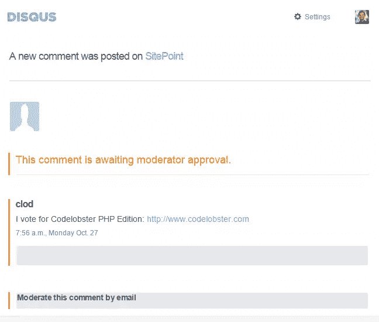

根据他们电子邮件的 HTML，我毫不怀疑这是 Disqus 的错，但仍然需要注意的是，差异是存在的，如果 Disqus 发生了这种情况，其他电子邮件也可能发生这种情况。这是一个相当大的问题——谁在打破这里的标准？真的是 Disqus 没有正确地 html 化他们的电子邮件吗？还是更严重，收件箱不按标准渲染？

这也发生在手机上:

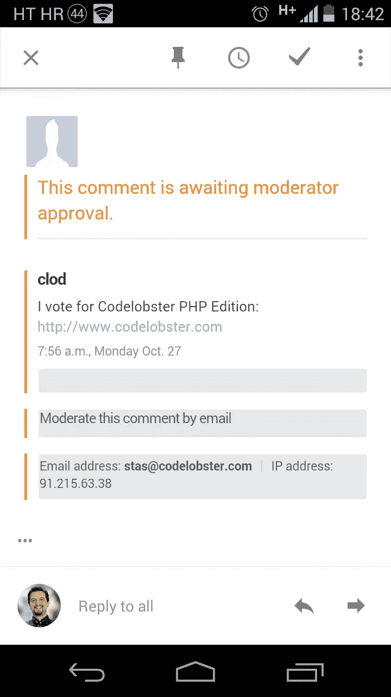

收件箱缺少一个显示原始内容的选项，所以你不能真的通过点击一个按钮来检查一封电子邮件的 HTML，但是通过 Chrome Dev 工具检查标签汤可以发现，一大块 HTML 实际上是丢失了。

Gmail:

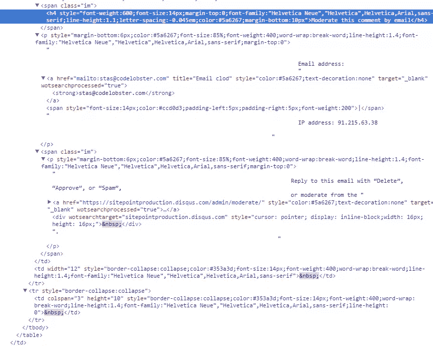

对比收件箱:

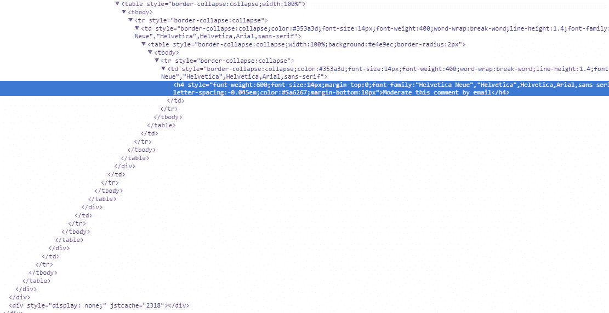

### 不必要的双重菜单

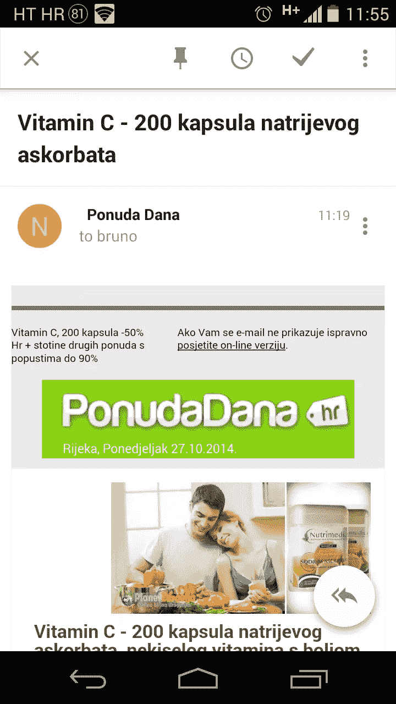

看到右上角的三个垂直点了吗？"哪三个点，上面还是下面？"，你可能会问。完全正确——有两个带有相同图标的菜单，都与一封电子邮件的上下文相关。如果你想把它标记为垃圾邮件(就像我对这封邮件所做的)，或者把它移到另一个标签，你需要使用上面的那个。

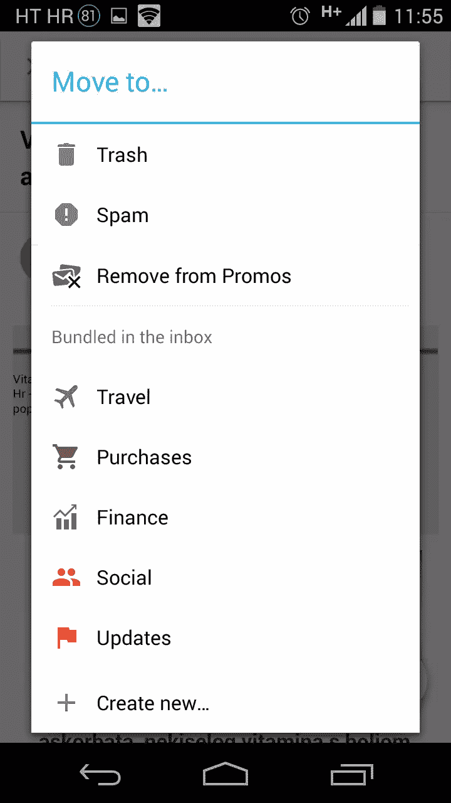

如果你想回复或转发，你需要使用较低的。

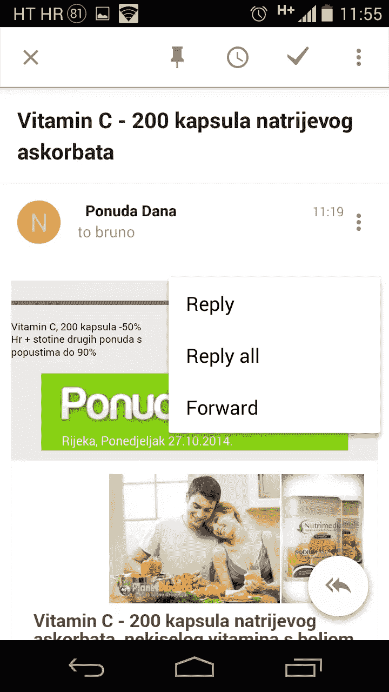

充满这些小怪癖的用户界面告诉我，这是一个紧急的工作或设计团队之间的冲突，这是我们不习惯与谷歌。

### 自定义上下文分析器和扩展

虽然 Inbox 可以识别某些上下文并对其进行修饰，向用户指出来，这很好，但是如果我们可以定义自定义的上下文过滤器并将它们应用到我们的界面上，那就更好了。例如，我每天会收到几十个 Disqus 通知——需要批准的评论等等。如果我能以某种方式教 Inbox 对来自 SitePoint 域(但仅来自 SitePoint 域)的 Disqus 邮件进行分组，并用正则表达式将它们的邮件预览更改为包含大部分评论的邮件预览，那就太好了。

我敢进一步梦想，我甚至应该能够在我的电子邮件上定义自定义意图，这将对我通常需要手动执行的消息执行一系列操作。例如，通过回复“批准”来批准评论，通过回复“垃圾邮件”并删除来发送垃圾邮件..你知道要点了。

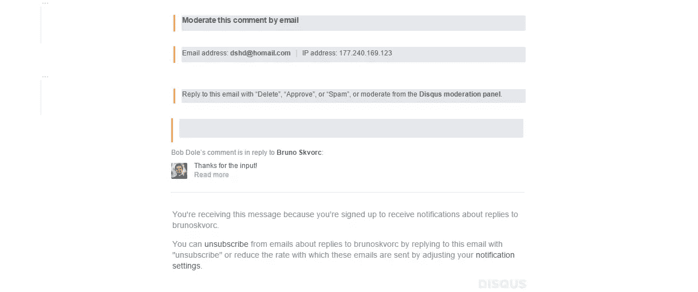

为什么不让我们能够在主题行的上下文菜单中定义这些选项，以便我只需单击三个选项(批准、垃圾邮件、已删除邮件)中的一个并执行该上下文操作？这肯定会占用每小时的几分钟。

这可以很容易地用 Chrome 扩展来实现，但为什么不将其官方化，开放一个“收件箱扩展”API，人们可以直接在后端安装到他们的 UI 中(因此也可以在移动应用程序中获得)，让奇迹发生？当然，我们可能会面临 Chrome 的网络商店和现有扩展已经存在的内存泄漏问题，但这会让我们“电子邮件超级用户”每月节省大量时间。

### 主题行中信息太少

基于之前的抱怨，收件箱中的主题行比 Gmail 中的要短得多。这模糊了一些信息，使得高级用户很难仅通过邮件的主题来辨别邮件的价值。例如，如果您是管理员，每当有评论需要批准时，Disqus 都会向您发送电子邮件通知。

如果你是几个网站的管理员，或者你是管理员的一些网站只是部分由你管理，其他人批准其他帖子的评论，你很难发现来自你或其他人管辖区的帖子的评论是否需要批准。在 Gmail 中，这非常简单——更长的主题行让邮件的性质更加清晰，从而改善了工作流程。

是的，这是吹毛求疵，Disqus 的界面/API/架构确实很糟糕，但这仍然是一个真实的例子——较长的主题行比较短的主题行更好。

### 自动翻译

收件箱应该检测外语邮件，并自动提供翻译成我的用户界面语言的选择。我不应该安装自定义的翻译扩展，也不应该将内容粘贴到 Google Translate 中来理解它的意思。

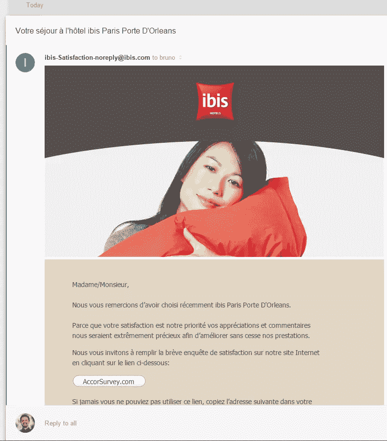

考虑到 Google+已经做到了这一点，在这里实现它应该不会有太多问题。

## 有效性

不幸的是，大多数人还不能使用收件箱。这是一个只接受邀请的应用程序，所以你只能被已经有权访问的人邀请。此外，并不是所有有权限的人都能立即收到邀请——你需要是一个非常早就接受邀请的人，一个至少有一定公开曝光率的网络名人，或者是谷歌的员工。不用说，这让一大群人感到不安，他们来到 Play store，仅仅因为没有被邀请参加派对，就在评论区发了一星评论，潜在地扭曲了新人的结果。

许多谷歌用户和客户面临的另一个潜在障碍是，谷歌应用套件中还没有收件箱。然而，那些抱怨这一点的人应该意识到，Inbox 远没有微调到完美，将一个有缺陷的产品发布到一个付费套件中对付费社区来说比根本不发布更有害。光是内存费用就令人难以置信，同时运行收件箱标签和 Gmail 标签通常会非常昂贵，你需要一台高端电脑才能跟上。

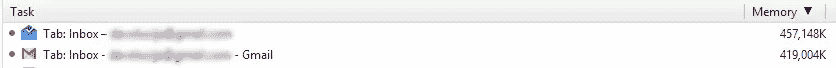

注意:在这篇文章中讨论的所有错误都已经被报告给收件箱团队，但是如果你有权限，请做同样的事情以加快修复过程。

## 结论

在使用这项服务几天后，我可以有把握地说，它正在取代 Gmail，但还没有完全取代。我需要结构和更多的细节。我不希望我的电子邮件被过滤和损坏，我希望它能与环境相适应。保留货币化过滤器和算法，但让我们定制我们认为合适的界面和电子邮件环境，并解决差异，你就有了一个 Gmail 杀手。在那之前，这只不过是一个断断续续工作的花哨的 Gmail 皮肤。

说了这么多，如果你真的渴望得到一个邀请，让我知道你认为收件箱中最常用的一个功能是什么，我会试着把你的名字扔进抽奖活动，发出 48 小时后我仍然收到的邀请。

你试过收件箱吗？你觉得怎么样？你会继续使用它吗？

## 分享这篇文章*