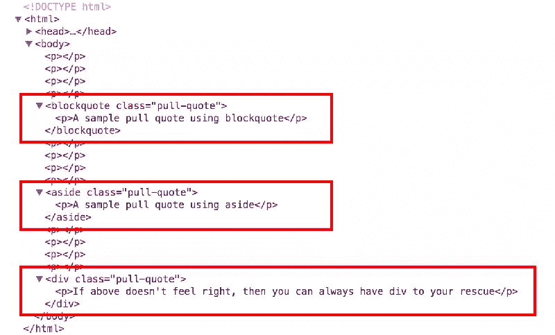
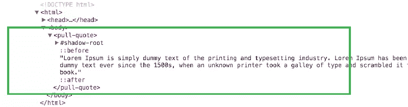
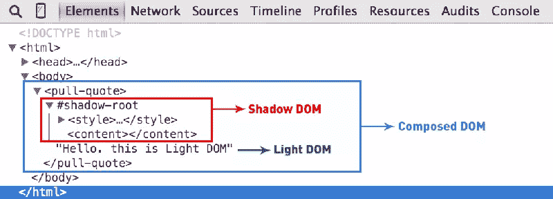

# 用聚合物构建引用定制元素

> 原文：<https://www.sitepoint.com/building-pull-quote-custom-element-polymer/>

自定义元素允许开发人员使用与他们的设计组件非常相似的自定义标记名来定义他们自己的 HTML 元素。W3C [将定制元素](http://w3c.github.io/webcomponents/spec/custom/)定义为规范:

> 允许作者在文档中定义和使用新类型的 DOM 元素。

这个定义在理论上看起来很简单，但是在实践中，创建和使用定制元素的过程包括:

1.  相当多的 JavaScript
2.  了解创建定制元素的 JavaScript API
3.  处理跨浏览器的不一致。

如果您设法通过这些挑战，那么您仍然需要担心那些不支持自定义元素的浏览器。幸运的是， [Polymer](http://www.polymer-project.org) 提供了一个易于使用的框架来创建和使用定制元素，从而扭转了局面。

如果你需要快速复习聚合物和 Web 组件，那么我强烈推荐你阅读我在 SitePoint 上的文章，这篇文章深入介绍了这些概念。

在本文中，我们将举一个非常基本的例子，用 Polymer 创建一个定制元素来呈现**的引用**。这个想法源于路易斯·拉扎勒斯的[这篇文章](http://www.impressivewebs.com/aside-vs-blockquote-html5/)，他引发了一场关于使用`blockquote`与`aside`在你的标记中创建引用的语义价值的辩论。



常见的是使用`blockquote`、`aside`，甚至是普通的`div`元素来标记引用。是时候通过创建一个名为`<pull-quote>`的新定制元素来结束这个难题了，它可以准确地表示我们的内容。在本文结束时，您将能够创建如下内容:



## 设置自定义元素

在我们开始定制元素之前，我们将通过 [Bower](http://bower.io/) 安装 Polymer 和所有依赖项来快速设置项目文件夹。

```
$ bower install --save Polymer/polymer
```

通常，创建新的自定义元素包括以下步骤:

1.  用自定义元素的名称创建一个 HTML 文件。
2.  使用`<link>`从`bower_components`文件夹导入`polymer.html`文件。
3.  使用`<polymer-element>`声明您的定制元素。
4.  使用`<template>`标签添加定义定制元素所需的样式和标记。
5.  如果您的定制元素涉及 JavaScript，调用`Polymer()`构造函数在 DOM 中注册元素。

基本的方法是首先决定如何在标记中使用定制元素，然后反向创建定制元素的模板。在这种情况下，每当我们打算在文档中使用引用时，我们计划使用以下标记:

```
<pull-quote>Sample text and can even contain other HTML tags.</pull-quote>
```

我们首先在根目录下创建一个名为`pull-quote.html`的文件。编辑文件并导入在`bower_components`文件夹中的`polymer.html`文件:

```
<link rel="import" href="bower_components/polymer/polymer.html">
```

我们将以如下方式使用`<polymer-element>`的`name`属性声明新的`<pull-quote>`元素:

```
<polymer-element name="pull-quote" noscript>
    <!-- More to come -->
</polymer-element>
```

有几点需要注意:

1.  定制元素[的名称必须包含一个连字符](http://w3c.github.io/webcomponents/spec/custom/#dfn-custom-element-type) (U+002D 连字符减)字符，以允许 HTML 解析器[区分定制元素](http://stackoverflow.com/questions/22545621/do-custom-elements-require-a-dash-in-their-name)和常规 HTML 元素。
2.  `noscript`属性表明这个元素不需要任何 JavaScript 就能运行，因此可以立即在 DOM 中注册。

## 添加内容

组成定制元素的内容在`<template>`标签中定义。标签提供了表示和内容的分离。在我们的例子中，我们在`<pull-quote>`标签中写的任何东西都将构成定制元素的内容，应用于它的样式将形成表示。

简而言之，我们要处理三种类型的 DOM 元素:

1.  Light DOM–这包括我们在自定义元素中编写的内容。因此，自定义元素的用户提供了 Light DOM。
2.  **影子 DOM**——这包括我们在`<template>`标签中定义的一切。它在元素内部，包含了定制元素工作所需的一切。
3.  **Composed DOM**–这是浏览器实际呈现的内容。为了渲染，光线 DOM 被分配到阴影 DOM 中以产生合成的 DOM。



标签表示插入点，光线 DOM 内容将在此处注入阴影 DOM。`<content>`标签有更高级的用法，只选择您在定制元素中编写的特定内容。然而，为了这个例子，我们将坚持这个标签的基本用法。

```
<polymer-element name="pull-quote" noscript>
    <template>
        <content></content>
    </template>
</polymer-element>
```

## 设置自定义元素的样式

对于定制元素的样式，Polymer 提供了许多有用的选择器。例如:

1.  `:host`–以自定义元素本身为目标。
2.  `:host(<pseudo-class>)`–针对自定义元素的各种状态，如`:host(:hover)`、`:host(:active)`等。
3.  `:host(<class-name>)`–仅定位那些具有提供的类名的自定义元素。
4.  `:host-context(<selector>)`–如果主机元素或其任何祖先与`<selector>`匹配，则该伪类以主机元素为目标。当您在`<html>`或`<body>`标签上应用主题相关的类时，这对于主题化特别有用。

> **专业提示-**如果你简单地使用选择器(比如，`p`，`#id`或者`.class`)而不使用`:host`，那么它们将自动成为派生的选择器。例如，要定位`<pull-quote>`中的段落标签，我们可以简单地使用`p { ... }`，然后它会自动扩展为`pull-quote p { ... }`。

我们可以选择使用`<style>`标签来样式化我们的定制元素:

```
<template>
    <style> :host {
            display: inline-block;
            font-style: italic;
            text-align: justify;
            width: 325px;
            line-height: 30px;
        } </style>
    <content></content>
</template>
```

或者我们可以在一个新的文件中编写 CSS，比如`pull-quote.css`，然后使用`<link>`将该文件导入到我们的`pull-quote.html`文件中:

```
<link rel="stylesheet" href="pull-quote.css">
```

有几点需要注意:

1.  默认情况下，所有自定义元素都被设置为`display: inline`。因此，我们必须显式声明`display: inline-block`。
2.  `:host`选择器的特异性最低。因此，用户可以从自定义元素之外重写您的样式。

在撰写本文时，在 Blink 浏览器(Chrome 和 Opera)中，在`:host`选择器上使用类似`:host::before {...}` [的伪元素(`::before`和`::after`)无法像预期的那样运行](http://stackoverflow.com/questions/25949354/pseudo-elements-on-polymer-custom-element-does-not-work)。这似乎是[一个已知的错误](http://crbug.com/393509)已经被修复，并将很快与 Chrome 38 一起发布。但是这不应该阻止我们一起使用它们。

要用实际的报价来包围我们的拉报价，我们有三种选择。

### 添加带有`:host`伪元素的引号

第一种选择是使用定制元素中的`:host::before`和`:host::after`伪元素来添加双引号:

```
:host::before {
  content: '\201C';
}
:host::after {
  content: '\201D';
}
```

如上所述，这只适用于非闪烁浏览器。如果你能等到其他浏览器修复了这个错误，那就坚持使用这个方法。

### 添加带有常规伪元素的引号

您还可以使用`pull-quote::before`和`pull-quote::after`伪元素从定制元素之外添加双引号。

```
pull-quote::before {
  content: '\201C';
}
pull-quote::after {
  content: '\201D';
}
```

这适用于所有浏览器，但可能不是最理想的解决方案，请记住，同一个定制元素的样式现在分散在两个不同的文件中。

### 用额外的 HTML 添加引号

最后一个选项是使用 HTML 在模板本身中添加双引号:

```
<template>
    <span>&quot;</span>
    <content></content>
    <span>&quot;</span>
</template>
```

这也适用于所有的浏览器！此外，您还可以用 CSS 样式化引号，然后放在`<template>`标签中。

## 使用我们完成的`pull-quote`元素

确保在文档的`<head>`中添加了`platform.js` polyfill。此聚合填充将确保您的自定义元素继续按预期工作，即使在不支持它们的浏览器中。

```
<script src="bower_components/platform/platform.js"></script>
```

为了使用定制元素，我们完全按照我在上一篇文章中描述的那样做:

1.  通过 Bower 下载定制元素包。
2.  在文档中导入相应的`.html`文件。
3.  在文档中的任意位置使用自定义元素标记。

    ```
    <html>
        <head>
            <script src="bower_components/platform/platform.js"></script>
            <link rel="import" href="pull-quote.html">
        </head>
        <body>
            <pull-quote>Sample text inside pull quote</pull-quote>

            <pull-quote>
                <p>Can also contain other tags</p>
            </pull-quote>
        </body>
    </html>
    ```

在 Plunker 上查看完整的代码和演示[。我还在 Github](http://plnkr.co/edit/DUGpZ5vRJKkByRhTQwQt?p=preview) 上为`pull-quote`定制元素设置了[项目存储库。如果你想要更多，Zeno Rocha 的一个项目有一个有用的自定义元素集合，使用 Polymer、X-Tag 等创建。](https://github.com/pankajparashar/custom-elements/tree/master/pull-quote)

聚合物库提供了大量强大的特性和 API 来与定制元素和其他 web 组件进行交互。我们几乎没有触及这个主题，仍然有许多功能需要探索。然而，我希望这个介绍足够简单，让每个人都能理解，并作为构建更多新的定制元素的跳板。

## 分享这篇文章