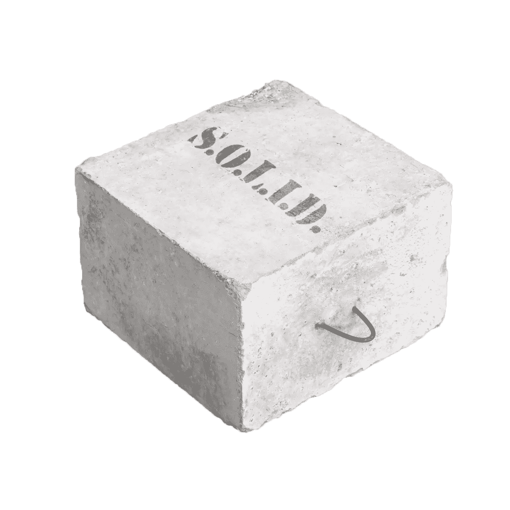
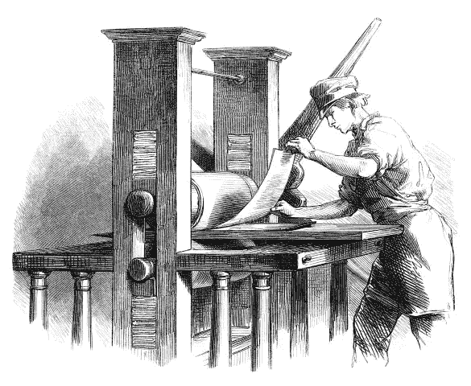

# 书评:PHP 中的实用设计模式

> 原文：<https://www.sitepoint.com/book-review-practical-design-patterns-php/>

这篇关于 Brandon Savage 的[PHP 实用设计模式](http://practicaldesignpatternsinphp.com/)的评论将包括我自己对这本书以及自助出版方面的看法和印象。非常感谢布兰登给我一份评论。

> 设计模式是关于常见问题的常见解决方案。它们是概念，不是蓝图；想法，而不是完成的设计。
> …它们让原本困难的局面变得清晰。
> *–Brandon Savage，PHP 实用设计模式*

## 内容

Brandon 从一个简单的介绍性注释开始，解释了框架的必要性，认为 OOP 不仅仅意味着在类中包装东西，并详细解释了为什么设计模式看起来很难学习。然后，他继续温和地介绍[坚实的](http://en.wikipedia.org/wiki/SOLID_%28object-oriented_design%29)原则，并为更高级的概念打下基础。他解释了为什么每个坚实的规则是重要的，它意味着什么。鉴于 SOLID 是一个公认的软件设计原则，将它与书中将要解释的每个模式进行比较是很自然的。或者，更准确地说，评估每个模式在向开发人员提供其预期功能的同时，在多大程度上尊重了坚实的原则。

如果我用 [Dreyfus 模型](http://en.wikipedia.org/wiki/Dreyfus_model_of_skill_acquisition)的术语来表达问题，他声称这本书是为了把新手变成有能力的开发人员，而不是让他们犯高级初学者的错误，而事实上，这样的学习方法是不完全可能的——那只是[而不是人类知识获取过程如何工作的](http://www.infoq.com/articles/better-best-practices)。

* * *

从 ToC 中可能看不出来，本书中解释的模式依次是:

*   (抽象)工厂模式
*   单一模式
*   构建器模式
*   装饰图案
*   适配器模式
*   桥模式
*   立面图案
*   战略模式
*   中介模式
*   观察者模式
*   责任链模式
*   迭代器模式
*   复合模式
*   MVC 模式
*   领域模型模式
*   活动记录模式
*   前控制器模式

涵盖了这么多模式(而且大部分都涵盖得很好)，我很惊讶地看到一个句子，比如“*[……]例如，注册表模式(本书没有涵盖)……*”。为什么不呢？注册表模式是一种流行的模式，解释起来非常简单，即使现在并不推荐它。

一个模式接一个模式，每个模式都有很好的解释，大多数都有展示其潜在实现的代码示例，尽管我对工厂模式的缓存示例有些不满。

该模式在一个不同缓存的例子上实现——APC 和 Memcache——两者都是通过工厂产生的，工厂被注入到任何需要缓存组件的服务中。

这对我来说很有意义，但我可以看到经验较少的人想知道为什么实际上可能需要工厂步骤，而不是简单地在构造函数中键入提示缓存接口本身，要求注入缓存对象本身，而不是其工厂。当前的例子既有工厂接口又有缓存接口，至少其中一个看起来是多余的。这从来没有以一种中级开发人员容易理解的方式解释过，我担心这可能会让一些人感到困惑。我对桥的图案的解释也不太满意——它似乎有所欠缺，就像它只是在表面被刮了一下，再也没有恢复原样。

另一方面，我非常喜欢复合模式解释及其在非常有趣的树示例上的演示——作者构建了一个具有任意数量嵌套节点级别的复合树，这非常适用于菜单构造、层次结构表示等——并且我对装饰模式解释特别激动。这是以一种非常平易近人的方式和良好的，可用的例子。尤其是这种模式，我总是很难向突然被问到的人解释，我还没有找到比这本书更好的分类。

### 忽视模型

在本书的一个实例中，Brandon 说模型是 MVC 应用程序中最重的提升器，包含所有的业务逻辑和验证代码。这种说法太绝对了，我无法接受——我能想到一个例子来证明这种说法是错误的:拉勒维尔。随着 Laravel 5 的推出和增加[表单请求](http://mattstauffer.co/blog/laravel-5.0-form-requests)，这些模型将变得更轻。

当然，有些人倾向于把所有东西和厨房水槽都放入模型中，但是也有人把同样多的神代码放入控制器中。我的经验和偏好告诉我，所有与框架相关的东西都应该非常轻(小控制器、小模型、小视图或没有视图)，所有与服务相关的东西(服务、插件、库、助手)都可以足够重，只要它们能在框架之间互操作。我想这只是个人喜好。不过，还有一件事让我觉得很奇怪:

> 创建好的模型是任何开发人员都要解决的最复杂的任务之一。很长一段时间，Zend 框架文档认为没有 Zend_Model 类，因为创建模型是应用程序开发过程的主要部分。创建一个 Zend_Model 将会假设每个人都可以或者想要使用相同的模型结构，这是不可能的，因为同样的原因我在本章中没有包含任何代码。

虽然这很有意义，但是以最简单的方式举例说明值、网关和存储对象对于第一次接触域模型模式的人来说是非常有益的。在我看来，领域模型模式在这本书里被忽视了，而且过于理论化。

## 知识的诅咒

在整本书中，Brandon 引用了高级概念(ORM、继承、依赖注入)和第三方内容，但没有链接到它(四人帮)，假设读者对这些都很熟悉。尤其是在几个场合提到了四人帮，他们至少可以使用到[设计模式](http://en.wikipedia.org/wiki/Design_Patterns)的链接——否则“新手”和“高级初学者”读者只会困惑地浏览一下句子。

在其他情况下，段落结构的编写方式远远超出了新手到中级用户的理解水平:

> 这是一个许多开发人员一直在努力解决的老问题:如果我正致力于反转我的依赖关系，而不是在我的类中创建对象，我该如何着手创建我在运行时需要但不一定能被注入的依赖关系？

这不是一个读者可以理解的层次，他们需要这本书来熟悉这些模式。完全理解这句话的读者可能已经完全熟悉了书中的所有模式，从而对真正的目标读者产生了疑问。我相信这是因为萨维奇先生遭受了所谓的“知识的诅咒”。

维基百科是这样定义的:

> 知识的诅咒是一种认知偏差，它导致信息较灵通的一方发现很难从信息较少的一方的角度来思考问题。

知识的诅咒在没有接受过正式培训来传授知识的专业人士中非常常见，但随着时间、经验和反馈，这种诅咒也会失效。这也是为什么我们 SitePoint 鼓励人们对我们的帖子给我们诚实的反馈，也是为什么我们试图让每一个新的出版物变得更简单、更流畅。没有人能对诅咒免疫——只是有些人受到的影响更大。

## 自助出版的瘟疫

近年来，自助出版似乎真的起飞了。那些不求助于 Leanpub 的人完全独自行动，就像布兰登在这本书里做的那样。虽然这种方法确实加快了过程，并允许专家以惊人的速度将高质量的内容送到感兴趣的人手中，但它也允许更多的错误、不良内容和错别字溜走。

不幸的是，困扰其他自助出版作家的大多数问题也困扰着这本书。由于缺乏经验丰富的编辑，在内容、形式甚至语法和句法的准确性方面似乎都没有任何指导——这是母语人士经常会搞砸的事情。

认为母语为英语的人不会犯错误，因此不需要正式的编辑，这类似于，例如，一家总部设在 Y 国的公司雇佣来自 X 国的人来校对他们的 X 语言版本的网站，唯一的理由是校对者是母语为 X 语言的人。你真的不想雇佣我来校对你的克罗地亚语版本的网站，即使它是我的母语，但你很难找到一个更好的英语编辑。

## 结论

作为一名高级用户，我以前了解书中解释的大部分(如果不是全部)模式。然而，我所经历的解释对一个中级用户来说是很好的形式和可接近的——尽管在我看来，对一个低技能的用户来说不是。虽然这本书的内容非常好，并且 Brandon 在用代码演示理论描述的内容方面非常出色，但我觉得这本书作为一个整体对于新手开发者来说太复杂了，无法从中获得任何切实的东西。

总的来说，在我看来，php 社区正在遭受一种“缺失链接”综合症，我们有绝对的初学者书籍(“这是 echo，这是一个函数，这是一个 PHP 标签”)和像这样的中级++书籍，或者 Sturgeon，Jones，Hartjes 和其他人已经推出的任何东西，但有一个中间地带仍然缺乏高质量的内容，只能通过良好的旧方法“把我扔进火里”来征服。

也就是说，如果你是一名中级开发人员，想要了解模式，摆脱那些在会议上尴尬的点头，而你周围的人在谈论这些模式，但你什么也不明白——那就一定要看这本书。如果你是个新手，我不建议你买这个——现在还不行。首先掌握你的“回声”,学习什么是作曲家，然后专心于此。

事实上，如果你是一个对模式感兴趣的高级初学者(初学者应该从最基础的开始),我为你鼓掌，并在你深入本书之前提供以下参考资料:

*   [可学习的面向对象 PHP 元素](https://learnable.com/courses/elements-of-object-oriented-php-2734)
*   [面向对象的 PHP](http://www.codecademy.com/courses/web-beginner-en-ZQQ64/0/1?curriculum_id=5124ef4c78d510dd89003eb8)
*   面向对象的 PHP 应用:让两军交战
*   亚历杭德罗·格瓦西奥的《了不起》——阅读这个人写的所有东西
*   [作曲家](https://www.sitepoint.com/re-introducing-composer/)
*   [MVC](https://www.sitepoint.com/the-mvc-pattern-and-php-1/)

就内容而言，我会给这本书打 4/5 分，但考虑到它似乎已经接近尾声的仓促工作，打字错误和语言错误(尽管公平地说，有一个错别字提交 Github repo，我已经用修复污染了它)，以及明显缺乏专业指导和一些奇怪的东西，我个人认为这些东西会给偶然接触这本书的新手带来错误的价值观(在各种代码样本中以数字开始类名)，我将最终得分定为 3/5 分。

## 分享这篇文章