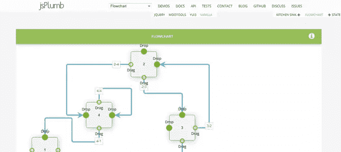
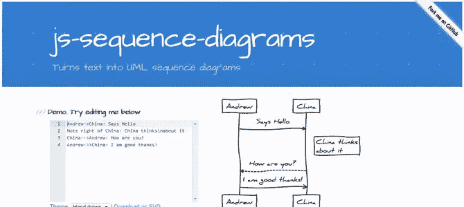
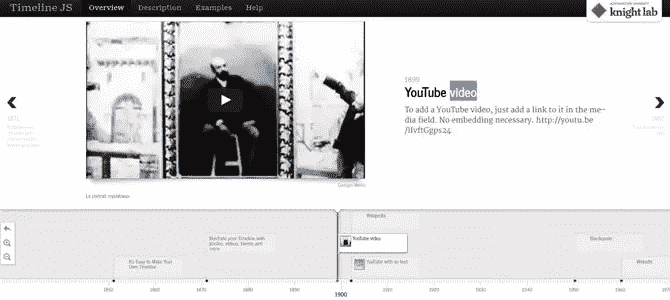
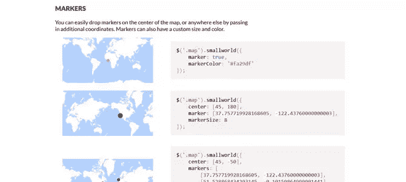
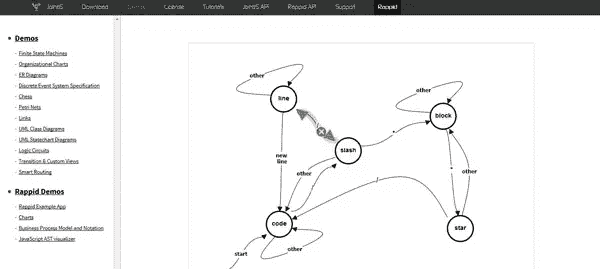
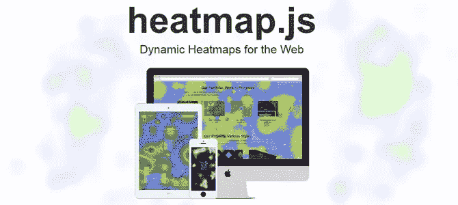

# 7 个用于特定可视化的 JavaScript 库

> 原文：<https://www.sitepoint.com/7-javascript-libraries-specific-visualizations/>

除了这里已经介绍过的用于创建交互式数据可视化的常用图表和图形库之外，还有许多鲜为人知的专门针对可视化类型的 JavaScript 库。当你在互动体验中处理来自数据新闻的图解[内容时，它们非常方便。以下是其中的几个例子。](https://www.sitepoint.com/generate-content-ideas-data-journalism/)

## [JSPlumb](https://jsplumbtoolkit.com)



JSPlumb 帮助您可视化地连接元素:流程图、厨房水槽、状态机和分层图表。它在可用的地方使用 SVG，在 IE8 和更低版本上使用 VML，因为它向下兼容 IE6。它的不同实现支持动画和拖放功能，这可能需要特定的插件。它的代码兼容 jQuery、MooTools 和 YUI，也可以用在普通的 JavaScript 中。GitHub 上有这个免费的库。

它的四个主要概念是锚点(特定位置)、端点(连接端点的可视化表示，连接到锚点)、连接器(连接两个元素的线条的可视化表示)和覆盖(连接器装饰，像箭头或标签)。有了这四个要素，你就可以开始了。

## [JS 顺序图](http://bramp.github.io/js-sequence-diagrams/)



JS 序列图将文本转换成向量 UML 序列图。它既依赖于[拉斐尔](http://raphaeljs.com/)又依赖于[下划线. js](http://underscorejs.org/) ，如果不需要交互，结果可以下载到 SVG 中，甚至可以保存为普通图像(比如通过用户输入动态创建图表)。

有两种不同的主题可供选择:直线和矩形带来整洁的专业外观，手绘线条和文字带来清新的餐巾外观和感觉。文本输入表示一个 UML 序列图，流程由箭头链接。这些例子用这样一种可理解的语法进行自我解释。下面显示了一个文本输入示例。

```
Title: Here is a title
A->B: Normal line
B-->C: Dashed line
C->>D: Open arrow
D-->>A: Dashed open arrow
```

## [时间线](http://timeline.knightlab.com)



Timeline 是一个开源工具，用于创建交互式响应时间线。您可以嵌入许多媒体源，如 YouTube 或 Vimeo 视频、谷歌地图、SoundCloud 或 Twitter feeds。数据源可以是谷歌电子表格或 JSON 文件，你可以通过 iframe 嵌入你的时间表，也可以自己直接托管，代码在 GitHub 上可以找到。

*   [演示](http://timeline.knightlab.com/#examples)
*   [文档](https://github.com/NUKnightLab/TimelineJS)

下面是一个使用 JSONP 数据源的实现示例。我们首先在调用`data.jsonp`文件的地方设置时间线参数。

```
<script type="text/javascript">
    var timeline_config = {
        width:              '100%',
        height:             '600',
        source:             'data.jsonp',
        embed_id:           'timeline-embed',
        start_zoom_adjust:  '-1',
        lang:               'en',
        css:                'javascript/timeline/css/timeline.css',
        js:                 'javascript/timeline/timeline-min.js'
    }
</script>
<script type="text/javascript" src="javascript/timeline/storyjs-embed.js"></script>
```

JSONP 文件为每个日期设置时间轴参数和一组数据，包括标题和媒体旁边的文本。除非明确提供，否则时间线中显示的缩略图自动取自给定的媒体资产。

```
storyjs_jsonp_data = {
  "timeline":
  {
    "headline": "David J. Peterson",
    "type": "default",
    "text": "",
    "lang": "en",
    "startDate": "1981,01,20",
    "date": [
      {
        "startDate": "1981,01,20",
        "headline": "Birth",
        "text": "<p>David J. Peterson was born at Long Beach, California.</p>",
        "asset": {
          "media": "images/articles/david-j-peterson/Long-beach-CA.jpg",
          "thumbnail": "images/articles/david-j-peterson/Long-beach-s.jpg",
          "credit": "Wikimedia commons"
        }
      },
      {
        "startDate": "2006",
        "headline": "M.A. in linguistics",
        "text": "<p>M.A. in linguistics at the University of California, San Diego, with the subject “Front Vowels in Velar Coda Contexts: An Examination of the Front Vowels of Southern Californian English”.</p>"
      },
    ]
  }
}
```

最终的时间线是大卫·j·彼得森的传记。

## [小世界](http://mikefowler.me/smallworld.js/)



免费的 smallworld.js 实用程序可帮助您使用 GeoJSON 和 HTML Canvas 生成地图概览。它没有依赖关系，并带有一个简单的包装器，可以与 jQuery 或 Zepto 一起使用。地图可以以纬度/经度坐标为中心，可以为水域和陆地指定颜色，还可以添加不同大小和颜色的标记。没有现成的交互特性，因为它主要用于演示目的，但是您应该能够在它的基础上编写自己的交互需求。

```
$('.map').smallworld({
  center: [45, -50],
  markers: [
    [37.757719928168605, -122.43760000000003],
    [51.528868434293145, -0.10159864999991441],
    [40.705960705452846, -73.9780035]
  ],
  markerSize: 8
});
```

*   [GitHub 来源](https://github.com/mikefowler/smallworld.js)

## [JointJS](http://www.jointjs.com/)



JointJS 是一个 JavaScript 图表库，它创建像有限状态机、组织图、实体关系图、Petri 网、UML 和逻辑电路等图表。教程解释得很好，对初学者和高级用户都有用。

它的许可模式是基于每个开发者的:每个开发者许可证允许他们在任意数量的服务器上创建无限数量的商业应用程序。

下面显示了一个代码示例。

```
var graph = new joint.dia.Graph;

var paper = new joint.dia.Paper({
  el: $('#myholder'),
  width: 600,
  height: 200,
  model: graph,
  gridSize: 1
});

var rect = new joint.shapes.basic.Rect({
  position: { x: 100, y: 30 },
  size: { width: 100, height: 30 },
  attrs: { rect: { fill: 'blue' }, text: { text: 'my box', fill: 'white' } }
});

var rect2 = rect.clone();
rect2.translate(300);

var link = new joint.dia.Link({
  source: { id: rect.id },
  target: { id: rect2.id }
});

graph.addCells([rect, rect2, link]);
```

## 热图



js 是一个专门用于热图显示的库，矩阵中包含的数据值用颜色表示。它的代码可以在 GitHub 上获得，这引起了其他开发者的兴趣，他们为谷歌地图、[开放图层](http://openlayers.org/)和[传单](http://leafletjs.com/)提供插件。虽然代码是开源的，但公司和商业产品也可以获得支持许可。

示例代码:

```
var heatmap = h337.create({
  container: domElement
});

heatmap.setData({
  max: 5,
  data: [{ x: 10, y: 15, value: 5}, ...]
});
```

## [纠结](http://worrydream.com/Tangle/)


独立的 Tangle 库创建了反应式文档，用户可以在文本或图形区域内使用参数来改变其他内容。这些例子比这个简短的描述更令人印象深刻，所以你应该检查它们以获得更好的想法。

示例代码:

```
When you eat <span data-var="cookies" class="TKAdjustableNumber"> cookies</span>, you consume <span data-var="calories"> calories</span>.
```

```
var tangle = new Tangle(document, {
  initialize: function () { this.cookies = 3; },
  update: function () { this.calories = this.cookies * 50; }
});
```

## 结论

正如您所看到的，当您的可视化项目范围有限时，没有必要使用像 D3.js 或 InfoVis 这样的大型图表和图形库。对于一个特定的项目，一个定制的库可以很好地完成这项工作，并且更容易实现。

如果您正在使用其他特定的数据可视化库，您可以在评论中与我们分享它们。

## 分享这篇文章