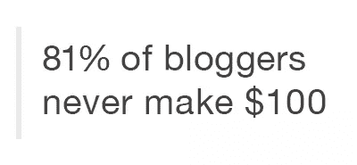

# 博客的现实

> 原文：<https://www.sitepoint.com/reality-blogging/>

当博客在 20 世纪 90 年代末开始流行时，许多人认为他们能够通过与世界分享他们的想法而过上舒适的生活。

和任何职业一样，那些在博客领域处于顶端的人可以赚很多钱。但是在你辞职之前，你应该对博客作者的收入有一个现实的预期。从好的方面来看，今天有许多博客的利基和应用，所以不管你的兴趣是什么，你都可能找到合适的。不幸的是，不利的一面可能是你可能从中获利多少。

谈到作家报酬，许多专业人士会参考[作家市场](http://www.writersmarket.com/)中包含的定价指南。该出版物每年都会制作一份评分表，涵盖了从商业博客到电影剧本和技术写作的许多学科。虽然数字指南提供了丰富的功能，但印刷版包括在线订阅，售价通常只有一半。

## 不要孤注一掷

就像生活中的任何事情一样，最好的博客不仅仅专注于写博客。白皮书、电子书、网络研讨会甚至播客可以带来更多收入，因为它们更容易赚钱。也就是说，传统文章对建立品牌至关重要，但如今很难仅仅依靠广告在网上谋生。

正如 ProBlogger 的 Darren Rowse 在他的博客上提到的，他的货币化策略相对缓慢而稳定。当开始将写博客作为一种爱好时，Darren 专注于基本的广告，如 AdSense 和亚马逊附属链接。随着时间的推移，随着达伦建立起信誉，他的收入来源也从他的博客扩展开来。咨询、演讲和写书成为他补充博客收入的重要方式。随着时间的推移，新的创收机会不断向他袭来。

正如 Darren 在他的帖子中提到的，这发生了 12 年，是许多实验的结果，以确定什么是他最适合的。和任何生意一样，你需要根据你的目标受众来调整你的努力。一旦你找到合适的东西，就用它来运作，并不断改进它，以通过新的和成熟的方法来增加收入。

## 不适合胆小的人

当看博客统计数据时，数字有点可怕。在 2012 年一份关于博客现状的报告中，只有 8%的调查参与者说他们通过博客赚到了足够养家糊口的钱。 9%的参与者表示，他们通过写博客赚到了足够的钱来维持目前的生活方式，每天写 4-6 个小时的博客，另外 2%的人表示，他们每天花 1-2 个小时写博客，每年在异国他乡写博客赚 15 万美元。

在调查数据中，对于一个有抱负的博客作者来说，最具毁灭性的数字是，超过 81%的博客作者从未通过写博客赚到 100 美元。

谋生写作在博客付费上有更多的资源。

## 写博客值得吗？

虽然你可能无法通过经营独立博客来谋生，但写作仍然是许多公司的热门领域。根据 HubSpot 的数据，截至 2014 年，企业内容营销预算一直在大幅增加，因为这是一种提高收入的经济有效的方式。事实上，如今 71%的营销人员获得了更高的预算，但 35%的财富 500 强首席营销官将最大化预算的有效性视为一项重大的职业挑战。

简单地说，内容营销是一种技术，在这种技术中，公司生产信息内容来说服客户在竞争中信任他们。如果你想靠写博客谋生，内容营销可能是理想的选择，因为它可以让你在获得可观收入的同时建立自己的声誉。

## 一切都是可能的

做博主的好处在于，你可以掌控自己的命运。你可以选择做副业，也可以努力把它变成全职职业。要记住的最重要的事情是，从你的博客中赚钱并不是网上写作的唯一好处。写博客的最大好处是证明你在你的领域知识渊博，这将为你打开新的商业或工作机会。

## 分享这篇文章