# 如何向 App Store 提交 Pebble 应用程序

> 原文：<https://www.sitepoint.com/submit-pebble-app-app-store/>

今年早些时候，我写了一篇关于用 JavaScript 开发 Pebble Watch 的文章。这涵盖了从 JavaScript 开发人员的角度开始 Pebble 应用程序开发，我在最后偷偷加入了一些 C 代码作为奖励。我开发了一个名为“*给我找星巴克*的奇妙应用，它结合了 Foursquare API 和 Pebble location API，在我的手表表面上的时间下方显示最近的星巴克的地址。然后，我在我关于[高级 Pebble 手表配置](https://www.sitepoint.com/advanced-pebble-watch-configuration/)的文章中将该应用程序扩展为“*找到我任何东西*”，添加了一个配置屏幕，以便用户可以选择要搜索的关键字。

一旦你有了一个可运行且经过测试的应用程序，下一个合乎逻辑的步骤就是将该应用程序放入 Pebble Appstore。无论是不是支持 JavaScript 的应用程序，将一个基本的应用程序放入 Appstore 的过程都是一样的。

## 准备好你的资产

### 对你的应用进行截图

1.  打开您的终端应用程序，导航到您想要保存截图的文件夹。

2.  运行以下命令:`pebble screenshot --phone IP_ADDRESS_OF_YOUR_PHONE`。这类似于在创建应用程序时运行`pebble build --phone IP_ADDRESS_OF_YOUR_PHONE`命令。您的命令行应该如下所示:

    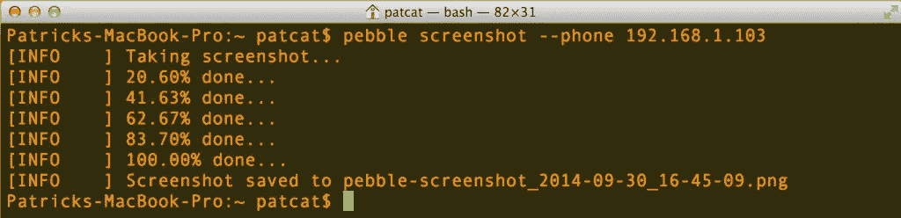

3.  然后，在您运行此命令的文件夹中，您将获得 Pebble 上可见内容的屏幕截图:

    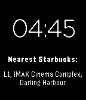

4.  你的应用最多可以有五张截图，所以准备几张吧。

5.  你可以为你的应用程序的主图像制作一个动画 gif，当人们搜索时，它会在应用程序商店的屏幕上显示更多你的应用程序。

### 创建营销横幅

所有专业且有吸引力的 Pebble 应用程式都应该有行销标语。这些都很容易制作，只要你有 Photoshop 之类的工具，可以打开 Pebble 提供的营销资料包。

1.  从本页的[下载“Pebble appstore 营销材料包”。这是一个 photoshop 文件，其中包含资产和查看您的内容在商店中的实时预览的能力！](http://developer.getpebble.com/2/design/#resources)

2.  提取并打开 psd 文件。

3.  滚动到营销横幅，并在您的 Photoshop 图层中找到它。应该在*营销- >营销旗号*下。

4.  双击该层的缩略图来编辑内容(注意:我的 Photoshop 截图在 Windows 中，而我的其他截图在 Mac 上，这是因为我没有 Mac 版的 Photoshop 并在虚拟机中运行它！):

    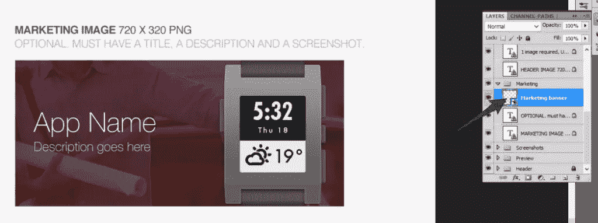

5.  点击弹出菜单上 *OK* 。它提醒你点击*文件- >保存*如果你想保留你在这里的任何更改。

    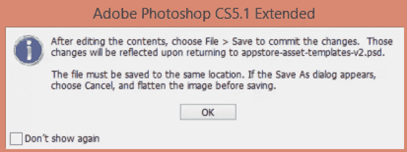

6.  现在，您将看到营销横幅及其可用层:

    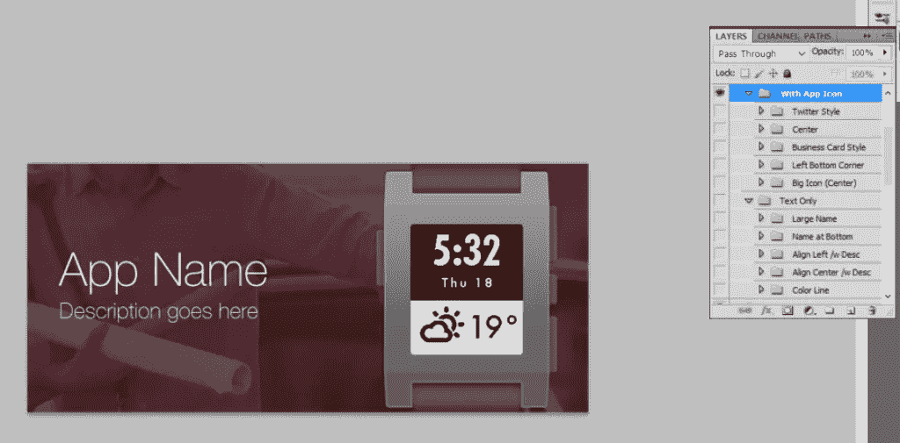

7.  编辑图像，确保您的应用标题、描述和应用截图在 Pebble 上可见。你可以调整文本的字体，添加新的元素(例如，我添加了一个“由 Foursquare 提供动力”)，使用一个更合适的背景图片等等。Pebble 示例中使用的字体是 Helvetica 新字体，如果你使用的是 Windows，这种字体是不能免费获得的，所以你可能会被迫使用不同的字体。我的最终结果是这样的:

    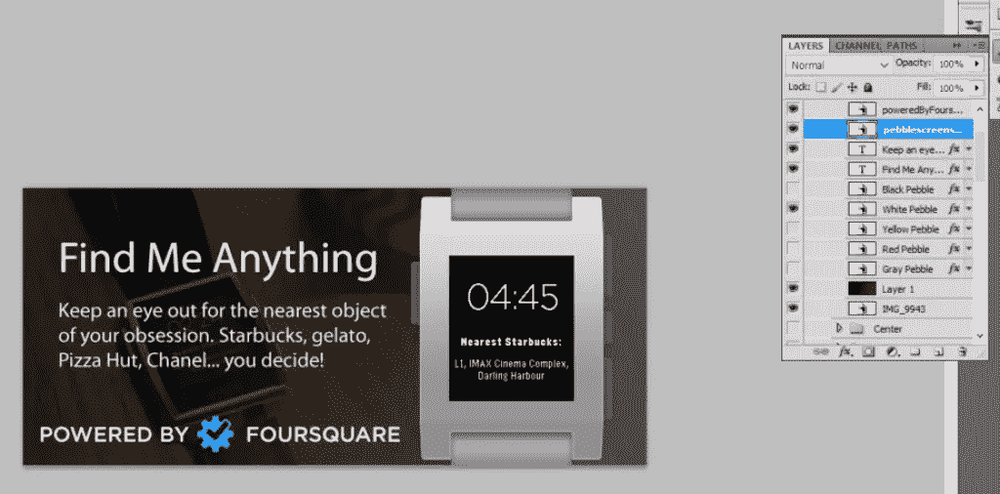

8.  进入*文件- >保存*，保存你的创作。

9.  然后，您可以切换回主 psd(暂时不要关闭您的营销横幅，让它保持打开)并查看您的横幅在运行。

    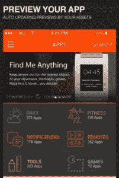

10.  我发现“由 Foursquare 提供动力”的部分被圆点遮住了，所以我调整、重新保存并来回切换了几次，直到我对结果满意为止。

11.  一旦您对自己的模板满意，我建议您为自己的安全保存保存一份独立于此模板的副本。切换到营销横幅，进入*文件- >另存为*，将您的文件另存为 psd 文件。默认的文件类型是 psb 文件，所以请确保将其更改为 PSD。

    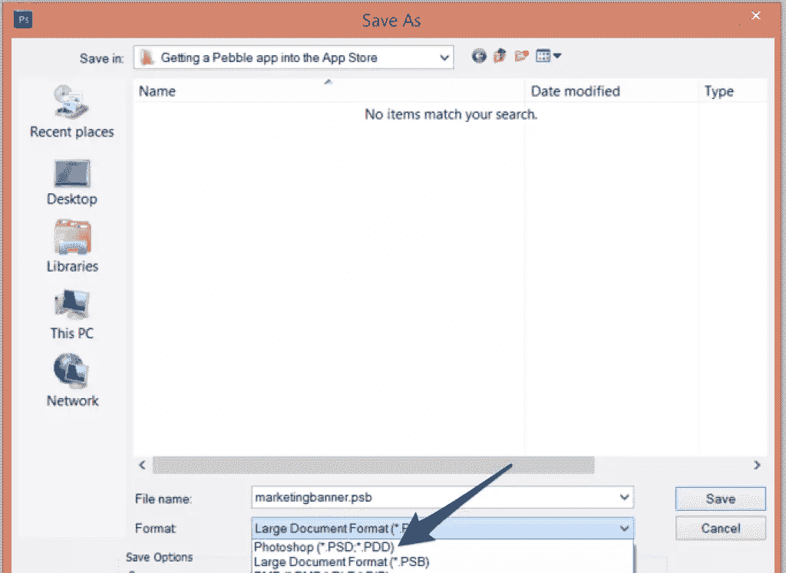

12.  接下来，我们将把文件导出为 PNG 文件，并包含在表单中。进入*文件- >网页和设备保存*，选择 PNG–24。应该是 720×320 像素。把它保存在你能找到的地方。

    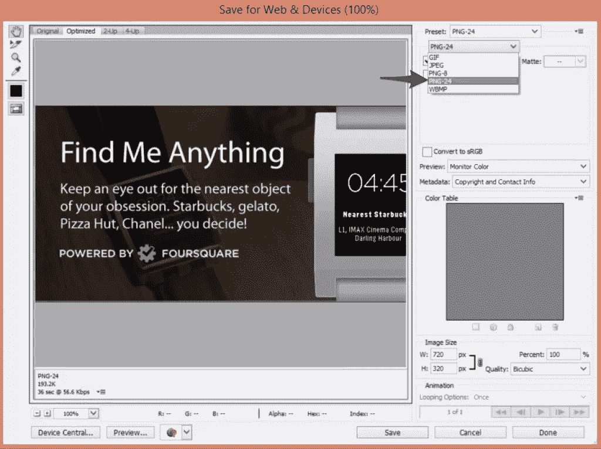

### 适用于 Pebble 应用程序(非 watchfaces)

如果您添加的是 Pebble 应用程序，而不是 watchface，那么您还需要两个 PNG 图像图标，用于在 app store 中代表您的应用程序，它们都在“Pebble appstore 营销材料套件”模板中:

*   一个 144 x 144 PNG
*   一个 48 x 48 巴布亚新几内亚

整理好这些后，我们就可以上传了。

## 通过 Pebble 开发者门户发布您的应用

1.  前往[https://dev-portal.getpebble.com](https://dev-portal.getpebble.com)

2.  点击“发布 Pebble 应用程序”: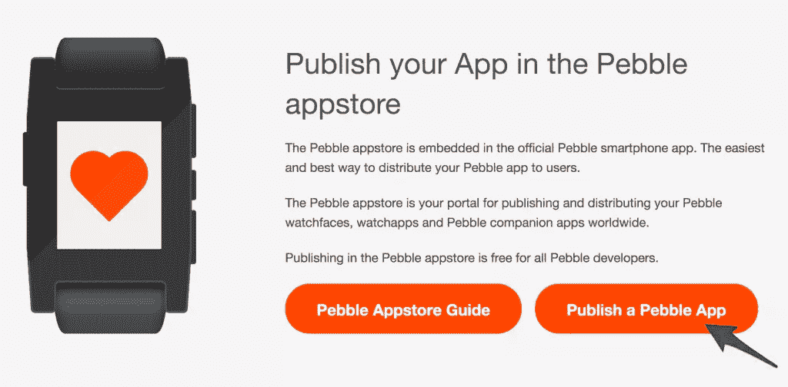

3.  获取一个帐户(如果您已经有了一个帐户，请登录)。

4.  登录后，您应该会看到一个屏幕，上面显示了每种应用类型的详细信息，底部有三个按钮，如下所示:

    

    我假设到这个时候，你已经有了一个应用程序。所以你可能已经知道它是 watchface、watchapp 还是配套应用。总而言之:

    *   **watch face–**显示时间，并且该应用程序在一天的大部分时间都可以在用户的 Pebble 上看到。我上面提到的“给我找星巴克”和“给我找任何东西”应用就是 watchfaces。
    *   **watch app–**这是一款用户需要从 Pebble watch 菜单打开并使用的应用。它可以做任何事情，显示我的小马的照片，统计最近十次大猩猩的出现，点一份没有凤尾鱼的披萨。他们可能更喜欢在特定场合收藏的东西，而不是随时可用并随时间展示的东西。
    *   **配套应用–**如果你做过配套应用，你会知道的。它是一个原生的 iOS 或 Android 应用程序，伴随着 Pebble 应用程序提供更多功能。有了 Pebblekit JavaScript 框架，为用户提供选择设置的方式就不需要这些了，所以只有在你真的需要的时候才有配套的应用。仅仅为了一个 watchface/watchapp 就安装多个项目，实在是一件痛苦的事情。
5.  我将从我的[Advanced Pebble Watch Configuration](https://www.sitepoint.com/advanced-pebble-watch-configuration/)文章中上传“Find Me Anything”Watch face，所以我选择“Create a Watchface”。

6.  添加你的应用名称、描述、URL 和代码链接(如果你愿意分享):

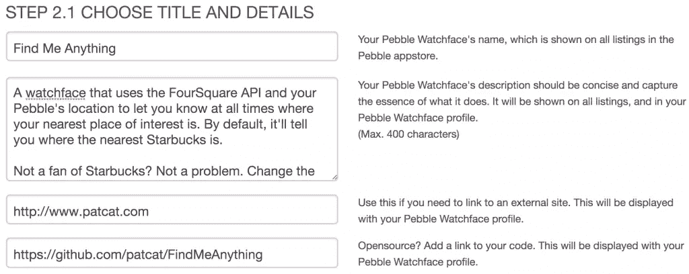

8.  上传您的 Pebble 应用程序截图(如果您制作了几个，则可以是多个截图):

    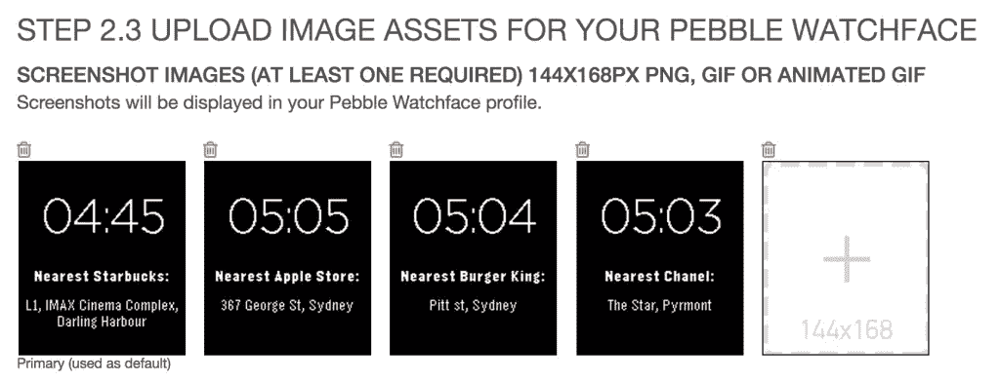

9.  上传您的营销横幅:

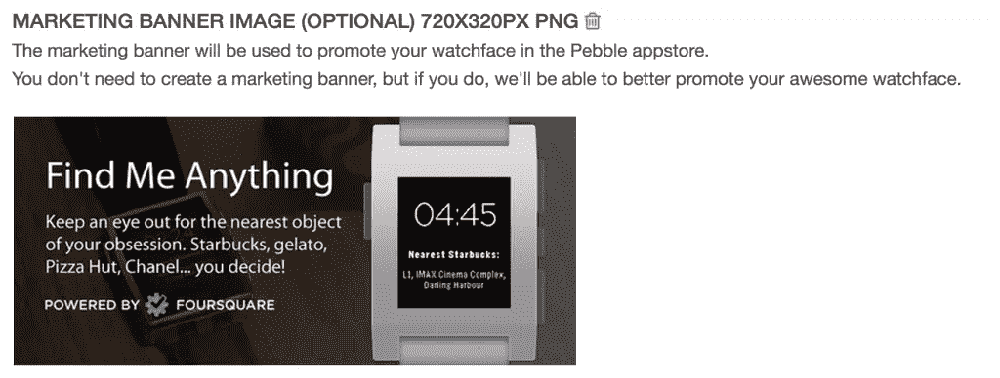

11.  点击“创建”
12.  从这一点来看，你的应用程序存在于你的帐户下，但没有任何应用程序版本。您可以查看 appstore 条目的预览:

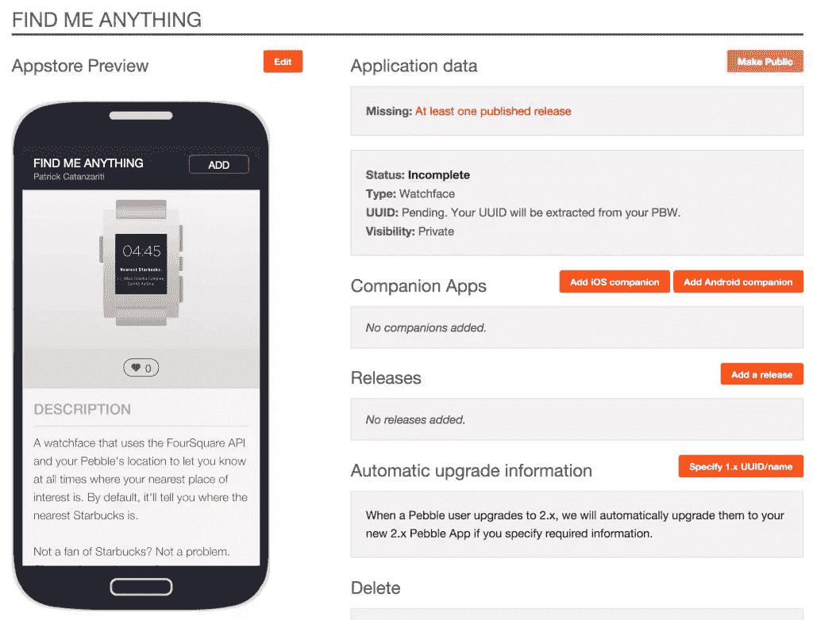

14.  您的应用程序包含在 PBW 文件中。要找到它，请转到包含您的应用程序的文件夹，然后找到“build”文件夹。
15.  在这个构建文件夹中，将会有一个以你的应用程序的名字作为文件名的 PBW 文件。比如我的是`find_me_anything.pbw`。
16.  要上传您的应用程序，请单击“添加版本”按钮:

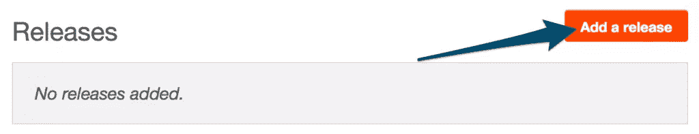

18.  在下一个屏幕中，单击“选择文件”并上传您的 PBW 文件，键入任何发行说明，然后单击“保存”:

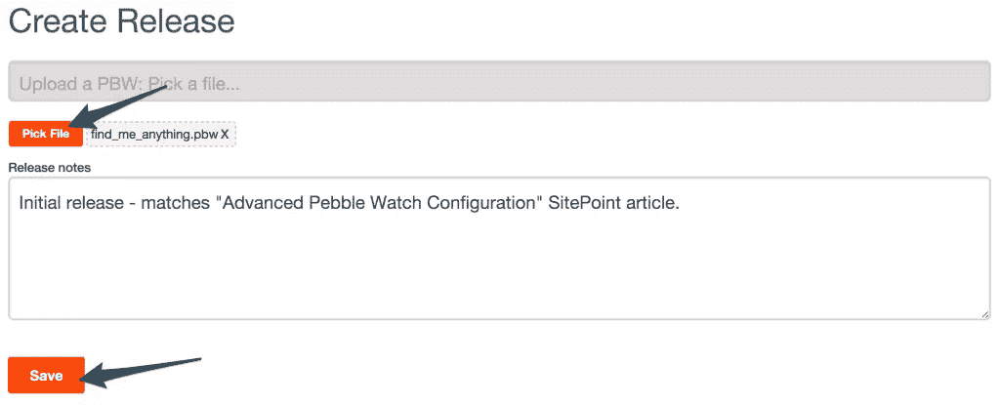

20.  如果您有任何验证错误，您需要在重新提交之前修复这些错误。我的提交失败了，因为版本编号约定已经改变。Pebble 现在只需要 *major.minor* 而不是*major . minor . bugfix`appinfo.json`中的*:
21.  如果愿意，您可以删除失败的版本。为此，请转到您的应用信息的“版本”部分，然后单击您要删除的版本旁边的“详细信息”链接:

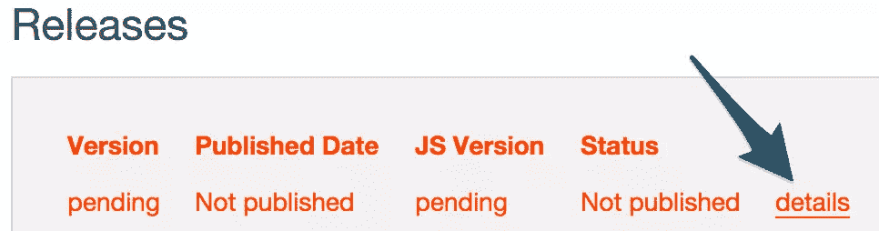

23.  在“所有者操作”下，选择“删除”，然后选择“确定”:

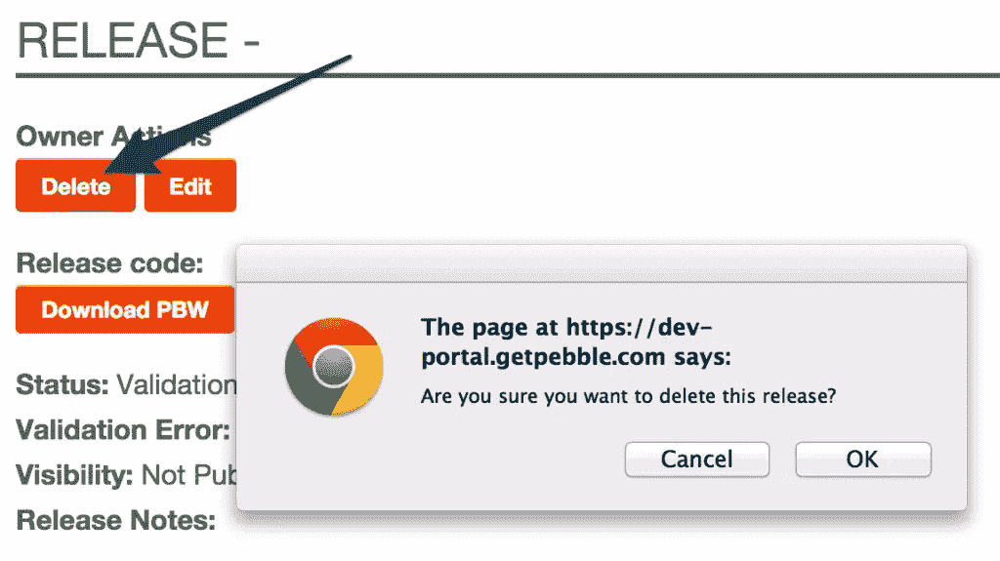

25.  你也许可以点击“编辑”重新提交一个版本，但是我使用的方法是要么删除失败的版本，要么让它留在那里，回到主应用程序信息屏幕，再次点击“添加版本”。
26.  如果提交没问题，进入发布页面，在“细节”链接旁边，你会看到一个“发布”按钮。点击:

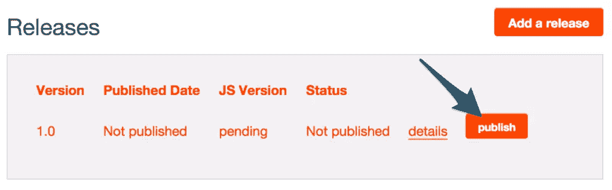

28.  单击“公开”按钮将可见性更改为公开:

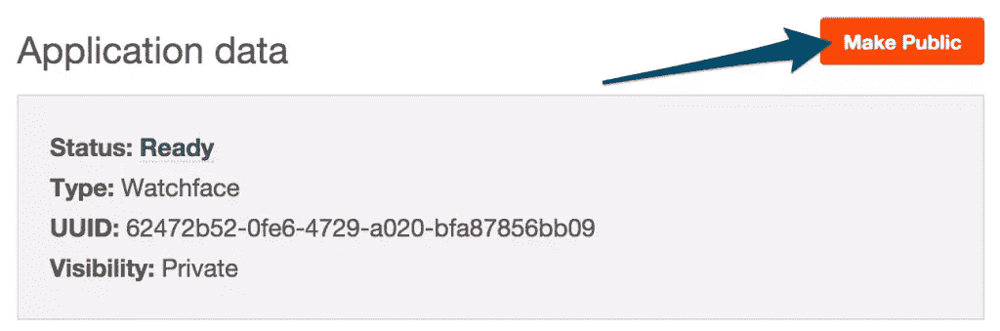

30.  您将在应用程序数据下看到您的应用程序的状态(之前显示为“私人”)。在这种情况下，我的应用程序现在在 Android 上是公开的，但它仍在努力将其移植到 iOS 上(我将在下面的一节中解释 iOS 的时间表):

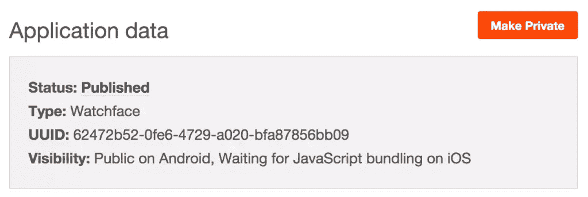

32.  如果一切顺利，它将发布到 appstore 上，你将获得可以分享的链接。公共网络链接是您可以在网上分享的链接，深度链接是您可以在 Android 和 iOS 应用程序中链接到的链接，以便直接进入 Pebble Appstore。

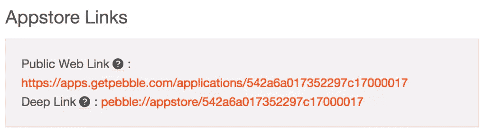

34.  前往 Appstore，搜索您的应用程序，感受看到您自己的应用程序的兴奋感！

    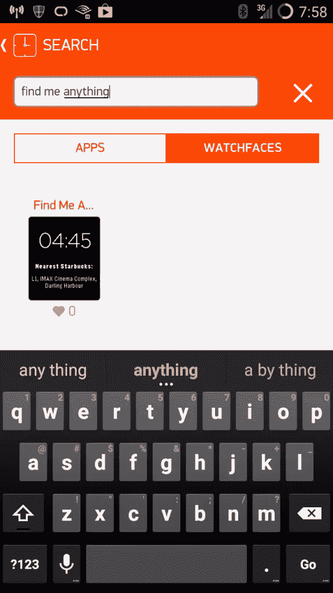

35.  点击并检查所有的细节是预期的，然后安装。

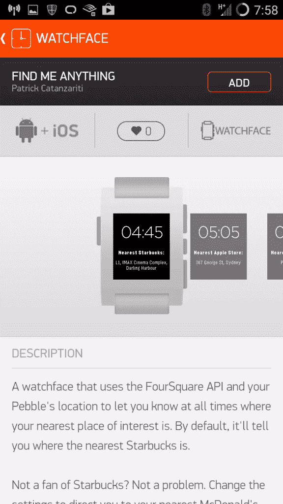

37.  当我安装应用程序时，它自动替换了我的测试版本，这很棒:

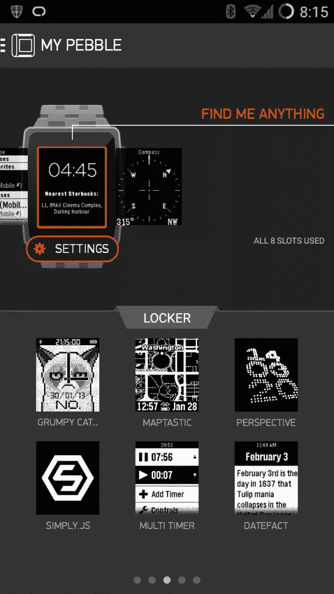

39.  我们都完了！如果你已经有了自己的应用程序，那么恭喜你，你已经在 appstore 上有了一个应用程序。

## 但是……iOS 还在等这个捆绑的东西？

遗憾的是，在 iOS 用户可以安装新提交的支持 JS 的应用程序之前，Pebble 需要将每个 JavaScript 文件捆绑到 Pebble iOS 应用程序中。他们大约每十天向苹果发送一次更新， [Pebble 在此解释](https://developer.getpebble.com/blog/2014/04/22/JS-Bundling/):

> 当您向 Pebble appstore 提交使用 JavaScript 的新应用程序时，iOS 用户将无法立即使用该应用程序。他们将看到一个“即将推出”按钮，而不是“添加”按钮。大约每 10 天，我们会抓取所有已发布的 JavaScript 应用程序的最新版本，并将它们包含在我们 iOS 应用程序的新版本中。这个新版本然后被发送给苹果。当这个新版本获得苹果批准后，iOS 用户将自动升级到这个版本，然后就可以访问你的应用程序了。

## 资源

*   [发布到 Pebble appstore](http://developer.getpebble.com/2/distribute/publish-to-pebble-appstore.html)–Pebble 关于发布到 app store 的官方文档
*   【Appstore 成功秘诀–Pebble 关于成功发布应用的秘诀
*   [Pebble Designer Guide](http://developer.getpebble.com/2/design/#resources)–包括“Pebble appstore 营销材料套件”，内含营销标题和图标的模板
*   [为 Pebble 应用捆绑 JavaScript](https://developer.getpebble.com/blog/2014/04/22/JS-Bundling/)–关于 iOS JS 捆绑问题的信息

## 分享这篇文章