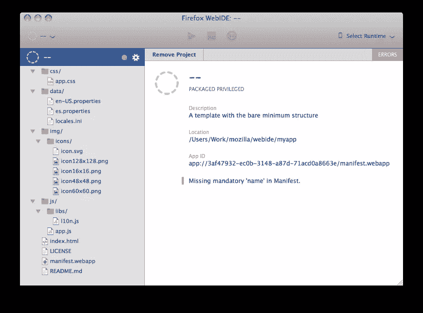
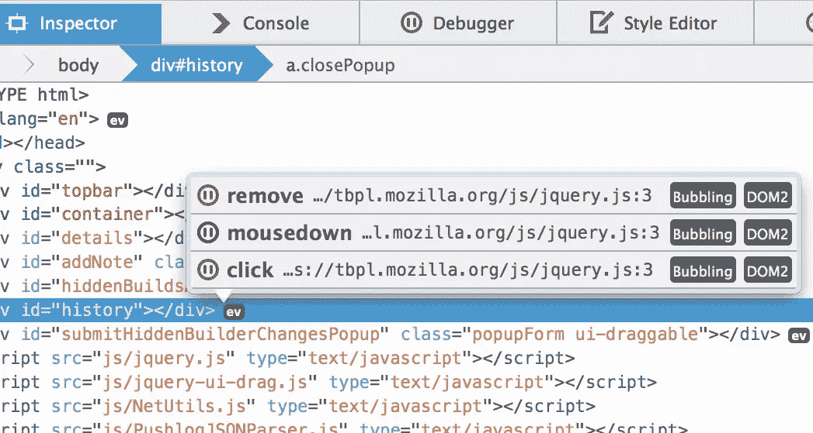
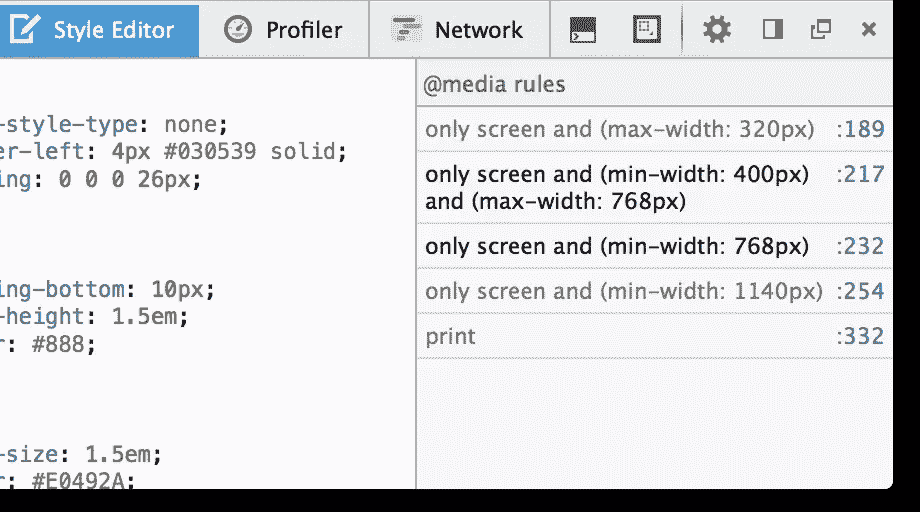
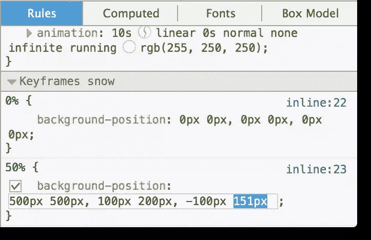
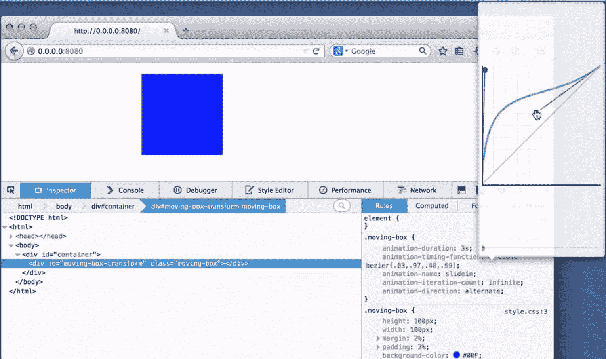

# 火狐 33 的新功能

> 原文：<https://www.sitepoint.com/whats-new-firefox-33/>

在 32 版本发布近六周后，Mozilla 的 Firefox 又带着新的更新回来了。你可以等待自动更新，从菜单中选择**关于火狐**，或者从 Firefox.com[手动下载新的安装程序。](https://firefox.com)

我们已经为最终用户和开发者检查了新的特性，他们都喜欢 v33 中的一些东西。让我们看一看。

## WebIDE

如果你以前玩过 Firefox 开发工具或 Firefox OS 应用程序，你可能在 WebIDE 还处于 Alpha 阶段或更早的时候(每晚)就已经看过了。WebIDE 取代了 Firefox OS 应用管理器，包括一些额外的部署和调试工具。它现在有一个基于 CodeMirror 和 tern.js 框架的代码编辑器。

应用程序可以通过 USB 或 WiFi 部署在真实的 Firefox OS 设备上，也可以部署在模拟器上。对于开发人员来说更容易的是，WebIDE 现在提供了基于各种模板的样板代码。它目前支持 Firefox OS 1.3、1.4 和 2.0。

[//www.youtube.com/embed/n8c34wk4OnY?feature=player_embedded](//www.youtube.com/embed/n8c34wk4OnY?feature=player_embedded)

正如 Mozilla Hacks 博客文章中提到的:

> 您可以使用一个简单的 API，允许外部编辑访问该工具的所有高级功能——运行时管理、将应用程序推送到不同的设备以及连接 Firefox 开发人员工具。您可以关闭我们的内部编辑器，为 WebIDE 留下一个简单、干净的界面来管理运行时和验证应用程序。我们希望让任何代码编辑器的用户都能轻松地将他们的代码发布到各种设备上。

Firefox 33 是第一个包含打开 WebIDE 选项的稳定版本，所以如果你还没有检查它，你现在肯定应该检查了。

注意:你可以通过改变一个偏好来启用 Firefox 33 中的 WebIDE:访问`about:config`，找到名为`devtools.webide.enabled`的偏好，并将其设置为`true`。

## 事件监听器弹出窗口

Firefox 33 中加入了各种新功能。其中之一是**事件监听器弹出**。现在，在检查器中，任何附加了 JavaScript 事件监听器的节点旁边都会有一个`ev`图标。单击该图标将打开附加到该元素的所有事件侦听器的列表。调试器的“暂停”图标还会弹出一个窗口，您可以在其中自己进一步调试元素。

## @媒体边栏

样式编辑器中添加了一个新的侧边栏。`@media`侧边栏显示当前正在编辑的样式表(或 Sass 源)中每个@media 规则的快捷方式列表。这很有效，尤其是当与响应式设计视图( *Opt+Cmd+M / Ctrl+Shift+M* )搭配使用时。

## 编辑关键帧

在新版本中，与当前所选元素相关联的任何`@keyframes`规则现在都显示在检查器的规则部分，并且也是可编辑的。当检查和调试 CSS 动画时，这是一个很好的补充，因为它使整个过程更加有效。

## 三次贝塞尔编辑器

在创建和编辑缓动动画时非常有用，现在所有 CSS 修补者都可以使用 CSS 动画的三次贝塞尔编辑器。可以通过 CSS 规则中动画计时函数旁边的图标来访问它。

[//www.youtube.com/embed/LemdYmcRrb0?feature=player_embedded](//www.youtube.com/embed/LemdYmcRrb0?feature=player_embedded)

## 开发人员工具的其他变化:

*   添加新规则
*   转换荧光笔
*   永久禁用缓存
*   新命令
*   编辑器首选项
*   编辑选择器
*   黑盒缩小源
*   自定义视口尺寸

## 网站兼容性更改

与许多版本一样，也包括了较小的站点兼容性更改。你可以在 Mozilla 开发者网络上的[这本方便的指南中找到它们](https://developer.mozilla.org/en-US/Firefox/Releases/33/Site_Compatibility)

。

## 最终用户功能

*   OpenH264 支持(沙盒)
*   更细更快的 JavaScript 字符串
*   提高了会话恢复的可靠性
*   通过 HTTPS 连接到 HTTP 代理
*   新的 CSP(内容安全策略)后端
*   通过地址栏改善搜索体验
*   Firefox 起始页上的搜索建议(关于:主页)
*   添加了阿塞拜疆[az]语言环境

除了一些进一步的 WebRTC 实验、改进的搜索体验和增强的磁贴，Firefox 33 没有普通人感兴趣的主要附加功能。

## 勤劳的狐狸

随着 10 周年纪念日的临近，Firefox 正在将自己打造成 web 开发人员的适当中心，提供越来越多的开源工具，同时仍然忠诚地为最终用户服务。

WebIDE 和 WebRTC 特性尤其令人兴奋。如果做得好，他们可以给火狐一个急需的推动力，使其脱颖而出。

你可以在这里找到官方发布说明[，在这里](https://www.mozilla.org/en-US/firefox/33.0/releasenotes/)找到开发者的新变化[。](https://developer.mozilla.org/en-US/Firefox/Releases/33)

你对新增加的内容有什么看法？你期待尝试它们吗？请在评论中告诉我们！

## 分享这篇文章