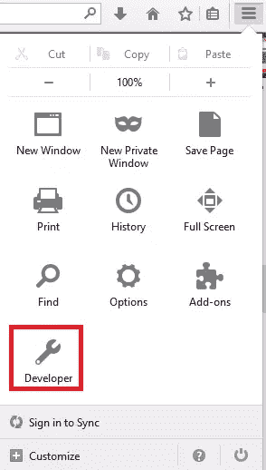
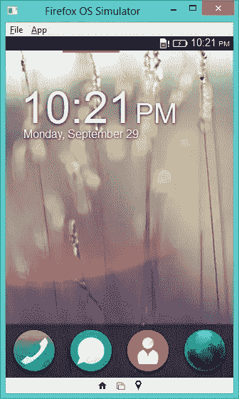
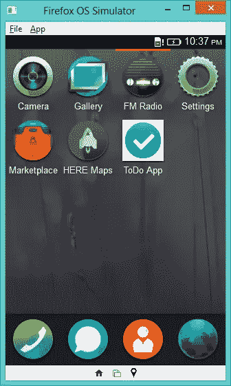
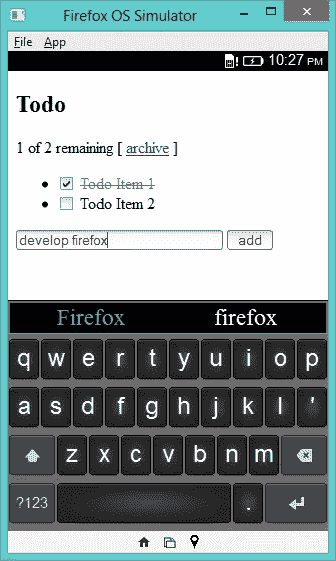

# 火狐操作系统应用入门

> 原文：<https://www.sitepoint.com/firefox-os-application-primer/>

欢迎来到火狐操作系统的应用开发教程。在我们深入探讨这个主题之前，我想强调一下 FireFox 操作系统的存在，以及为什么 web 开发者必须考虑为这个操作系统开发应用程序。

## 火狐 OS 是什么？

FireFox OS 是一款移动操作系统，是 Mozilla 的“Boot to Gecko”项目的成果。提到它是基于 Linux 内核和 Firefox 的 Gecko 渲染引擎，不会断章取义。这个操作系统是完全开源的，因此它没有受到所有权的束缚。FireFox OS 的用户界面是一个 web 应用程序，具有启动和显示各种其他 web 应用程序的内置功能。与移动操作系统领域的其他巨头(如 Android、iOS)不同，它的目标是新兴市场。它还旨在以低廉的价格为最终用户提供智能手机的卓越功能。

## 为什么要为 FireFox OS 开发应用？

我们必须明白的第一件事是，FireFox OS 通过让 web 开发人员与设备的原生功能紧密互动，赋予了他们真正的力量。这意味着开发 Firefox 应用程序所需要的只是像 HTML 和 JavaScript 这样的网络技术。开发人员可用的强大 API 使得通过充分利用设备来创建健壮的应用程序变得非常容易。

现在我们已经了解了更多关于这个操作系统的应用程序，让我们了解一下 Firefox 操作系统应用程序的类型。

**打包:**

这些 app 基本上都是。包含应用程序使用的资源的 zip 存档文件(如 HTML、CSS 和 JavaScript 文件)。用户将不得不下载并安装它，就像任何其他移动操作系统应用程序一样。开发者可以通过 Firefox marketplace 向用户推送更新。也可以自行更新应用程序。

**主持:**

托管应用程序主要从服务器上运行，就像有给定域名的网站一样。该应用程序的所有文件都托管在服务器上。由于应用程序资源位于服务器上，开发人员对托管应用程序有更多的控制权。

在本教程中，我们将逐步开发一个打包的应用程序，为用户列出待办任务。

## 为火狐操作系统开发应用的操作方式

### 1.开发环境设置

每个 Firefox OS 应用程序(打包的或托管的)都需要一个位于项目根目录下的名为`manifest.webapp`的强制文件。它是一个 JSON 文件，提供信息(如名称、描述、作者、图标等。)关于 app 到 OS。在本教程中，我们将使用以下简单的`manifest.webapp`。

```
{
  "version": 1.0,
  "name": "ToDo App",
  "description": "App to make a note of to-do tasks",
  "launch_path": "/index.html",
  "developer": {
    "name": "Preetish",
    "url": "http://Preetish.Me"
  },
  "icons": {
    "512": "/img/icon-512.png",
    "128": "/img/icon-128.png"
  },
  "default_locale": "en"
}
```

要了解更多关于清单文件的信息，你可以查看文档。清单文件可以通过[清单验证器](https://marketplace.firefox.com/developers/validator)进行验证。一个 [API](http://firefox-marketplace-api.readthedocs.org/en/latest/) 也可以用来验证。

在我们的项目根目录中，创建`manifest.webapp`文件，以及以下目录:

*   `css`
*   `js`
*   `lib`
*   `img`

最后，您需要安装 [Firefox OS 模拟器](https://developer.mozilla.org/en-US/docs/Tools/Firefox_OS_Simulator)来完全设置开发环境。安装后，可以从 Firefox 浏览器菜单的开发者部分访问模拟器。



一旦模拟器启动，您应该会看到 Firefox OS 屏幕，如下图所示。



### 2.Web APIs 和 Web 活动

通过 web 技术访问移动设备功能一直是一个难以解决的问题。Mozilla 已经提出了广泛的 JavaScript APIs 来解决这个问题，通过提供访问来管理和控制设备功能，如联系人、电源管理、相机、FM、蓝牙硬件等。这些被称为[webapi](https://developer.mozilla.org/en-US/docs/WebAPI)，作为开发者，你必须在 Mozilla 开发者网络上查看它们。

在 web 活动的情况下，应用程序执行的操作是通过从一个应用程序到另一个应用程序的任务分配链来完成的。例如，如果应用程序需要打开一个 PDF 文件，它会要求用户选择一个他或她已经用来打开 PDF 文件的应用程序。一旦特定文件被打开，它将被返回给调用者或源应用程序。

你可以参考 MDN 上的[网络活动](https://developer.mozilla.org/en-US/docs/WebAPI/Web_Activities)参考和 Mozilla Hacks 上的[网络活动介绍](https://hacks.mozilla.org/2013/01/introducing-web-activities/)了解更多信息。

### 3.编写示例应用程序

我们将使用 [AngularJS](https://angularjs.org/) 来开发这个待办事项应用程序。下载角度源并将其复制到我们项目的`lib`目录中。接下来，在根目录中创建`index.html`。将以下代码复制到文件中。

```
<!DOCTYPE html>
<html lang="en">
  <head>
    <title>Todo List App</title>
    <link rel="stylesheet" type="text/css" href="css/style.css"/>
  </head>
  <body>
    <div ng-app="todoApp">
      <h2>Todo</h2>
      <div ng-controller="TodoController">
        <span>{{remaining()}} of {{todos.length}} remaining</span>
        [ <a href="" ng-click="archive()">archive</a> ]
        <ul class="unstyled">
          <li ng-repeat="todo in todos">
            <input type="checkbox" ng-model="todo.done">
            <span class="done-{{todo.done}}">{{todo.text}}</span>
          </li>
        </ul>
        <form ng-submit="addTodo()">
          <input type="text" ng-model="todoText"  size="30"
                 placeholder="add new todo here">
          <input class="btn-primary" type="submit" value="add">
        </form>
      </div>
    </div>
    <script type="text/javascript" src="lib/angular.js"></script>
    <script type="text/javascript" src="js/app.js"></script>
  </body>
</html>
```

接下来，在`css`目录中创建`style.css`，并复制以下代码:

```
.done-true {
  text-decoration: line-through;
  color: grey;
}
```

接下来，在`js`目录中创建`app.js`，并复制下面的代码。

```
angular.module('todoApp', [])
  .controller('TodoController', ['$scope', function($scope) {
    $scope.todos = [
      {text:'Todo Item 1', done:true},
      {text:'Todo Item 2', done:false}];

    $scope.addTodo = function() {
      $scope.todos.push({text:$scope.todoText, done:false});
      $scope.todoText = '';
    };

    $scope.remaining = function() {
      var count = 0;
      angular.forEach($scope.todos, function(todo) {
        count += todo.done ? 0 : 1;
      });
      return count;
    };

    $scope.archive = function() {
      var oldTodos = $scope.todos;
      $scope.todos = [];
      angular.forEach(oldTodos, function(todo) {
        if (!todo.done) $scope.todos.push(todo);
      });
    };
}]);
```

### 4.测试应用程序

为了测试我们的应用，我们将使用 [Firefox OS 模拟器](https://developer.mozilla.org/en-US/docs/Tools/Firefox_OS_Simulator)。在火狐中，去工具>开发者>火狐操作系统模拟器。接下来，点击添加目录按钮并导航到`manifest.webapp`文件来加载它。

如果一切正常，您应该能够在笔记本电脑/台式机上看到模拟的应用程序。您可能需要滚动屏幕才能访问该应用程序。



点击屏幕上出现的应用程序，访问您的应用程序。



完成应用程序后，创建。压缩整个根目录文件的归档文件，并使用[验证器](https://marketplace.firefox.com/developers/validator)对其进行一轮完整的测试。

查看 [WebIDE](https://developer.mozilla.org/en-US/docs/Tools/WebIDE) 测试工具，它允许您通过 usb 将桌面 Firefox 连接到兼容设备。此外，它还能让你将应用程序直接推送到设备上，并在运行时进行调试。

### 5.发布应用程序

分发你的 Firefox OS 应用程序非常容易。可以作为[自发布 app](https://developer.mozilla.org/en-US/docs/Web/Apps/Publishing/Self-publishing_Apps) 托管在自己的服务器上。然而，为了获得更大的影响力和知名度，它可以被推到 [Firefox marketplace](https://marketplace.firefox.com/) 。一旦清单文件通过验证，就可以提交关于应用程序的额外信息(如操作系统支持、价格、屏幕截图)。用户将能够购买你的应用程序，对它进行评级，并提供反馈。

## 结论

本教程向您展示了如何创建一个简单的 Firefox OS 应用程序。本文涉及的演示应用程序的代码也可以在 [GitHub](https://github.com/jsprodotcom/source/blob/master/FireFox_OS_To-Do_App_Source_Code.zip) 上获得。请随意查看、修改它，并可能用它来启动您的下一个 Firefox 应用程序。尽情享受吧！

## 分享这篇文章