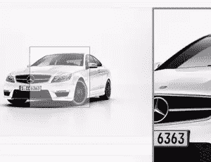

# 为 jQuery 插件创建 Ruby Gem:基础

> 原文：<https://www.sitepoint.com/create-ruby-gem-jquery-plugin-basics/>



Rails 包含了目前 web 开发领域没有其他框架提供的特性。随着每个版本的发布，它的特性集变得越来越强大。无论是将流支持集成到核心框架中，还是俄罗斯娃娃缓存，或者是使用 Bundler 轻松管理依赖项，Rails 总是证明自己是引入 web 开发新概念的先锋。

Rails 是用 Ruby 构建的，可以说 Rails 是 Ruby 的天下，Ruby 是宝石的天下。Ruby 代码主要由 gem 组成，这相当于其他语言视角中的库。Rails 本身就是一块红宝石。Gems 提供了一种干净优雅的方式来组织相关代码。在适当的 gems 中创建和分离相关代码是实现代码库模块化的第一步。

在这篇文章中，我们将从头开始创造一个宝石。我们正在构建的 gem 基于一个 jQuery 插件。您可能想知道:当我们可以简单地获取它的源代码并开始使用它时，为什么还要为 jQuery 插件开发 gem 呢？原因是 Rails。Rails 为开发人员提供了一种系统化的做事方式，这也是它区别于其他框架的魅力所在。通过开发 gem，我们将不再需要开发人员手工编写 JavaScript 代码。相反，我们的 gem 会自动做正确的事情，从而节省开发人员的时间。

我们的 gem 的 jQuery 插件叫做 [image_zoomer](https://github.com/ilatif/image_zoomer) 。这个插件为图片提供了缩放效果，而不需要额外的图片。GitHub repo 有一个演示，因此您可以了解它的功能。我们的目标是提供一个系统化的“Rails”方式，这样开发者只需要安装我们的 gem 就可以了。插件需要的所有设置将由我们的 gem 处理。如果你不想经历所有的步骤，想一跃到底，那就访问 [image_zoomer_rb 资源库](https://github.com/ilatif/image_zoomer_rb)。剩下的人，我们开始吧。

## 宝石骨架

首先，安装最新版本的 Ruby，这是本文撰写时的版本。此外，安装最新版本的 Rails，这样我们就可以在构建 gem 时对其进行测试。

Bundler 不仅使安装和管理依赖项变得非常容易，而且使创建 gem 的基本框架变得非常容易。使用以下命令:

```
bundle gem name_of_gem
```

在 Ruby 中给宝石命名并不困难，但是您应该有意识地这样做。在给宝石命名之前，每个宝石作者都应该阅读一些官方指南。我们的 gem 将被命名为`image_zoomer`,因此它与 jQuery 插件相对应。现在，创建宝石骨架:

```
bundle gem image_zoomer
```

上述命令的输出将类似于:

```
create image_zoomer/Gemfile
create image_zoomer/Rakefile
create image_zoomer/LICENSE.txt
create image_zoomer/README.md
create image_zoomer/.gitignore
create image_zoomer/image_zoomer.gemspec
create image_zoomer/lib/image_zoomer.rb
create image_zoomer/lib/image_zoomer/version.rb
Initializing git repo in /Users/imran/Desktop/work/gem_creation/sitepoint/image_zoomer
```

**image_zoomer.gemspec** 是以预定义的方式包含我们宝石的元信息的文件。查看[这份](http://guides.rubygems.org/specification-reference/)参考指南，了解各酒店的详细信息。Bundler 已经用缺省值填充了这个文件，可以根据需要进行更新。这个文件也用于定义 gem 的依赖项。Bundler 已经填好了`bundler`和`rake`。因为我们的 gem 只依赖于 Rails 和一个 jQuery 插件，所以不需要包含任何其他东西。

继续改变其他字段，比如`authors`和`email`，让世界知道是谁创造了这块宝石。

**Gemfile** 被 **Bundler** 用来安装和管理我们的依赖项，这你可能已经知道了。但是，我刚才说了 **image_zoomer.gemspec** 是用来管理我们的 gem 依赖关系的。在这里做了一些聪明的事情。

打开 **Gemfile** ，你会注意到有一个对`gemspec`的调用。 **Gemfile** 自动引用 **image_zoomer.gemspec** 文件，因此，Bundler 将管理 gemspec 中定义的依赖关系。

**Rakefile** 包含与 gem 创建、安装和分发相关的 rake 任务。

**LICENSE.txt** 包含一个 MIT 许可证，自动为我们生成。您可以用选择的许可方案来替换它，以表明您对 gem 用户的权限和限制。

**README.md** 包含安装和使用相关信息。它由 Bundler 定义的默认结构填充。每个 gem 作者都要根据自己的要求进行更新。

**。gitignore** 被 Git 用来忽略文件。

lib/image_zoomer/ 是定义我们的 gem 运行所需的 Ruby 类和模块的首选和社区接受的方式。你会在每颗红宝石上看到这种图案。

**lib/image_zoomer.rb** 是 gem 的基础文件，通常用来定义基础模块，需要 **lib/image_zoomer/** 中定义的模块和类。因为我们的 gem 名称是`image_zoomer`，所以自动为我们创建了一个模块`ImageZoomer`。

**lib/image _ zoomer/version . Rb**包含了我们 gem 的版本。这是我们的 gem 的第一次迭代，所以`0.0.1`看起来绝对没问题。

## 创建一个示例应用程序

我们已经为我们的宝石创建了一个基本框架。最好用一个虚拟 Rails 应用程序开始测试，以便提前发现错误。要创建一个示例 Rails 应用程序，请键入(注意:在 gem 目录之外进行):

```
rails new image_zoomer_app
```

创建一个控制器和视图，产生一个地方来测试我们的 gem 提供的东西。

```
rails generate controller site index
```

这将创建一个带有方法`index`的控制器`site`。 **routes.rb** 也会自动更新。在这个 Rails 应用程序中包含我们的 gem。打开 **Gemfile** 并键入:

```
gem 'image_zoomer', '0.0.1', path: '/Users/imran/Desktop/work/gem_creation/sitepoint/image_zoomer/'
```

Bundler 提供了一种简单的方法来包含本地宝石。我们已经指定了 gem 的名称、版本和绝对路径。当然，你的道路会有所不同。您可以跳过这个版本，但是最好保留它，因为没有它，本地的`.gem`文件可能会产生问题。

继续打开**app/views/site/index . html . erb**，删除已经自动生成的内容并粘贴以下代码。

```
<%= ImageZoomer::VERSION %>
```

启动服务器，访问[http://localhost:3000/site/index](http://localhost:3000/site/index)。您将看到页面上显示的`0.0.1`。酷！。我们刚刚创建了一个小的 gem，并在一个 Rails 应用程序中使用它。你一定感觉很有成就感，但是旅程才刚刚开始:-)。

## 包括 JavaScript 资产

因为我们正在为一个 jQuery 插件创建一个 gem，如果没有这个 jQuery 插件的文件，这个 gem 是完全没有用的。在 gem 的根目录下创建一个名为 **app/assets/javascripts** 的目录。进入[image _ zoomer](https://github.com/ilatif/image_zoomer)plugin GitHub 页面，克隆或下载 repo，抓取 **image_zoomer.js** 放入新的 **app/assets/javascripts** 目录。

多亏了 Rails 核心团队，包含 JavaScript 和其他资产变得非常容易。只需在 **lib/image_zoomer** 目录下创建一个名为 **engine.rb** 的文件，并粘贴以下代码:

```
module ImageZoomer
  class Engine < Rails::Engine
  end
end
```

根据 Rails 的说法，为了将 gem/engine 中的资产包含到 Rails 应用程序中，必须存在从`Rails::Engine`派生的名为`Engine`的类。Rails 会处理剩下的事情。

返回到虚拟 Rails 应用程序并打开**app/assets/JavaScript s/application . js**。添加以下行:

```
//= require image_zoomer
```

这将包括我们的 Rails 应用程序资产中的 jQuery 插件。重启你的服务器，刷新页面，你会得到一个错误。哎呀！。这不是我们所期望的。有一个关于 Rails 资产管道无法定位`image_zoomer`的丑陋错误。我们错过了什么吗？是的，我们有。记住，我们刚才在我们的 gem 中创建了一个文件 **engine.rb** ，但是我们忘记了`require`它。如果不要求，该文件中的代码将永远不会执行。在 gem 中打开 **lib/image_zoomer.rb** ，在第一条`require`语句后粘贴下面一行。

```
require "image_zoomer/engine"
```

这将包括 **app/assets/** 下的所有资产，就像我们包括来自 Rails 应用的资产一样。重新启动 web 服务器并刷新浏览器。这一次，您将不会看到任何错误。也可以在浏览器的任意位置单击鼠标右键，然后选择`view source`。你会看到一个引用`image_zoomer.js`的`script`标签。

我们只使用了 gem 中的一个 JavaScript 文件。如果有其他 JavaScript 文件，我们必须提到每一个**app/assets/JavaScript s/application . js**。你不觉得有点奇怪吗？是的，它是。别担心，有更好的方法。

链轮(Rails 资产管道背后的宝石)有一个指令，将所有文件包含在一个目录下。在我们的 gem 中的 **app/assets/javascripts** 下创建一个文件 **image_zoomer_main.js** ，并粘贴以下代码:

```
//= require_tree .
```

这告诉资产管道递归地要求指定路径的所有子目录中的所有文件。点(' . '))表示当前路径，因此当前路径下的所有文件都将包含在资产管道中。现在，在你的 Rails 应用中打开**app/assets/JavaScript s/application . js**，将`//= require image_zoomer`替换为:

```
//= require image_zoomer_main
```

重新启动 web 服务器，刷新浏览器并再次查看页面源代码。注意来自 gem 的两个 JavaScript 文件都在响应中。这很好，因为现在我们不必担心单独管理每个 JavaScript 文件。

## 集成 jQuery 插件

随着 JavaScript 资产被包含在我们的 gem 中，是时候通过将 jQuery 插件与 Rails 应用程序集成来实现了。GitHub 上`image_zoomer`的[用法](https://github.com/ilatif/image_zoomer#how-to-use)相当简单。让我们把这个包括在我们的宝石里。我们不会对 **image_zoomer.js** 做任何改动，因为未来的更新会变得难以管理。相反，让我们创建一个单独的文件来保存初始化插件的代码。

但是首先，在我们的网页上放一张图片。打开**app/views/site/index . html . erb**，将所有内容替换为:

```
<%= image_tag("test.jpg"); %>
```

你可以将`test.jpg`替换为你拥有的任何一张图片的名称(合理大小，意思是，大到足以放大)。一定要把它放在我们的 Rails 应用程序的 **app/assets/images** 目录下。刷新你的浏览器，你会看到一个图像。将鼠标悬停在图像上暂时不会显示任何缩放效果。

在我们的 gem 中的**app/assets/JavaScript**下创建一个文件**image _ zoomer _ initializer . js**，使用:

```
$(function() {
  $(".image_zoomer").each(function() {
    $(this).image_zoomer();
  });
});
```

我们已经使用了`.image_zoomer` CSS 选择器作为我们的基本选择器，所以任何具有`image_zoomer` CSS 类的图像都将接收到由`image_zoomer`提供的缩放效果。打开**app/views/site/index . html . erb**，更新代码，如下所示:

```
<%= image_tag("test.jpg", :class => "image_zoomer"); %>
```

我们将 CSS 类应用于图像，并将初始化代码放在**image _ zoomer _ initializer . js**中。

让我们看看它的实际效果。刷新你的浏览器，如果一切都设置好了，你应该看到图像放大的动作。

## 基础完成

我们已经实现了一种在 Rails 应用程序中对图像应用缩放效果的系统化方法。而不是要求用户手动下载某些资产等。，他们只需要安装我们的 gem，更新**app/assets/JavaScript s/application . js**，并添加`image_zoomer` CSS 类到我们想要获得缩放效果的图像中。

你应该自我感觉良好，因为你刚刚学会了如何通过构建一个 gem 来实现自动化。

在下一篇文章中，事情变得更加复杂:

*   如何为我们的 gem 创建自定义助手
*   如何提供 jQuery 插件所需的默认设置
*   如何让用户能够通过使用 Rails 初始化器来覆盖默认设置
*   如何解决资产缓存的问题
*   如何捆绑发行创业板

## 分享这篇文章