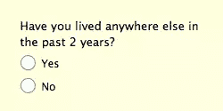
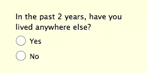
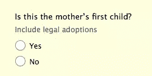
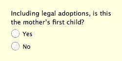
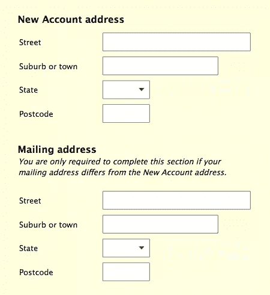
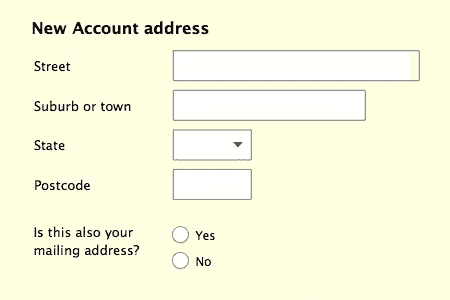

# 满意:对 Web 表单意味着什么？

> 原文：<https://www.sitepoint.com/satisficing-mean-web-forms/>

照片:JSsocal

## 我们所说的满意是什么意思？

术语“满足感”指的是人类倾向于只花费成功完成一项任务所需的最少能量。这是一种潜意识现象:(大多数时候)我们不会坐下来做某件事，并想“*我要在这个*上花最少的钱”。

相反，适者生存意味着尽可能节约能源是有意义的。然而，我们仍然需要把事情做好，所以我们通常最终会付出足够的努力来获得成功，而不是更多。

你可能以前没听过“满意”这个词。希尔伯特·西蒙被认为是它的创造者，在二十世纪中叶 [1](#fn1) 。这是“满足”和“足够”的混合体:凑合着刚好够用。

想想你在网上的行为:你可能会得到很多满足。例如，就在最近几天，我的满意度包括:

*   浏览标题而不是阅读整篇文章
*   不要跳过谷歌搜索结果的第一页
*   在给产品定价时，只研究两三个网站

在每个案例中，我只做了我觉得需要做的工作，以获得一个可以接受的——但不一定是最好的——结果。

表格需要我们的努力和关注，那么满足感如何影响我们的表格使用呢？

## 满足形式的设计

人们对表单的满意程度不亚于任何其他网络交互，甚至可能更高。毕竟表格名声不好；人们只是想把它们结束掉！不幸的是，如果我们没有很好地设计表单，满足感会导致错误。更糟糕的是，这些错误中有许多无法通过验证检测出来，我将在下面展示。

如果我们想要准确的数据，我们需要调整我们的设计以防止令人满意:

1.  [将参考框架放在问题的开头，而不是结尾](#frames-of-reference "Jump to: Frames of reference")。
2.  [把每个人都需要的信息放在问题里，而不是在帮助里](#put-information-in-questions "Jump to: Put information in Questions")。
3.  [把重要的指示变成问题](#turn-instructions-into-questions "Jump to: Turn instructions into questions")。

### 将参考框架放在问题的开头，而不是结尾

假设您要出租一套公寓，您需要了解潜在租户的租赁历史。收集他们的当前地址后，你可以问:

然而，满足意味着一些填表人会在“*住在其他地方*”时停止阅读问题，假设(下意识地)这是他们提供答案所需要知道的全部。

这个问题的参照系是*“过去 2 年”*。它告诉填表人你对他们经历中的 ***子集*** 感兴趣。

参照系不仅可以指时间段，还可以指任何约束条件，例如:

*   不算无偿工作
*   不包括从外国投资获得的收入
*   自从离开大学
*   包括合法收养的儿童

为了确保参照系不会因为满足而丢失，**总是把它们放在问题**的开头，而不是结尾。这种“前加载”意味着参照系将被读取:

这种方法也很好地符合人类的思维方式:将参考框架放在问题的开头可以正确地设置填表人的记忆搜索。

### 将每个人都需要的信息放在问题中，而不是帮助中

帮助文本比问题更难让人满意。如果填表人(下意识地)认为他们能够在没有任何进一步帮助的情况下回答问题，他们就不会阅读帮助文本。

当帮助文本包含表单填写者需要知道的内容时，这就给我们带来了麻烦。出生登记表格中出现了以下问题:

将重要信息放在问题本身有助于防止遗漏:

在这种情况下，信息是一个参考框架，所以它需要前置。

前面我提到过，当满足导致错误时，你并不总是能分辨出来。上面的例子很好地说明了这一点。如果母亲有一个合法收养的孩子，没有亲生子女，她很可能会对第一种方法回答“是”。在上下文中，“是”看起来是一个合理的答案，不会触发任何验证失败。

但是“不”实际上是正确的答案，如果我们将重要信息从帮助转移到问题内部，我们更有可能得到正确答案。

### 把重要的指示变成问题

当涉及到形式指令时，满足是猖獗的。在大多数情况下，你可以放心地假设填表人会在没有阅读任何此类指南的情况下尝试填写你的表格。当说明很关键时，你可以通过将它们整合到问题中来确保它们被阅读。

以下面的例子为例，它基于一个真实的表单:

满意使得关于邮寄地址的说明可能不会被阅读。但是这是一个非常重要的指令:它可以节省填表人的宝贵时间！

如果我们把这个指令变成一个问题，我们可以改善每个人的体验:

## 趁还来得及，快进去

正如这三个提示所示，满足于形式的潜在破坏性后果是可以规避的。诀窍是在填表人停止阅读并开始回答之前*传达关键信息。这样做，你收集的数据质量会更好，填表人甚至不会注意到。*

你还有什么其他的技巧来处理表格中的满足感？一定要在评论里分享你的想法。

* * *

1.  “满足”一词首次出现在西蒙 1957 年的著作《人类模型》中。 [↩](#fnref1)

## 分享这篇文章