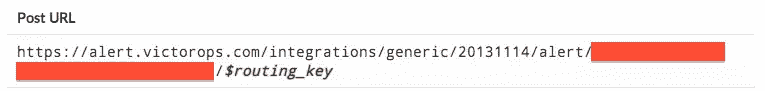
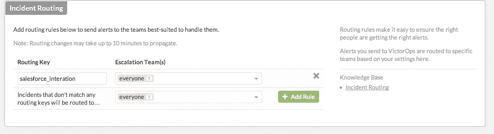
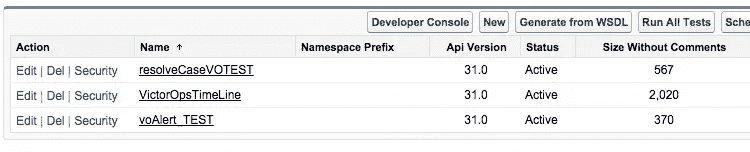
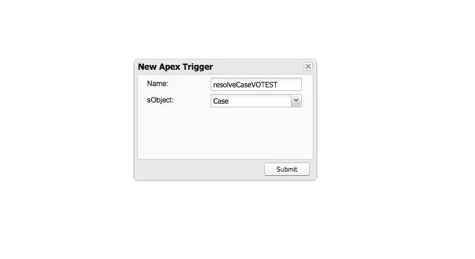
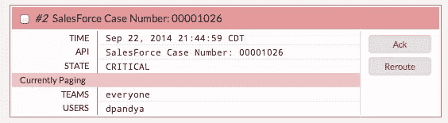

# 使用 REST 端点将 VictorOps 与 Salesforce 集成

> 原文：<https://www.sitepoint.com/integrating-victorops-salesforce-using-rest-endpoint/>

*本文由 [VictorOps](http://victorops.com/?utm_source=Online%20Advertising&utm_medium=SitePoint%203rd%20party%20content&utm_campaign=SitePoint) 赞助。感谢您对使 SitePoint 成为可能的赞助商的支持！*

当你有一个有真实用户的实时应用程序时，问题不会按照你的时间表出现。你需要一种方法来管理和解决突然出现的问题，这个过程需要尽可能简单和轻松。这就是 [VictorOps](http://victorops.com/?utm_source=Online%20Advertising&utm_medium=SitePoint%203rd%20party%20content&utm_campaign=SitePoint) 的用武之地。它允许您管理谁负责修复实际问题，当这些问题出现时，支持团队之间的交流，并与您的系统的其余部分集成，使检测问题变得轻而易举。

在本文中，我们将介绍如何使用 VictorOps 作为 REST 端点来将其与其他服务集成。我们将特别关注 SalesForce 集成。要进行整合，您需要一个 [VictorOps 帐户](http://victorops.com/?utm_source=Online%20Advertising&utm_medium=SitePoint%203rd%20party%20content&utm_campaign=SitePoint#signup)。

## 集成和 REST 端点

首先，我们说 VictorOps 给你一个“REST 端点”是什么意思？其思想是，VictorOps 允许您通过 HTTP 使用 RESTful API 访问资源。你会问，这有什么意义？嗯，通常很容易发出 HTTP 请求，我们可以使用 REST 端点快速建立与其他服务的集成。例如，许多公司使用 [Nagios](http://www.nagios.org/) 来监控部署中的服务。我们可以使用一个插件将 VictorOps 与 Nagios 集成在一起，该插件只需获取警报并将它们推送到 VictorOps 的 REST 端点。使用 REST 端点可以集成的服务的广度令人难以置信；只要有一小段代码可以向 alert.victorops.com 发送一些 HTTP 请求，就可以实现集成。

让我们来看看如何设置其中一个集成。许多团队使用 [Salesforce](http://www.salesforce.com) 作为沟通媒介。我们希望使用 Salesforce 的人(通常包括非技术人员)能够与使用公司服务器的人交流。因此，当在 Salesforce 中创建*案例*时，我们应该通过 VictorOps 获得警报。这使您可以在一个地方(VictorOps)看到整个基础架构中出现的 IT 问题。让我们看看如何设置集成。

## Salesforce 集成

Salesforce 有一种方法来挂钩小块代码，这些代码决定当称为“触发器”的特定事情发生时做什么。这些小代码是用一种叫做“ [Apex](https://www.salesforce.com/us/developer/docs/apexcode/Content/apex_intro_what_is_apex.htm) ”(或多或少特定于 Salesforce)的语言编写的，其语法与 Java 非常相似。幸运的是，您不必花费任何时间来学习如何编写 Apex 以使 Salesforce 集成工作，因为 VictorOps 的善良的人们有[一个包含所需代码片段的存储库](https://github.com/nategrieb/VictorOps-SalesForce)。

出于安全原因，我们需要告诉 Salesforce 我们的代码将向 VictorOps REST 端点发出请求。为此，我们必须通过 Salesforce 仪表板中的“安全控制= >远程站点设置= >新建远程站点”来添加“[http://alert.victorops.com/](http://alert.victorops.com/)”作为远程站点。完成后，您应该会在“所有远程站点”页面上看到:


在让 Apex 代码与 VictorOps 对话之前，我们需要将 API 和路由密钥从 VictorOps 放入 Apex 代码。首先从[这个库](https://github.com/nategrieb/VictorOps-SalesForce)中获得代码的副本。然后，我们需要从维多利亚号上拿到正确的钥匙。从 VictorOps 仪表板，我们转到“设置= >集成 REST 端点”。启用集成后，您将看到如下 URL:



红色部分是你的“API 密匙”。现在，我们将创建一个路由关键字。您的路由密钥允许您将特定警报路由到您的 VictorOps 组织内的特定人群。要设置一个，再次进入 VictorOps 仪表板中的“设置”,单击“集成”,然后向下进入“事件路由”。添加带有路由关键字的规则(例如“salesforce_integration”)。此时，您可能会将该路由关键字路由给“每个人”:



现在，在 Apex 代码中，您应该会找到一个名为“VictorOpsTimeLine Apex Class”的文件，其中包含一段如下所示的文本:

```
http://alert.victorops.com/integrations/generic/20131114/alert/$YOUR_API_KEY_HERE/$ROUTING_KEY_HERE
```

编辑它以添加您的 API 和路由键。

接下来，我们将把 Apex 代码添加到 Salesforce 中。转到 Salesforce 中的“Setup => Apex Classes ”,然后简单地上传以“Class”结尾的[存储库](https://github.com/nategrieb/VictorOps-SalesForce)中的文件。例如，而“VO 警报测试类”放在类中。您最终会得到:



我们还需要设置触发器。为此，请通过“Setup = > Apex Classes = > Developer Console”转到开发人员控制台。点击“文件= >新建=> Apex 触发器”。该名称应该对应于触发器的文件名(有两个)，并且 sObject 应该是“Case”(因为我们希望在创建或解决案例时触发该触发器)。



然后，只需粘贴触发器代码并保存。

为了最终将这些代码部署到生产环境中(相对于您到目前为止一直在使用的开发人员沙箱),您需要[将一个变更集](https://help.salesforce.com/HTViewHelpDoc?id=code_tools_changesets.htm&language=en_US)从沙箱部署到生产组织中。

要测试集成，您可以在 Salesforce 中创建新案例，您应该看到它在 VictorOps 中显示为一个警报，如下所示:



## 其他集成

我们已经使用 REST 端点概述了 Salesforce 集成，但是集成其他平台的过程非常相似，因为 VictorOps 可以通过 REST 端点与许多不同的平台通信。例如， [Sensu](http://sensuapp.org/) 是一种基于一组检查来监控系统的好方法，您可以使用 REST 端点来使它的警报显示在 VictorOps 上，这样您就可以以协调的方式处理它们。

事实上，推出您自己的集成相当容易，因为 VictorOps 有[非常好的文档](http://victorops.force.com/knowledgebase/articles/Integration/Alert-Ingestion-API-Documentation/?l=en_US&c=Integrations%3ASensu&fs=RelatedArticle)说明如何让警报进入系统。通过一个 API、一个简单的 HTTP 库和几个小时的时间，您就可以将几乎任何服务的信息添加到您的 VictorOps 仪表板上的警报中。

通过提供这种简单的集成，VictorOps 使您能够以更加高效和及时的方式处理复杂的问题，因为您不必检查一百万个信息源来找出问题出现的时间和地点。

## 进一步查看和阅读

本教程到此结束，但是如果您对 VictorOps 集成有任何其他聪明的想法，请在评论中提出。关于这个主题的更多信息，这里有一个有用的资源列表，你可以查看一下:

*   [victor ops-sales force 整合的简短而温馨的截屏](https://www.youtube.com/watch?v=7jzUKM5FrRo)。
*   [关于休息终点的文件](http://victorops.force.com/knowledgebase/articles/Integration/Alert-Ingestion-API-Documentation/?l=en_US&c=Integrations%3ASalesForce&fs=RelatedArticle)
*   [描述 Apex 部署的一组链接](https://www.salesforce.com/us/developer/docs/apexcode/Content/apex_deploying.htm)
*   [sales force 上的组件部署](https://www.salesforce.com/us/developer/docs/apexcode/Content/apex_qs_deploy.htm)

## 分享这篇文章