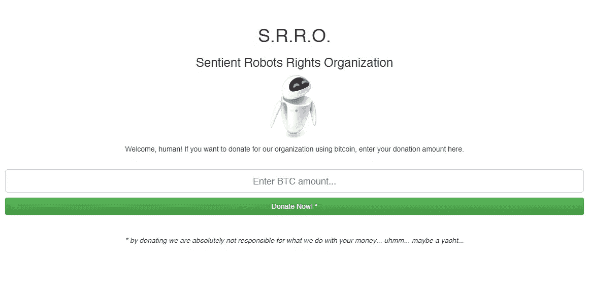

# 比特币和 PHP 与比特币基地的 API–演示应用

> 原文：<https://www.sitepoint.com/bitcoin-php-coinbases-api-demo-app/>

在[第 1 部分](https://www.sitepoint.com/bitcoin-php-coinbases-api-basic-usage/)中，我们介绍了比特币基地比特币 PHP API 和附带 SDK 的基本安装和使用。在第二部分也是最后一部分，我们将构建我们的示例应用程序。

## 发送和接收比特币

用比特币基地 API 发送或接收 BTC 非常简单。有几个直观的方法你很容易猜到:`sendMoney()`和`requestMoney()`。

这是第一个:

```
public function sendMoney($to, $amount, $notes=null, $userFee=null, $amountCurrency=null)
```

第一个参数是“谁”会收到钱。第二个是你要寄的金额。交易记录仅适用于拥有比特币基地账户的收款人。否则，BTC 网络不支持它。

让我们来看一个例子:

```
$response = $coinbase->sendMoney($receiverAddress, "2");
```

如果您想验证您的交易状态，请使用`$response->transaction->status`属性。

```
echo $response->transaction->status;
```

您也可以验证结果:

```
if($response->success)
	{
		echo 'Done.';
	}
```

如果想获得交易 id，只需使用`$response->transaction->id`。

现在让我们看看如何请求 BTC。你必须使用的方法是`requestMoney()`，这是它的语法。

```
$response = $coinbase->requestMoney($emailAddress, 10, "Maintenance Operation (10 BTC)");
```

这一次，机制有点不同。比特币基地将使用指定的邮件地址作为第一个参数来发送一条消息，其中比特币基地自己将向我们的 BTC 发送者解释做什么和如何做。

以下是检查交易状态的方法:

```
echo $response->transaction->request ? 'true' : 'false';
	// 'true'
	echo $response->transaction->id;
	// 'request_transaction_id'
```

如果有问题，您也可以使用一些方法取消或重新发送相同的请求。作为密钥，您必须使用之前获得的交易密钥。

```
$response = $coinbase->resendRequest('request_transaction_id');
	echo $response->success ? 'true' : 'false';
	// 'true'

	$response = $coinbase->cancelRequest('request_transaction_id');
	echo $response->success ? 'true' : 'false';
	// 'true'
```

在您确保该过程完成之后，您将不得不调用`completeRequest()`方法。

像这样:

```
$response = $coinbase->completeRequest('501a3554f8182b2754000003');
	echo $response->success ? 'true' : 'false';
```

仅此而已！

### 其他方法

API 系统经常更新，但是 PHP 包不能用 API 周围的所有包装器方法更新。如果你需要一些“特殊”的东西，你可以使用`get`、`post`、`put`和`delete`方法直接处理 API。

```
var_dump($coinbase->get('/account/balance'));

	// object(stdClass)#4 (2) {
	//   ["amount"]=>
	//   string(10) "0.56902981"
	//   ["currency"]=>
	//   string(3) "BTC"
	// }
```

在这个具体的例子中，我们使用了`/account/balance`，但是同样的原则也适用于其他所有的 API 方法。在第一个参数 metod 名称之后，如果需要，可以指定一组选项。

我们已经完成了基础工作。既然我们已经知道了交易的工具，那么试着做一个真正简单的应用程序来处理支付怎么样？

## 比特币基地 API 的首次应用

是时候创建一个简单的第一个真实应用程序了，模拟真实世界的情况。假设我们有一个朋友拥有一个小型非营利组织。一个真正重要的原因:他决定献身于捍卫有意识机器人的权利。

好吧，他们还不存在，但是越早开始，越早结束！

他偶然发现了这个 BTC 的东西，他想用这种新的加密货币来实现捐赠。

没问题！

我们要做的就是创建四个简单的页面:

*   **欢迎页面:**用户将在此输入在 BTC 的捐款金额；
*   **支付页面:**我们将使用 PHP SDK 创建一个按钮；
*   **感谢页面:**捐赠完成时显示的确认页面；
*   **取消页面:**在过程中出现错误时显示的错误页面；

按照第 1 部分中的演示安装 SDK。之后，你就可以出发了。



现在，让我们从欢迎页面开始。创建一个包含以下代码的`index.php`文件。

```
<!DOCTYPE html>
	<html>
		<head>
			<!-- Latest compiled and minified CSS -->
			<link rel="stylesheet" href="https://maxcdn.bootstrapcdn.com/bootstrap/3.2.0/css/bootstrap.min.css">

			<!-- Optional theme -->
			<link rel="stylesheet" href="https://maxcdn.bootstrapcdn.com/bootstrap/3.2.0/css/bootstrap-theme.min.css">

			<!-- Latest compiled and minified JavaScript -->
			<script src="https://maxcdn.bootstrapcdn.com/bootstrap/3.2.0/js/bootstrap.min.js"></script>

			<title>Welcome! - The Sentient Robots Rights Organization</title>
		</head>
		<body>
			<div class="container">

		      <div class="starter-template" style="text-align:center; padding-top:50px;">
		        <h1>S.R.R.O.</h1>
		        <h3>Sentient Robots Rights Organization</h3>

		        <p></p>

		        <p>Welcome, human! If you want to donate for our organization using bitcoin, enter your donation amount here.</p>

		        <br/>

		        <form action="payment.php" method="post">
		        	<p><input type="text" class="form-control input-lg" placeholder="Enter BTC amount..." style="text-align:center;" name="amount" autofocus /></p>
		        	<p><button class="form-control btn-success">Donate Now! *</button></p>
		        </form>

		        <p>&nbsp;</p>

		        <p><i>* by donating we are absolutely not responsible for what we do with your money... uhmm... maybe a yacht...</i></p>
		      </div>

		    </div><!-- /.container -->
		</body>
	</html>
```

**注意:**正如你很容易想象的，我通过 CDN 使用 Bootstrap 为我们的页面快速建立了一个结构和一些样式。不要介意缺乏框架或视图与逻辑的混合，这只是一个演示。

没什么特别的:我们只是创建了一个带有输入字段的表单和一个发送表单数据的按钮。提交时，数据将被发送到`payment.php`页面。这里我们进入下一步:`payment.php`。

```
<?php require('includes/coinbase.inc.php'); ?>

	<!DOCTYPE html>
	<html>
		<head>
			<!-- Latest compiled and minified CSS -->
			<link rel="stylesheet" href="https://maxcdn.bootstrapcdn.com/bootstrap/3.2.0/css/bootstrap.min.css">

			<!-- Optional theme -->
			<link rel="stylesheet" href="https://maxcdn.bootstrapcdn.com/bootstrap/3.2.0/css/bootstrap-theme.min.css">

			<!-- Latest compiled and minified JavaScript -->
			<script src="https://maxcdn.bootstrapcdn.com/bootstrap/3.2.0/js/bootstrap.min.js"></script>

			<title>Payment - The Sentient Robots Rights Organization</title>
		</head>
		<body>
			<div class="container">

		      <div class="starter-template" style="text-align:center; padding-top:50px;">
		        <h1>S.R.R.O.</h1>
		        <h3>Sentient Robots Rights Organization</h3>

		        <p></p>

		        <p>It's time to pay. You decided to donate...</p>

		        <p style="font-size:32px;"><b><?php echo $_POST['amount']; ?> BTC</b></p>

		        <hr/>

		        <?php echo $button->embedHtml; ?>

		        <p>&nbsp;</p>
		      </div>

		    </div><!-- /.container -->
		</body>
	</html>
```

我们这里有什么？`$_POST['amount']`是我们在上一个屏幕中选择的捐赠金额。然后我们还有`$button->embedHTML`。

等等等等。这个按钮在哪里？

你得到了:在这里包含的另一个文件中，`includes/coinbase.php`。让我们创建文件夹和文件。这是我们要放进去的东西。

```
<?php

		require('vendor/autoload.php');

		$coinbaseAPIKey = 'MY_COINBASE_API_KEY';
		$coinbaseAPISecret = 'MY_COINBASE_API_SECRET';

		$coinbase = Coinbase::withApiKey($coinbaseAPIKey, $coinbaseAPISecret);

		if(!isset($_POST['amount']))
			header('Location: index.php');

		if (!preg_match('/^[0-9]+(?:\.[0-9]+)?$/', $_POST['amount']))
			header('Location: index.php');

		$button = $coinbase->createButton(
			"Your Donation to S.R.R.O.", 
			$_POST['amount'], 
			"BTC", 
			"", 
			array(
	        	"description" => "My " . $_POST['amount'] . " BTC donation to S.S.R.O.",
	        	"cancel_url" => "http://localhost/coinbase/cancel.php",
	        	"success_url" => "http://localhost/coinbase/thanks.php"
	    	)
	    );
```

第一个`required`用于加载 SDK。进一步的指令分别用于:

*   声明`$coinbaseAPIKey`变量；
*   声明`$coinbaseAPISecret`变量；
*   创建我们将用来生成支付按钮的`$coinbase`对象；

之后，一点点验证。只是为了安全起见。

**注意:**这是一篇关于比特币基地 API 的文章，所以我们不会深入验证。在现实世界中，情况会有所不同，我们可以使用许多工具和技术来创建更好(也更安全)的代码。

最后一步是使用`createButton`方法创建按钮。我将第四个参数留空，因为在这个特定的例子中，我的订单不需要跟踪代码。但是，请记住，如果需要，这是您必须使用的参数。

现在我们有了按钮，我们可以在`payment.php`页面中回显它的代码。

**注意:**在您创建按钮之前，请在比特币基地网站上填写您的商家资料。这是必要的一步。如果你不这样做，你会被一个致命错误阻止。

现在我们已经拥有了一切，我们只需要设置我们的`thanks.php`和`cancel.php`页面。他们来了。

这是`thanks.php`:

```
<!DOCTYPE html>
	<html>
		<head>
			<!-- Latest compiled and minified CSS -->
			<link rel="stylesheet" href="https://maxcdn.bootstrapcdn.com/bootstrap/3.2.0/css/bootstrap.min.css">

			<!-- Optional theme -->
			<link rel="stylesheet" href="https://maxcdn.bootstrapcdn.com/bootstrap/3.2.0/css/bootstrap-theme.min.css">

			<!-- Latest compiled and minified JavaScript -->
			<script src="https://maxcdn.bootstrapcdn.com/bootstrap/3.2.0/js/bootstrap.min.js"></script>

			<title>Thank you! - The Sentient Robots Rights Organization</title>
		</head>
		<body>
			<div class="container">

		      <div class="starter-template" style="text-align:center; padding-top:50px;">
		        <h1>S.R.R.O.</h1>
		        <h3>Sentient Robots Rights Organization</h3>

		        <p></p>

		        <p>&nbsp;</p>

		        <p><b>Thank you!</b></p>

		        <p>Hey, thank you for your donation! World is a better place now. Visit our site again in the future to follow our updates.</p>
		        <p>Now <a href="index.php">go to index page and make another donation</a>.</p>
		      </div>

		    </div><!-- /.container -->
		</body>
	</html>
```

…这是`cancel.php`:

```
<!DOCTYPE html>
	<html>
		<head>
			<!-- Latest compiled and minified CSS -->
			<link rel="stylesheet" href="https://maxcdn.bootstrapcdn.com/bootstrap/3.2.0/css/bootstrap.min.css">

			<!-- Optional theme -->
			<link rel="stylesheet" href="https://maxcdn.bootstrapcdn.com/bootstrap/3.2.0/css/bootstrap-theme.min.css">

			<!-- Latest compiled and minified JavaScript -->
			<script src="https://maxcdn.bootstrapcdn.com/bootstrap/3.2.0/js/bootstrap.min.js"></script>

			<title>Donation Cancelled - The Sentient Robots Rights Organization</title>
		</head>
		<body>
			<div class="container">

		      <div class="starter-template" style="text-align:center; padding-top:50px;">
		        <h1>S.R.R.O.</h1>
		        <h3>Sentient Robots Rights Organization</h3>

		        <p></p>

		        <p>&nbsp;</p>

		        <p>It seems something went wrong with your donation. <a href="index.php">Try again</a>...</p>
		      </div>

		    </div><!-- /.container -->
		</body>
	</html>
```

搞定了。现在我们已经完全准备好开始为我们的机器人朋友接受捐赠了。

**注意:**这是一个非常简单的演示项目，它的完整代码可以在 Github 的[上找到。](https://github.com/sitepoint-examples/coinbase_ssro)

## 结论

我们坚持到了这个系列的最后。比特币基地 API 很容易使用，也很容易实现。PHP SDK 也经常更新，这向我们表明他们关心稳定性和社区。

有反馈吗？希望获得更深入的报道？请在下面的评论中告诉我们！

## 分享这篇文章